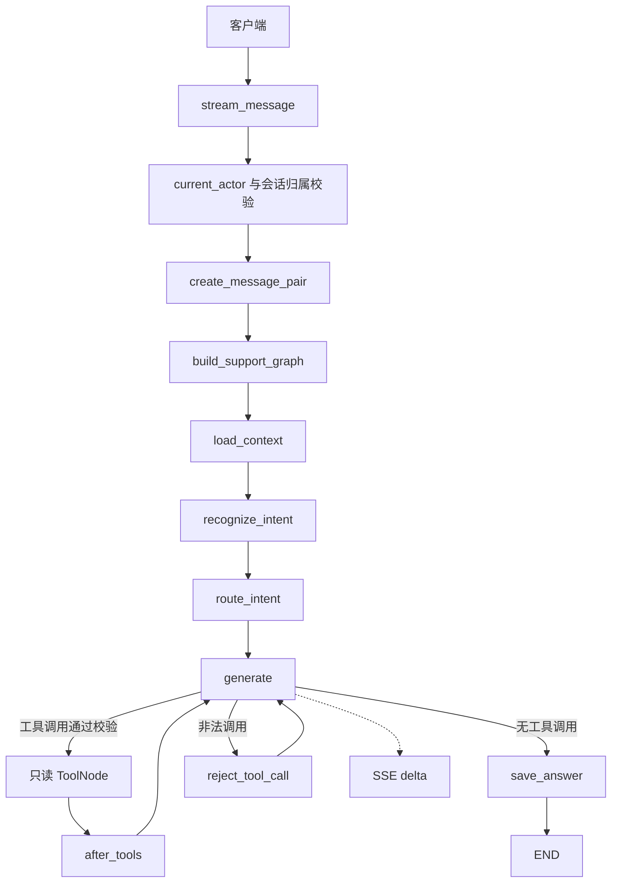

# Aiden 项目 Agent 指南

本文件说明 Aiden 当前代码结构、实现约定和协作规则。开始修改前先阅读与任务相关的现有代码和文档；以源码为准判断功能是否已经实现。

## 项目概况

Aiden 是一个智能订单客服原型。当前技术栈是 React、TypeScript、Vite 前端，Python、FastAPI、LangGraph 后端，以及 MySQL、SQLAlchemy 和 Alembic。前端有 mock 与 remote 两种 API 模式。

项目仍在开发中。`docs/Aiden.md` 中的架构图包含目标设计；其中某些服务、工具、运营能力还没有对应的实现代码。说明或修改功能时，要区分已实现内容与规划内容，不要根据架构图推断功能已经可用。

## 目录结构

下面列出主要源码和文档目录，省略配置文件、构建产物及空目录。

```text
.
├─ AGENT.md                         # 本项目开发与协作约定
├─ AGENTS.md                        # Agent 自动发现入口，指向本文件
├─ start.ps1                        # 本地 MySQL、迁移、演示用户、API 与前端启动脚本
├─ backend/
│  ├─ app/
│  │  ├─ agent/                     # LangGraph 状态与图编排
│  │  ├─ api/                       # FastAPI 依赖、请求模型、SSE 与路由
│  │  │  └─ routes/                 # 登录、会话等 HTTP 路由
│  │  ├─ config/                    # 运行配置
│  │  ├─ persistence/mysql/         # MySQL 模型、连接、查询与对话数据访问
│  │  ├─ services/
│  │  │  └─ tools/customer.py        # Agent 的订单、物流和 FAQ 只读工具
│  ├─ alembic/versions/             # 数据库结构迁移
│  └─ scripts/                      # 后端维护脚本，如演示用户初始化
├─ frontend/
│  ├─ README.md                     # 前端模式、演示账号与启动说明
│  └─ src/
│     ├─ api/                       # API 契约、mock 与 remote 适配器
│     ├─ components/                # 共用界面组件
│     ├─ data/                      # mock 演示数据
│     └─ pages/                     # 登录、用户与客服页面
├─ deploy/                          # Docker Compose 和环境变量示例
├─ docs/                            # 架构、数据库、启动和测试说明
└─ sql/                             # 手工执行的 SQL 脚本，如 test.sql
```

## 编码规范

- 沿用附近代码的组织方式和命名风格，使用英文标识符；面向项目开发者的注释和文档使用清楚、简洁的中文。
- **注释要写清楚。** 注释或 docstring 应说明代码意图、设计原因、重要约束、边界条件或跨层约定；不要只把代码逐行翻译成文字。对公开接口、复杂流程和非直观行为写清楚输入、输出及关键副作用。实现变更时同步修正过时注释，避免留下与实际行为不符的说明。
- 保持各层职责清晰：路由负责 HTTP 输入输出，持久化代码负责数据库读写，Agent 负责对话编排，前端 API 适配器负责与后端契约交互。不要把数据库或模型调用细节塞进页面组件。
- 后端使用项目现有 Python、FastAPI、SQLAlchemy 和 LangGraph 依赖；保持类型标注及现有异步边界。数据库 Session 应在短操作内关闭，不要跨模型异步调用持有 Session。
- 前端使用 TypeScript 类型和现有 React 组件模式。修改请求或响应字段时，检查 `frontend/src/types.ts`、API 适配器和对应后端 schema/路由，保持前后端契约一致。
- 保留 mock 与 remote 的语义差异。不要让 remote 请求失败后静默切回 mock，也不要把 mock 行为描述成真实后端能力。
- 持久化继续使用 MySQL。数据库结构变更通过新增 Alembic migration 完成；不要改写已应用的旧 migration，也不要擅自将数据库换成 SQLite。
- 当前处于原型开发阶段，暂不为缺少实际依据的异常场景添加过多防御性分支、冗余校验、重试或兜底逻辑；优先实现清楚的主流程。保留鉴权、用户数据隔离、参数化 SQL、密钥保护和明确业务约束等必要安全措施，不得以此规则为由移除它们。
- 配置和凭据从本地环境文件读取。不得把真实密钥、密码、Cookie 或其他凭据写入源码、示例配置、SQL、日志或提交内容；示例文件只放占位值。

## 文档规则

- **每次新增一层内容时，都要主动询问用户是否要同步新增或更新文档。** 这里的“一层内容”包括新增架构层、主要模块或业务子系统、新类目 API、数据库表，或独立运行能力。提出问题时指出可能需要更新的文档位置。
- 小范围 bug 修复、单个函数内部调整、纯重命名等不算新增一层内容，不必因此询问。
- 询问文档需求不应阻塞用户已经授权且不依赖该答案的实现工作。用户明确要求写文档时直接完成，不重复询问；用户选择不写时，不擅自扩展文档范围。
- 文档应描述当前实际行为。若更新架构文档中的规划内容，要明确标出规划与已实现部分。
- Markdown 流程图使用标准 Mermaid 语法，优先采用 `graph TD` 或 `graph LR`；节点 ID 使用 ASCII 字符，含中文或标点的节点文本用引号包裹。编辑后检查代码围栏与 Mermaid 定义；有渲染预览时应确认图能正常显示。

## 协作与变更边界

- 先确认用户要求的修改范围，只改完成任务所需的文件；不要顺手重构无关模块或扩大功能范围。
- 用户明确要求隔离某个 Agent、目录或功能范围时，严格按该边界操作。只要求 SQL 或文档的任务，不顺便修改 Agent 实现。
- 不要擅自创建、删除或重置用户数据、数据库、密钥和本地环境配置。涉及数据库结构时提供可审阅的迁移；涉及数据脚本时说明它会写入哪些表。
- 完成后简要说明修改位置、行为变化和已做的检查。只运行用户要求的测试或验证；不要自行添加或运行测试套件。

### 变更可追溯

- 一个任务尽量只实现一个清晰的功能或修复；不要把无关功能、顺手重构和格式化混在同一批变更中。
- 修改前查看 `git status`，识别并保留已有工作区改动。交付前检查本任务的 diff，确保每个修改文件都能对应到用户要求的功能。
- 每次交付都说明：任务目标、用户可见行为、从入口到结果的主要调用链，以及“功能点 → 文件 → 类/函数/路由”的对应关系。涉及 API 或数据库时，补充对应契约或表；列出实际执行过的检查及未验证事项。
- 文件引用尽量指向具体代码位置；提供行号前先核对行号。不要为了可追溯给每行代码添加注释，注释仍按上方编码规范说明关键意图和约束。
- 不要自动创建 Git commit。用户明确要求提交时，一个功能或修复使用一个清晰的 commit；采用 `feat(scope): ...`、`fix(scope): ...` 等 Conventional Commits 格式，并且只提交本任务产生的改动，不包含已有工作区修改。

## 后端 Agent 实现说明

本节按当前源码描述后端 Agent，供阅读和修改时定位调用链。`docs/Aiden.md` 包含较完整的目标架构，其中的 Supervisor、RAG、摘要、工单、人工接管等设计不代表已经接入当前运行链路。当前 Agent 实际接入订单、物流和 FAQ 三个只读工具。

### 源码结构与请求主链

```text
backend/app/
├─ config/settings.py             # dotenv、模型/Cookie 设置、历史上下文上限
├─ main.py                        # FastAPI app 与路由装配
├─ api/
│  ├─ deps.py                     # Cookie 登录用户依赖
│  ├─ schemas.py                  # HTTP 请求体
│  ├─ sse.py                      # SSE 事件编码
│  └─ routes/conversations.py     # 会话 API 与流式消息入口
├─ agent/
│  ├─ state.py                    # LangGraph SupportState
│  ├─ intent.py                   # 意图 schema 与分类 Prompt
│  └─ graph.py                    # Prompt、节点、工具白名单、状态图
├─ services/tools/customer.py     # 订单、物流、FAQ 只读工具
└─ persistence/mysql/
   ├─ chat.py                     # 登录、会话/消息读写、历史裁剪
   ├─ database.py                 # MySQL Engine 与 Session 工厂
   └─ queries.py                  # 带用户归属限制的查询
```

一次流式请求从 `POST /api/conversations/{conversation_id}/messages/stream` 开始：认证 Cookie 得到 `actor.id`，路由校验会话归属和状态，在一个事务中创建用户消息及助手 `streaming` 占位消息；随后构建 LangGraph、读取有限历史并执行识别和回答流程。图将最终答案更新到助手消息行，路由把 `generate` 节点的文本作为 SSE `delta` 发给客户端，结束时发出 `done`。主要入口见 `backend/app/main.py:1-16`、`backend/app/api/deps.py:7-18`、`backend/app/api/routes/conversations.py:50-182`。



### 配置加载

`backend/app/config/settings.py:13-34` 定位 `backend/.env` 并调用 `load_dotenv`。模型配置包括 `OPENAI_API_KEY`、`OPENAI_MODEL` 和可选 `OPENAI_BASE_URL`；Cookie 配置包括名称、安全标记和有效期。历史限制 `max_history_messages=16`、`max_message_chars=2000`、`max_context_chars=12000` 目前是代码默认值，不从环境变量读取。模型缺少 API Key 或模型名时，`model_configuration_error()` 在创建图之前返回错误，由流式路由发送 `error` 事件。

```python
BACKEND_DIR = Path(__file__).resolve().parents[2]
load_dotenv(BACKEND_DIR / ".env")

class Settings:
    openai_api_key: str = os.getenv("OPENAI_API_KEY", "").strip()
    openai_base_url: str = os.getenv("OPENAI_BASE_URL", "").strip()
    openai_model: str = os.getenv("OPENAI_MODEL", "").strip()
    max_history_messages: int = 16
    max_message_chars: int = 2000
    max_context_chars: int = 12000
```

MySQL 连接配置单独由 `backend/app/persistence/mysql/database.py:20-60` 从进程环境读取 `DATABASE_URL`；该模块自身不加载 `.env`，也不会在导入时连接数据库或建表。应用通过 `settings.py` 的 dotenv 加载过程提供本地环境变量。环境变量示例见 `backend/.env.example`，只应填写占位凭据。

### Prompt 管理与结构化提取

当前没有独立 Prompt 注册表或模板目录，两个主要 Prompt 以常量维护：`SYSTEM_PROMPT` 在 `backend/app/agent/graph.py:68-79`，由 `load_context` 放到主模型消息首位；`INTENT_RECOGNITION_PROMPT` 在 `backend/app/agent/intent.py:68-76`，由分类节点单独使用。分类器只接收专用指令和对话历史，不绑定业务工具。

`IntentRecognition` / `RecognizedEntities`（`backend/app/agent/intent.py:12-66`）用 Pydantic 限定输出字段：意图只能是 `order_query`、`logistics_query`、`faq`、`unsupported`、`unclear`；实体只允许有订单号和订单指代类型，同时提取补全后的问题、澄清标记和置信度。`build_support_graph` 用 `with_structured_output(..., method="function_calling")` 获取该结构（`backend/app/agent/graph.py:681-686`）。解析或 schema 校验失败时关闭工具权限并走固定兜底。

```python
intent_model = model.with_structured_output(
    IntentRecognition,
    method="function_calling",
)

result = await intent_model.ainvoke(_recognition_messages(state["messages"]))
```

结构化结果不是权限决定。`_semantic_route()` 会核验提取的订单号是否确实出现在用户消息/历史中，并由服务端根据固定意图生成 `allowed_tools`；`_arguments_are_authorized()` 在 `ToolNode` 前再次检查工具名、参数和订单号。`user_id` 不来自模型输出，而由已认证状态注入工具。相关实现见 `backend/app/agent/graph.py:316-497`、`:499-550` 和 `backend/app/services/tools/customer.py:38-191`。

### 会话记录与历史裁剪

`create_message_pair()`（`backend/app/persistence/mysql/chat.py:221-328`）在同一事务中保存用户消息和助手占位行，并用 `clientMessageId` 处理重试；同一会话最多允许一个 `streaming` 助手行。路由、历史读取和答案写回都同时校验 `conversation_id` 与 `user_id`。

`recent_messages()`（`backend/app/persistence/mysql/chat.py:331-361`）只读当前用户/会话的消息，排除本次助手占位行和其他 `streaming` 消息；按时间倒序取最近 16 条，再从最新内容开始应用每条 2000 字、总计 12000 字限制，最后反转成时间正序。`load_context` 将这些行映射为 LangChain 消息，并在模型调用前关闭 MySQL Session。当前没有 LangGraph checkpointer 或历史摘要节点；跨轮记忆来自 MySQL 消息记录。

```python
.order_by(Message.created_at.desc(), Message.id.desc())
.limit(settings.max_history_messages)
```

```python
remaining_chars = settings.max_context_chars
for role, content in rows:
    if remaining_chars <= 0:
        break
    text = content[: min(settings.max_message_chars, remaining_chars)]
    if text:
        selected.append({"role": role, "content": text})
        remaining_chars -= len(text)
return list(reversed(selected))
```

### SSE 流式响应

HTTP 入口和事件生命周期在 `backend/app/api/routes/conversations.py:50-182`，编码格式在 `backend/app/api/sse.py:5-11`。服务端当前实际发出 `start`、`delta`、`done`、`error`；图取消或连接中断时将仍为 `streaming` 的消息收尾为 `stopped`。模型失败时保存错误状态并通过 `error` 事件返回。

路由用 `graph.astream_events(..., version="v2")` 读取模型事件，但只接收 `langgraph_node == "generate"` 的文本。文本先暂存到 `pending_deltas`，到 `generate` 节点结束且存在最终 `answer` 后才发出；工具调用轮的答案为空，因此工具计划和工具前置文本不会被当成客服回答发送。正常结束前，`save_answer` 已将最终回答落库。

```python
async for event in graph.astream_events(initial_state, version="v2"):
    if (
        event.get("event") == "on_chat_model_stream"
        and event.get("metadata", {}).get("langgraph_node") == "generate"
    ):
        chunk = event.get("data", {}).get("chunk")
        content = getattr(chunk, "content", "")
        if isinstance(content, str) and content:
            pending_deltas.append(content)
        elif isinstance(content, list):
            content_text = "".join(
                part.get("text", "") for part in content if isinstance(part, dict)
            )
            if content_text:
                pending_deltas.append(content_text)
    if event.get("event") == "on_chain_end" and event.get("name") == "generate":
        output = event.get("data", {}).get("output", {})
        answer = output.get("answer") if isinstance(output, dict) else None
        if isinstance(answer, str):
            answer_so_far = answer
            if answer:
                for text in pending_deltas or [answer]:
                    yield sse_event("delta", {"text": text})
        pending_deltas.clear()
```

前端 `frontend/src/api/remote.ts:39-133` 负责解析分块到达的 SSE 行并映射事件；`sendMessageStream()` 请求后端同名流式路由（`:159-177`）。

### 装配入口、状态图与 Agent 循环

FastAPI 入口是 `backend/app/main.py:7-10`，只装配登录和会话路由；启动时不自动连库或创建表。每次流式请求先检查模型配置，再由 `stream_message()` 调用 `build_support_graph()`（`backend/app/api/routes/conversations.py:94-114`）。`build_support_graph()` 创建 OpenAI 兼容模型、结构化识别器、各只读工具的独立 `ToolNode`，定义节点并 `compile()`；当前图不配置持久化 checkpointer。

`SupportState`（`backend/app/agent/state.py:7-39`）用 `TypedDict` 保存会话 ID、助手消息 ID、认证用户 ID、消息列表、意图/权限、补全问题、待核验订单和最终答案等字段；`messages` 使用 `add_messages` reducer 合并节点输出。状态里不放 SQLAlchemy Session。

| 节点 | 职责 | 实现位置 |
| --- | --- | --- |
| `load_context` | 读取有界历史，添加主 System Prompt | `backend/app/agent/graph.py:695-705` |
| `recognize_intent` | 调用 Pydantic 结构化分类器 | `backend/app/agent/graph.py:707-726` |
| `route_intent` | 校验结构化字段，计算服务端工具白名单或固定答复 | `backend/app/agent/graph.py:728-743`、`:316-497` |
| `generate` | 绑定当前白名单工具并生成工具调用轮或最终回答 | `backend/app/agent/graph.py:745-798` |
| `run_query_order`、`run_query_logistics`、`run_search_faq` | 执行对应只读工具 | `backend/app/agent/graph.py:688-693,853-854`；工具实现在 `backend/app/services/tools/customer.py` |
| `after_tools` | 回收工具权限；订单前置查询时生成选项或核验下一步查询 | `backend/app/agent/graph.py:815-825`、`:553-666` |
| `reject_tool_call` | 拒绝越权或参数不匹配的工具调用并准备固定安全答复 | `backend/app/agent/graph.py:827-829` |
| `save_answer` | 将最终回答写入预创建的助手消息行 | `backend/app/agent/graph.py:831-843` |

状态图入口、工具回边和结束边在 `backend/app/agent/graph.py:845-874`：`generate` 根据模型输出选择已校验的单个工具节点、拒绝分支或 `save_answer`；工具完成后回到 `generate`。订单/物流缺少明确目标时，服务端先查询当前用户的近期订单；用户选择后再次用本人订单查询结果核验，才授权订单详情或物流工具。

```python
graph = StateGraph(SupportState)
graph.add_node("load_context", load_context)
graph.add_node("recognize_intent", recognize_intent)
graph.add_node("route_intent", route_intent)
graph.add_node("generate", generate)
graph.add_node("after_tools", after_tools)
graph.add_node("reject_tool_call", reject_tool_call)
graph.add_node("save_answer", save_answer)
for tool_name, node_name in _TOOL_NODE_BY_NAME.items():
    graph.add_node(node_name, tool_nodes[tool_name])

graph.add_edge(START, "load_context")
graph.add_edge("load_context", "recognize_intent")
graph.add_edge("recognize_intent", "route_intent")
graph.add_edge("route_intent", "generate")
graph.add_conditional_edges(
    "generate",
    route_after_generate,
    {
        **{node_name: node_name for node_name in _TOOL_NODE_BY_NAME.values()},
        "reject_tool_call": "reject_tool_call",
        "save_answer": "save_answer",
    },
)
for node_name in _TOOL_NODE_BY_NAME.values():
    graph.add_edge(node_name, "after_tools")
graph.add_edge("after_tools", "generate")
graph.add_edge("reject_tool_call", "generate")
graph.add_edge("save_answer", END)
return graph.compile()
```

当前只读工具由 `backend/app/services/tools/customer.py` 暴露：`query_order`、`query_logistics`、`search_faq`。订单/物流 SQL 归属过滤见 `backend/app/persistence/mysql/queries.py`。退货退款流程、政策独立查询、创建工单、人工接管、RAG、摘要记忆和 trace/运营接口在当前 Agent 请求链中尚未实现；以源码为准，不要把 `docs/Aiden.md` 的目标设计写成现有能力。
