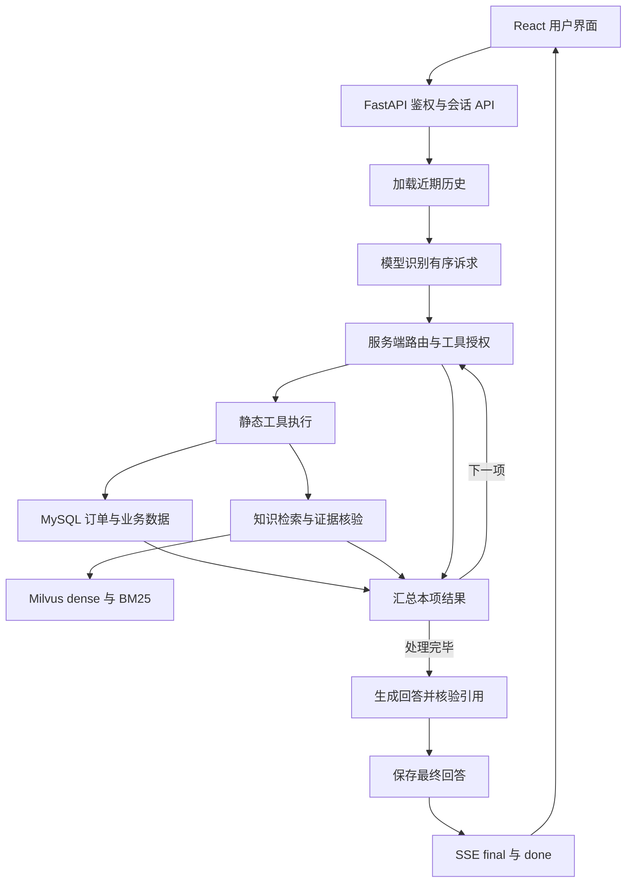

# Aiden 智能订单客服

Aiden 是一个面向电商订单与售后的智能客服原型，提供用户对话、订单与物流查询、知识问答、售后申请和人工客服工作台。

项目采用 **React + FastAPI + LangGraph**，将模型的语义识别与回答生成放在服务端控制的业务流程中：模型识别诉求，服务端决定允许执行的工具、核验业务数据和知识证据，再生成回答。


## 功能与边界

| 模块 | 当前能力 | 重要边界 |
| --- | --- | --- |
| 用户与会话 | Cookie 登录、会话历史、消息持久化、流式回答、停止生成与请求幂等 | 本人业务数据隔离，员工接口单独鉴权 |
| 诉求识别 | 九类意图，一轮最多四项诉求，按顺序处理并汇总 | 工具名、用户身份与权限由服务端控制 |
| 订单与物流 | 查询本人订单、选择订单、查看物流轨迹 | 结果取决于 MySQL 业务数据；没有独立的实时价格或库存查询工具 |
| 知识问答 | Markdown 结构感知切块、dense/BM25 检索、RRF 融合、reranker、来源引用 | 证据不足或引用无法核实时拒答；演示知识不是正式商家承诺 |
| 售后与工单 | 退款/退货/换货申请、进度查询、允许阶段取消、员工审核与处理 | 对话退款限本人单商品订单，须核单、核对有效政策与原因并确认；退换货和多商品申请走售后页 |
| 人工客服 | 站内排队、员工接单、双方消息与关闭会话 | 主要通过前端轮询同步；登记工单、提交售后、排队转人工是三种不同操作 |
| 知识运营 | RAG 建库控制台、低置信度与负反馈入池、员工审核补库、历史对话挖掘 | 挖掘需显式启动，可能调用模型并写入知识数据 |
| 评估与可观测性 | 离线 RAG/工作流评估、报告页面、可选 Langfuse 调用追踪 | 检索内部阶段尚未全部独立追踪 |
| 旁路主题分类 | 独立数据准备、训练、预测、批处理与人工标注 CLI | 不接入在线意图路由; |


## 技术栈

- **前端：** React 18、TypeScript、Vite 6、Ant Design、React Router、TanStack Query。
- **后端：** Python 3.10+、FastAPI、LangGraph、LangChain、OpenAI 兼容模型接口。
- **关系型数据：** MySQL、SQLAlchemy、Alembic；仓库 Compose 使用 MySQL 8.4。
- **知识检索：** Milvus 2.5+、BGE embedding、原生 BM25、RRF、BGE reranker。
- **可观测性：** Langfuse，未配置时关闭上报。

## 运行链路



模型生成时的 `delta` 会先作为**尚未核验的草稿**展示；引用核验并保存成功后，`final` 用权威正文和引用替换草稿，`done` 标记完成。核验失败可替换为拒答，但已经展示的草稿不能被视为从未暴露。

## 快速开始：仅体验前端 mock

需要 Node.js/npm，不需要数据库、后端或模型服务。以下命令在仓库根目录的 PowerShell 中执行：

```powershell
cd frontend
npm ci
# 显式选择 mock，避免已有 .env.local 将模式设为 remote。
$env:VITE_API_MODE = 'mock'
npm run dev
```

打开 Vite 输出的地址，默认 `http://localhost:5173`。页面顶部会标明模式。

| 身份 | 演示账号 | 演示密码 |
| --- | --- | --- |
| 普通用户 林沐言 | `maya@aiden.demo` | `aiden123` |
| 普通用户 陈屿 | `chen@aiden.demo` | `aiden123` |
| 人工客服 | `staff@aiden.demo` | `aiden123` |

可先询问“我的订单到哪了？”，再点击“转人工”，在同一浏览器的另一标签页以客服身份接单并回复。mock 使用 `localStorage` 保存演示数据、`sessionStorage` 保存标签页身份，支持跨标签页同步；“重置演示”只恢复浏览器本地演示数据。

**mock 的订单、流式回答、售后与客服处理均为模拟行为，不会调用真实模型或写入后端数据库。**

## 连接真实后端：remote

以下为 Windows 本地开发入口；完整的独立演示库、业务 SQL、员工创建、精确知识导入和验收步骤见 [前端运行说明](frontend/README.md)。

### 1. 准备依赖与配置

- Python 3.10+、Node.js/npm、已启动的 Docker Desktop（使用仓库 MySQL Compose 时）。
- 可访问的 OpenAI 兼容聊天模型服务。
- 知识问答另需 Milvus 2.5+、OpenAI 兼容 embedding 服务以及可加载的 reranker 权重；仓库 Compose **只部署 MySQL**。

从仓库根目录复制尚不存在的配置，不覆盖已有文件：

```powershell
if (!(Test-Path deploy/.env.mysql)) { Copy-Item deploy/.env.mysql.example deploy/.env.mysql }
if (!(Test-Path backend/.env)) { Copy-Item backend/.env.example backend/.env }
if (!(Test-Path frontend/.env.local)) { Copy-Item frontend/.env.example frontend/.env.local }
```

编辑本地配置，替换 MySQL 占位密码并填写模型密钥。真实密钥、密码和连接串只保存在未提交的本地配置中；不要写回示例文件。

| 配置 | 用途与约束 |
| --- | --- |
| `deploy/.env.mysql` | MySQL 容器账号、密码、库名与宿主端口，默认端口 `3307` |
| `DATABASE_URL` | `deploy/.env.mysql` 与 `backend/.env` 必须一致；密码中的 URL 保留字符须编码 |
| `OPENAI_API_KEY` / `OPENAI_BASE_URL` / `OPENAI_MODEL` | 聊天模型密钥、兼容接口地址与实际可用模型名 |
| `OPENAI_THINKING_MODE` | DeepSeek 在线客服建议设为 `disabled`，避免合成工具历史缺少 `reasoning_content` 导致 400 |
| `EMBEDDING_*` | embedding 服务、模型、向量维度及序列长度上限 |
| `MILVUS_*` | Milvus 地址、鉴权与知识集合 |
| `RAG_*` | 知识目录、切块预算、检索策略与 reranker；默认策略 `hybrid_rerank` |
| `SESSION_COOKIE_SECURE` | 本地 HTTP 为 `false`；HTTPS 部署应设为 `true` |
| `LANGFUSE_PUBLIC_KEY` / `LANGFUSE_SECRET_KEY` / `LANGFUSE_BASE_URL` | 三项齐全才启用在线追踪 |
| `VITE_API_MODE` / `VITE_API_BASE_URL` | 手动启动前端时设置为 `remote` / `/api` |

**模型配置必须与服务及集合一致。** `backend/.env.example` 使用 BGE-M3、1024 维、8192 tokens；[前端文档](frontend/README.md)另提供 bge-small、512 维、512 tokens 的演示基线。不能混用模型、维度、tokenizer 或已有向量集合；切换集合不会自动重建已经向量化的知识块。

在根目录显式安装后端与 RAG 依赖：

```powershell
if (!(Test-Path backend/.venv/Scripts/python.exe)) { python -m venv backend/.venv }
.\backend\.venv\Scripts\python.exe -m pip install -r backend/requirements.txt
.\backend\.venv\Scripts\python.exe -m pip install -r backend/requirements-rag.txt
```

`requirements.txt` 已包含数据库依赖。RAG 依赖虽然不一定阻止 API 启动，但知识检索需要它们；模型权重与独立服务仍须另行准备。

### 2. 审阅数据写入，再启动

> `start.ps1` 会启动 MySQL、执行 `alembic upgrade head`，并初始化两个普通演示用户。迁移会修改目标库结构，部分历史迁移涉及旧表删除；首次体验建议使用独立演示库。先核对目标库和迁移，不要把脚本当成无副作用的服务启动命令。

在根目录执行：

```powershell
.\start.ps1
```

脚本会按需创建后端虚拟环境、安装基础后端依赖和前端依赖，随后启动 API 与 Vite，并在前端进程中强制设置 remote 模式及代理目标。

API 默认不启用自动热重载：评估等控制台任务运行在 API 后台线程，任务历史只保存在内存；重载会中断任务、清空进度，并关闭该 API 启动的本地向量服务。后端代码或配置修改后，等待任务结束再手动重启。仅调试短请求时可自行启用 `--reload`，不要在长评估期间使用。

| 入口 | 默认地址 |
| --- | --- |
| 前端 | `http://127.0.0.1:5173` |
| API 存活检查 | `http://127.0.0.1:8000/api/health` |
| OpenAPI 文档 | `http://127.0.0.1:8000/docs` |
| 进程日志 | `backend/.tmp/` 中的 API/Vite 标准输出与错误日志 |

自定义 API 端口：

```powershell
$env:FASTAPI_PORT = '8100'
.\start.ps1
```

脚本同步更新 Vite 代理，前端仍使用 `5173`。按 `Ctrl+C` 停止脚本启动的 API、前端及可选挖掘进程，MySQL 容器保持运行。

**启动成功不等于业务数据已准备：**

- 脚本只创建 `maya@aiden.demo`、`chen@aiden.demo` 两个普通用户，初始密码为 `aiden123`；不覆盖已有密码，也不为他们创建订单。
- `staff@aiden.demo` 是 mock 账号，不会自动成为 remote 员工。真实员工需设置 `AIDEN_STAFF_EMAIL`、`AIDEN_STAFF_NAME`、`AIDEN_STAFF_PASSWORD`（至少 12 字符），在 `backend/` 显式运行 `python -m scripts.init_staff_user`，使用该虚拟环境的 Python。
- `sql/test.sql` 不会自动执行。它写入演示业务数据；其中订单属于 `sql.customer@aiden.test`，不是 maya/chen。导入前审阅目标库与写入范围，具体命令见 [前端运行说明](frontend/README.md)。
- 知识不会自动导入或向量化。按明确文件清单建库，勿直接全量导入可能相互冲突的演示资料。
- `/api/health` 仅证明 API 进程存活，不验证数据库、模型、检索或支付能力。

remote 的 Cookie 在同站点标签页间共享。用户与员工并行演示请使用不同浏览器或独立隐私会话，不要照搬 mock 的双标签页登录方式。

### 3. 手动启动与可选能力

完成迁移、账号与数据准备后，也可在两个 PowerShell 窗口分别启动前后端。

后端窗口，从仓库根目录进入 `backend/`：

```powershell
cd backend
.\.venv\Scripts\python.exe -m uvicorn app.main:app --host 127.0.0.1 --port 8000
```

前端窗口，从仓库根目录进入 `frontend/`：

```powershell
cd frontend
npm ci
$env:VITE_API_MODE = 'remote'
$env:VITE_API_BASE_URL = '/api'
$env:VITE_API_PROXY_TARGET = 'http://127.0.0.1:8000'
npm run dev
```

手动启动不会自动执行迁移或初始化用户。改变 API 端口时同步修改 `VITE_API_PROXY_TARGET`，不要与 embedding 默认端口 `8001` 冲突。已有进程环境变量可能覆盖 `.env`，启动前核对配置而不要打印密钥。

历史对话挖掘默认不启动。若确实需要定时抽取，并已审阅其模型调用和数据写入，在根目录执行：

```powershell
.\start.ps1 -EnableConversationMining
```

该选项启动独立定时进程，配置见 `MINING_*`；处理边界见 [数据飞轮](docs/数据飞轮.md)与 [RAG 文档](docs/RAG.md)。旁路主题分类器另需独立依赖、人工确认数据和本地模型，不随网站启动；详见 [主题分类器](docs/主题分类器.md)。

## 目录结构

```text
Aiden/
├─ README.md                   # 项目入口
├─ start.ps1                   # Windows 本地启动脚本
├─ backend/
│  ├─ app/
│  │  ├─ agent/                # 状态图、诉求路由、证据与回答处理
│  │  ├─ api/                  # 鉴权、会话、SSE、售后与员工路由
│  │  ├─ config/               # 运行、RAG 与挖掘配置
│  │  ├─ persistence/          # MySQL 与 Milvus 数据访问
│  │  └─ services/             # 静态工具、RAG、旁路主题分类
│  ├─ alembic/versions/        # 数据库迁移
│  ├─ scripts/                 # 账号初始化、embedding、建库与挖掘 CLI
│  ├─ knowledge/               # 演示知识素材
│  ├─ evals/                   # 离线评估题集、入口与报告
│  └─ tests/                   # 后端测试
├─ frontend/
│  ├─ src/api/                 # mock / remote 适配器与 API 契约
│  ├─ src/components/          # 共用组件
│  ├─ src/pages/               # 用户与员工页面
│  └─ README.md                # 前端与完整 remote 演示说明
├─ deploy/                    # MySQL Compose 与环境变量示例
├─ docs/                      # 架构、业务、检索与评估文档
└─ sql/test.sql               # 需显式执行的演示业务数据
```

## 开发入口

| 功能点 | 文件与入口 |
| --- | --- |
| API 装配与存活检查 | `backend/app/main.py`：`app`、`health()` |
| 客服状态图 | `backend/app/agent/graph.py`：`build_support_graph()` |
| 诉求识别与逐项授权 | `backend/app/agent/nodes/intent.py`：`make_recognize_intent()`、`route_intent()` |
| 对话与 SSE | `backend/app/api/routes/conversations.py`：`stream_message()` |
| 售后与工单 HTTP 接口 | `backend/app/api/routes/service_workflow.py`：`/api/service`、`/api/staff/service` |
| 人工队列 | `backend/app/api/routes/staff.py`：`/api/staff/queue`、接单、回复与关闭接口 |
| 建库与问题审核 | `backend/app/api/routes/rag_admin.py`：`/api/rag` |
| 前端模式选择 | `frontend/src/api/index.ts`：`apiMode`；`mock.ts` / `remote.ts` 实现适配 |

前端构建与本地预览在 `frontend/` 执行：

```powershell
npm run build
npm run preview
```

后端评估依赖真实配置与数据，命令、指标和报告边界见 [评估说明](docs/评估说明.md)。开发约定见 [AGENTS.md](AGENTS.md)；不要把原型能力或历史运行记录描述为生产可用性承诺。

## 文档导航

| 文档 | 内容 |
| --- | --- |
| [技术学习路线](docs/技术学习路线.md) | 从基础、项目调用链到进阶专题的技术学习顺序与源码导航 |
| [架构设计](docs/Aiden.md) | 当前实现、目标设计与整体架构 |
| [Agent 实现详解](docs/Agent实现详解.md) | 状态图、请求处理与回答生成 |
| [LangChain](docs/LangChain.md) | 模型与工具契约专题 |
| [LangGraph](docs/LangGraph.md) | 工作流与状态图专题 |
| [语义识别与意图路由](docs/语义识别与意图路由前置层.md) | 九类意图、处理目标、退款专用流程与工具权限 |
| [工具契约](docs/tools.md) | 静态业务工具与约束 |
| [前端运行说明](frontend/README.md) | 模式、账号、完整 remote 基线与历史验收记录 |
| [前端实现](docs/前端.md) | 页面、状态与交互实现 |
| [FastAPI](docs/FastAPI.md) | HTTP 接口、鉴权与 SSE |
| [数据库](docs/数据库.md) / [数据层](docs/数据层.md) | 数据结构与持久化职责 |
| [售后与工单](docs/售后与工单.md) | 申请、审核与工单处理 |
| [RAG](docs/RAG.md) / [Milvus](docs/Milvus.md) | 切块、索引、召回、重排与知识管理 |
| [数据飞轮](docs/数据飞轮.md) | 在线缺口、用户反馈、审核补库与历史挖掘 |
| [可观测性](docs/可观测性.md) | Langfuse 配置、追踪与成本归因 |
| [评估说明](docs/评估说明.md) | 离线评估与报告复现 |
| [主题分类器](docs/主题分类器.md) | 旁路多标签分类与验收前提 |

现有文档含规划和历史快照；启动命令、配置及迁移版本以当前源码为准，历史验收仅证明其记录的具体场景。