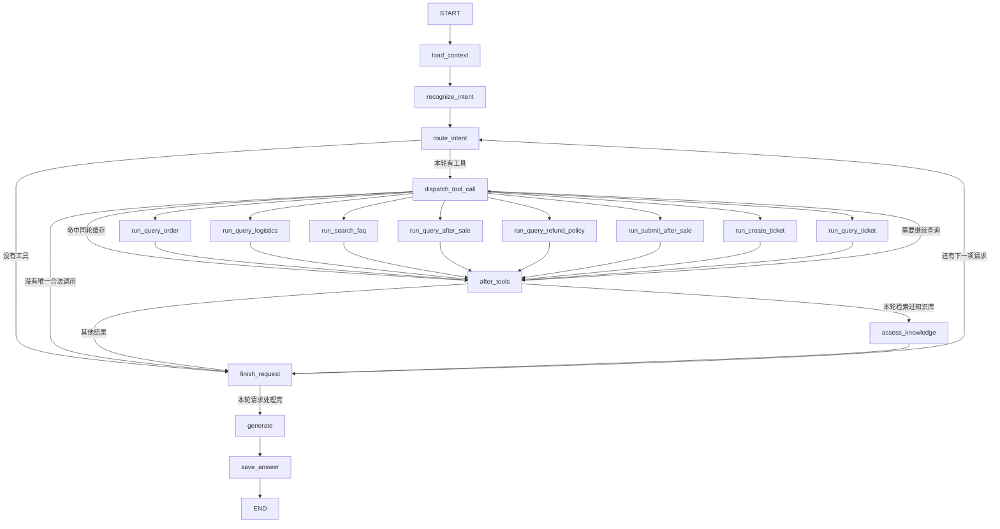

# Aiden 后端 Agent 实现详解

> 本文的 §1–§3（当前能力概览、目录地图与术语、LangGraph 主流程）与 §9–§12（工具与数据访问、SSE 事件、当前实现边界、源码索引）已按当前代码更新，可对照 `backend/app/agent/graph.py`、`backend/app/services/tools/registry.py` 和 `backend/app/api/routes/conversations.py` 阅读。§4–§8 仍是早期三工具、单意图版本的实现笔记，其中的代码摘录、节点表和 `reject_tool_call` 之类已删除的节点不代表当前运行链路，涉及工具集合、路由和写操作边界时以 [客服工具系统](tools.md) 和 [语义识别与意图路由前置层](语义识别与意图路由前置层.md) 为准。

从一条用户消息开始，解释请求如何经过 FastAPI、MySQL、LangGraph 和模型，再以 SSE 事件返回浏览器。


## 1. 当前 Agent 做什么

Aiden 当前是一个智能订单客服原型。后端客服 Agent 在 `backend/app/services/tools/registry.py` 的 `SUPPORT_TOOLS` 中静态注册了八个工具：查询当前登录用户的订单、物流、售后申请（`query_after_sale`）和工单（`query_ticket`），检索已入库知识（`search_faq`）与本人订单当前有效的退款政策（`query_refund_policy`），以及两个写操作——登记退款申请（`submit_after_sale`）和登记待处理工单（`create_ticket`）。核心链路是：

1. FastAPI 验证登录 Cookie 和会话归属。
2. MySQL 保存用户消息，并创建一条状态为 `streaming` 的助手消息。
3. Agent 从 MySQL 读取近期历史，识别用户意图并补全当前问题。
4. 服务端按识别结果决定本轮允许使用哪个工具，并由 `backend/app/agent/graph.py` 中的 `dispatch_tool_call()` 亲自构造这次调用的名称和参数；模型只负责理解诉求，不能自行扩展工具权限。写操作还要额外通过服务端复核：退款提交（`submit_after_sale`）要求紧邻上一轮保存的确认状态与本轮明确的「确认提交」原文同时成立；工单登记（`create_ticket`）要求本轮原话确实包含该登记诉求。识别结果解析失败、置信度不足或参数对不上时，服务端清空白名单并给出固定兜底答复，不执行任何工具。
5. LangGraph 在必要时执行工具，再让模型根据工具结果组织回答。
6. 最终回答由图节点 `save_answer()` 经 `backend/app/persistence/mysql/chat.py` 中的 `finish_assistant_message()` 整段写入助手消息；`backend/app/api/routes/conversations.py` 中的 `stream_message()` 只在 `save_answer` 这一步结束、拿到完整回答后发一次 `delta`（同一条回答不会被拆成多次 `delta`），需要时紧跟 `citations` 或 `handoff` 事件，末尾发 `done`，执行失败则发 `error`。模型中间产出的草稿和被拒答替换掉的文本都不会流到前端。

`docs/Aiden.md` 有更大的目标架构设计。比如多类专业 Agent、对话内退货换货自助办理、员工政策版本管理界面、人工客服实时推送和问题运营工作台不能因为出现在架构图中就视为当前已实现；这些边界见第 11 节。本篇以当前 Python 源码为准。

## 2. 目录地图

阅读 Agent 时常用的代码集中在以下位置：

```text
backend/app/
├─ main.py                              # FastAPI 应用入口与路由注册
├─ config/settings.py                  # .env、模型、Cookie 和历史长度配置
├─ api/
│  ├─ deps.py                           # 从 Cookie 解析当前登录用户
│  ├─ schemas.py                        # 登录、发送消息等请求结构
│  ├─ sse.py                            # SSE 事件编码
│  └─ routes/
│     ├─ auth.py                        # 登录、当前用户、退出
│     ├─ conversations.py               # 会话 API、转人工入口与流式消息
│     └─ staff.py                       # 员工待接入队列、接管、回复与结单
├─ agent/
│  ├─ state.py                          # LangGraph 节点间共享的数据结构
│  ├─ intent.py                         # 意图字段定义及分类 Prompt
│  └─ graph.py                          # 主 Prompt、识别、路由、工具调用与图装配
├─ services/tools/
│  ├─ registry.py                       # 八个客服工具的静态注册入口
│  ├─ customer.py                       # 订单、物流、FAQ 读工具
│  ├─ after_sale.py                     # 本人售后申请查询（query_after_sale）
│  ├─ after_sale_submit.py              # 退款政策查询与退款申请登记（写入）
│  ├─ ticket_create.py                  # 待处理工单登记（写入）
│  └─ ticket_query.py                   # 本人工单状态查询（query_ticket）
└─ persistence/mysql/
   ├─ database.py                       # Engine、Session 工厂
   ├─ chat.py                           # 用户登录会话、业务会话和消息读写
   ├─ human_support.py                  # 转人工队列与员工接管的会话状态转换
   ├─ service_workflow.py               # 售后申请与工单的事务边界
   ├─ models.py                         # SQLAlchemy 数据表模型
   └─ queries.py                        # 带用户归属约束的数据库查询
```

前端 remote API 的调用和 SSE 解码位于 `frontend/src/api/remote.ts`。API 契约的主要输入模型在 `backend/app/api/schemas.py`。

### 读代码时会遇到的几个词

| 术语 | 在这个项目里的意思 |
| --- | --- |
| 会话（conversation） | 用户与客服的一段对话，保存在 MySQL `conversations` 表中。它和登录 Cookie 不是同一回事。 |
| 消息（message） | 会话中的一条用户或助手发言，保存在 `messages` 表中。 |
| State | 一次 LangGraph 执行期间节点共享的数据，例如用户 ID、历史消息、识别出的意图和工具权限。 |
| Node（节点） | 图中的一个处理步骤，接收部分 State 并返回要更新的字段。 |
| Edge（边） | 一个节点完成后去往下一个节点的连接；条件边根据当前 State 选择工具节点、继续查询、收尾当前项或开始下一项请求。 |
| Tool（工具） | 模型可以请求的后端函数，但调用本身由服务端 `dispatch_tool_call()` 构造，模型不能自己决定工具名和参数。当前八个工具大多是只读查询，退款申请登记（`submit_after_sale`）和工单登记（`create_ticket`）是写操作，只有在服务端复核通过后才会执行。 |
| SSE | 服务器发送事件。HTTP 响应保持打开，服务端按 `start`、`delta`、`citations`、`handoff`、`done`、`error` 六种事件通知浏览器进度；`delta` 只在最终回答落库时整段发送一次。 |

## 3. LangGraph 一次执行的主流程

LangGraph 每次执行时，初始 `SupportState` 带有 `conversation_id`、`assistant_message_id` 和 `user_id`。第一个节点 `load_context` 用这些值读取当前用户的有限聊天历史，并把系统 Prompt 和历史消息放入 State；后续节点都通过 State 交换信息。



节点与边的注册语句都在 `backend/app/agent/graph.py` 的 `build_support_graph()` 末尾。要点：

- `route_intent` 完成某一项请求的服务端授权后，条件函数 `route_after_intent()` 决定去向：本轮有可执行工具就进入 `dispatch_tool_call`，否则直接 `finish_request`（闲聊、兜底答复和澄清类请求走后者）。
- `dispatch_tool_call()` 不接受模型给出的调用，而是按白名单和已复核字段自己构造这一次调用；`route_dispatched_tool()` 再把它送到唯一对应的 `run_<tool>` 节点，同一轮完全相同的调用命中缓存时直接进入 `after_tools`，没有唯一合法调用时进入 `finish_request`。
- 八个 `run_<tool>` 节点各是只装了一个工具的 `ToolNode`，执行完成后固定回到 `after_tools`。
- `after_tools()` 收回本轮白名单，并在订单列表核验等场景写入下一步权限；`route_after_tools()` 按当前 State 选择重新进入 `dispatch_tool_call`（继续这一轮的查询）、`assess_knowledge`（本轮检索过知识库，需要校验证据是否足够）或 `finish_request`。
- `assess_knowledge()` 只服务于知识问答：证据不足时替换成固定拒答，通过后同样进入 `finish_request`。
- `finish_request()` 冻结当前项的事实、引用与澄清结果；`route_next_request()` 在还有下一项请求时回到 `route_intent` 处理下一项，否则进入 `generate`。
- `generate()` 只用本轮工具结果和已冻结的事实组织整轮回答，唯一的出边是 `save_answer`。因此这里没有模型自由发起的工具循环，也没有早期版本中的 `reject_tool_call` 节点：不合法的调用请求在校验处就被换成固定答复。

## 4. 配置是怎么加载的

### 4.1 `.env` 与 Settings

`backend/app/config/settings.py` 在模块加载时定位 `backend/.env` 并调用 `load_dotenv`。随后 `Settings` 从进程环境读取模型和 Cookie 配置，并集中保存 Agent 历史长度限制。

```python
BACKEND_DIR = Path(__file__).resolve().parents[2]
load_dotenv(BACKEND_DIR / ".env")

class Settings:
    openai_api_key: str = os.getenv("OPENAI_API_KEY", "").strip()
    openai_base_url: str = os.getenv("OPENAI_BASE_URL", "").strip()
    openai_model: str = os.getenv("OPENAI_MODEL", "").strip()
    session_cookie_name: str = os.getenv("SESSION_COOKIE_NAME", "aiden_session").strip()
    session_cookie_secure: bool = os.getenv("SESSION_COOKIE_SECURE", "false").lower() in {"1", "true", "yes"}
    session_ttl_seconds: int = int(os.getenv("SESSION_TTL_SECONDS", str(60 * 60 * 24 * 7)))
    max_history_messages: int = 16
    max_message_chars: int = 2000
    max_context_chars: int = 12000
```

摘录来自 `backend/app/config/settings.py` 中的 `load_dotenv` 和 `Settings`。其中：

- `OPENAI_API_KEY` 和 `OPENAI_MODEL` 是调用模型必需项；缺少任一项时，`model_configuration_error()` 返回面向本地开发者的错误，流式接口发送 `error` 事件。
- `OPENAI_BASE_URL` 可选，用于 OpenAI 兼容服务；为空时 SDK 使用默认地址。
- `SESSION_COOKIE_NAME`、`SESSION_COOKIE_SECURE` 和 `SESSION_TTL_SECONDS` 控制登录 Cookie。
- `max_history_messages`、`max_message_chars` 和 `max_context_chars` 目前写在代码中，并非环境变量。

### 4.2 MySQL 连接配置是另一条路径

数据库连接 URL 由 `backend/app/persistence/mysql/database.py` 的 `database_url_from_env()` 从进程环境读取 `DATABASE_URL`。数据库模块本身不加载 `.env`；在常规后端应用的导入路径中，`settings.py` 会先加载 `backend/.env`。创建 Engine 会复用缓存，但不会因为导入模块就连接数据库或创建表。表结构仍由 Alembic migration 管理。

配置示例见 `backend/.env.example`。它只应包含占位凭据；实际密钥和数据库密码放在本地 `backend/.env` 中。

## 5. Prompt 与结构化提取

### 5.1 回答、分类和补全 Prompt

项目当前没有独立的 Prompt 管理服务或模板目录，提示词以 Python 常量保存：

1. `SYSTEM_PROMPT` 在 `backend/app/agent/graph.py`，用于主回答模型。它说明客服语气、当前可用能力和不得编造数据等约束。`load_context()` 将它放在主模型上下文开头。
2. 当前运行的多请求识别指令是 `MULTI_REQUEST_PROMPT`，在 `backend/app/agent/intent.py`；同文件保留的单项分类和语义补全 Prompt 当前没有独立调用。退款办理的确认、原因及订单引用由多请求结构化结果表达。

识别时，`_structured_messages()` 会去掉历史中所有 `SystemMessage`（包括主客服 Prompt），换成当前阶段指令及 JSON Schema。`recognize_intent()` 先只用本轮原话拆分；缺目标或有待续的订单、退款上下文时再带近期历史识别。结果由 Pydantic 校验字段、枚举和范围；识别器不接收业务工具定义。实现见 `backend/app/agent/graph.py`。

### 5.2 输出字段由 Pydantic 模型限制

当前运行入口解析 `SupportRequests`，最多四项。每项由 `SupportRequest` 限定意图、目标、置信度、补全问题、编号和引用来源、动作原话、退款原因原话及退款登记态度。关键字段如下（完整约束见 `backend/app/agent/intent.py`）：

| 字段 | 用途 |
| --- | --- |
| `intent` | 九选一：`logistics`、`order`、`product`、`refund_return`、`after_sales`、`complaint`、`smalltalk`、`human`、`other`。 |
| `cofidence` | 0 到 1 的分类置信度；按请求约定保留此字段拼写。 |
| `goal` | 固定业务目标：订单、物流、知识或政策、已有申请、已有工单、工单登记等。模型不能提交工具名。 |
| `action_quote` | 从本轮原文摘录写操作或人工转接请求；服务端复核其来源。 |
| `refund_reason_quote`、`refund_consent` | 退款原因原话，以及对上一轮退款工单登记询问的同意、拒绝或未表态。 |

订单、物流和商品咨询的内部路由仍使用 `SemanticExtraction` 的以下补全字段：

| 字段 | 用途 |
| --- | --- |
| `completed_question` | 用历史补全后的单句问题。例如把“它到哪了”补成能单独理解的物流问题。 |
| `entities.order_no` | 用户对话中明确出现的订单号；没有则为 `null`。 |
| `entities.order_reference` | 说明用户指的是具体订单、最近订单、需要从本人订单中确定、多个候选或没有指代。 |
| `needs_clarification` | 当前请求是否仍缺少查询必要信息。 |
| `clarification_question` | 可选的澄清文案，不得索取密码、验证码等凭据。 |

这里的“结构化提取”使用 `response_format={"type":"json_object"}` 请求 JSON，再由 Pydantic 验证；当前源码没有调用 LangChain 的 `with_structured_output()`。运行入口是：

```python
response = await json_model.ainvoke(
    _structured_messages(state["messages"], MULTI_REQUEST_PROMPT, SupportRequests)
)
requests = SupportRequests.model_validate_json(_content_as_text(response.content))
```

摘录见 `backend/app/agent/graph.py` 中的 `recognize_intent()`。如果 JSON 无法解析或字段验证失败，节点关闭工具权限并返回固定兜底答复。

### 5.3 模型分类结果不会直接授予权限

这是理解该 Agent 的关键边界：模型负责“理解用户想做什么”，后端负责“允许做什么”。

`route_intent()` 先检查每项意图与目标的允许组合和最低置信度，再按目标进入 `_semantic_route()`、`_service_route()` 或退款办理专用的 `_route_refund_request()`：

1. 检查 `completed_question` 是否为空；空问题走兜底。
2. 非闲聊意图的 `cofidence` 低于 `0.55` 时不进入工具；`other` 走兜底。无工具的 `smalltalk` 不受该门槛限制。
3. 商品咨询和退款政策目标最多获得 `search_faq` 权限；已有退款申请只可用 `query_after_sale`，已有工单只可用 `query_ticket`。
4. `smalltalk` 用于问候、自我介绍和能力范围咨询，不分配业务工具；主回答模型只能按 System Prompt 说明身份和已接入能力。
5. 订单号必须能从真实用户消息或会话历史中逐字验证；分类模型编造或误提取的号码不会成为查询参数。
6. 订单或物流缺少唯一目标时，服务端可以先查询该用户近期订单并列出选项。只有用户选择的订单经过本轮本人订单结果再次核对后，才会授权后续查询。
7. 单商品退款办理先核对本人订单和用户原因，再用 `query_refund_policy` 读取当前有效的商家退款政策。政策正文必须覆盖用户陈述的原因才能进入确认：生成登记前说明和固定确认话术，并把 `{stage: confirm, order_no, reason, policy_id, policy_snapshot, request_type: refund}` 存到助手消息的 `workflow_state`。只有紧邻上一轮保存的确认状态与用户本轮原文 `确认提交` 同时成立，才开放 `submit_after_sale`；写入层锁定政策行复核快照，同 ID 原地修改正文、版本或生效范围也使旧确认失效，用户需重新核验后再次确认。没有覆盖原因的现行政策时不询问提交，提供带已核验订单和原因的页面链接用于核对政策或咨询人工，并以 `refund_policy_unavailable` 记入低置信度问题池；无有效政策时页面也不能正式提交。多商品退款、退货和换货核验本人订单后转 `/app/service?orderNo=...&requestType=...`，可附已核验原因，订单追问保留申请类型。可见文字本身没有写入权限；拒绝或仅说“我要退款”均不写入。`search_faq` 与旧 `rag:` 引用不授予提交权限，详见 [`售后与工单.md`](售后与工单.md)。

路由逻辑见 `backend/app/agent/graph.py`。`dispatch_tool_call()` 只按服务端白名单和已复核字段构造参数；退款写入还检查跨轮确认授权。置信度和分类结果都不能决定登录身份或扩大数据权限。

补全问题交给当前单项的最终回答模型；数据库里保存的用户消息仍是原文。退款跨轮状态单独保存在助手消息的 `workflow_state`，不会作为消息 API 字段返回；相关代码在 `backend/app/agent/graph.py` 的 `generate()`、`save_answer()` 和 `backend/app/persistence/mysql/chat.py`。

## 6. 登录会话、聊天会话与历史裁剪

### 6.1 两种“会话”要分开理解

- **登录会话**：浏览器携带 Cookie。`current_actor()` 把 Cookie 交给 MySQL 仓储验证，当前版本只允许普通用户进入客服消息接口，见 `backend/app/api/deps.py` 中的 `current_actor()`。
- **聊天会话**：数据库中的一个 `Conversation`，有一个所有者和多条 `Message`。每次读写都会同时检查会话 ID 和用户 ID，避免仅凭猜到的会话 ID 读取别人的记录。

聊天路由的 `stream_message()` 先调用 `get_owned_conversation()`；成功后由 `backend/app/persistence/mysql/chat.py` 中的 `create_message_pair()` 在一个事务里新增用户消息与助手占位消息。它还使用 `clientMessageId` 做幂等重试：同一个客户端键和相同原文重试时，已完成的回答可以重放；仍在生成时拒绝并发重发；失败或中断的记录可重新生成而不重复插入用户消息。

### 6.2 Agent 使用的不是全部历史

界面读取消息历史的 API 与模型上下文是两回事。`GET /api/conversations/{id}/messages` 用来返回界面展示的消息，由 `backend/app/api/routes/conversations.py` 中的 `messages()` 处理；Agent 则通过 `backend/app/persistence/mysql/chat.py` 中的 `recent_messages()` 另外加载有限上下文。

历史裁剪按三个上限进行：

1. 最多取最近 **16 条消息记录**（不是 16 轮问答）。SQL 先按时间倒序读取。
2. 每条最多保留 **2000 个字符**。
3. 所有选中的消息合计最多 **12000 个字符**。从最新消息开始消耗总量预算，之后反转为时间正序给模型。

本轮用户消息已在运行图之前写入数据库，因此它会进入这次历史读取；本轮助手的 `streaming` 占位行则通过 ID 排除。图的 `load_context` 节点在读取历史后，把消息转为 LangChain 消息对象，见 `backend/app/agent/graph.py` 中 `build_support_graph()` 内定义的 `load_context()`。数据库 Session 在取出普通 Python 字符串后关闭，模型请求期间不会占用同步 Session。

核心裁剪代码摘录（`backend/app/persistence/mysql/chat.py` 中的 `recent_messages()`）：

```python
.order_by(Message.created_at.desc(), Message.id.desc())
.limit(settings.max_history_messages)
```

```python
remaining_chars = settings.max_context_chars
for role, content in rows:
    if remaining_chars <= 0:
        break
    text = content[: min(settings.max_message_chars, remaining_chars)]
    if text:
        selected.append({"role": role, "content": text})
        remaining_chars -= len(text)
return list(reversed(selected))
```

这些上限按字符数计算，并不是模型 Token 计数。当前没有 LangGraph 持久化 checkpointer 或摘要节点；跨请求保留的对话历史来自 MySQL。

## 7. LangGraph 的构建入口、State 和节点

LangGraph 的构建入口是 `backend/app/agent/graph.py` 中的 `build_support_graph()`。这个函数创建 `ChatOpenAI` 模型和三个独立的 `ToolNode`，定义各业务节点，再用 `StateGraph(SupportState)` 注册节点与边，最后调用 `compile()`，返回可执行的图。模型使用 `temperature=0.2`、`streaming=True`、`max_tokens=800`；设置了 `OPENAI_BASE_URL` 时会传给模型客户端。模型、工具节点和图结构都在 `build_support_graph()` 中装配。

### 7.1 State 是节点之间的共享数据

每次执行图时，初始 State 只需提供三个基本值：`conversation_id`、`assistant_message_id` 和已验证的 `user_id`。`load_context` 随后加载消息历史；后续节点再逐步把识别结果、工具权限、工具结果和最终答案写进 State。

```python
class SupportState(TypedDict, total=False):
    conversation_id: str
    assistant_message_id: str
    messages: Annotated[list[BaseMessage], add_messages]
    answer: str
    user_id: str
    semantic_result: dict[str, object]
    allowed_tools: list[str]
    completed_question: str
    direct_reply: str
```

这是 `backend/app/agent/state.py` 中 `SupportState` 的部分摘录。`total=False` 表示 State 字段可以在不同节点逐步填充；`add_messages` 是 `messages` 的 reducer，节点返回的新消息会按 LangGraph 规则并入列表。订单选择、已授权订单号和工具拒绝状态等字段也定义在该类中。数据库 Session 不会放进 State。

### 7.2 节点职责

| 节点 | 通俗解释 | 源码位置 |
| --- | --- | --- |
| `load_context` | 取当前用户这段聊天的有限历史，加上客服主 Prompt，形成模型消息列表。 | `backend/app/agent/graph.py` 中 `build_support_graph()` 内定义的 `load_context()`。 |
| `recognize_intent` | 让模型输出固定 JSON，解析成意图、补全问题和实体字段。 | `backend/app/agent/graph.py` 中 `build_support_graph()` 内定义的 `recognize_intent()`。 |
| `route_intent` | 检查识别结果，由服务端设置工具白名单或固定答复。 | `backend/app/agent/graph.py` 中 `build_support_graph()` 内定义的 `route_intent()`；意图到权限的判断在 `_semantic_route()`。 |
| `generate` | 绑定获准工具并请求模型；或者直接生成澄清、兜底、安全拒绝答复。 | `backend/app/agent/graph.py` 中 `build_support_graph()` 内定义的 `generate()`。 |
| `run_query_order` | 查询当前用户的订单及商品快照。 | 节点映射由 `backend/app/agent/graph.py` 中的 `_TOOL_NODE_BY_NAME` 定义；ToolNode 构造与注册在 `build_support_graph()`；工具函数为 `backend/app/services/tools/customer.py` 中的 `query_order()`。 |
| `run_query_logistics` | 查询当前用户指定订单的包裹和物流节点。 | 节点映射由 `backend/app/agent/graph.py` 中的 `_TOOL_NODE_BY_NAME` 定义；ToolNode 构造与注册在 `build_support_graph()`；工具函数为 `backend/app/services/tools/customer.py` 中的 `query_logistics()`。 |
| `run_search_faq` | 检索已入库并通过有效性校验的知识块（FAQ、Markdown 文档与对话抽取结果）。 | 节点映射由 `backend/app/agent/graph.py` 中的 `_TOOL_NODE_BY_NAME` 定义；ToolNode 构造与注册在 `build_support_graph()`；工具函数为 `backend/app/services/tools/customer.py` 中的 `search_faq()`。 |
| `run_query_refund_policy` | 读取本人已核验订单当前有效的商家退款政策，供退款提交前核对。 | 节点映射由 `backend/app/agent/graph.py` 中的 `_TOOL_NODE_BY_NAME` 定义；工具函数为 `backend/app/services/tools/after_sale_submit.py` 中的 `query_refund_policy()`，内部复用 `service_workflow.preview_request()`。 |
| `after_tools` | 工具运行后收回临时权限；订单列表查询场景会核对结果并决定是否开放下一步查询。 | `backend/app/agent/graph.py` 中 `build_support_graph()` 内定义的 `after_tools()` 和 `_order_lookup_result()`。 |
| `reject_tool_call` | 拒绝不在白名单、参数不匹配或多于一个的工具调用。 | `backend/app/agent/graph.py` 中 `build_support_graph()` 内定义的 `reject_tool_call()`。 |
| `save_answer` | 把最终答复写入先前创建的助手消息行并改成完成状态。 | `backend/app/agent/graph.py` 中 `build_support_graph()` 内定义的 `save_answer()`。 |

下面是 StateGraph 定义和关键条件边的摘录，完整装配见 `backend/app/agent/graph.py` 中的 `build_support_graph()`：

```python
graph = StateGraph(SupportState)
graph.add_node("load_context", load_context)
graph.add_node("recognize_intent", recognize_intent)
graph.add_node("route_intent", route_intent)
graph.add_node("generate", generate)
graph.add_node("after_tools", after_tools)
graph.add_node("reject_tool_call", reject_tool_call)
graph.add_node("save_answer", save_answer)
for tool_name, node_name in _TOOL_NODE_BY_NAME.items():
    graph.add_node(node_name, tool_nodes[tool_name])

graph.add_edge(START, "load_context")
graph.add_edge("load_context", "recognize_intent")
graph.add_edge("recognize_intent", "route_intent")
graph.add_edge("route_intent", "generate")
graph.add_conditional_edges(
    "generate",
    route_after_generate,
    {
        **{node_name: node_name for node_name in _TOOL_NODE_BY_NAME.values()},
        "reject_tool_call": "reject_tool_call",
        "save_answer": "save_answer",
    },
)
for node_name in _TOOL_NODE_BY_NAME.values():
    graph.add_edge(node_name, "after_tools")
graph.add_edge("after_tools", "generate")
graph.add_edge("reject_tool_call", "generate")
graph.add_edge("save_answer", END)
return graph.compile()
```

这段定义先创建 `StateGraph`，再注册普通业务节点和工具节点，随后声明固定边与条件边。条件边的意思是：`generate` 完成后不能直接假设“模型已回答”。`route_after_generate` 还要检查模型是否请求工具、请求是否唯一、参数是否匹配本轮权限，然后才会去工具节点、拒绝节点或保存节点。`compile()` 把这些定义组装成可运行的图。

## 8. Agent 循环怎么工作

“Agent 循环”指模型提出一次工具请求，后端执行后把结果放回消息，再让模型根据结果组织答复的过程。它不是模型可以自由反复访问数据库的循环：每次只接受一个工具调用，工具名与关键参数都要由服务端校验。

`route_after_generate()` 的分支可以概括为：

1. 没有工具调用且本轮没有待执行工具权限：进入 `save_answer`。
2. 恰好一个工具调用，且工具名、参数和当前白名单都匹配：进入对应 `ToolNode`。
3. 多个调用、解析失败的调用、未授权工具或参数不匹配：进入 `reject_tool_call`，清空权限，再由 `generate` 输出固定安全答复。
4. ToolNode 执行完成后进入 `after_tools`，再回到 `generate`。常规查询会收回工具权限，因此模型下一轮只能根据结果回答。

源代码：`route_after_generate()`、`after_tools()` 和节点之间的边都定义在 `backend/app/agent/graph.py` 的 `build_support_graph()` 中。

### 例一：商品咨询

识别为 `product` 且置信度通过后，服务端把 `search_faq` 放入 `allowed_tools`。模型只能用补全后的当前问题作为 `question` 调工具，服务端在 `dispatch_tool_call` 中把 `completed_question` 原样写入参数。工具返回知识候选后，服务端收回权限，再让模型基于这些结果回答；没有结果或结果与问题对不上时，模型必须说明暂时无法核实，不能把模型记忆或 `policies` 表当作查证结果，也不能因为知识块带章节标题就补出条款细节。

### 例二：用户提供明确订单号查物流

服务端先核验订单号在用户原话/上下文中真实出现，再只允许 `query_logistics`。模型发起的 `order_no` 必须与后端授权号完全一致。工具层收到的 `user_id` 由 LangGraph 已认证 State 注入，SQL 同时以 `user_id` 和订单号过滤，因此订单号本身不能越过用户数据边界。

### 例三：没有给订单号，想查物流

1. `route_intent` 只允许先调用 `query_order`，并设置 `order_lookup_pending` 和 `logistics_list` 模式。
2. 工具按当前用户查询近期订单；模型不能传订单号缩小这个列表。
3. `after_tools` 将真实候选格式化为编号列表并作为客服答复返回。
4. 用户下一轮回复“选第 2 个”时，服务端只会把它与紧邻上一条标准订单列表匹配。然后再次查询当前用户近期订单，核验所选订单仍属于本人且在候选中。
5. 核验成功后才把该订单写入 `authorized_order_no` 并允许 `query_logistics`；失败就刷新候选列表。

这段跨轮授权逻辑位于 `backend/app/agent/graph.py` 中的 `_previous_order_list()`、`_selected_order_from_list()`、`_semantic_route()` 和 `_order_lookup_result()`。用户明确说“最近一笔”时也会由服务端验证该表达来自本轮用户消息，不从历史对话继承这种授权。

## 9. 工具怎样访问数据

三个客服工具在 `backend/app/services/tools/customer.py`：

| 工具 | 作用 | 数据查询 |
| --- | --- | --- |
| `query_order` | 查询当前用户的订单及下单时商品快照；不传号码时查询最近五笔。 | `backend/app/persistence/mysql/queries.py` 中的 `list_user_orders()`。 |
| `query_logistics` | 查询指定订单的包裹、承运商、运单和轨迹节点。 | `backend/app/persistence/mysql/queries.py` 中的 `get_owned_order_with_shipments()`。 |
| `search_faq` | 按语义相似度检索已入库的常见问题、政策与手册知识，返回匹配问题、答案和分类。 | 问题在 `backend/app/services/rag/retrieval.py` 中的 `semantic_search()` 里归一化后，按 `RAG_ONLINE_STRATEGY`（默认 `hybrid_rerank`）由 `backend/app/persistence/milvus/knowledge_store.py` 中的 `KnowledgeVectorStore.hybrid_search()` 做 dense + BM25 双路召回与 RRF 融合，再由同文件的 `_rerank()` 用 `RAG_RERANKER_MODEL`（默认 `BAAI/bge-reranker-v2-m3`）精排，最后经 `backend/app/persistence/mysql/knowledge.py` 中的 `get_vectorized_chunks_by_ids()` 回表取权威原文。 |

`query_order` 和 `query_logistics` 的函数签名使用 `InjectedState("user_id")`，因此模型提供的 JSON 参数不含身份字段。这两个工具打开一个短生命周期的 SQLAlchemy Session，整理成普通 JSON 字符串后关闭 Session；模型不会拿到 ORM 对象或数据库连接。关系查询的 `WHERE` 子句会包含用户 ID。实现见 `backend/app/services/tools/customer.py` 中的 `query_order()`、`query_logistics()` 和 `search_faq()`。

知识检索默认是 dense + BM25 的混合召回加精排，不是单路向量相似度：`RAG_ONLINE_STRATEGY` 默认 `hybrid_rerank`，`KnowledgeVectorStore.hybrid_search()` 在 Milvus 内同时发起 dense 与 BM25 两路召回、用 `RRFRanker(60)` 融合，取 `RAG_ONLINE_CANDIDATE_LIMIT`（默认 50）条候选；`_rerank()` 用 `RAG_RERANKER_MODEL`（默认 `BAAI/bge-reranker-v2-m3`）对回表正文打分，sigmoid 归一到 0..1 后按 `RAG_RERANK_LIMIT`（默认 10）截断，最终最多返回 `RAG_ONLINE_RESULT_LIMIT`（默认 10）条。Milvus 检索期间不持有 MySQL Session，回表才开短事务。命中项只有当前有效且 `vector_status = 'vectorized'` 的块会交给模型；`backend/app/agent/graph.py` 还会用 `RAG_MIN_RERANK_SCORE`（默认 0.35）在最高重排分低于阈值时走低置信度拒答，而不是把低分知识当结论。向量服务或 Milvus 故障时返回通用错误结果，不静默降级。售后类工具另在 `backend/app/services/tools/`：`after_sale.py` 的 `query_after_sale` 与 `ticket_query.py` 的 `query_ticket` 读本人售后申请与工单，`ticket_create.py` 的 `create_ticket` 登记待处理工单，`after_sale_submit.py` 的 `query_refund_policy` 经 `preview_request()` 读本人订单当前有效的商家退款政策、`submit_after_sale` 在跨轮确认成立后写入退款申请。因此“政策依据”有两条互不替代的来源：知识库召回只用于解释与咨询（`knowledge_chunks`），退款提交只认 `query_refund_policy` 返回的现行政策行（`policies`）。

在线 Agent 的模型客户端还需要 `OPENAI_THINKING_MODE=disabled`：工具调用由服务端合成（`dispatch_tool_call` 构造的 `AIMessage` 不带 `reasoning_content`），而 DeepSeek 思考模式要求带 `tools` 的请求必须回传历史 `reasoning_content`，否则在「工具结果后再生成回答」这一步返回 400。原因与替代做法见 [`RAG.md`](RAG.md#思考模式必须关闭)。

## 10. SSE 是怎样发到前端的

路由返回 `StreamingResponse`，媒体类型为 `text/event-stream`。`sse_event()` 把事件名和 JSON 数据编码成 SSE 格式，并在末尾加空行作为事件边界，见 `backend/app/api/sse.py` 中的 `sse_event()`。

后端当前实际发出的事件为：

| 事件 | 数据 | 时机 |
| --- | --- | --- |
| `start` | `{"messageId":"助手消息 ID"}` | 新建/找到助手消息行后、开始生成前。 |
| `delta` | `{"text":"回答文本"}` | `save_answer` 链结束时把本轮最终回答整段发出（同一条回答不会被拆成多次 `delta`）；幂等重放时同样整段重放已完成的回答。 |
| `citations` | `{"citations":[{"number":1,"chunkId":"…","content":"…","sectionPath":"…"}]}` | 本轮回答带有经校验的知识引用时，紧跟 `delta` 发出。 |
| `handoff` | `{}` | `save_answer` 已把该会话转入人工队列（用户本轮明确要求转人工且原话通过复核）时发出。 |
| `done` | `{}` | LangGraph 正常运行结束后。 |
| `error` | `{"error":"可显示的错误信息"}` | 模型配置缺失或执行失败。 |

一段实际事件类似：

```text
event: start
data: {"messageId":"..."}

event: delta
data: {"text":"您好，您的订单"}

event: done
data: {}

```

路由的 `stream_message()` 会读取 LangGraph 的 `astream_events(version="v2")`，但只在 `save_answer` 这个链结束时取输出，不把模型流式片段直接转发：那里已经有 `generate` 写好的最终回答和经校验的引用，所以工具调用计划、被拒答替换掉的草稿都不会流到前端；最终回答为空则按失败处理，发 `error` 事件。处理代码见 `backend/app/api/routes/conversations.py` 中的 `stream_message()`。

最终回答由图中的 `save_answer` 写入 MySQL；之后 SSE 正常发 `done`。异常会写入助手消息的 `error` 状态并发 `error` 事件；客户端取消时仍处于生成状态的消息会收尾为 `stopped`，相关处理见 `backend/app/api/routes/conversations.py` 中的 `stream_message()` 和 `backend/app/persistence/mysql/chat.py` 中的 `finish_assistant_message()`。

浏览器端 `frontend/src/api/remote.ts` 中的 `readSseStream()` 负责把网络分块拼成完整 SSE 行，支持 CRLF、跨块半行和 EOF；`sendMessageStream()` 发起流式请求并把 `start`、`delta` 等事件交给界面。前端类型里还留着 `tool_status` 和 `order_card`（mock 模式会发这两类事件），但当前这个后端流式接口只发 `start`、`delta`、`citations`、`handoff`、`done` 和 `error`。

## 11. 当前实现边界

| 已由当前代码实现 | 还属于规划或未接入 Agent 的能力 |
| --- | --- |
| 登录 Cookie、用户会话和消息持久化 | 摘要记忆 |
| 订单及商品快照查询；对话内单商品退款办理（现行商家退款政策正文覆盖原因 + 用户明确回复「确认提交」） | 退货、换货的对话内自助办理（对话只引导到「售后与工单」页面） |
| 订单物流查询；本人订单可用的现行商家退款政策查询（`query_refund_policy`）；售后进度查询（`query_after_sale` 读本人售后申请、`query_ticket` 读本人工单） | 面向员工的政策版本管理界面 |
| SSE 文本回答；工单登记（`create_ticket`：售后、投诉类需本轮明确要求且原话通过复核）；转人工队列与员工接管（用户侧 `POST /api/conversations/{id}/handoff` 进入队列；员工侧 `GET /api/staff/queue`，以及 `/api/staff/conversations/{id}` 下的 `accept`、`messages`、`close`） | 人工客服的实时推送：当前只有队列与会话状态，员工工作台靠定时刷新，没有 WebSocket 推送 |
| 在线语义检索：`search_faq` 的 dense + BM25 混合召回、RRF 融合、`bge-reranker-v2-m3` 精排与失效过滤；离线建库：Markdown、FAQ 和历史对话问答入库，员工可用 `/staff/rag` 预览切块并触发任务 | 运营工作台和完整链路 trace |

离线建库的实现位于 `backend/app/services/rag/`，可从 `backend/scripts/build_knowledge_base.py`、`backend/scripts/mine_conversation_knowledge.py` 或员工控制台触发；文档、FAQ 与对话抽取结果先写 MySQL，再补齐 Milvus 向量。在线检索由 `backend/app/services/rag/retrieval.py` 的 `semantic_search()` 提供，`search_faq` 已经是它的调用方：问题经同一套 BGE-M3 编码成 dense 向量，同时展开成 BM25 查询词，在 Milvus 用 RRF 融合两路候选，再由 `RAG_RERANKER_MODEL`（默认 `BAAI/bge-reranker-v2-m3`）精排，最后回 MySQL `knowledge_chunks` 取权威原文并过滤失效块；策略与条数由 `RAG_ONLINE_STRATEGY`、`RAG_ONLINE_CANDIDATE_LIMIT`、`RAG_RERANK_LIMIT`、`RAG_ONLINE_RESULT_LIMIT` 控制。表结构、向量状态与建库命令见 [`数据层.md`](数据层.md) 的离线建库一节，控制台和检索细节见 [`RAG.md`](RAG.md)。

判断功能是否可用时，沿路由、图节点、工具和数据库查询找到实际调用链。`docs/Aiden.md` 主要呈现目标设计；可配合阅读 `docs/语义识别与意图路由前置层.md`、`docs/tools.md` 和 `docs/数据层.md`。

## 12. 源码快速索引

| 想了解什么 | 从这里开始 |
| --- | --- |
| FastAPI 应用与路由装配 | `backend/app/main.py` 中的 `app` 和 `include_router()` 调用 |
| Cookie 身份依赖 | `backend/app/api/deps.py` 中的 `current_actor()`；`backend/app/persistence/mysql/chat.py` 中的 `get_user_for_session()` |
| 发送消息 API、SSE 生命周期 | `backend/app/api/routes/conversations.py` 中的 `stream_message()`；`backend/app/api/sse.py` 中的 `sse_event()` |
| Prompt、分类、订单目标校验、图节点 | `backend/app/agent/intent.py` 中的 `INTENT_CLASSIFICATION_PROMPT`、`SEMANTIC_EXTRACTION_PROMPT`、`IntentClassification` 和 `SemanticExtraction`；`backend/app/agent/state.py` 中的 `SupportState`；`backend/app/agent/graph.py` 中的 `SYSTEM_PROMPT`、`_semantic_route()` 和 `build_support_graph()` |
| Agent 历史裁剪与消息状态 | `backend/app/persistence/mysql/chat.py` 中的 `recent_messages()`、`finish_assistant_message()` |
| 订单、物流、FAQ 数据查询 | `backend/app/services/tools/customer.py` 中的 `query_order()`、`query_logistics()`、`search_faq()`；`backend/app/persistence/mysql/queries.py` 中的 `list_user_orders()`、`get_owned_order_with_shipments()` |
| 在线语义检索链路 | `backend/app/services/rag/retrieval.py` 中的 `semantic_search()`、`_rerank()`；`backend/app/services/rag/embedding_text.py` 中的 `build_query_embedding_text()`；`backend/app/persistence/milvus/knowledge_store.py` 中的 `KnowledgeVectorStore.hybrid_search()`（dense 单路为 `search()`、BM25 单路为 `search_bm25()`）；`backend/app/persistence/mysql/knowledge.py` 中的 `get_vectorized_chunks_by_ids()` |
| 浏览器 SSE 解码 | `frontend/src/api/remote.ts` 中的 `readSseStream()` 和 `sendMessageStream()` |
