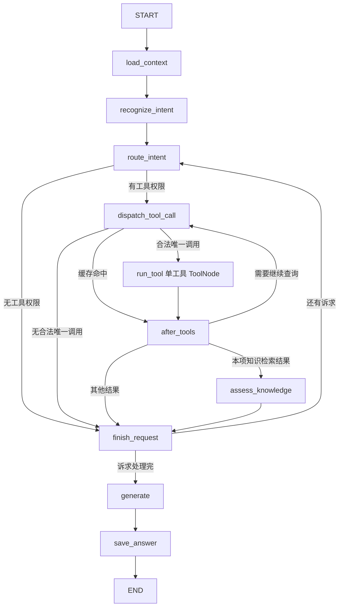

# Aiden 后端 Agent 实现详解

本文只描述当前源码链路，不保留已删除节点和早期模型自主工具调用流程作为“当前实现”。先读 [技术学习路线](技术学习路线.md)、[LangChain](LangChain.md)、[LangGraph](LangGraph.md) 的基础，再用本文对照一次真实请求。HTTP 与协议见 [FastAPI](FastAPI.md)，检索见 [RAG](RAG.md)、[Milvus](Milvus.md)，存储见 [数据层](数据层.md)。源码存在不等于真实依赖环境已经验收。

## 1. 当前能力与关键边界

Aiden 是订单客服原型。模型负责识别诉求、补全语义、评估证据和组织回答；**服务端负责工具名、参数、身份、业务授权与写入**，不是模型自主选择工具的 ReAct。

[registry.py](../backend/app/services/tools/registry.py) 的 `SUPPORT_TOOLS` 静态注册八个工具：`query_order`、`query_logistics`、`search_faq`、`query_after_sale`、`query_refund_policy`、`submit_after_sale`、`create_ticket`、`query_ticket`。运行时不会根据模型输出或外部服务动态发现工具。

一次发消息的顺序：

1. Cookie 鉴权、会话归属及请求校验。
2. MySQL 原子写入用户消息和助手占位消息。
3. 加载有限历史，识别最多四个独立诉求。
4. 逐项授权、服务端合成工具调用、执行查询或获准写入、核验知识证据并冻结结果。
5. 按项组织整轮回答；生成过程中实时发布 **delta 草稿**。
6. 引用校验可能改写或替换草稿；最终结果由 `save_answer` 提交。
7. 保存成功后发布 **final 权威正文与引用**，可选 `handoff`，正常结束 `done`；异常 `error`。

草稿已经展示，不能声称引用失败替换后“未曾暴露”。浏览器应以 final 替换草稿，而非追加另一个答案。

## 2. 模块地图

| 层 | 文件与入口 | 负责什么 |
| --- | --- | --- |
| HTTP | [conversations.py](../backend/app/api/routes/conversations.py)：`stream_message` | 校验、消息占位、运行图、SSE、重放和取消 |
| 身份 | [deps.py](../backend/app/api/deps.py)：`current_identity`、`current_actor`、`current_staff` | Cookie 会话验证与角色限制 |
| 模型 | [models.py](../backend/app/agent/models.py)：`create_models` | 流式答复与非流式JSON识别客户端 |
| 图装配 | [graph.py](../backend/app/agent/graph.py)：`build_support_graph` | StateGraph 节点、条件边、单工具ToolNode |
| 状态 | [state.py](../backend/app/agent/state.py)：`SupportState` | 身份、消息、诉求、授权、结果 |
| 历史/保存 | [nodes/context.py](../backend/app/agent/nodes/context.py)：`make_load_context`、`make_save_answer` | 短数据库操作和评估边界 |
| 识别/授权 | [nodes/intent.py](../backend/app/agent/nodes/intent.py)：`make_recognize_intent`、`route_intent` | JSON解析、原话来源、意图到权限 |
| 调用/后处理 | [nodes/tools.py](../backend/app/agent/nodes/tools.py)：`make_dispatch_tool_call`、`after_tools` | 服务端参数、缓存、连续查询 |
| 证据/收尾 | [nodes/knowledge.py](../backend/app/agent/nodes/knowledge.py)：`make_assess_knowledge`；[nodes/request.py](../backend/app/agent/nodes/request.py)：`finish_request` | 证据闸门、冻结当前项 |
| 回答 | [nodes/answer.py](../backend/app/agent/nodes/answer.py)：`make_generate` | 按项生成、草稿事件、引用核验 |
| 业务核验 | [order_routing.py](../backend/app/agent/order_routing.py)、[order_selection.py](../backend/app/agent/order_selection.py)、[refund.py](../backend/app/agent/refund.py) | 订单来源、列表选择、退款流程 |
| 消息仓储 | [chat.py](../backend/app/persistence/mysql/chat.py) | 登录会话、聊天历史、幂等、终态写入 |

## 3. 图的当前主流程



图中 `run_tool` 是八个 `run_<工具名>` 节点的归纳表示，不是源码节点名。`build_support_graph()` 为每个注册工具创建独立 `ToolNode([tool], handle_tool_errors=False)`。

条件函数在 [graph.py](../backend/app/agent/graph.py)：`route_after_intent` 选择派发或收尾；`route_dispatched_tool` 选择工具、缓存或收尾；`route_after_tools` 选择继续查询、知识核验或收尾；`route_next_request` 选择下一项或生成。`generate` 的唯一出边是 `save_answer`，不是模型回答后再自由选择工具。

## 4. 配置与模型接口

[settings.py](../backend/app/config/settings.py) 加载本地环境配置，保存模型、Cookie及历史限制；不在文档输出真实配置或密钥。[database.py](../backend/app/persistence/mysql/database.py) 的 `database_url_from_env()` 只从进程环境读连接串，不自行加载环境文件，Engine按URL缓存，导入不会创建表。

[models.py](../backend/app/agent/models.py) 的 `model_configuration_error()` 检查 API Key 与模型名，缺配置时路由发error，不返回固定假模型答案。`create_models()` 配置答复模型温度0.2、流式、最大800 tokens；识别模型关闭流式并 `bind(response_format={"type":"json_object"})`。

兼容服务的思考模式、usage与工具历史要求不同。源码对 DeepSeek 等的服务端合成调用缺少 `reasoning_content` 情形给出 `OPENAI_THINKING_MODE=disabled` 的配置说明；这不是所有模型一律必须关闭思考的结论。模型创建不是请求成功或服务验收。

## 5. Prompt、JSON与授权

当前识别指令为 [intent.py](../backend/app/agent/intent.py) 的 `MULTI_REQUEST_PROMPT`，结果模型为 `SupportRequest` / `SupportRequests`。识别入口没有分别调用旧单项分类/补全提示词，也没有使用 `with_structured_output()`。

`_structured_messages()` 移除历史SystemMessage，换成阶段指令与schema；`make_recognize_intent()` 先只看本轮原话，JSON或字段格式异常再尝试一次。存在退款上下文、上一轮订单列表或目标不明确时，再结合有限历史识别。多诉求要求每项 `original_question_quote` 来自本轮原话，不能把别项证据挂错。

关键字段：`intent` 九选一、`goal` 固定业务目标、`cofidence` 为0到1（保留契约拼写）、`completed_question`、订单引用、`action_quote`、退款原因和态度。JSON模式不等于业务正确，Pydantic也只能限制结构；授权仍由 `route_intent()` 与 `_route_request()` 复核。

- 非闲聊低置信度（低于0.55）不进入业务工具；`other` 兜底。
- 商品/政策知识问答可获得 `search_faq`；本人申请/工单走对应工具。
- 订单号与引用表达必须核验来源；数据归属最终在SQL中限制。
- 写操作的动作原话、退款确认及政策依据另外校验，不能由模型置信度授予写权限。

数据库保存用户原文，不用补全问题覆盖原文。客服主约束来自 [prompt.py](../backend/app/agent/prompt.py) 的 `SYSTEM_PROMPT`。

## 6. 会话、历史与持久化

登录会话是Cookie令牌及服务端登录记录；聊天会话是一个有所有者的Conversation及Message。`current_identity()` 验证Cookie，`current_actor()`进一步只允许普通用户对话，员工接口用 `current_staff()`。

[chat.py](../backend/app/persistence/mysql/chat.py) 的 `create_message_pair()` 在一个事务内创建用户消息与助手占位，使用 `clientMessageId` 做幂等；相同键和相同原文的完成回答可重放，正在生成拒绝并发重发。错误/中断记录只有在对应用户消息仍是最新用户轮、会话仍处于bot状态且没有其他streaming消息时，才允许重生成而不重复插入用户消息；不能任意重生成旧轮回答。

`recent_messages()` 读取归属用户的有限上下文，排除本轮助手占位；默认上限为16条消息、单条2000字符、总12000字符，对应 [settings.py](../backend/app/config/settings.py) 的 `Settings.max_history_messages`、`max_message_chars`、`max_context_chars`。这些是可在Settings中调整的配置值，不是不可变的框架上限，也不是当前由环境变量读取的参数。从最新消息消耗预算后反转为时间正序。这是字符预算，不是模型token预算。

`make_load_context()` 把普通历史数据转成LangChain消息；Session在模型await前关闭。当前没有持久化checkpointer或摘要节点，跨请求历史与退款 `workflow_state` 都来自MySQL，不是图断点自动续跑。

## 7. State 与节点更新

`SupportState` 是 `TypedDict(total=False)`，节点逐步写入字段；`messages` 使用 `add_messages` reducer按消息ID合并，其他普通字段由返回更新覆盖。节点只返回需要更新的字段；State中没有数据库Session。

`requests` 保存有序诉求，`request_index`定位当前项，`request_results`保存冻结结果。`finish_request()`在当前项完成后冻结工具事实、引用、检索快照和澄清结果，再推进索引。全轮处理完后 `make_generate()`按项组合答复，一项澄清或失败不等于吞掉其他项。

`query_cache`用于同轮相同调用结果复用；缓存命中合成关联ToolMessage，直接进入 `after_tools`。它不是跨用户共享业务缓存，也不是长期记忆。

## 8. 三条典型业务链路

### 知识咨询

```text
识别product/policy → 授权search_faq → 服务端传completed_question
→ Milvus召回 → MySQL回表有效性过滤 → rerank
→ assess_knowledge → finish_request → generate → save_answer
```

`make_assess_knowledge()`处理空召回、重排分阈值及模型证据充分性核验；服务故障不冒充知识缺失。生成再校验引用编号；编号缺失或越界可替换拒答。这个检查不是每条事实都已得到语义证明。

### 查物流与订单选择

[order_routing.py](../backend/app/agent/order_routing.py) 的 `_semantic_route()`核验订单引用；目标不唯一时先查本人近期订单。`after_tools()`结合 [order_selection.py](../backend/app/agent/order_selection.py) 的 `_order_lookup_result()`决定列候选或继续查询。下一轮列表选择要再次查本人近期订单复核后才开放物流工具；号码本身不能绕过用户归属。

### 退款和工单写入

单商品退款先核对本人订单、原因和当前有效商家退款政策。生成登记前说明及固定确认话术，将确认状态存入助手消息 `workflow_state`。下一轮明确 `确认提交` 与紧邻上一轮已保存状态均通过复核，才开放 `submit_after_sale`。写入层还核对现行政策快照；知识库检索结果不授予退款权限。

多商品退款、退货与换货引导到售后页面，不描述成已接入对话自助办理。`create_ticket`依据已核验本轮动作原话登记待处理工单；登记不等于员工解决问题。退款审核通过也不代表外部支付退款到账。完整业务限制见 [售后与工单](售后与工单.md)。

## 9. 工具和数据访问

| 工具 | 文件与符号 | 数据边界 |
| --- | --- | --- |
| 订单、物流 | [customer.py](../backend/app/services/tools/customer.py)：`query_order`、`query_logistics` | InjectedState身份；[queries.py](../backend/app/persistence/mysql/queries.py) 按本人过滤 |
| 知识 | 同上：`search_faq`；[retrieval.py](../backend/app/services/rag/retrieval.py)：`semantic_search` | Milvus候选先回MySQL取有效权威正文，再精排 |
| 售后进度 | [after_sale.py](../backend/app/services/tools/after_sale.py)：`query_after_sale` | 本人申请 |
| 退款政策/登记 | [after_sale_submit.py](../backend/app/services/tools/after_sale_submit.py)：`query_refund_policy`、`submit_after_sale` | 当前商家政策和明确确认 |
| 工单登记/查询 | [ticket_create.py](../backend/app/services/tools/ticket_create.py)：`create_ticket`；[ticket_query.py](../backend/app/services/tools/ticket_query.py)：`query_ticket` | 原话授权、本人数据 |

工具整理为普通JSON字符串，不把ORM对象、连接或原始异常交给模型。知识默认dense+BM25/RRF+rerank，详见 [Milvus](Milvus.md)；不静默改为MySQL LIKE查询。

## 10. 当前 SSE 契约

路由调用 `astream_events(version="v2")`，用 [sse.py](../backend/app/api/sse.py) 的 `sse_event()`编码 `event:`、JSON `data:` 和末尾空行。

| 事件 | 载荷 | 时机 |
| --- | --- | --- |
| `start` | `messageId` | 助手行已确定，开始生成/重放 |
| `progress` | `stage`、`message` | 受控阶段和顶层工具进度，无原始参数/结果 |
| `delta` | `text` | 仅转发generate节点内 `support_answer_delta`，是未核验草稿，可多次 |
| `final` | `text`、`citations` | save_answer的on_chain_end后，权威正文替换草稿 |
| `handoff` | 空对象 | 最终保存已提交人工转接时 |
| `done` | 空对象 | 正常结束 |
| `error` | `error` | 配置或执行失败；与done互斥 |

当前后端**不另发 `citations` 事件**；前端可能仍兼容它，不等于后端现行输出。

```text
event: start
data: {"messageId":"教学占位ID"}

event: delta
data: {"text":"尚未核验的草稿"}

event: final
data: {"text":"已保存的最终回答","citations":[]}

event: done
data: {}

```

上面是契约示意，不是本次运行记录。完成重放仅 `start → final → done`，不再执行图。`make_save_answer()`调用 `finish_assistant_message()`，同事务保存最终正文、引用、检索快照、低置信度问题及必要的人工状态。

客户端取消时，未获得保存结果的生成记录以空正文 `stopped`收尾，草稿不落库；仓储终态闸门保护已提交的 `complete`，迟到取消不能降级它。保存事件到达后路由放弃取消收尾权。断线不再承诺能发送error给已关闭连接。

## 11. 已实现与未实现要分开

当前源码包括Cookie鉴权、本人订单/物流/售后/工单、受控退款与工单登记、知识检索与人工审核补库、员工人工排队接待、主题分类旁路及可观测性路由。员工接待当前靠HTTP和页面刷新，不是WebSocket实时推送。

摘要记忆、持久化checkpointer、模型自主ReAct、动态MCP发现、对话内完整退货换货办理等不能写成已实现。目标设计见 [Aiden](Aiden.md)，当前能力应以注册路由和实际调用链为准。

`build_support_graph(evaluation=...)`可替换历史与保存边界，默认禁止业务写工具；允许写评估还要求隔离环境和账号。mock演示、单元替身、模型依赖调用及健康接口成功都不等于真实服务验收。

## 12. 排查与源码阅读顺序

1. [conversations.py](../backend/app/api/routes/conversations.py) `stream_message`：区分HTTP校验失败与SSE开始后的错误。
2. [graph.py](../backend/app/agent/graph.py) `build_support_graph`：从条件边解释实际经过的节点。
3. [nodes/intent.py](../backend/app/agent/nodes/intent.py) → [nodes/tools.py](../backend/app/agent/nodes/tools.py)：检查意图、原话、权限和参数。
4. [retrieval.py](../backend/app/services/rag/retrieval.py) → [nodes/knowledge.py](../backend/app/agent/nodes/knowledge.py)：区分服务故障、空召回、证据不足。
5. [nodes/answer.py](../backend/app/agent/nodes/answer.py) → [nodes/context.py](../backend/app/agent/nodes/context.py) → [chat.py](../backend/app/persistence/mysql/chat.py)：核验草稿、final和数据库终态。

本篇只给静态实现依据；真实验收应记录具体问题、账号/前置状态、依赖版本、SSE最终事件及数据库结果，不沿用旧事件契约的历史记录证明新链路已测。
