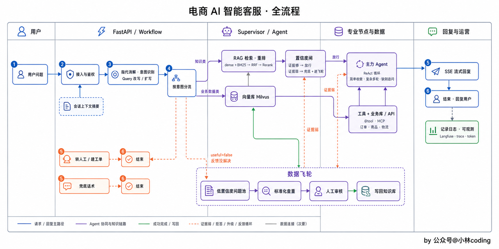

# Aiden


## 架构设计

```
 Aiden/
  ├─ frontend/                         # 交互层：React + Vite
  │  └─ src/
  │     ├─ pages/                      # 用户对话、人工客服、运营工作台、链路可视化
  │     ├─ components/
  │     ├─ api/                        # FastAPI 接口与 SSE 客户端
  │     └─ types.ts
  │
  ├─ backend/
  │  └─ app/
  │     ├─ main.py                     # FastAPI 入口
  │     ├─ api/                        # 鉴权、会话、人工接管、运营与 trace 接口
  │     │  ├─ routes/
  │     │  ├─ schemas/
  │     │  └─ sse.py
  │     │
  │     ├─ agent/                      # Agent 编排层
  │     │  ├─ graph.py                 # LangGraph Supervisor 组图
  │     │  ├─ state.py                 # 对话与流程状态
  │     │  ├─ nodes/                   # load_context、intent、clarify、route、
  │     │  │                            # summarize、security
  │     │  └─ specialists/             # RAG、Tools、Billing、ticket
  │     │
  │     ├─ services/                   # 基础能力层
  │     │  ├─ rag/                     # 检索、融合、重排
  │     │  ├─ tools/                   # 订单、物流等工具调用
  │     │  ├─ memory/                  # 上下文裁剪与摘要
  │     │  ├─ guardrails/              # 置信度闸门、拒答、转人工
  │     │  ├─ model/                   # OpenAI 兼容模型接入
  │     │  └─ observability/           # trace、token 与成本记录
  │     │
  │     ├─ persistence/                # 数据访问
  │     │  ├─ mysql/                   # 会话、消息、工单、问题池
  │     │  └─ milvus/                  # 知识向量
  │     └─ config/
  │
  ├─ scripts/                           # 知识导入与索引构建
  ├─ deploy/                            # Docker Compose 与部署配置
  └─ docs/                              # 文档
```


### 用户输入一条消息的全景



用户问题进来，首先是接入与鉴权，然后是AI进行指代消解与意图识别，将一些依赖上下文的对话补充成一句独立能看懂的完整问题，再判断它属于九类意图的哪一类，按照意图分流，有五个出口

* 知识类，强制先检索再答，检索回来还要过一道置信度闸门，证据不足直接不回答
* 退款退货走一条写死的子流程：先取订单，缺订单号就弹选择器等用户选，再强制检索退货政策，最后才把 这一单能不能退 交给模型判断
* 查订单物流，交给主力agent拿工具去翻
* 闲聊给固定话术，不让模型生成
* 投诉先安抚，给出转人工或建工单的选项

回答使用SSE流式恢复，答不上的走兜底话术或转人工

答不上的问题攒进问题池等人工审核补库 -> 数据飞轮


### 为什么是 workflow + agent 的混合？

对于客服，有几处硬约束是不能依靠模型自觉的，知识类必须检索，投诉不能硬接，退款必须查政策再回答

而且，大量用户只会问几句问题，不能依赖agent自己去探索和使用RAG，这样速度太慢，稳定性也差

所以定成，用`LangGraph`确定 workflow 的骨架，配合主力 agent 的ReAct循环


### 分层架构


## Prompt工程化


### System Prompt

```
你是「喵购商城」的智能客服Aiden，语气亲切、回答简洁，不用网络烂梗。

你的职责范围：商品咨询、订单与物流查询、退换货政策解答。

必须遵守：
1. 只依据商城政策作答，拿不准就说「这边帮您转人工核实」，严禁编造；
2. 不承诺具体的退款到账时间，不对商品质量打包票；
3. 用户聊到职责之外的话题，礼貌把话拉回客服业务。
```


### PromptTemplate

客服话术天然带变量 ，亲，您的订单 {订单号} 已从 {仓库} 发出，预计 {日期} 送达」

```
from langchain_core.prompts import ChatPromptTemplate

prompt = ChatPromptTemplate.from_messages([
    ("system", SYSTEM_PROMPT),
    ("user", "用户问题：{question}\n\n可参考的资料：{context}"),
])
chain = prompt | llm
reply = chain.invoke({"question": "运费险怎么赔？", "context": policy_text})
```


### 结构化输出

```
from pydantic import BaseModel, Field

class AftersaleNote(BaseModel):
    product: str = Field(description="商品名称")
    issue: str = Field(description="问题描述")
    urgent: bool = Field(description="用户是否着急")

structured_llm = llm.with_structured_output(AftersaleNote)
chain = prompt | structured_llm
```


## Function Calling

模型先从用户的话里识别出意图，比如说查订单，接着生成一个结构化的工具调用请求，带上函数名和参数，然后我们的代码执行函数，拿到真实数据，最后把执行结果回传给模型，让它据此生成给用户的回答

协议层

```
{
  "type": "function",
  "function": {
    "name": "query_order",
    "description": "根据订单号或下单手机号查询订单的状态、商品与金额",
    "parameters": {
      "type": "object",
      "properties": {
        "order_no": {"type": "string", "description": "订单号，形如 SO20260625001"},
        "phone": {"type": "string", "description": "下单时使用的 11 位手机号"}
      },
      "required": []
    }
  }
}
```

`name` 是工具的名字，`description` 告诉模型这工具是干什么的、什么时候用，`parameters` 用 JSON Schema 描述参数长什么样。JSON Schema 可以理解成参数的「格式合同」：`type` 定类型，每个参数自己的 `description` 说明取值含义，`required` 圈出必填项


模型决定用工具时，回复

```
{
  "role": "assistant",
  "content": null,
  "tool_calls": [{
    "id": "call_7f3a",
    "type": "function",
    "function": {
      "name": "query_order",
      "arguments": "{\"phone\": \"13800001234\"}"
    }
  }]
}
```


执行完函数，把结果包成一条`rool`为`tool`的消息，追加回对话

```
{
  "role": "tool",
  "tool_call_id": "call_7f3a",
  "content": "{\"order_no\": \"SO20260625001\", \"status\": \"已发货\", \"item\": \"蓝牙耳机\"}"
}
```


本质上，Function Calling 就是一种消息格式的约定，外加一轮额外的对话往返，三份 json：说明书，申请单，结果单


### 工具

* query_order 订单查询
* query_product 商品查询
* query_logistics 物流查询
* query_faq 政策与常见问题查询
* create_ticket 转人工工单
* list_user_orders 用户没提供订单号时，列出本人订单供其选择
* query_policy 检索当前生效的退换货政策，供退款流程强制调用
* query_after_sale 查询退货，退款申请及处理进度
* query_ticket 查询已建工单的处理状态


### @tool装饰器

每个工具就是一个python函数，需要配套一份说明书

LangChain给出的方案是`@tool`装饰器，一份代码两份产生产出

```
from langchain.tools import tool
from typing import Annotated

@tool
def query_order(
    order_no: Annotated[str | None, "订单号，形如 SO20260625001"] = None,
    phone: Annotated[str | None, "下单时使用的 11 位手机号"] = None,
):
    """根据订单号或手机号查询订单，返回订单状态、商品与金额。

    订单号和手机号至少提供一个。用户报不出订单号时，用手机号查询。
    """
    ...
```

这段代码里藏着三个映射：函数名 `query_order` 成了工具名，docstring 成了工具的 `description`，参数的类型注解生成参数 Schema，`Annotated` 里那句中文说明会挂到对应参数的 `description` 上。装饰器在函数定义那一刻把这些信息抽出来，组装成模型要看的 JSON 说明书，跟函数本体永远同步。


## 数据库设计

客服解决的，查商品，查订单，催物流，问政策

| 表 | 存什么 | 服务什么 |
| --- | --- | --- |
| `users` | 用户与客服的身份、联系方式、角色 | 鉴权、会话归属、人工接管 |
| `products` | 商品名称、分类、描述、上架状态 | 商品咨询、商品查询 |
| `product_skus` | 商品规格、价格、库存状态 | 具体规格与价格查询 |
| `orders` | 订单号、用户、总金额、订单状态、下单时间 | `query_order`、退款前核对订单 |
| `order_items` | 订单中的 SKU、数量、成交价及商品名称快照 | `query_order`、确认可退商品 |
| `shipments` | 订单关联的包裹、承运商、运单号、配送状态 | 物流查询、催物流 |
| `tracking_events` | 包裹的物流节点、地点、时间、状态 | 展示物流轨迹 |
| `after_sale_requests` | 退货或退款申请、关联订单商品、原因、处理状态 | 售后进度查询与处理 |
| `policies` | 退换货、运费险等政策的内容、版本、生效时间 | 政策检索、退款资格判断 |
| `faq` | 问答对：问题、答案、分类 | `query_faq` |
| `conversations` | 会话：用户、开始时间、处理状态、接管客服 | 对话服务、人工接管 |
| `messages` | 消息流水：关联会话、角色、内容、发送时间 | 对话服务、上下文加载 |
| `tickets` | 人工工单：工单号、关联会话、问题描述、类型、处理状态、创建时间 | `create_ticket` |
| `unanswered_questions` | 低置信度或未解决的问题、关联会话、审核状态 | 问题池、人工审核补库 |


## RAG


### 工作流程

* 离线建库：解析，切分，向量化

  知识库里面的知识放什么？

  * 权威，结构清晰的文档：退款退货政策
  * 商品FAQ(规格，功能，使用方法)
  * 售后服务手册(保修条件，换货流程)
  * 支付和发票FAQ
  * 促销活动规则
  * 账号安全，评价规则

  知识从哪里来？

  * 人工整理
  * 历史客服对话，拿出一批历史对话，喂给LLM，让它从聊天里抽取出 [用户问了什么，客服怎么答的] 的问答对，写进一张暂存表，等所有批次过完，再整体过一遍去重，才是最终能用的问答对

* 在线问答


### Embedding选什么？

向量化选择什么模型呢？电商客服这个场景，一般是企业级的，数据不能泄露出去，私有化部署是硬要求，有时候还需要拿语料给它微调，得选一个开源的，能自己微调的，并且要支持中英文

开源几个候选：BGE-M3、Qwen3-Embedding、gte-multilingual-base、jina-embeddings-v3

BGE-M3 体量不大，支持 100 多种语言，能处理长达 8192 token 的文本，中英文的语义检索能力都稳，还方便后续做领域微调。

Qwen3-Embedding 走的是同一条路，多语言表现更强一档，同样开源可微调，不过它的强项在 4B、8B 这种大参数档，也提供 0.6B 的轻量档


模型参数越大，检索效果越好吗？不一定

真实情况下，检索质量的瓶颈很少卡在 Embedding 的参数规模上，更多卡在切分切得好不好，检索是不是只用了单一路径，也没有做重排，要不要针对领域微调这几步

这几步做好了轻量模型也够用

并且电商客服这个场景，用户问题通常不长，知识问题也有限，就是商品和政策

大挡位模型，是给语料庞杂，跨语种差异多的场景准备的，所以我们选择0.6B


BGE-M3支持中英文，长文本，微调，生成环境用的多，向量库也适配，工程上很便利

就用这个吧


### 向量库怎么选？

向量库主流的有：FAISS、ChromaDB、pgvector、Milvus 和 Qdrant。

* FAISS，严格来说只是个检索库，不带服务层，只管存向量和一个数字ID，连原文都不存，不能按字段过滤，不行
* ChromaDB，开箱即用，嵌入式部署，但撑不住生产环境的并发规模
* pgvector就是给 PostgreSQL 装了个向量检索的插件，复用现成的数据库，中小规模可以用
* Milvus 和 Qdrant 是专门为向量检索设计的分布式系统，索引种类丰富，原生支持按量字段过滤，扛得住大规模，高并发

本项目选Milvus

电商客服系统要抗的向量规模会持续涨，按品类，按店铺过滤这种标量查询也要有


存进去 Milvus 靠的是 ANN，近似最近邻，常见索引方式

* HNSW，图跳查
* IVF 分桶查

规模不大，追求低延迟选HNSW，规模特别大，能接收调参换召回选IVF


### 原文放哪里？

向量是从原文算出来的，计算必然出现信息的损失，原文不能丢，必须存着

后面微调 Embedding，调整切分策略，换向量维度，这些改动都需要原文

原文直接放向量库不行吗？向量库专精的是按相似度查找，业务上还可能需要对原文进行关系型查询，这些还是放在关系型数据库好一点


原文放哪，跟向量库怎么搭，这也有几种方案

* 跑demo，FAISS配一个sidecar，拿SQLite存原文
* FAISS + MySQL，靠一个 vectorId 字段关联
* Milvus 和 Qdrant 一体，原文和各种元数据直接进向量库自带的存储，原生支持标量过滤，代价是多运维一套分布式系统
* 正文连同检索要用的元数据直接放进 Milvus，MySQL当权威事实源和业务底座，本项目就用这个


### 如何实现？

一个知识块从切好到能被检索到，需要 [双写] + 一个状态位

* 先把切好的内容放进去MySQL，状态标记成 [待向量化] vectorId 留空
* 再拿它去调用 Embedding 模型算出向量，把向量连同正文，检索用的元数据一起写进 Milvus，Milvus会给这条记录分配一个ID
* 回写，把这个ID不回去 vectorId，状态改成已向量化


### 一个 chunk 长什么样？

每一条知识落库，不能知识一段正文，应该是一个结构化的 JSON

