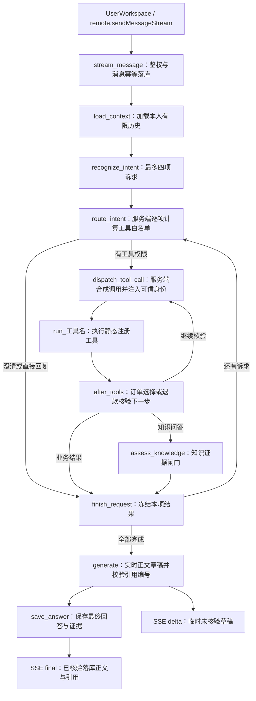
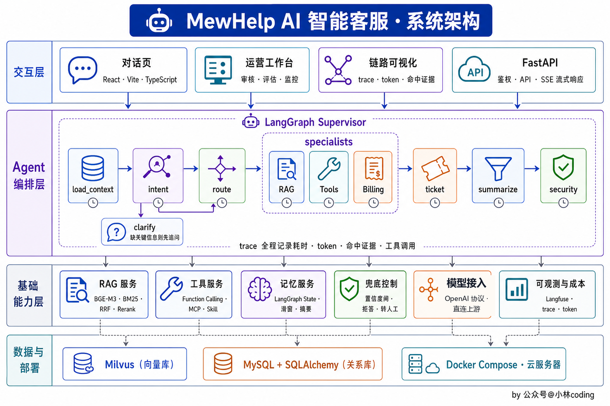
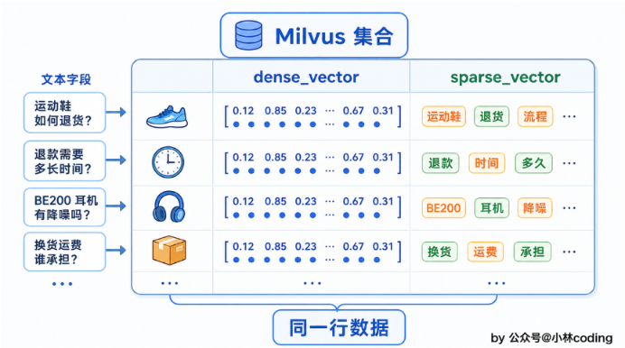

# Aiden

状态校准日期：2026-09-30。本文保留架构思路与目标设计，但**已有实现、真实环境验收、未来规划是三种不同状态**。下列“已实现”以源码为准；本次说明校准不代表 remote 的模型、MySQL、Milvus、售后和人工完整闭环已验收。演示基线及复现步骤见 [`frontend/README.md`](../frontend/README.md#本地启动)，具体场景验收见 [`待办.md`](../待办.md#二p0先把已有闭环验收完整)。

## 架构设计
### 当前实现与验收边界

| 状态 | 当前能力或边界 | 源码入口 |
| --- | --- | --- |
| 已实现，仍需真实环境验收 | Cookie 鉴权、本人业务数据隔离、对话落库、停止与幂等重放 | `api/routes/auth.py`、`api/routes/conversations.py`、`persistence/mysql/chat.py` |
| 已实现，仍需真实环境验收 | 九类意图、最多四项诉求逐项执行；服务端静态工具白名单，不是自主 ReAct | `agent/intent.py`、`agent/graph.py`、`services/tools/registry.py` |
| 已实现，仍需真实环境验收 | 本人订单、物流、售后和工单查询；商品咨询走知识检索，无独立 SKU 实时价格/库存工具 | `services/tools/customer.py`、`after_sale.py`、`ticket_query.py` |
| 已实现，仍需真实环境验收 | 知识切块、MySQL/Milvus 双写、dense/BM25/RRF/rerank、证据充分性及引用编号检查、拒答 | `services/rag/indexing.py`、`retrieval.py`、`agent/graph.py` |
| 已实现，仍需真实环境验收 | 售后页退款/退货/换货与员工处理；对话退款限本人单商品订单、政策覆盖原因和原文“确认提交” | `/app/service`、`/staff/service`、`persistence/mysql/service_workflow.py`、`services/tools/after_sale_submit.py` |
| 已实现，仍需真实环境验收 | 站内人工排队、接单、双方消息、关闭；前端主要靠轮询，不是外部坐席平台 | `api/routes/staff.py`、`persistence/mysql/human_support.py`、`UserWorkspace.tsx`、`StaffWorkspace.tsx` |
| 已实现，仍需真实环境验收 | 低置信度/负反馈入池、员工审核补 FAQ、同步及重试；历史挖掘是另一条抽取/脱敏/暂存/去重路径 | `services/rag/review_queue.py`、`conversation_mining.py`、`extraction.py` |
| 已实现，仍需真实环境验收 | RAG 控制台、离线评估、Langfuse 图回调与意图归因；员工“观测与用量”页面 `/staff/observability` 与只读 API 按显式来源汇总，展示安全观测树、唯一模型调用的 Token 分组/趋势、员工语言事实、可追溯慢请求/慢步骤和用量缺失覆盖，不展示费用。服务内部 Langfuse 费用采集与计量仍保留，采用 costDetails.total 或有文档定义的 v2 totalCost（USD），非账单；历史来源/意图不推断，缺金额不当零。2026-10-09 真实只读批次为 108 个唯一观测、11 次模型调用、7 条线上请求；11/11 供应商原始计数完整，合计 30,023 tokens，11 次金额未提供，尚无真实多意图请求可验。隔离 current_staff 会话读取成功不代表正式员工登录验收；用户此前 connection_failed 根因尚未捕获，不能宣称已修复。检索内部阶段未单独追踪 | `api/routes/rag_admin.py`、`api/routes/observability.py`、`backend/evals/run_customer_rag.py`、`agent/graph.py`、`frontend/src/pages/Observability.tsx` |
| 尚未实现 / 目标设计 | MCP 动态发现、自主 ReAct、历史摘要与语义记忆、小分类器及微调；外部支付退款执行及到账核实 | 后文标注的规划章节 |

本地 mock 只展示模拟订单、对话和处理状态；remote 使用后端与真实依赖，出错不会静默切回 mock。`approved` / `awaiting_external_refund` 只表示审核通过 / 待外部退款，不能描述为款项已到账；站内人工排队也不保证立即接入。

### 当前目录（省略空目录与构建产物）

```text
Aiden/
├─ frontend/src/
│  ├─ pages/                         # 登录、用户/员工会话、售后、RAG、评估、审核与观测页面
│  ├─ components/
│  ├─ api/                           # mock / remote 适配器与 SSE 客户端
│  ├─ data/                          # mock 演示数据
│  └─ types.ts
├─ backend/
│  ├─ app/
│  │  ├─ main.py
│  │  ├─ api/                        # deps.py、schemas.py、sse.py、routes/
│  │  ├─ agent/                      # graph.py、state.py、intent.py、service_intent.py
│  │  ├─ services/
│  │  │  ├─ observability/            # Langfuse callback 与只读控制台聚合
│  │  │  ├─ rag/                      # 建库、检索、历史挖掘、审核与控制台
│  │  │  └─ tools/                    # 八个静态注册工具
│  │  ├─ persistence/
│  │  │  ├─ mysql/                   # 业务、会话、人工接管、知识与审核数据访问
│  │  │  └─ milvus/                  # 知识向量、BM25 与混合召回
│  │  └─ config/
│  ├─ scripts/                       # 演示用户、知识建库、embedding 与挖掘入口
│  ├─ knowledge/                     # 演示素材；不默认全部导入
│  ├─ evals/                         # 离线题集与评估
│  └─ alembic/versions/
├─ deploy/
├─ sql/
└─ docs/
```

### 目标目录（规划，不代表文件或能力已经存在）

下面保留早期分层设想。当前节点实现集中在 `agent/nodes/`，由 `agent/graph.py` 装配成图，并未拆成 Supervisor / specialists；memory、guardrails、model 尚无独立服务实现；只读“观测与用量”控制台及 Langfuse callback 已分别位于 `api/routes/observability.py` 和 `services/observability/`，不等同于独立的通用监控平台。当前脚本在 `backend/scripts/`，不是根目录 `scripts/`。


```
 Aiden/
  ├─ frontend/                         # 交互层：React + Vite
  │  └─ src/
  │     ├─ pages/                      # 用户对话、人工客服、运营工作台、链路可视化
  │     ├─ components/
  │     ├─ api/                        # FastAPI 接口与 SSE 客户端
  │     └─ types.ts
  │
  ├─ backend/
  │  └─ app/
  │     ├─ main.py                     # FastAPI 入口
  │     ├─ api/                        # 鉴权、会话、人工接管、运营与 trace 接口
  │     │  ├─ routes/
  │     │  └─ sse.py
  │     │
  │     ├─ agent/                      # Agent 编排层
  │     │  ├─ graph.py                 # LangGraph Supervisor 组图
  │     │  ├─ state.py                 # 对话与流程状态
  │     │  ├─ nodes/                   # load_context、intent、clarify、route、
  │     │  │                            # summarize、security
  │     │
  │     ├─ services/                   # 基础能力层
  │     │  ├─ rag/                     # 检索、融合、重排
  │     │  ├─ tools/                   # 订单、物流等工具调用
  │     │  ├─ topic_classification/    # 旁路主题分类器接入
  │     │
  │     ├─ persistence/                # 数据访问
  │     │  ├─ mysql/                   # 会话、消息、工单、问题池
  │     │  └─ milvus/                  # 知识向量
  │     └─ config/
  │
  ├─ scripts/                           # 知识导入与索引构建
  ├─ deploy/                            # Docker Compose 与部署配置
  └─ docs/                              # 文档
```


### 用户输入一条消息的全景

下面是当前源码链路；早期图片 [`一条消息怎么变成一句回答`](assets/一条消息怎么变成一句回答.jpg) 仅作为目标设计参考。



- 知识类通过 `search_faq` 检索后再判断证据充分性；生成后检查引用编号是否有效，不是逐句 NLI 事实证明。
- 对话退款先查询本人订单和有效商家退款政策，原因被政策正文覆盖才进入确认阶段；原文“确认提交”后由 `submit_after_sale` 再次核验并创建待审核申请，不执行支付退款。
- 查订单、物流、售后、工单均由服务端按意图选择固定工具；闲聊使用模型自然回应，不查询业务数据。投诉、登记工单和站内转人工是不同处理目标。
- 明确转人工可通过按钮或对话进入站内队列；客服接单后双方在原会话留言，waiting / staff 状态不继续触发机器人回答。
- 当前 remote SSE 用瞬态 `progress` 展示真实识别、工具查询、检索与校验阶段；`generate` 经 `model.astream` 逐段发正文自定义事件，路由仅把 generate 的 `support_answer_delta` 转为 `delta`。直接答复、多项编号/换行及退款固定确认也使用同一事件；不转发原生模型流、推理/工具块或内部 JSON。
- `delta` 是可见但尚未核验的草稿，已经展示的内容无法撤回；引用校验可改写为拒答或去掉悬空标记。`save_answer` 核验结果落库成功后发一次 `final {text,citations}`（引用可为空数组），以完整权威正文与引用替换草稿，再发可选 `handoff` 和 `done`，保存后不再发 delta/citations。完成重放只发 start→final→done，不调用模型、不重复用户行。
- 取消/断线不伪造 final/done，错误只发 error，不再发 done。保留原持久化语义：草稿不进入 `answer_so_far`，未完成取消保存空正文 stopped；仓储只修改 streaming，已保存 complete 不被迟到取消降级。mock 仍使用本地模拟 `tool_status`、卡片与分段输出，不代表真实模型和数据库。低置信度和负反馈进入人工审核问题池，历史对话挖掘另走独立流程。
- 2026-10-07 后端定向验收：真实 FastAPI/Uvicorn TCP HTTP/SSE 配受控模型、工具和内存仓储，观察正常前两段实时 delta 时模型未结束且 save=0；直接答复、多项全轮引用偏移、坏引用草稿→拒答 final 并保存拒答、退款确认、私有输出隔离、错误终态互斥、取消 stopped 空正文、同 key 重试/重放及保存后断线 complete 均通过。关键消费者测试 2 项通过；既有多请求 runner 为 `Ran 30 tests`、`FAILED (failures=2)`，两处失败是退货/换货同一测试的子例，当前 generate 前订单查询与测试无查询期待冲突，未修改用户已有意图代码或运行修改前基线。独立外部模型探测收到两个正文片段“你好。”；随后真实外部模型驱动生产 generate，经 TCP SSE 收到 6 个实时 delta → final → done。最终路由守卫另以当前源码 TCP 烟测验证：注入迟到 delta 和重复保存事件后仍只一次 final，final 后无 delta；异常和取消不伪造 done/final。工具与仓储仍受控，不等同真实 MySQL/Milvus 业务全链路验收。
- 同日真实 React/系统 Chrome 经 FastAPI TCP SSE 验收：DOM 已显示多个草稿片段时模型未完成、save=0、仓储正文为空且 streaming；正常、直接、多项顺序、[1]/[2] 点击引用 Popover 和缓存来源正确，坏引用 [99] 草稿被拒答 final 替换并清空引用，私有块不显示，首段停止后 stopped 空正文及同 key 重试重新建立草稿均已观察。真实外部模型浏览器场景收到 16 个 delta，最终 DOM 与 HTTP 历史正文一致；工具/仓储仍受控。
- 真实浏览器时序验收还观察到：3 秒历史轮询不抹 streaming 草稿且员工消息继续到达；仓储 complete 早于 final 时不重复；final 先于迟到历史时正文不回退；旧 stopped 历史迟到不抹重试草稿；final 后、done 前仍保留忙状态，done 后才释放；同会话旧 finally 和跨会话故意迟到的真实 SSE 回调不污染新草稿或释放新请求忙状态。乱序由临时浏览器 fetch/取消控制构造，不修改生产后端来制造竞态。
- 实际生成取消另经独立 TCP 场景验证：首段后真实 HTTP abort，受控模型异步生成器捕获 `CancelledError` 且 finally 关闭，原生成没有完成；仓储 stopped 空正文、无 final/done。同 key HTTP 重试启动不同生成实例，只有新实例完成并复用原消息对。此证据验证取消传播到模型任务，不仅是界面停止或 HTTP 断线。
- 真实浏览器补充验收：完成记录的手动同 key 重试，两次 POST 正文/键完全相同，第二次仅 start→final→done、助手 ID 相同且 save_count=1；历史 complete 后通过浏览器注入迟到 delta，DOM 与缓存保持权威正文；remote 错误仅 start/error，DOM 同步仓储错误正文并显示重试。mock 独立回归保留模拟工具轨迹与订单卡片、不显示 remote 草稿提示，模拟错误正文未改变；这些 mock 观察不是外部模型或数据库验收。


### 为什么是 workflow + agent 的混合？

对于客服，有几处硬约束是不能依靠模型自觉的，知识类必须检索，投诉不能硬接，退款必须查政策再回答

而且，大量用户只会问几句问题，不能依赖agent自己去探索和使用RAG，这样速度太慢，稳定性也差

当前用 `LangGraph` 确定 workflow 骨架，模型只负责结构化识别与有证据的回答；工具名、权限和可信用户身份由服务端决定。主力 Agent 自主 ReAct 循环仍是目标设计，不能用它描述现有执行方式。


### 分层架构

早期目标分层示意：。当前实现的分层与状态以本页“当前目录”和源码入口表为准。


## Prompt工程化


### System Prompt
以下 Prompt、模板和结构化输出是教学示例，不是运行时原文。实际 `SYSTEM_PROMPT` 与多诉求契约分别在 `backend/app/agent/prompt.py`、`intent.py`；不得据示例承诺未核实的仓库、送达日期或到账时效。


```
你是「喵购商城」的智能客服Aiden，语气亲切、回答简洁，不用网络烂梗。

你的职责范围：商品咨询、订单与物流查询、退换货政策解答。

必须遵守：
1. 只依据商城政策作答，拿不准就说「这边帮您转人工核实」，严禁编造；
2. 不承诺具体的退款到账时间，不对商品质量打包票；
3. 用户聊到职责之外的话题，礼貌把话拉回客服业务。
```


### PromptTemplate

客服话术天然带变量 ，亲，您的订单 {订单号} 已从 {仓库} 发出，预计 {日期} 送达」

```
from langchain_core.prompts import ChatPromptTemplate

prompt = ChatPromptTemplate.from_messages([
    ("system", SYSTEM_PROMPT),
    ("user", "用户问题：{question}\n\n可参考的资料：{context}"),
])
chain = prompt | llm
reply = chain.invoke({"question": "运费险怎么赔？", "context": policy_text})
```


### 结构化输出

```
from pydantic import BaseModel, Field

class AftersaleNote(BaseModel):
    product: str = Field(description="商品名称")
    issue: str = Field(description="问题描述")
    urgent: bool = Field(description="用户是否着急")

structured_llm = llm.with_structured_output(AftersaleNote)
chain = prompt | structured_llm
```


## Function Calling

当前实现由模型识别结构化意图，服务端 `route_intent` 计算白名单，`dispatch_tool_call` 合成工具名与参数，再由对应 `ToolNode` 执行；模型不自主提交工具名或用户身份。结果再交给生成节点，回答以本轮真实查询或检索证据为准。

下面三份 JSON 仅解释 Function Calling 协议格式，不代表当前模型自主决策。示例的 `order_no` 可省略；`user_id` 通过可信图状态注入，不能按手机号或用户自称授权。

```
{
  "type": "function",
  "function": {
    "name": "query_order",
    "description": "查询当前登录用户的订单和商品；省略订单号时返回最近五笔",
    "parameters": {
      "type": "object",
      "properties": {
        "order_no": {"type": "string", "description": "本人订单号，可省略"}
      },
      "required": []
    }
  }
}
```

`name` 是工具的名字，`description` 告诉模型这工具是干什么的、什么时候用，`parameters` 用 JSON Schema 描述参数长什么样。JSON Schema 可以理解成参数的「格式合同」：`type` 定类型，每个参数自己的 `description` 说明取值含义，`required` 圈出必填项


服务端合成的工具调用使用这类消息格式：

```
{
  "role": "assistant",
  "content": null,
  "tool_calls": [{
    "id": "call_7f3a",
    "type": "function",
    "function": {
      "name": "query_order",
      "arguments": "{\"order_no\": \"SO20260625001\"}"
    }
  }]
}
```


执行完函数，把结果包成一条 `role` 为 `tool` 的消息，追加回图状态：

```
{
  "role": "tool",
  "tool_call_id": "call_7f3a",
  "content": "{\"order_no\": \"SO20260625001\", \"status\": \"已发货\", \"item\": \"蓝牙耳机\"}"
}
```


本质上，Function Calling 就是一种消息格式的约定，外加一轮额外的对话往返，三份 json：说明书，申请单，结果单


### 工具

工具注册以 `backend/app/services/tools/registry.py` 的 `SUPPORT_TOOLS` 为准，当前共八个：

| 工具名 | 当前用途与边界 |
| --- | --- |
| `query_order` | 查询本人订单及商品快照；省略订单号时列出最近五笔，没有独立 `list_user_orders` 注册工具 |
| `query_logistics` | 查询本人指定订单的包裹与物流节点 |
| `search_faq` | 商品知识、政策咨询及 FAQ 检索；不是实时商品/SKU 价格库存查询 |
| `query_after_sale` | 查询本人售后申请与进度 |
| `query_refund_policy` | 读取本人订单当前有效且按退款归类的商家政策 |
| `submit_after_sale` | 对话退款确认后再次核验，创建或复用待审核申请；不执行外部支付退款 |
| `create_ticket` | 登记待处理工单；不是退款申请，也不直接接通真人 |
| `query_ticket` | 查询本人工单状态 |

早期名称 `query_faq` / `query_policy` 已分别对应 `search_faq` / `query_refund_policy`；`query_product` 属未来商品工具设想，目前未注册。人工接管由会话状态和专用 HTTP 路由处理，不是第九个工具。


### @tool装饰器

当前工具使用 LangChain `@tool` 生成契约。以下为现有 `query_order` 的签名摘录；实现主体见 `services/tools/customer.py`：

```python
from typing import Annotated
from langchain_core.tools import tool
from langgraph.prebuilt import InjectedState

@tool
def query_order(
    user_id: Annotated[str, InjectedState("user_id")],
    order_no: str | None = None,
) -> str:
    """查询当前登录用户的订单和商品；订单号可选，省略时返回最近五笔。"""
    # 此处仅展示签名；返回值是 UTF-8 JSON 字符串。
```

函数名、docstring 和类型注解提供工具名、说明及参数定义；可信 `user_id` 由图状态注入，服务端路由才决定这一轮能执行哪个工具。


## 数据库设计

客服解决的，查商品，查订单，催物流，问政策

| 表 | 存什么 | 服务什么 |
| --- | --- | --- |
| `users` | 用户与客服的身份、联系方式、角色 | 鉴权、会话归属、人工接管 |
| `products` | 商品名称、分类、描述、上架状态 | 已有数据表；当前对话商品咨询走知识库，没有独立实时商品工具 |
| `product_skus` | 商品规格、价格、库存状态 | 已有数据表；实时价格库存对话工具尚未实现 |
| `orders` | 订单号、用户、总金额、订单状态、下单时间 | `query_order`、退款前核对订单 |
| `order_items` | 订单中的 SKU、数量、成交价及商品名称快照 | `query_order`、确认可退商品 |
| `shipments` | 订单关联的包裹、承运商、运单号、配送状态 | 物流查询、催物流 |
| `tracking_events` | 包裹的物流节点、地点、时间、状态 | 展示物流轨迹 |
| `after_sale_requests` | 退货或退款申请、关联订单商品、原因、处理状态 | 售后进度查询与处理 |
| `policies` | 退换货、运费险等政策的内容、版本、生效时间 | 政策检索、退款资格判断 |
| `faq` | 问答对：问题、答案、分类 | 建库后由 `search_faq` 检索知识块，不直接查 FAQ 业务行 |
| `conversations` | 会话：用户、开始时间、处理状态、接管客服 | 对话服务、人工接管 |
| `messages` | 消息流水：关联会话、角色、内容、发送时间 | 对话服务、上下文加载 |
| `tickets` | 人工工单：工单号、关联会话、问题描述、类型、处理状态、创建时间 | `create_ticket` |
| `low_confidence_questions` | 证据不足或负反馈产生的原始问法、关联会话及当次检索证据 | 问题池、归并来源 |
| `review_queue` | 规范化问题、出现次数、审核结论与关联 FAQ | 人工审核补库 |


## RAG

本节保留已实现机制的设计解释与后续方案。当前已有切块、MySQL/Milvus 双写与状态回填、dense/BM25/RRF/rerank、证据闸门、历史挖掘和员工控制台；细节以 [`RAG.md`](RAG.md)、`services/rag/retrieval.py`、`agent/graph.py` 为准。后文动态权重、HyDE、逐句 NLI、邻块自动扩展与模型微调不应视为已实现；旧评估记录也不代表当前在线验收。


### 工作流程

* 离线建库：解析，切分，向量化

  知识库里面的知识放什么？

  * 权威，结构清晰的文档：退款退货政策
  * 商品FAQ(规格，功能，使用方法)
  * 售后服务手册(保修条件，换货流程)
  * 支付和发票FAQ
  * 促销活动规则
  * 账号安全，评价规则

  知识从哪里来？

  * 人工整理
  * 历史客服对话，拿出一批历史对话，喂给LLM，让它从聊天里抽取出 [用户问了什么，客服怎么答的] 的问答对，写进一张暂存表，等所有批次过完，再整体过一遍去重，才是最终能用的问答对

* 在线问答


### Embedding选什么？

向量化选择什么模型呢？电商客服这个场景，一般是企业级的，数据不能泄露出去，私有化部署是硬要求，有时候还需要拿语料给它微调，得选一个开源的，能自己微调的，并且要支持中英文

开源几个候选：BGE-M3、Qwen3-Embedding、gte-multilingual-base、jina-embeddings-v3

BGE-M3 体量不大，支持 100 多种语言，能处理长达 8192 token 的文本，中英文的语义检索能力都稳，还方便后续做领域微调。

Qwen3-Embedding 走的是同一条路，多语言表现更强一档，同样开源可微调，不过它的强项在 4B、8B 这种大参数档，也提供 0.6B 的轻量档


模型参数越大，检索效果越好吗？不一定

真实情况下，检索质量的瓶颈很少卡在 Embedding 的参数规模上，更多卡在切分切得好不好，检索是不是只用了单一路径，也没有做重排，要不要针对领域微调这几步

这几步做好了轻量模型也够用

并且电商客服这个场景，用户问题通常不长，知识问题也有限，就是商品和政策

大挡位模型，是给语料庞杂，跨语种差异多的场景准备的，所以我们选择0.6B


BGE-M3支持中英文，长文本，微调，生成环境用的多，向量库也适配，工程上很便利

上述是早期选型讨论。当前 embedding 模型、维度、集合和 reranker 必须以复现基线及运行配置为准，不能从“就用 BGE-M3”推断现有集合已经切换；更换模型需使用对应维度集合并重新向量化。


### 向量库怎么选？

向量库主流的有：FAISS、ChromaDB、pgvector、Milvus 和 Qdrant。

* FAISS，严格来说只是个检索库，不带服务层，只管存向量和一个数字ID，连原文都不存，不能按字段过滤，不行
* ChromaDB，开箱即用，嵌入式部署，但撑不住生产环境的并发规模
* pgvector就是给 PostgreSQL 装了个向量检索的插件，复用现成的数据库，中小规模可以用
* Milvus 和 Qdrant 是专门为向量检索设计的分布式系统，索引种类丰富，原生支持按量字段过滤，扛得住大规模，高并发

本项目选Milvus

电商客服系统要抗的向量规模会持续涨，按品类，按店铺过滤这种标量查询也要有


存进去 Milvus 靠的是 ANN，近似最近邻，常见索引方式

* HNSW，图跳查
* IVF 分桶查

规模不大，追求低延迟选HNSW，规模特别大，能接收调参换召回选IVF


### 原文放哪里？

向量是从原文算出来的，计算必然出现信息的损失，原文不能丢，必须存着

后面微调 Embedding，调整切分策略，换向量维度，这些改动都需要原文

原文直接放向量库不行吗？向量库专精的是按相似度查找，业务上还可能需要对原文进行关系型查询，这些还是放在关系型数据库好一点


原文放哪，跟向量库怎么搭，这也有几种方案

* 跑demo，FAISS配一个sidecar，拿SQLite存原文
* FAISS + MySQL，靠一个 vectorId 字段关联
* Milvus 和 Qdrant 一体，原文和各种元数据直接进向量库自带的存储，原生支持标量过滤，代价是多运维一套分布式系统
* 正文连同检索要用的元数据直接放进 Milvus，MySQL当权威事实源和业务底座，本项目就用这个


### 如何实现？

一个知识块从切好到能被检索到，需要 [双写] + 一个状态位

* 先把切好的内容放进去MySQL，状态标记成 [待向量化] vectorId 留空
* 再调用 Embedding 模型算出向量，以 MySQL 知识块主键作为 Milvus 主键执行 upsert，并写入正文副本与检索元数据
* Milvus 写入成功后，把同一个主键回填到 `vector_id`，状态改成已向量化；中断后重跑会覆盖同一向量


### 一个 chunk 长什么样？

每一条知识落库，不能知识一段正文，应该是一个结构化的 JSON

不管是哪一类内容，送进去向量化的都是 category, questions, answer 三格拼起来的文本

除了这几个字段，每条 chunk 还带四类元数据，它们都不进向量化

`section_path`记录这块内容在文档里的章节路径

`content_type`标出这块内容是文字，表格，还是图片

`is_key_clause`标记块是不是退货，售后这类关键条款，留作检索排序时的一个加权信号

`prev_chunk_id` 和 `next_chunk_id` 是相邻块元数据；在线自动拉前后块补全仍是后续设想，当前检索不依此扩展上下文。

于是一条chunk长这样

```
{
  "category": "退换货",
  "questions": ["买的鞋子能不能退", "七天无理由适用哪些商品"],
  "answer": "支持 7 天无理由退货，商品需保持完好，定制类商品除外。",
  "section_path": "退货政策 > 无理由退货",
  "content_type": "text",
  "is_key_clause": true,
  "prev_chunk_id": "kb_00417",
  "next_chunk_id": "kb_00419"
}
```


### 混合检索

早期单路向量召回存在实体型号混淆的问题；当前 `semantic_search` 已实现 dense、bm25、hybrid、hybrid_rerank 四种策略，以下解释引入混合检索的动机，不是在描述当前仍只有单路。

用户问 [BE200 支持快充吗]，知识库里躺着两份规格文档，一份是BE200的参数表，一个是上一代BE100的参数表，两份文档八成的字句一模一样，型号那几个符号是唯一差别

这时候向量检索会把BE100的文档加进去


这时候，我们就需要混合检索，对于型号编号此类东西，字面匹配比语义匹配更加靠谱

这种查法是 BM25，是关键词检索的标准打分算法


这条路径落在哪里？回到 Milvus

Milvus从2.5版本起就自带 BM25 全文检索

建库时给存正文的字段挂一个 BM25 函数，Milvus 会自动生成一份稀疏向量，中文分词走内置的 `chinese`分析器，底层用的是 jieba 分词，dense向量字段和这份稀疏向量字段在同一张集合里并排存着



查询时候，一次检索就可以把两路结果一起要回来，融合

接下来就是 rerank 粗排->精排


### 动态权重（规划）

两路结果那个占权高？

权重可以按 query 类型来定。标准化程度高的电商用词，比如具体型号、优惠券代码，BM25 更值得信任；问法模糊、带口语色彩的语义型提问，更该偏向量


### RRF

两路结果的分数如何融合？不比分数，只比排名，每份文档在每条排序里贡献 1/(k+排名) 这么一点分，两条路径的排名加起来，两边都靠前的文档自然冒头，k 这个参数通常取 60。

这是粗排


### reranker

reranker，重排器，用的结构叫 [Cross-Encoder]，交叉解码，把query和文档拼成一条输入送进模型，让两边的每个词充分交互，读出 [运费该谁出] 这种更深的语义关联


### Query 理解（部分已实现）
当前 `normalize_query` 做规则归一化，`expand_retrieval_query` 给 BM25 增补少量业务同义词；下面的独立 LLM 改写、多查询扩写与 HyDE 是设计思路，尚未作为在线检索阶段实现。


用户「这个是不是能便宜点买」这种问法，知识库里大概率没有一模一样的字眼，得先把它改写成更贴近知识库表达的说法，比如「是否支持优惠或满减」，这叫「Query 改写」，目的是求准。

另一种做法是「扩写」，给问题加上同义词、相关词，变成好几条查询一起去检索，比如同时拿「优惠」「满减」「折扣」都查一遍，目的是求全，哪怕知识库里写的是另一个说法，也能被兜到。改写和扩写这两件事目标维度不一样，一个求准，一个求全，别混着用同一套逻辑去衡量。


* 可以给 BM25 补同义词，多开几个命中入口
* HyDE，先让模型编一段可能的答案，再把这段假答案向量化，拿它去检索真实文档


### 生成答案前后的几道闸
当前 `assess_knowledge` 先检查可用召回与重排阈值，再让模型输出 `sufficient` / `reason`；`generate` 检查引用编号有效性。下面的 Prompt 和 `useful` JSON 是概念示例，逐句 NLI 后验是规划，不代表现有代码已经证明每条事实都正确。


llm的天性就是硬凑答案

有两个方式可以去尽量避免，生成前用`system prompt`约束

```
# 角色
你是电商客服助手，只依据下面的【知识片段】回答，判断不了就转人工。

# 铁律
1. 只用【知识片段】里的信息作答，片段没提到就直说没查到，绝不自行编造
2. 每条结论后标来源编号 [1][2]，对应片段序号，方便回原文核对
3. 红线，一律不承诺：具体到货时间、第三方物流时效、退款金额的最终裁定

# 知识片段
[1] {chunk_1}
[2] {chunk_2}

# 用户问题
{query}
```

知识片段带着`[1][2]`的序号一起喂进去，方便后面溯源


溯源标注，在生成后补一道验证，做一条事实验证链去拦截漏网的幻觉，并且给答案标上出处

答案里的每个结论标一个编号，编号映射回这段内容在 chunk 里存的 section_path，编号就能跳到原文核对

怎么让编号标出来，工程上有两条路线。一条是直接在 prompt 里让模型边答边标 `[编号]`，最简单，一个 prompt 就搞定，缺点是模型会有一部分漏标，标错编号的情况也不是没有。

另一条是回答生成之后再做后处理，把答案拆成一句一句，对每一句去查检索到的原文能不能支撑它，支撑得住的补上出处，支撑不住的这句大概率就是编的，这套技术在自然语言处理里有个名字叫「NLI」，自然语言推理

第二条路线更可靠，代价是多跑一遍模型去 Review，速度慢，成本高

生产里两条路线通常一起上，先上模型生成时顺手标一遍，再用后处理逐句校验补漏


还有一个问题，模型该拒答的时候不拒答，这一步可以让模型在生成答案之前先自己判断一下，检索回来的知识够不够回答用户这个问题，够就正常生成，标成`userful = true`，不够就直接拒答，`useful = false`，同时给一条兜底话术

这条低置信度的记录会自动落进一个问题池，等到后面处理

```
# 输出要求
先判断【知识片段】够不够回答，再按 JSON 返回，别输出多余内容：
- 够答：useful=true，依据片段作答，每条结论标来源编号
- 不够：useful=false，reply 给一句转人工的兜底话，reason 写清缺什么
```


### RAG评估体系

评估分层看，先看检索，再看生成

检索段看 该找的找到没有，生成段看 生成后的情况


* 检索段常用两个指标
  * Recall@k，正确的那份资料有没有出现在前k个检索结果中
  * MRR，全称平均倒数排名，正确资料排第一得1分，排第二得0.5，没有召回记0分，所有测试题取平均数，不仅看找没找到，还要看排得靠不靠前
* 生成段看答得好不好
  * LLM-as-Judge，拿另一个模型当裁判照着标准打分
  * Faithfulness，衡量答案有几成能在检索原文里找到依据


这几个指标社区有 RAGAS 这类现成框架，可以直接使用，也可以选择自己搭


## Workflow 编排（已实现）与 ReAct（规划）


### 用户问题流程

完整流程图见前文“用户输入一条消息的全景”。`build_support_graph()` 注册 `load_context`、`recognize_intent`、`route_intent`、`dispatch_tool_call`、`run_工具名`、`after_tools`、`assess_knowledge`、`finish_request`、`generate`、`save_answer`。

- `recognize_intent` 识别单轮最多四项诉求；`route_intent` 逐项收窄白名单并核对原文授权。
- `dispatch_tool_call` 由服务端构造唯一允许的调用，`ToolNode` 执行；`after_tools` 处理订单选择、退款订单/政策/提交阶段等固定下一步，不让模型随意探索工具。
- 没有工具权限的澄清、闲聊、人工队列等项也进入 `finish_request`；知识项先经过 `assess_knowledge`。
- 每项结果冻结后继续下一项，全部完成才由 `generate` 逐项流式汇总并核验引用，再由 `save_answer` 保存；SSE delta 是未核验草稿，保存成功后 final 替换为已核验正文与引用。闲聊由模型自然回复，不是固定话术。
- 工单登记走 `create_ticket`；明确转人工走会话状态事务，不能将两者混称“创建工单即接通人工”。


### 当前 LangGraph 连边摘录

```python
graph.add_edge(START, "load_context")
graph.add_edge("load_context", "recognize_intent")
graph.add_edge("recognize_intent", "route_intent")
graph.add_conditional_edges(
    "route_intent", route_after_intent,
    {"dispatch_tool_call": "dispatch_tool_call", "finish_request": "finish_request"},
)
graph.add_edge("assess_knowledge", "finish_request")
graph.add_conditional_edges("finish_request", route_next_request, {
    "route_intent": "route_intent", "generate": "generate",
})
graph.add_edge("generate", "save_answer")
graph.add_edge("save_answer", END)
```

工具节点与 `after_tools` 的其他条件边见 `backend/app/agent/graph.py` 的 `build_support_graph()`；这里不是一份可独立运行的图定义。


### 主力 Agent：ReAct 循环（规划）

`thought → action → observation → 循环` 是未来自主 Agent 思路。当前并未让模型自主选择工具，即使内部使用 `AIMessage.tool_calls` 和 `ToolNode`，也不等于已经具备自主 ReAct。


## 会话上下文管理
**当前实现：** `persistence/mysql/chat.py` 的 `recent_messages()` 按本人会话加载有限历史，限制消息数、单条长度和总字符数；`load_context()` 恢复必要的退款阶段状态。以下历史语义检索、关键事实长期记忆与模型摘要均为规划；目前没有独立 memory 服务。


每一轮生成回复，都不能把全部历史全部给到模型，首先是上下文有限，其次是成本，然后是模型注意力，那么如何选取历史呢

* 滑动窗口，取最近 N 轮
* 语义检索，把历史里每一轮也向量化存起来，当前这句问题进来，把问题当作钥匙去历史里做一次相似度检索
* 主题重要度，有些信息一旦说了，整篇对话都必须记着，关键事实必须标记


三个做法需要一起用


### 早期对话

早期对话如何处理？可以直接扔掉，这就是滑动窗口的做法

也可以先`compact`一次，先请模型把它们读一遍，压成一小段梗概

```
## 角色
你是电商客服对话的摘要助手，把下面这段较早的对话压成一条「历史摘要」，留给后续的语义识别和意图路由当线索。

## 规则
1. 只提炼事实与诉求：问过哪款商品、已报上来的订单号或手机号、明确的诉求、还没解决的问题
2. 绝不添油加醋，对话里没出现过的内容一个字都不许补
3. 寒暄、语气词、跟业务无关的闲聊一概不留
4. 控制在几十到一两百字，压得比原文还长就算失败

## 对话片段
{history}

## 输出要求
只返回如下 JSON，不要输出任何多余文字：
{"summary": "string"}
```


## 工具系统与 MCP 接入（MCP 为规划）
**当前实现：** `services/tools/registry.py` 静态登记八个内置工具，意图白名单由 `agent/nodes/intent.py` 决定，`InjectedState` 注入可信身份，工具各自核验权限和业务条件。以下 MCP 动态发现和统一超时/重试/审计引擎是目标设计，尚无 MCP 客户端或统一执行引擎实现。


对于agent而言，它只需要一份现在能调哪些工具的清单，真实系统中，这份清单有两个来源

* 内置工具，源代码中的`@tool`写的函数
* MCP Server，只需要客户端连接服务器，就可以调用服务器的工具


工具数量多起来之后，如何进行管理？

* 动态发现与注册，内置工具在服务启动时就登录进来，外部的MCP工具则是连上Server之后现问现答 动态，就是工具不写死在代码中，运行时去发现
* 注册管理与执行引擎，不管工具从哪里来，都走同一套契约校验，权限控制，超时，重试，结果格式化，审计


### 工具契约

任何工具都需要带齐三样东西：工具名，用途描述，一份 JSON Schema 写的参数定义

JSON Schema 规定每个参数叫什么，是什么类型，哪些必填，取值有没有限定范围


注册的时候，把每个工具连同这份说明书登记进统一的工具表，之后按工具名就能找到它，调用它


参数校验，工具真正执行前，先拿参数对着 JSON Schema 校验一遍，类型不对，必填缺失，取值越界，提前拦下


最后是权限控制，这一层管的是哪些工具在什么场景下允许调


权限层只负责管 这个工具能不能调用，还有一件事情，这次调用是替谁做的

查订单这类工具，光有订单号还不够，得知道发起的人是谁，这个[谁]，不能让模型填，模型手里只有用户说的话，用户自称是谁就按谁处理

身份从可信通道获取，并且这类身份参数不可以让模型看见，需要由执行引擎在参数校验之后补进去，这叫做[注入参数]

```
@tool
async def create_ticket(
    description: str,
    ticket_type: Literal["售后", "投诉", "咨询"],
    conversation_id: Annotated[int, InjectedToolArg],   # 模型看不到 InjectedToolArg
) -> dict:
```


### 统一执行引擎

超时重试，错误处理，结果格式化


## 可观测性（部分已实现）
当前已接 Langfuse 图回调、模型 usage 与意图成本归因，开关和连接由运行配置提供；检索内部的 embedding、Milvus、RRF、rerank 阶段尚未各自单独埋点。LangSmith 与按意图切换大小模型属于后续选型，不是当前运行能力。


将一次请求还原出来，记成一颗调用树，主力agent每走一步就是树上的一个节点


### 接 Langfuse

它开源，可自部署，接入很方便

先是设三个环境变量

再在图编译时把它的回调挂上去

当前回调跟踪 LangGraph 节点、模型和工具并拼接 trace；不能据此声称检索内部每个阶段已被自动独立追踪。


LangGraph 跑图的时候会把每个节点的输入输出往外发信号，Langfuse 顺着这些信号就能还原出整棵树，包括每个节点的 prompt、返回、token 消耗和耗时。开发时在它的界面上点开任意一条请求，就能对整条链路铺开来看


### 接 LangSmith

LangChain官方集成，和LangGraph同源，直接设置两个环境变量就可以接上

代价是它托管服务，链路数据要上报到它的云端，而且要钱


### Cost Control

按意图把token分堆算

项目初期先上大模型，把准确率做好，等到系统稳定后，再在不掉准确率的前提下换成更便宜的

物流，订单这类高频简单的意图，主力agent只需要调用接口再念一下数据，可以换成小模型

商品咨询，退款退货，售后这些最好就用大模型


## 数据飞轮
**当前实现：** 低置信度和负反馈保存当次证据快照，经标准化归并进入 `review_queue`；员工批准的正式答案写入 FAQ，同步向量并可重试。模型示例答案不是正式答案，`ingestion_status=ready` 才表示审核内容已可检索。历史对话挖掘另走抽取、脱敏、暂存和整体去重路径，不应混称为全部人工审核。下面海量问题分类与微调仍是规划。


知识库不可能一开始就完备，允许它一开始缺，靠飞轮在跑的过程里一点点补齐

答不上来的问题被记录，沉淀，补进库，后面就可以答了


### 飞轮从哪里进

问题靠什么进飞轮？

* 检索证据闸门：无可用知识，或可用最高重排分数低于配置阈值时拒答并记录 `retrieval_low_confidence`。重排分数不是 LLM 给出的数值置信度，也不是已校准的正确率。

* 证据充分性：模型返回 `sufficient` / `reason`，不能支撑回答或判定无法解析时记录 `generation_insufficient_knowledge`；生成后的引用缺失或编号越界另记录 `generation_missing_citation`。现有判定不使用 `evidence_confidence` 或 `useful` 字段。

  > 入池不一定意味着缺 FAQ。退款政策缺失、不覆盖用户原因，或政策查询故障导致无法核验时，也可能记录 `refund_policy_unavailable`；一般知识检索服务故障则明确报错，不直接当成知识空结果。员工应先区分服务故障、商家政策缺口与可补的知识问题，不能用补一条 FAQ 代替修复现行政策。

* 用户反馈，每次客服给出回答，给两个反馈按钮，用户点了没解决，这个就得进问题池


### 问题标准化与查重

* 问题标准化，让模型将原话去噪，剥掉情绪和口语，只留核心诉求，改成一句 FAQ 式的标准问题，顺带生成一个示例答案备用
* 查重，给模型喂一批候选问题，也就是之前标准化过、在待审队列里排着的那些标准问题，让它判断当前这条跟哪个候选是同一个意图。判定是同一个，就返回那条候选的 `matched_question_id`，把这次出现合并过去、累加一次出现次数；判定没有同类，`matched_question_id` 就返回 null，这条作为新问题入池。


### 进库前审查

标准化查重结束，问题进待审队列，接下来就是人工审核

* 无意义的乱输入直接丢掉
* 人工审核原则：强时效内容（如“今晚活动几点结束”）不宜直接沉淀为长期 FAQ，应核对版本和有效期并按需要转人工。自动到期撤回、停用或删除知识的完整失效链路仍待验收和补齐，不能声称已入库知识会“自然过期”并自动停止检索。
* 低频的，一次性的冷门问题，就算是正经业务问题也不值得占知识库的位置，要耗人工的精力去补


### 问题分堆分类（规划 / 分类代码已实现但未验收）

当前已有旁路 taxonomy、topic专用脱敏、批量持久化与CLI代码；6条来源尚无隐私确认或人工标签，MySQL迁移未执行，尚无真实训练、分类质量或生产batch验收。公开HFL中文RoBERTa候选模型卡已声明Apache-2.0，但本地base权重/tokenizer、revision与文件checksum绑定provenance、训练数据许可/隐私和人工语义审核仍缺失。详细类目、入口和证据见[主题分类器说明](主题分类器.md)与[运行报告](主题分类器运行报告.md)。

飞轮运行了一段时间，低置信度问题池里攒下几千上万条问题。这时候会冒出一个更宏观的问题：用户到底最常卡在哪一类上，是物流、退换货、尺码、还是开发票？搞清楚这个，才好定先补哪块知识的优先级，把人工审核的力气用在刀刃上。


要回答它，得把这几万条问题按固定的主题类目批量归个类，看哪个类目下堆的问题最多、最缺知识。量小的时候，让 LLM 一条条读、一条条打主题标签也可以。可几万条一条条调大模型，又贵又慢，主流问法还好，碰上方言、错别字、一句话夹好几个诉求，大模型逐条打标也容易偏离。这种海量、类目固定、要便宜要快的归类任务，用一个微调过的小分类器批量跑，比 LLM 逐条打标又快又省。


## 模型微调（规划；训练代码已实现但未验收）

当前训练入口和验证集 checkpoint/阈值选择代码已存在；公开HFL候选模型卡声明Apache-2.0（revision `5c58d0b8ec1d9014354d691c538661bf00bfdb44`），但本机无对应base权重/tokenizer或本地文件SHA provenance，训练语料许可及数据人工审核未确认。实际训练未执行，保持规划状态；参见[主题分类器运行报告](主题分类器运行报告.md)。

什么是微调？拿着一批标好的数据去再训它一轮，懂得是模型的参数，让它对某一类任务处理的更好

基座模型越强，提示词能覆盖的东西就越多，需要动用微调的地方反而越少。早两年模型弱，好多任务提示词怎么调都不稳，只能靠微调；现在换个强基座，同样的任务一段提示词就搞定了。所以微调的第一原则，是能用提示词就别微调，把它省下来，只留给提示词怎么调都搞不定但是又必须要做到的那点残余


### 什么时候轮到微调？

* 例子举不完，假设我们用提示词做归类，就是把类目连着例句写进提示词里教它，使用`few-shot`来知道模型，用户的说法无穷无尽，还有上下文窗口限制和 Lost in the Middle(模型对中间的注意力稀释)，模型不能保证归类正确
* 方言，口语，错别字问题
* 成本


可以专门训一个小模型来接这个任务，小模型跑得快，成本低

拿标号的数据把这套固定的分类体系训练进去，让它进行分类


微调前期投入大，见效慢，它好用的前提，是面对的是大量，重复的处理量

主题归类正好对上这种量。飞轮里的问题成千上万地往里堆，每天还在涨。到了万级的处理量，分类哪怕只错百分之一，算下来也是上百条问题被归错、上百个补知识的判断跟着错。量堆到这个级别，微调那点前期投入才值得做


### 微调什么？

具体到Aiden，是需要一个主题分类器，给飞轮的数据做分类统计，让我们更方便分析

对于多变、模糊的用户问题，归到一个或几个固定的主题类目，比如物流、退换货、尺码、发票。多数问题落一个类目；碰上「买大了想换小一号」这种一句话两个诉求的，尺码、退换货两个标签都打上，业内管这种任务叫「多标签分类」

然后哪个类目堆的最多，最缺知识，一目了然，数据飞轮可以根据这个排补知识优先级


### 选择什么模型？

挑一个最好的模型来训练吗？不一定，再分类任务上，最好的模型往往不是最优解


分类和生成，是两种任务

* 编码器模型，如 BERT, RoBERTa，它们天生适合分类任务，它把整句话都进去，压成一个向量，再拿这个向量对每个条目打一个分，分数过线旧挂上对应的标签
* 生成式大模型，它本质是先理解，再去分类

并且编码器模型小，训练成本低


中文场景中，RoBERTa-wwm-ex 可以用，参数量一亿出头


### 怎么微调？

微调方式有两大类，差别在于训练时动多少参数，要么把参数全动一遍，要么只动一点

* 全参微调，模型里所有参数跟着训练数据更新一遍，代价是吃显存，不过分类器这个体量刚刚好

* 参数高效微调 [PEFT]，如果模型参数几十亿甚至上百亿，全参微调显存不够，旧不碰原模型，只在旁边另挂一批可循参数，训练时只更新这一小撮，靠它逼近全参的效果

  LoRA是PEFT中最常用的一种


### 数据处理

微调的成败决定于数据集


数据处理步骤

* 清洗 原始问题从飞轮中捞出来，先脱敏抹掉用户的敏感信息，并且处理错别字，整理格式
* 归并术语表 电商客服里，同一个意思用户能有一百种说法，「退货」「退款」「退钱」「想退了」，指的是一回事。归并术语表干的，就是把这些散落的说法收拢到同一个标准类目底下，全系统上上下下只认这一套术语，绝不能这块表叫「退货」、那块表叫「退换」，各说各话。这张表一旦定死，后面还会沉淀成一份结构化的知识库，全流程都靠它对齐，所以务必保证它对得上、只有一份

| 主题类目 | 什么算这一类                                     | 用户的说法示例                               |
| -------- | ------------------------------------------------ | -------------------------------------------- |
| 退换货   | 退货、换货、退款怎么办                           | 退货、退款、退钱、想退了、七天无理由还能退不 |
| 物流     | 货走到哪了、什么时候送到                         | 快递、发货、到哪了、怎么还不动               |
| 尺码     | 大小、码数合不合适                               | 大了、小了、尺码不对、偏码                   |
| 发票     | 开票、抬头、报销凭证                             | 开发票、发票抬头开错了、能开增值税发票吗     |
| 质量问题 | 商品本身的毛病                                   | 开胶、断底、破了个洞、有瑕疵                 |
| 运费     | 运费谁出、运费险理赔；管的是钱，货走到哪了归物流 | 包邮吗、退货运费谁承担、运费险怎么赔         |
| 优惠活动 | 券和活动怎么用、能不能叠                         | 优惠券、满减、活动价、能叠加用吗             |
| 价保     | 买完降价了补不补差价                             | 刚买就降价了、能补差价吗、保价期多久         |
| 支付     | 付款环节出的问题                                 | 付不了款、花呗分期、扣了两次钱               |
| 订单修改 | 下单之后改信息、取消订单                         | 改地址、改电话号码、订单还能取消吗           |
| 库存补货 | 有没有货、什么时候补                             | 有货吗、断码了、什么时候补货                 |
| 商品信息 | 材质、功能、用法                                 | 什么材质、怎么洗、会不会缩水                 |
| 保修维修 | 保修期限、维修换新；修归这里，退归退换货         | 保修多久、坏了能修吗、能换新吗               |
| 账号     | 登录、绑定、账号安全                             | 登录不上、忘了密码、换绑手机号               |
| 会员积分 | 会员权益、积分怎么用                             | 积分怎么用、会员几级、积分能抵钱吗           |
| 评价     | 评价、晒单的规则                                 | 评价怎么改、追评在哪写、晒单有奖励吗         |
| 其他     | 上面都对不上的，先兜底                           | ——                                           |

* 划分数据集，把清洗归并好的数据切成三分，训练集，验证集，和测试集，常见分法 8:1:1
* 数据增强 可以让AI帮忙扩充样本，同一句话换几个同义词


几千上万条的标签哪里来？人工/大模型

这种，大模型照着术语表预标一遍，人工抽样把关


### 欠拟合与过拟合

* 欠拟合，没学会，原因可能是模型太弱，或数据特征太少
* 过拟合，死记硬背，可能是数据量不够，数据里噪音太多，没有泛化能力


解决问题一般从数据下手


### Embedding模型的微调

通用的 Embedding 模型在「满减」「花呗分期」这类电商黑话上召回偏弱，它没怎么见过这些词，在向量空间里摆的位置就不准。拿自家语料微调一下 Embedding，能把这些词的位置校准回来，从源头把 RAG 的召回质量往上提升一点


### 接入系统

旁路主题分类的 ORM、Alembic migration、批量持久化、统计和显式人工审阅入口已有代码；只有显式提供已训练且版本匹配的本地artifact才能运行预测，artifact缺失会hard fail。实库新表仍未迁移、现有6条导出未获隐私/人工标注确认；batch尚无真实模型验收，不能据此宣称已接入生产。详情见[主题分类器说明](主题分类器.md)及[运行报告](主题分类器运行报告.md)。