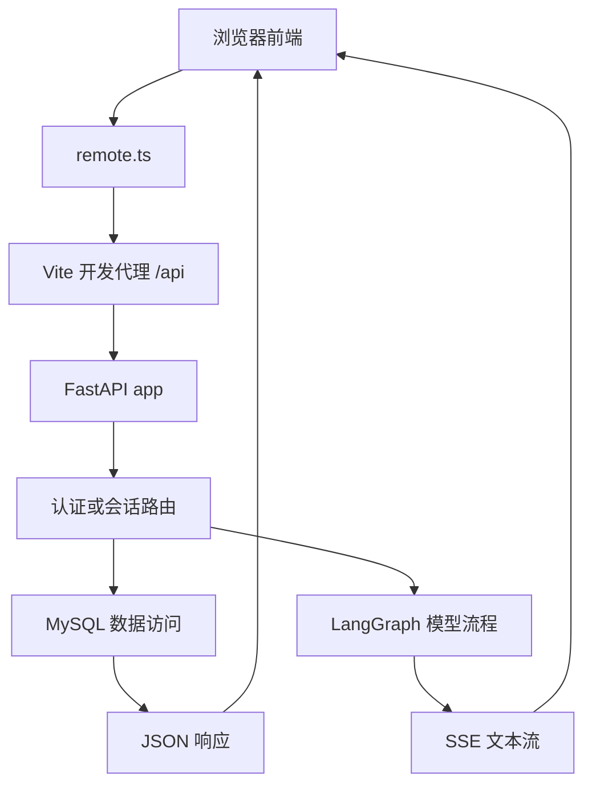

# FastAPI 入门与 Aiden 项目中的用法

官方资料以 FastAPI 文档为准，查阅日期：2026-09-24。相关链接列在文末。

## 1. API 在做什么

可以把 API 想成前端和后端之间约定好的一组“问答方式”：前端按约定发来一个请求，后端执行相应工作，再把结果发回去。比如网页要显示会话列表，就请求后端的会话接口；后端查数据库后把列表作为 JSON 返回。

FastAPI 是用 Python 写 Web API 的框架。它负责接收 HTTP 请求、把请求数据交给 Python 函数、检查数据格式，并把函数结果作为 HTTP 响应返回。Uvicorn 是常用的运行服务器，负责在某个地址和端口上接收网络请求，再交给 FastAPI 应用处理。

一个接口通常由两部分确定：**HTTP 方法 + 路径**。例如 `GET /api/conversations` 和 `POST /api/conversations` 路径相同，但方法不同，通常分别表示“读取会话”和“创建会话”。

| 名词 | 通俗解释 | 例子 |
| --- | --- | --- |
| 路径（path） | 接口地址中表示资源的位置 | `/items/12` |
| HTTP 方法 | 想对资源做什么 | `GET` 读取，`POST` 新建 |
| 路径参数 | 写在路径中的变量，通常指明某条记录 | `/items/{item_id}` 中的 `item_id` |
| 查询参数 | 写在 URL 的 `?` 后，用于筛选或分页 | `/items?q=茶&limit=10` |
| 请求体（body） | 随请求发送的数据，常用 JSON 表示 | `{"name":"茶","price":12}` |
| 响应 | 后端返回的数据和状态码 | `200` 加一段 JSON |
| 校验 | 检查输入是否符合约定 | `price` 必须是大于 0 的数字 |

常见方法的约定是：`GET` 读取、`POST` 新建或触发操作、`PUT` 整体替换、`PATCH` 局部修改、`DELETE` 删除。具体含义仍由接口设计决定。

常见状态码：`200` 成功、`201` 新建成功、`204` 成功但没有响应正文、`400` 请求不符合业务要求、`401` 未登录、`403` 没有权限、`404` 找不到资源、`409` 当前状态冲突、`422` 输入数据未通过校验、`500` 服务端发生未处理错误。

## 2. 写一个能运行的 API

下面的例子实现商品列表、按名称搜索、新建商品和读取单个商品。商品暂时放在 Python 字典中，所以服务重启后数据会清空；它用来学习接口结构，真实项目通常会把数据存进数据库。

### 2.1 准备 Python 环境

在 PowerShell 中进入一个空目录，创建虚拟环境并安装 FastAPI：

```powershell
py -3.10 -m venv .venv
.\.venv\Scripts\python.exe -m pip install "fastapi[standard]"
```

如果电脑没有 `py` 命令，可以把第一行的 `py -3.10` 换成已安装的 Python 3.10 或更新版本的 `python`。

### 2.2 新建 `main.py`

把下面代码保存为当前目录下的 `main.py`：

```python
from typing import Annotated

from fastapi import FastAPI, HTTPException, Query, status
from pydantic import BaseModel, Field

app = FastAPI(title="商品 API")


class ItemCreate(BaseModel):
    """客户端新建商品时允许发送的字段。
       Basemodel，强制约定了字段的类型，如果不对，服务器会拒绝请求
    """
    name: str = Field(min_length=1, max_length=50)
    price: float = Field(gt=0)
    description: str | None = None


class ItemOut(BaseModel):
    """API 返回给客户端的商品格式。"""
    id: int
    name: str
    price: float
    description: str | None = None


items: dict[int, ItemOut] = {}
next_id = 1


@app.get("/items", response_model=list[ItemOut])
def list_items(
    q: str | None = None,
    limit: Annotated[int, Query(ge=1, le=100)] = 20,
) -> list[ItemOut]:
    """列出商品；q 可选，用来按名称搜索。"""

    result = list(items.values())
    if q:
        result = [item for item in result if q.casefold() in item.name.casefold()]
    return result[:limit]


@app.post(
    "/items",
    response_model=ItemOut,
    status_code=status.HTTP_201_CREATED,
)
def create_item(body: ItemCreate) -> ItemOut:
    """检查请求体后创建商品，并返回带 id 的新商品。"""

    global next_id
    item = ItemOut(id=next_id, **body.model_dump())
    items[next_id] = item
    next_id += 1
    return item


@app.get("/items/{item_id}", response_model=ItemOut)
def read_item(item_id: int) -> ItemOut:
    """按路径中的商品 id 读取一件商品。"""

    item = items.get(item_id)
    if item is None:
        raise HTTPException(status_code=404, detail="找不到这件商品")
    return item
```

### 2.3 启动和试用

仍在 `main.py` 所在目录运行：

```powershell
.\.venv\Scripts\fastapi.exe dev main.py
```

终端显示服务器地址后，在浏览器打开 `http://127.0.0.1:8000/docs`。这是 FastAPI 自动生成的交互式接口页面：展开 `POST /items`，选择 **Try it out**，输入 JSON 并执行：

```json
{
  "name": "乌龙茶",
  "price": 12.5,
  "description": "清香型"
}
```

成功时会得到 `201` 和带有 `id` 的商品。随后可以在 `GET /items` 查看列表，在 `GET /items/{item_id}` 输入返回的 id 查看单条商品。`price` 写成负数、`name` 留空或 `limit` 超出 1 到 100 的范围时，FastAPI 会在进入接口函数前拒绝请求并返回 `422` 校验错误。访问不存在但格式正确的商品 id，则代码主动返回 `404`。

要停止开发服务器，在启动它的终端按 `Ctrl+C`。

### 2.4 逐段读懂这段代码

1. `app = FastAPI(...)` 创建应用对象。运行服务器时，`main.py` 是模块名，`app` 是模块里的应用变量，所以 Uvicorn 常用 `main:app` 来定位它。
2. `@app.get("/items")` 是装饰器，告诉 FastAPI：收到 `GET /items` 时调用下面的函数。`@app.post(...)`、`@app.get(...)` 也是同样的约定。
3. `{item_id}` 表示路径变量。请求 `/items/12` 时，FastAPI 把 `12` 转成整数，再作为 `item_id` 传给函数；写成 `int` 是 Python 类型标注，也让 FastAPI 知道要做什么转换和检查。
4. `q` 和 `limit` 不在路径里，也不是 Pydantic 请求模型，因此 FastAPI 把它们当查询参数：`/items?q=茶&limit=10`。有默认值表示可以不传；`q` 的默认值 `None` 表示“没有搜索词”。
5. `ItemCreate` 继承 `BaseModel`，定义了新建商品请求体的形状。请求发送 JSON 时，FastAPI/Pydantic 会检查字段并转换类型。`Field(...)` 用来声明取值限制。
6. 路径函数返回的字典、列表或 Pydantic 模型会被转换成 JSON。`response_model` 声明响应格式，帮助校验和过滤返回字段，并把格式写进自动生成的 API 文档。
7. `HTTPException` 用来提前结束请求并返回具体错误。它要用 `raise` 抛出，而不是 `return`。

写接口时可以按这个顺序想：**接口是什么方法和路径 → 客户端从哪里传数据 → 输入规则是什么 → 函数要做什么 → 成功时返回什么 → 失败时给什么状态码。**

## 3. FastAPI 的关键机制

### 参数从哪里来

FastAPI 根据路由和函数签名判断数据来源：出现在路径中的同名变量是路径参数；普通的简单类型参数（`str`、`int`、`bool` 等）一般是查询参数；Pydantic 模型参数一般来自 JSON 请求体。Cookie 和 Header 可通过 `Cookie(...)`、`Header(...)` 显式声明。

例如：

```python
@app.post("/users/{user_id}/notes")
def add_note(user_id: int, body: NoteCreate, draft: bool = False):
    ...
```

这里 `user_id` 来自 URL 路径，`body` 来自 JSON 请求体，`draft` 来自查询参数。函数参数的类型标注不仅是给人看的说明，也是 FastAPI 进行解析、校验和生成文档的依据。

### 自动校验与错误

如果请求格式不合法，FastAPI 通常返回 `422` 和指出字段位置的错误信息，接口函数不会执行。业务规则则由代码明确处理，例如记录不存在就 `raise HTTPException(status_code=404, detail="...")`。这两类错误要区分：类型、必填字段和 `Field` 限制属于输入校验；用户权限、资源存在与否等一般属于业务检查。

### 同步和异步函数

接口函数可以写成普通的 `def`，也可以写成 `async def`。如果要 `await` 一个支持异步的库（例如异步 HTTP 客户端或模型流），函数需要写成 `async def`；如果使用同步库，就可以写普通 `def`。两种写法都可在一个 FastAPI 项目里混用，不需要为了“看起来先进”把所有接口都改成异步。

### `Depends`：复用公共步骤

有些操作许多接口都需要，例如读取登录 Cookie、检查当前用户、提供数据库会话。FastAPI 的依赖注入允许函数声明“我需要这个依赖”，框架会先执行依赖，再把结果传进来：

```python
def my_endpoint(actor: dict = Depends(current_actor)):
    ...
```

可以把 `Depends(current_actor)` 理解成：“先运行 `current_actor`；成功后把它返回的当前用户放进 `actor`。如果它抛出错误，就直接把错误响应给客户端。”

### `APIRouter`：把接口分文件

小练习可以把所有接口放进 `main.py`。项目变大后，可以用 `APIRouter` 按功能分组，再由主应用 `include_router(...)` 注册。它类似于把一大本说明书拆成多个章节：每个路由文件只管理一类接口，但最终仍由同一个 FastAPI 应用对外服务。

### 自动生成接口文档

访问`http://127.0.0.1:8000/docs` 由 Swagger UI 提供

它会自动更新，很好用，点击`Try it out`，它允许你填写参数并直接与 API 交互

## 4. Aiden 项目里 FastAPI 怎么工作

### 请求经过哪些部分



前端的 [`remote.ts`](../frontend/src/api/remote.ts) 用 `fetch` 发 HTTP 请求；本地开发时，Vite 把 `/api` 转发到 `http://localhost:8000`。FastAPI 根据 HTTP 方法和路径找到对应路由，读取请求字段，执行认证和业务逻辑，再返回 JSON 或流式响应。前端请求带 `credentials: 'include'`，浏览器会在需要时自动发送服务端设置的登录 Cookie。

### 后端代码分别负责什么

| 文件 | 用途 |
| --- | --- |
| [`main.py`](../backend/app/main.py) | 创建 FastAPI 应用、注册认证和会话路由、提供健康检查接口 |
| [`auth.py`](../backend/app/api/routes/auth.py) | 登录、读取当前用户、退出登录；登录成功时设置 HttpOnly Cookie |
| [`conversations.py`](../backend/app/api/routes/conversations.py) | 列出和创建会话、读取消息历史、发送流式消息 |
| [`schemas.py`](../backend/app/api/schemas.py) | 用 Pydantic 定义登录和消息请求体及字段限制 |
| [`deps.py`](../backend/app/api/deps.py) | 读取并验证登录 Cookie，将当前用户提供给需要登录的路由 |
| [`chat.py`](../backend/app/persistence/mysql/chat.py) | 执行 MySQL 用户、会话、消息等数据读写 |
| [`graph.py`](../backend/app/agent/graph.py) | 组织上下文读取、模型生成和回答保存的 LangGraph 流程 |
| [`sse.py`](../backend/app/api/sse.py) | 把事件名称和 JSON 数据编码成 SSE 文本格式 |

主应用用 `include_router` 注册认证和会话两个路由组。比如 `auth.py` 中路由器的前缀是 `/api/auth`，某个接口再写 `@router.post("/login")`，组合后就是 `POST /api/auth/login`。`conversations.py` 同理使用 `/api/conversations` 前缀。

### 后端当前实现的接口

| 方法和路径 | 用途 | 关键行为 |
| --- | --- | --- |
| `GET /api/health` | 检查 API 进程是否能响应 | 返回 `{"status":"ok"}`；不检查 MySQL 或模型是否可用 |
| `POST /api/auth/login` | 登录 | 请求体含 `account`、`password`、`role`；成功设置 HttpOnly Cookie，错误凭证返回 `401` |
| `GET /api/auth/me` | 恢复当前登录用户 | 通过 `Depends(current_actor)` 验证 Cookie；未登录返回 `401` |
| `POST /api/auth/logout` | 退出登录 | 撤销服务端会话并清除 Cookie，响应状态为 `204` |
| `GET /api/conversations` | 获取当前用户的会话列表 | 只返回当前 Cookie 用户拥有的会话 |
| `POST /api/conversations` | 新建会话 | 请求体为 `{}`，成功状态为 `201` |
| `GET /api/conversations/{conversation_id}/messages` | 读取会话历史 | 先检查会话归属；找不到或不属于当前用户时返回 `404` |
| `POST /api/conversations/{conversation_id}/messages/stream` | 发送消息并接收流式回答 | 请求体含 `text`，可带 `clientMessageId`；成功响应为 SSE |
| `GET /api/rag/overview`、`/preview`、`/chunks`、`/mining`、`/jobs` | 员工查看建库状态 | 所有路由经 `current_staff` 验证 Cookie；预览不写 MySQL 或 Milvus |
| `GET /api/rag/milvus` | 员工查看 Milvus 实际集合 | 只读返回集合状态、记录统计数和分页标量字段，并回 MySQL 标示状态 |
| `POST /api/rag/jobs/{kind}` | 员工排队建库任务 | `kind` 支持文档/FAQ 导入、对话挖掘一轮、向量化、作废向量清理；成功返回 `202` |
| `POST /api/rag/embedding/start`、`/stop` | 员工管理本地向量服务 | 只管理当前 API 进程启动的子进程；成功返回 `202` |

例如，会话相关路由中 `actor: dict = Depends(current_actor)` 会让 FastAPI 先取登录 Cookie 并查验用户。路由再把 `actor["id"]` 传给数据访问函数，因此查询会话和消息时会按用户 id 做归属过滤。

登录请求体和消息请求体在 `schemas.py` 中用 Pydantic 声明。例如消息内容长度有上限，`clientMessageId` 也有长度要求。无效 JSON 或不合规字段由 FastAPI/Pydantic 返回校验错误；业务层遇到会话不存在、状态冲突等情况时，路由会用 `HTTPException` 返回 `404`、`409` 等状态。

### 一条聊天消息是怎样完成的

普通读写路由多用同步 `def`，例如读取会话列表；需要异步消费模型事件的 `stream_message` 用 `async def`。发消息时，后端检查会话归属和状态，先把用户消息与助手消息占位记录写入 MySQL，再运行 LangGraph 的模型流程。模型生成期间，FastAPI 用 `StreamingResponse` 持续返回 `text/event-stream`：`start` 携带助手消息 id，`delta` 携带新生成的文本，最后以 `done` 或 `error` 结束。前端读取这些事件并逐段显示。

本项目直接用 `StreamingResponse` 和 [`sse.py`](../backend/app/api/sse.py) 编码 SSE，再由前端用 `fetch` 读取流。它不是普通的一次性 JSON 响应；也不是仅凭 `EventSource` 自动完成的连接。FastAPI 官方还介绍了自己的 SSE 响应工具，学习项目实现时要区分官方其他写法和这里实际使用的代码。

数据库表结构由 Alembic 迁移管理。导入应用模块不会自动创建表；手动只启动 FastAPI 时，需先配置数据库并应用迁移。根目录的 [`start.ps1`](../start.ps1) 则会检查本地配置，启动 MySQL、应用迁移、准备演示用户，然后启动 FastAPI 和前端。若只想运行后端，官方项目文档给出的开发命令是在 `backend/` 目录运行：

```powershell
.\.venv\Scripts\python.exe -m uvicorn app.main:app --host 127.0.0.1 --port 8000
```

此命令与 `start.ps1` 默认都不启用热重载。控制台评估是进程内后台任务；`--reload` 重启 worker 会中断任务、清空内存进度，并触发关闭该 worker 拥有的本地向量进程。修改后端代码后应等待任务结束，再手动重启；不要在长评估期间使用热重载。

启动后可打开 `http://127.0.0.1:8000/docs` 查看当前注册的接口。`/api/health` 返回成功只代表 API 进程已响应，并不能证明数据库迁移、登录或模型配置都正常。聊天模型还需要 `backend/.env` 中的模型配置；具体数据库准备方式见 [`数据库.md`](数据库.md)。

员工登录已用于 `/staff/rag` 建库控制台，API 路由在 [`rag_admin.py`](../backend/app/api/routes/rag_admin.py)，具体任务与限制见 [`RAG.md`](RAG.md#员工建库控制台)。前端 [`remote.ts`](../frontend/src/api/remote.ts) 仍保留客服接管请求定义，但后端尚无 `/api/staff/*` 接待接口；员工能建库，不代表能在 remote 模式接管会话。判断服务端能力以 `backend/app/main.py` 注册的路由和实际接口为准。


## 官方资料

- [FastAPI Tutorial - User Guide](https://fastapi.tiangolo.com/tutorial/)：官方教程目录与安装说明。
- [First Steps](https://fastapi.tiangolo.com/tutorial/first-steps/)：创建应用、写第一个路由、运行服务器和自动 API 文档。
- [Path Parameters](https://fastapi.tiangolo.com/tutorial/path-params/) 和 [Query Parameters](https://fastapi.tiangolo.com/tutorial/query-params/)：路径变量、查询参数、类型转换和校验。
- [Request Body](https://fastapi.tiangolo.com/tutorial/body/) 和 [Response Model](https://fastapi.tiangolo.com/tutorial/response-model/)：Pydantic 请求模型与响应格式。
- [Handling Errors](https://fastapi.tiangolo.com/tutorial/handling-errors/)：用 `HTTPException` 返回 HTTP 错误。
- [Dependencies](https://fastapi.tiangolo.com/tutorial/dependencies/)：依赖注入与公共逻辑复用。
- [Bigger Applications - Multiple Files](https://fastapi.tiangolo.com/tutorial/bigger-applications/)：用路由器拆分多文件应用。
- [Concurrency and async / await](https://fastapi.tiangolo.com/async/)：何时使用同步 `def` 或异步 `async def`。
- [Server-Sent Events (SSE)](https://fastapi.tiangolo.com/tutorial/server-sent-events/)：服务端事件流的概念与 FastAPI 支持。
