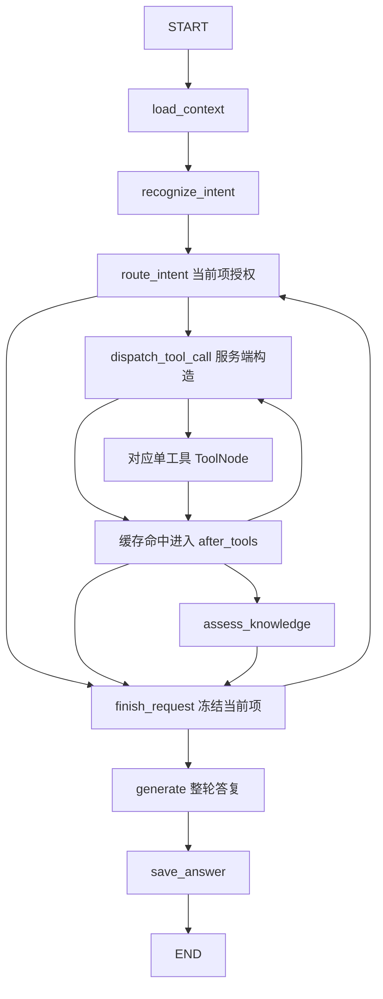

# LangGraph：从状态更新到 Aiden 多诉求客服图

阅读入口：[技术学习路线](技术学习路线.md) → [LangChain](LangChain.md) → 本文 → [Agent 实现详解](Agent实现详解.md)。本文讲编排机制；HTTP 协议见 [FastAPI](FastAPI.md)，知识处理见 [RAG](RAG.md)。

## 1. 图为什么比一个大函数更容易解释

一次客服请求包含读取历史、识别、授权、工具查询、证据校验、答复和保存。有些步骤固定，有些根据结果选择下一步。LangGraph 用“节点做工作、边决定下一站、State 交换数据”表示这种流程。

项目声明 `langgraph>=0.2.60,<2.0`，见 [requirements.txt](../backend/requirements.txt)。图能表达循环，不表示模型能自由选择工具；有 State，也不表示系统自动持久化 State。

## 2. State、节点和 reducer

普通字段通常由节点返回的更新覆盖；带 reducer 的字段用指定函数合并。节点返回的是**局部更新**，不是必须重新返回整个状态。`TypedDict` 描述字段类型，`total=False` 允许字段逐步填入，不会自动补默认值或执行完整业务校验。

[SupportState](../backend/app/agent/state.py) 中：

```python
messages: Annotated[list[BaseMessage], add_messages]
```

`add_messages` 按消息 ID 合并：新 ID 的消息加入列表，同 ID 的消息可以替换旧消息。因此它不能简单理解成无条件 `list.extend`。订单授权、诉求索引、最终正文等普通字段没有这条消息 reducer，需要节点明确返回新值。

一个**只操作内存、不调用模型和数据库**的教学图：

```python
from typing import TypedDict
from langgraph.graph import END, START, StateGraph

class DemoState(TypedDict, total=False):
    text: str
    result: str

def normalize(state: DemoState) -> dict:
    return {"text": state["text"].strip()}

def reply(state: DemoState) -> dict:
    return {"result": "收到：" + state["text"]}

def route(state: DemoState) -> str:
    return "reply" if state["text"] else "finish"

builder = StateGraph(DemoState)
builder.add_node("normalize", normalize)
builder.add_node("reply", reply)
builder.add_edge(START, "normalize")
builder.add_conditional_edges("normalize", route, {"reply": "reply", "finish": END})
builder.add_edge("reply", END)
graph = builder.compile()
result = graph.invoke({"text": "  示例  "})
```

执行时 `normalize` 更新 `text`，条件函数读取更新后的 State 决定是否进入 `reply`。`result` 不会抹掉已有 `text`。这个例子解释状态转移，不代表业务流程验收。

## 3. 固定边和条件边

- `add_edge(a, b)`：完成 a 后进入 b。
- `add_conditional_edges(a, router, mapping)`：a 完成后用 router 读取 State，再按返回值映射下一站。
- router 是选择函数；它不应该被误读为另一个模型自动决策步骤。
- `compile()` 把定义装配成可执行图，不会因此跑业务查询或创建数据库表。

Aiden 的 [graph.py](../backend/app/agent/graph.py) 中 `build_support_graph()` 装配节点工厂、八个单工具 `ToolNode` 和条件边，最后 `compile(name="aiden_support")`。按配置还可 `with_config` 绑定观测回调。在线路由为每条需要生成的消息构建一次图，不是启动时创建一个共享持久化聊天实例。

## 4. 项目 State 的四组职责

| 字段组 | 作用 | 信任边界 |
| --- | --- | --- |
| `conversation_id`、`assistant_message_id`、`user_id` | 定位会话、占位回复和认证身份 | 路由提供，SQL仍检查归属 |
| `requests`、`request_index`、`request_results` | 有序诉求、当前项与已冻结结果 | 模型拆分后经过schema和来源校验 |
| `allowed_tools`、`authorized_order_no`、退款字段 | 当前项授权与流程事实 | 服务端复核，不直接采信模型工具名 |
| `messages`、`answer`、`citations`、`low_confidence` | 调用消息、最终回答与质量结果 | 草稿和最终保存内容有区别 |

完整字段见 [state.py](../backend/app/agent/state.py) 的 `SupportState`。不要把 SQLAlchemy Session 放进 State：节点在短操作内读取普通数据，关闭连接后再等待模型。

## 5. 多诉求循环，而不是模型自主工具循环



图展示可选路径，不表示每次全部执行。入口识别最多四项，`route_intent()` 每次只处理 `requests[request_index]`。工具结果由 `finish_request()` 冻结进 `request_results`，再推进索引；还有下一项就回到授权节点，否则统一生成回答。这样一项澄清或拒答仍能保留位置，不吞掉其他项。

源码：[nodes/intent.py](../backend/app/agent/nodes/intent.py) 的 `make_recognize_intent()` / `route_intent()`；[nodes/request.py](../backend/app/agent/nodes/request.py) 的 `finish_request()`；[graph.py](../backend/app/agent/graph.py) 的 `route_next_request()`。

同一项也可能连续查询：先读本人订单，再核验所选目标或查退款政策。`after_tools()` 根据真实结果设置下一步权限；同轮相同调用命中缓存时不重复访问工具。**这些循环由服务端业务条件驱动，生成模型不决定下一步工具。**

## 6. ToolNode 与 InjectedState

`ToolNode` 消费消息中的调用记录并执行工具，产生关联的 `ToolMessage`。项目每个 ToolNode 只注册一个工具，`handle_tool_errors=False`；工具自己的受控错误返回与未处理异常是不同层次，后者会进入路由的流式错误处理。

[registry.py](../backend/app/services/tools/registry.py) 静态登记工具；[nodes/tools.py](../backend/app/agent/nodes/tools.py) 的 `make_dispatch_tool_call()` 仅在白名单唯一且合法时合成调用参数。`route_dispatched_tool()` 再选择对应 `run_<name>` 节点。

[customer.py](../backend/app/services/tools/customer.py) 中 `InjectedState("user_id")` 把可信身份从图状态注入工具；它不是让模型填写 user_id。即使图已做授权，工具仓储仍必须按本人数据筛选。退款工具还注入确认授权和消息主键，详见 [Agent 实现详解](Agent实现详解.md)。

## 7. 执行事件、模型片段与 SSE 是三层

在线入口 [conversations.py](../backend/app/api/routes/conversations.py) 的 `stream_message()` 调用 `graph.astream_events(..., version="v2")`。事件可包含节点链开始/结束、模型与工具事件、业务自定义事件。

1. `make_generate()` 调用 `model.astream`，只抽取可显示正文并派发 `support_answer_delta`。
2. 路由只消费来自 `generate` 节点的这个自定义事件，转成 `delta`；不会把所有模型片段一概转发。
3. `make_save_answer()` 完成最终正文与引用提交；路由收到 `save_answer` 的 `on_chain_end` 后发送 `final`。

受控 `support_progress` 和顶层工具开始事件由 [sse.py](../backend/app/api/sse.py) 的 `progress_payload()` 转成 `progress`。进度不包含工具参数、结果或推理内容。

完整协议为 `start/progress/delta/final/handoff/done/error`。`delta` 是草稿；`final` 用 `text` 和 `citations` 替换草稿；正常结束发 `done`，错误发 `error`，两者互斥。当前后端不另发 `citations` 事件。

## 8. 持久化不是 checkpoint

当前编译没有配置 checkpointer。图 State 是一次执行内的工作数据；跨请求历史来自 MySQL：

```text
create_message_pair → 用户消息+助手占位行
→ load_context / recent_messages → 本轮 State
→ generate → save_answer / finish_assistant_message
→ 后续请求重新读取历史和退款 workflow_state
```

源码：[chat.py](../backend/app/persistence/mysql/chat.py) 的 `create_message_pair()` / `recent_messages()` / `finish_assistant_message()`；[nodes/context.py](../backend/app/agent/nodes/context.py) 的 `make_load_context()` / `make_save_answer()`。

这不是“断线后从最后一个图节点自动恢复”。已完成且相同幂等键/原文的请求重放数据库最终回答；尚未完成的取消按数据库状态收尾。未来若学习 checkpointer、interrupt、time travel，应先理解它们需要额外配置，不能写成项目已有能力。

## 9. 排查与深入阅读

| 现象 | 先读哪里 |
| --- | --- |
| 没进入工具节点 | `route_intent` 的授权、`route_after_intent` 的条件 |
| 连续查单或物流 | `after_tools`、[order_selection.py](../backend/app/agent/order_selection.py) 与 [order_routing.py](../backend/app/agent/order_routing.py) |
| 一项失败但其他项有回答 | `finish_request` 和 `make_generate` 的按项组合 |
| 有delta但最终是拒答 | `make_generate` 的引用校验，不把草稿当最终事实 |
| 断线后状态异常 | `stream_message` 的finally和 `finish_assistant_message` 的终态闸门 |
| 评估没有写业务库 | `build_support_graph(evaluation=...)` 与节点工厂的评估边界 |

评估可替换历史/保存边界，默认禁止业务写工具；执行同一个图或看到依赖调用不代表真实服务已验收。进阶学习参考 [LangGraph 概览](https://docs.langchain.com/oss/python/langgraph/overview)、[Graph API](https://docs.langchain.com/oss/python/langgraph/graph-api)、[持久化](https://docs.langchain.com/oss/python/langgraph/persistence)。
