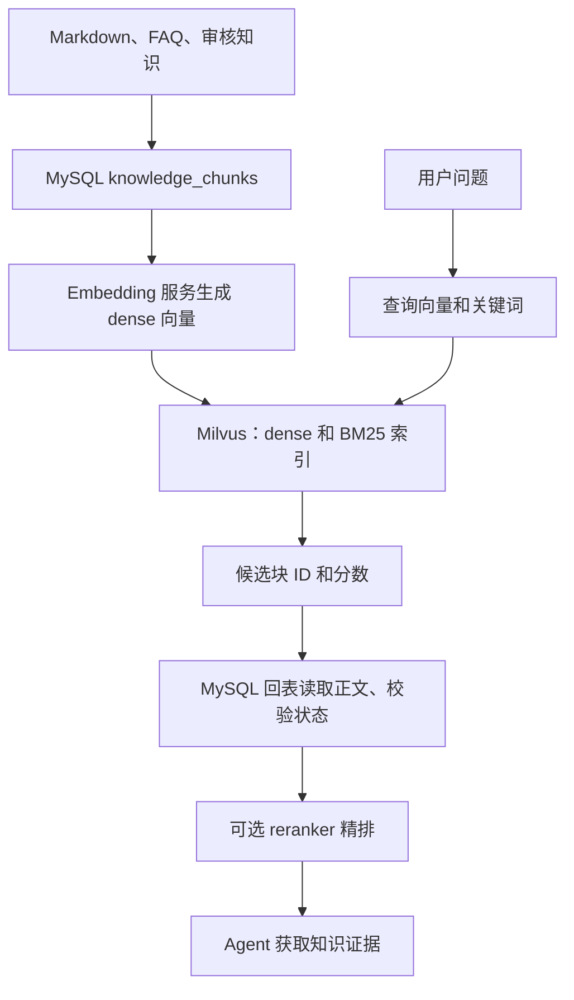

# Aiden 的 Milvus 使用说明

本文按“部署 → 配置与连接 → 集合与索引 → 写入 → 查询 → 更新与删除 → 运维核对”说明当前项目如何使用 Milvus。代码摘录以仓库现有实现为准；可独立运行的示例另行标注，不能把片段中的局部变量当成完整脚本。

阅读入口：[技术学习路线](技术学习路线.md) → 本文的基础与三级读法 → 原有部署和源码章节。完整业务编排见 [RAG](RAG.md)、[LangChain](LangChain.md)、[LangGraph](LangGraph.md)。

## 基础：向量数据库到底查什么

### 从文本到坐标，而不是把文字压缩成答案

Embedding 把文本映射成固定维度的数值向量，同一模型下含义接近的文本通常更接近。向量不是可逆的原文压缩，也不包含业务有效性。模型、维度、输入模板改变后，即使数字长度相同，也不能假定它们还在同一语义空间。

项目的 [`EmbeddingClient`](../backend/app/services/rag/embedding.py) 编码问题与知识；[`embedding_text.py`](../backend/app/services/rag/embedding_text.py) 的 `build_embedding_text()` / `build_query_embedding_text()` 控制模板。Milvus 保存检索索引，原文及有效状态仍在 MySQL。

### 距离、相似度与近似最近邻

余弦相似度为向量点积除以两向量长度乘积，衡量方向接近程度。教学上，`(1,0)` 与 `(2,0)` 的余弦为1，`(1,0)` 与 `(0,1)` 为0；它说明比例不改变方向，不表示任何文本答案“100%正确”。

本项目 dense 使用 `COSINE`，数值越大越相似；不要套用L2距离“越小越好”的排序直觉。`HNSW` 用分层邻接图缩小搜索范围，属于近似最近邻：避免逐条扫描全部高维向量，但召回与延迟存在权衡。`M=16`、`efConstruction=200` 是建索引参数，查询 `ef` 影响候选探索；它们不是切块长度或最终返回条数。

实现入口：[`knowledge_store.py`](../backend/app/persistence/milvus/knowledge_store.py) 的 `KnowledgeVectorStore.ensure_collection()` / `search()`。源码参数只是当前选型，不意味着所有规模都最优。

### dense、BM25、RRF 和 rerank 是四个不同步骤

1. **dense 召回**侧重语义近似，能帮助匹配不同说法，但可能把具体型号或条件混淆。
2. **BM25 召回**基于词项匹配、词频饱和与文档长度归一化；精确型号和业务关键词常有价值，但同义表述未必共享词项。本项目使用Milvus中文analyzer和BM25 function，从 `text` 生成稀疏向量，不是客户端再用embedding模型编码一份关键词向量。
3. **RRF 融合**用排名而不是直接相加不同量纲的分数。一个候选在每一路的贡献可理解为 `1/(60+名次)`，多路贡献相加；排名靠前且跨路出现的项更有优势。源码 `RRFRanker(60)` 的60是平滑参数，不是Top60。
4. **rerank 精排**把问题和候选权威正文成对打分，再排序。它成本高于索引召回，因此只用于缩小后的候选集，不在全库逐条运行。

教学例子：候选A在dense排第1、BM25排第20；B在两路均第3。RRF按排名累加，B可能优于只在单路很靠前的A；这不是声称B答案必然正确。COSINE、BM25、RRF分数不可混用阈值；本项目reranker的sigmoid分数也不是校准后的正确概率。

默认链路为两路各最多Top50 → RRF融合最多50 → MySQL有效性回表 → rerank → 默认最多Top10。源码 [`retrieval.py`](../backend/app/services/rag/retrieval.py) 的 `semantic_search()` / `_rerank()`；三种Milvus入口为 `search()`、`search_bm25()`、`hybrid_search()`。

### 为什么先过滤、再回表

品类、来源、内容类型等标量条件在每路召回前精确过滤，避免不相关类别占据候选池。召回后仍要按主键回MySQL：Milvus可能残留作废向量或孤儿项，索引正文副本也不能替代当前权威正文。

[`get_vectorized_chunks_by_ids()`](../backend/app/persistence/mysql/knowledge.py) 仅取仍为 `vectorized` 的块；先做这一步，再把有效正文交给reranker。最终还经过Agent证据充分性与引用校验，检索排名不直接成为业务结论。

### 三级阅读路线

| 层级 | 阅读目标 | 对应章节与源码 |
| --- | --- | --- |
| 入门 | 分清原文、向量、索引、候选与最终证据 | 本节与§1；先看RAG全景，不先执行写数据命令 |
| 实现 | 看一个问题如何得到候选ID，再变成有效正文 | §4/§6；`KnowledgeVectorStore.hybrid_search` → `semantic_search` → `get_vectorized_chunks_by_ids` |
| 进阶 | 理解建库幂等、索引迁移、召回权衡和失败边界 | §5/§7/§8；[`indexing.py`](../backend/app/services/rag/indexing.py) 的 `vectorize_pending` / `migrate_legacy_collection` / `cleanup_superseded_vectors` |

先画读链路，再学写链路：MySQL pending → embedding → Milvus同主键upsert → MySQL vectorized。这不是跨库原子事务；中断补齐与作废过滤必须一起理解。下文保留原有部署步骤，示例中的写入/删除/迁移不应为了学习直接操作用户数据库。

## 1. Milvus 在项目中的职责

**MySQL 保存权威知识和业务状态，Milvus 保存检索索引。** Milvus 不负责订单、会话、员工审核或模型生成。



三个关键约定：

1. Milvus 的 `chunk_id` 等于 MySQL `knowledge_chunks.id`，不让 Milvus 自动生成主键。
2. 写入使用 `upsert`；重复写同一个主键不会新增一个逻辑知识块。
3. 在线结果必须回 MySQL 读取正文，并要求 `vector_status = 'vectorized'`；不能把 Milvus 中的正文副本直接交给模型。

### 当前配置与默认配置不是一回事

2026-10-07 在当前后端虚拟环境读取到：

| 项目 | 当前配置/安装值 | 源码默认值 |
| --- | --- | --- |
| Python SDK | `pymilvus 2.6.17` | 依赖范围 `>=2.5,<3.0` |
| Embedding 模型 | `BAAI/bge-small-zh-v1.5` | `BAAI/bge-m3` |
| dense 向量维度 | 512 | 1024 |
| Embedding 序列上限 | 512 tokens | 8192 tokens |
| 集合名 | `knowledge_bm25` | `knowledge_bm25` |
| 在线检索策略 | `hybrid_rerank` | `hybrid_rerank` |

这是配置和 SDK 版本快照，**不证明 Milvus 服务已启动、集合已存在或外部模型可用**。以后变更模型或环境，应重新核对，不沿用此快照。

## 2. 部署：Milvus 服务需要单独准备

当前 `deploy/` 只有 MySQL Compose，`start.ps1` 没有部署或启动 Milvus。项目使用 Milvus 原生 BM25，因此需要支持该能力的 **Milvus 2.5+ 服务**，不要把 Milvus Lite 当成本项目混合检索的等价替代。

本地开发建议 Docker Desktop 的 Linux 容器模式，部署 Standalone：

| 服务 | 用途 |
| --- | --- |
| Milvus Standalone | 集合、索引、向量/BM25 检索服务 |
| etcd | Milvus 元数据存储，不替代项目 MySQL |
| MinIO | 对象存储，用于保存 Milvus 数据文件 |

下面是**可复制到独立部署目录的示例**，不是仓库中已经存在的配置。参考 [Milvus v2.6.17 官方 Compose](https://github.com/milvus-io/milvus/blob/v2.6.17/deployments/docker/standalone/docker-compose.yml)；该文件中的 Milvus 镜像实际是 `v2.6.16`，示例保留该版本，不把源码标签误写成镜像版本。

### 2.1 Compose 示例

保存为独立目录中的 `compose.milvus.yml`。示例只把应用端口和健康检查端口绑定到本机；MinIO、etcd 不发布宿主机端口。凭据从运行环境注入，不写入文件。

```yaml
services:
  etcd:
    image: quay.io/coreos/etcd:v3.5.25
    environment:
      ETCD_AUTO_COMPACTION_MODE: revision
      ETCD_AUTO_COMPACTION_RETENTION: "1000"
      ETCD_QUOTA_BACKEND_BYTES: "4294967296"
      ETCD_SNAPSHOT_COUNT: "50000"
    command: etcd -advertise-client-urls=http://etcd:2379 -listen-client-urls http://0.0.0.0:2379 --data-dir /etcd
    volumes:
      - etcd-data:/etcd
    healthcheck:
      test: ["CMD", "etcdctl", "endpoint", "health"]
      interval: 30s
      timeout: 20s
      retries: 3

  minio:
    image: minio/minio:RELEASE.2024-05-28T17-19-04Z
    environment:
      MINIO_ROOT_USER: ${MILVUS_MINIO_USER:?Set MILVUS_MINIO_USER}
      MINIO_ROOT_PASSWORD: ${MILVUS_MINIO_PASSWORD:?Set MILVUS_MINIO_PASSWORD}
    command: minio server /minio_data --console-address ":9001"
    volumes:
      - minio-data:/minio_data
    healthcheck:
      test: ["CMD", "curl", "-f", "http://localhost:9000/minio/health/live"]
      interval: 30s
      timeout: 20s
      retries: 3

  standalone:
    image: milvusdb/milvus:v2.6.16
    command: ["milvus", "run", "standalone"]
    security_opt:
      - seccomp:unconfined
    environment:
      MINIO_REGION: us-east-1
      ETCD_ENDPOINTS: etcd:2379
      MINIO_ADDRESS: minio:9000
      MINIO_ACCESS_KEY_ID: ${MILVUS_MINIO_USER:?Set MILVUS_MINIO_USER}
      MINIO_SECRET_ACCESS_KEY: ${MILVUS_MINIO_PASSWORD:?Set MILVUS_MINIO_PASSWORD}
    ports:
      - "127.0.0.1:19531:19530"
      - "127.0.0.1:9092:9091"
    volumes:
      - milvus-data:/var/lib/milvus
    depends_on:
      etcd:
        condition: service_healthy
      minio:
        condition: service_healthy
    healthcheck:
      test: ["CMD", "curl", "-f", "http://localhost:9091/healthz"]
      interval: 30s
      start_period: 90s
      timeout: 20s
      retries: 3

volumes:
  etcd-data:
  minio-data:
  milvus-data:
```

`MINIO_ACCESS_KEY_ID` / `MINIO_SECRET_ACCESS_KEY` 是 Milvus 访问 MinIO 的凭据，需与 MinIO 配置一致，映射依据见 [官方参数定义](https://github.com/milvus-io/milvus/blob/v2.6.17/pkg/util/paramtable/service_param.go)。**这不是 Milvus 客户端鉴权 token**。

### 2.2 启动与健康检查

在保存 Compose 的目录运行 PowerShell：

```powershell
# 交互输入 MinIO 用户名和密码，不将密码写进命令历史或文档。
$credential = Get-Credential -Message '输入本地 Milvus MinIO 的用户名和密码'
$env:MILVUS_MINIO_USER = $credential.UserName
$env:MILVUS_MINIO_PASSWORD = $credential.GetNetworkCredential().Password

# 只核对配置，不输出展开后的凭据。
docker compose -p aiden-milvus -f .\compose.milvus.yml config --quiet
# 会创建容器和持久化卷；仅在确定部署目录和端口未冲突时执行。
docker compose -p aiden-milvus -f .\compose.milvus.yml up -d
docker compose -p aiden-milvus -f .\compose.milvus.yml ps
Invoke-WebRequest http://127.0.0.1:9092/healthz
```

端口对应关系：宿主机 `19531` → 容器 `19530`，宿主机 `9092` → 容器 `9091`。因此应用配置是 `MILVUS_URI=http://127.0.0.1:19531`，不是健康检查地址。

普通停止可用 `docker compose ... stop`，不会删除数据。不要随意删除持久化卷；该示例不是高可用生产部署。对外部署还需要服务端鉴权、TLS、网络隔离、备份恢复和资源规划；仅填写 `MILVUS_TOKEN` 不会自动开启服务端鉴权。

## 3. 应用配置与连接

### 3.1 依赖和环境变量

在 `backend` 目录安装项目依赖：

```powershell
.\.venv\Scripts\python.exe -m pip install -r requirements.txt
.\.venv\Scripts\python.exe -m pip install -r requirements-rag.txt
```

后者包含 `pymilvus>=2.5,<3.0`，以及 token 计量、reranker 依赖。客户端和服务端尽量使用兼容的同一 minor 版本，不应仅凭依赖范围认定所有组合均已验收。

`backend/.env` 相关配置示例：

```dotenv
MILVUS_URI=http://127.0.0.1:19531
MILVUS_TOKEN=
MILVUS_KNOWLEDGE_COLLECTION=knowledge_bm25
MILVUS_INSERT_BATCH_SIZE=64

EMBEDDING_BASE_URL=http://127.0.0.1:8001/v1
EMBEDDING_API_KEY=
EMBEDDING_MODEL=BAAI/bge-small-zh-v1.5
EMBEDDING_DIMENSION=512
EMBEDDING_MAX_SEQ_TOKENS=512
EMBEDDING_BATCH_SIZE=16

RAG_ONLINE_STRATEGY=hybrid_rerank
RAG_ONLINE_CANDIDATE_LIMIT=50
RAG_ONLINE_RESULT_LIMIT=10
RAG_RERANK_LIMIT=10
RAG_RERANKER_MODEL=BAAI/bge-reranker-v2-m3
```

仅对未开启鉴权的本地服务留空 token/key；真实凭据放在本地环境，不提交。Embedding 服务、MySQL、reranker 均独立于 Milvus；Milvus 不会替应用调用 Embedding 模型。更改配置后重启使用这些配置的进程。

### 3.2 项目实际连接代码

位置：[knowledge_store.py](../backend/app/persistence/milvus/knowledge_store.py)，`KnowledgeVectorStore.__init__()` 摘录：

```python
from pymilvus import MilvusClient

self._collection = collection or rag_settings.milvus_collection
self._dimension = dimension or rag_settings.embedding_dimension
self._client = MilvusClient(
    uri=uri or rag_settings.milvus_uri,
    token=token or rag_settings.milvus_token or "",
)
```

`pymilvus` 在实例化时才导入；API 能启动不代表 Milvus 已连通。配置来自 [rag.py](../backend/app/config/rag.py)，该模块会触发本地 `.env` 加载。

下面是可在 `backend` 目录使用 Python 执行的**独立只读连接示例**，不要调用 `ensure_collection()` 做连通性检查，因为它可能创建集合：

```python
from pymilvus import MilvusClient
from app.config.rag import rag_settings

client = MilvusClient(
    uri=rag_settings.milvus_uri,
    token=rag_settings.milvus_token or "",
    timeout=3,
)
try:
    print(client.list_collections(timeout=3))
    name = rag_settings.milvus_collection
    if client.has_collection(collection_name=name, timeout=3):
        description = client.describe_collection(collection_name=name, timeout=3)
        print(description["collection_name"])
finally:
    client.close()
```

## 4. 集合、字段与索引

`KnowledgeVectorStore.ensure_collection()` 在集合不存在时创建；已存在时调用 `require_bm25_schema()` 检查 dense 维度及 `text`、`sparse_embedding` 字段，不自动修改旧集合。当前检查不等于对所有索引参数和 BM25 函数做完整校验。

集合类似关系型数据库中的一张表

### 4.1 字段结构

| 字段 | 类型 | 项目用途 |
| --- | --- | --- |
| `chunk_id` | VARCHAR(64)，主键 | 等于 MySQL 知识块 ID，`auto_id=False` |
| `embedding` | FLOAT_VECTOR | Embedding 服务输出的 dense 向量，当前配置 512 维 |
| `text` | VARCHAR(65535)，启用中文 analyzer | 权威答案的索引副本，BM25 的输入 |
| `sparse_embedding` | SPARSE_FLOAT_VECTOR | Milvus BM25 函数自动生成，不由应用计算 |
| `source_type` / `source_id` | VARCHAR(32/256) | 来源类型与标识 |
| `source_path` | VARCHAR(1024) | 文档相对路径；没有路径时写空字符串 |
| `category` / `section_path` | VARCHAR(512/1024) | 分类与章节路径 |
| `content_type` | VARCHAR(32) | 正文、表格、代码、混合内容 |
| `is_key_clause` | BOOL | 关键条款标记，可用于过滤 |
| `chunk_index` | INT32 | 来源内的块顺序 |
| `content` | VARCHAR(65535) | 可读正文副本，不作为在线权威答案 |
| `metadata` | JSON | 问法、前后块 ID、向量文本模板指纹 |

VARCHAR 的 `max_length` 按 UTF-8 字节约束，不是中文字符数。动态字段关闭；写入行应符合固定 schema。

以下是 `ensure_collection()` 的**核心字段摘录**；完整实现还添加上表其他字段，不应单独运行此摘录创建项目集合：

```python
from pymilvus import DataType, Function, FunctionType

schema = self._client.create_schema(auto_id=False, enable_dynamic_field=False)
schema.add_field(CHUNK_ID_FIELD, DataType.VARCHAR, is_primary=True, max_length=64)
schema.add_field(VECTOR_FIELD, DataType.FLOAT_VECTOR, dim=self._dimension)
schema.add_field(
    TEXT_FIELD, DataType.VARCHAR, max_length=65535,
    enable_analyzer=True, analyzer_params={"type": "chinese"},
)
schema.add_field(SPARSE_FIELD, DataType.SPARSE_FLOAT_VECTOR)
schema.add_function(Function(
    name="text_bm25", input_field_names=[TEXT_FIELD],
    output_field_names=[SPARSE_FIELD], function_type=FunctionType.BM25,
))
```

BM25 使用正文 `text`，不是 BGE 模型输出的稀疏向量；即使选 BGE-M3，本项目 Embedding 服务也只输出 dense 向量。

### 4.2 索引参数

同函数中的索引与建集合代码摘录：

```python
index_params = self._client.prepare_index_params()
index_params.add_index(
    field_name=VECTOR_FIELD,
    index_type="HNSW",
    metric_type="COSINE",
    params={"M": 16, "efConstruction": 200},
)
index_params.add_index(
    field_name=SPARSE_FIELD, index_type="SPARSE_INVERTED_INDEX",
    metric_type="BM25", params={"inverted_index_algo": "DAAT_MAXSCORE"},
)
self._client.create_collection(
    collection_name=self._collection, schema=schema, index_params=index_params,
)
```

- HNSW 是近似近邻图索引；`M` 控制图连接规模，`efConstruction` 控制建图搜索宽度。
- 查询使用 `ef=max(64, 候选数量)`，扩大搜索范围通常会增加召回与计算开销，需要业务压测。
- dense 的建索引、查询都用 COSINE，不混用距离度量。
- BM25 用稀疏倒排索引，关键词与语义召回互补。
- 这些是项目现有参数，不代表已经通过生产容量测试，也不是 HNSW 必然优于 IVF 的证明。

## 5. 写入：先 MySQL，再 upsert Milvus

### 5.1 正常建库命令

以下命令在 `backend` 目录运行。**导入和向量化会写数据**；先确定知识文件清单、数据库和集合，不默认把目录里所有演示素材当作有效政策。

```powershell
# 精确导入一个已确认的知识文件，只写 MySQL knowledge_chunks。
.\.venv\Scripts\python.exe -m scripts.build_knowledge_base import-markdown --directory .\knowledge --pattern "商品FAQ.md"
# 可选：读取启用的 faq 行并导入 knowledge_chunks，不修改 faq 本身。
.\.venv\Scripts\python.exe -m scripts.build_knowledge_base import-faq
# 为 pending 块生成向量、写入 Milvus，再回填 MySQL 状态。
.\.venv\Scripts\python.exe -m scripts.build_knowledge_base vectorize
```

入口是 [build_knowledge_base.py](../backend/scripts/build_knowledge_base.py)。`vectorize` 需要 MySQL、Milvus 和 Embedding 服务，不需要生成模型或 reranker。待人工处理的块不参与向量化。

### 5.2 服务层如何生成写入行

位置：[indexing.py](../backend/app/services/rag/indexing.py)，`vectorize_pending()` 摘录：

```python
pending = knowledge_repo.list_pending_chunks(limit)
if not pending:
    return VectorizeResult(scanned=0, vectorized=0)

active_client = client or EmbeddingClient()
dimension = active_client.expected_dimension
active_store = store or KnowledgeVectorStore(dimension=dimension)
active_store.ensure_collection()
```

每批将 MySQL 中保存的 `embedding_text` 送给 Embedding 服务，然后创建完整的 `KnowledgeVector` 写入行。以下为 `vectorize_pending()` 的行构造摘录：

```python
vectors = active_client.embed_documents([item.embedding_text for item in batch])
rows = [
    KnowledgeVector(
        chunk_id=item.id,
        embedding=vector,
        source_type=item.source_type,
        source_id=item.source_id,
        source_path=item.source_path,
        category=item.category,
        section_path=item.section_path,
        content_type=item.content_type,
        is_key_clause=item.is_key_clause,
        chunk_index=item.chunk_index,
        content=item.answer,
        text=item.answer,
        metadata={
            "questions": item.questions,
            "prev_chunk_id": item.prev_chunk_id,
            "next_chunk_id": item.next_chunk_id,
            "embedding_fingerprint": embedding_fingerprint(),
        },
    )
    for item, vector in zip(batch, vectors)
]
```

dense 编码文本使用“分类 + 问法 + 答案”模板；BM25 的 `text` 仅使用答案正文。`EmbeddingClient.embed_documents()` 会校验返回条数、按 index 恢复顺序，并校验每条向量的维度：

```python
if len(vector) != self._expected_dimension:
    raise DimensionMismatchError(
        f"向量维度与配置不一致：期望 {self._expected_dimension}，实际 {len(vector)}。"
        "请先确认 EMBEDDING_MODEL 与 EMBEDDING_DIMENSION，再重建 Milvus 集合。"
    )
```

源码：[embedding.py](../backend/app/services/rag/embedding.py)。配置的期望维度、模型真实输出维度、Milvus schema 维度必须一致；维度相同也不意味着不同模型的向量可以混用。

### 5.3 Milvus 实际写入代码

位置：`KnowledgeVectorStore.upsert()` 摘录：

```python
rows = [self._to_row(vector) for vector in vectors]
batch_size = max(1, rag_settings.milvus_insert_batch_size)
written = []
for start in range(0, len(rows), batch_size):
    batch = rows[start:start + batch_size]
    self._client.upsert(collection_name=self._collection, data=batch)
    self._client.flush(collection_name=self._collection)
    written.extend(row[CHUNK_ID_FIELD] for row in batch)
```

`_to_row()` 将 `KnowledgeVector` 转为固定字段字典，不传 `sparse_embedding`，由 Milvus BM25 函数自动生成。当前每批写入后执行 `flush()`；它是持久化/封存动作，**不是跨库事务，也不能替代读取一致性设置或可见性验收**。封装未显式指定 consistency level，不能宣称所有查询都强一致或立即可见。

写成功后才执行：

```python
written = active_store.upsert(rows)
vectorized += knowledge_repo.mark_chunks_vectorized(written)
```

MySQL 回填 `vector_id = knowledge_chunks.id`、`vector_status = 'vectorized'`。两库之间没有分布式事务：

- Embedding 或 Milvus 写入失败：尚未回填的块仍可从 pending 重跑。
- Milvus 已写成功、MySQL 回填前中断：重跑用相同主键 upsert，不生成重复逻辑记录。
- 在线检索回表时不接受 pending，因此未完成回填的向量不会成为知识证据。

## 6. 查询：标量查询、dense、BM25、混合召回

### 6.1 按主键读向量与查看集合

`read_embeddings()` 是项目已有的按主键查询，主要用于旧集合迁移，不调用模型：

```python
rows = self._client.query(
    collection_name=self._collection,
    filter=f"{CHUNK_ID_FIELD} in {json.dumps(chunk_ids, ensure_ascii=False)}",
    output_fields=[CHUNK_ID_FIELD, VECTOR_FIELD],
    limit=len(chunk_ids),
)
```

`query()` 是标量条件读取，不是相似度搜索。`inspect()` 读取主键、来源、分类、章节等少量标量字段，不读取高维向量；`get_collection_stats()` 用于展示统计。

### 6.2 dense 向量检索

`KnowledgeVectorStore.search()` 摘录：

```python
results = self._client.search(
    collection_name=self._collection,
    data=[embedding],
    anns_field=VECTOR_FIELD,
    limit=limit,
    search_params={"metric_type": METRIC_TYPE, "params": {"ef": max(64, limit)}},
    output_fields=[CHUNK_ID_FIELD],
    filter=filter,
)
```

这里 `embedding` 必须由与建库一致的模型和 query 模板生成，不能用随机向量作为业务检索示例。返回候选块 ID、COSINE 分数和顺序，不直接返回权威答案。

### 6.3 原生 BM25 检索

`KnowledgeVectorStore.search_bm25()` 摘录：

```python
results = self._client.search(
    collection_name=self._collection,
    data=[query],
    anns_field=SPARSE_FIELD,
    search_params={"metric_type": "BM25", "params": {}},
    limit=limit,
    filter=filter,
    output_fields=[CHUNK_ID_FIELD],
)
```

输入是查询字符串，由集合的中文 analyzer 处理，不需要 Embedding 服务。项目还会在 query 侧补充少量业务同义词，例如“退钱”补充“退款”，不会修改知识正文。

### 6.4 dense + BM25 混合召回

`KnowledgeVectorStore.hybrid_search()` 核心摘录：

```python
from pymilvus import AnnSearchRequest, RRFRanker

candidate_limit = min(limit, HYBRID_CANDIDATE_LIMIT)
requests = [
    AnnSearchRequest(
        data=[embedding], anns_field=VECTOR_FIELD,
        param={"metric_type": METRIC_TYPE, "params": {"ef": max(64, candidate_limit)}},
        limit=candidate_limit, expr=filter or None,
    ),
    AnnSearchRequest(
        data=[query], anns_field=SPARSE_FIELD,
        param={"metric_type": "BM25", "params": {}},
        limit=candidate_limit, expr=filter or None,
    ),
]
results = self._client.hybrid_search(
    collection_name=self._collection,
    reqs=requests,
    ranker=RRFRanker(60),
    limit=candidate_limit,
    output_fields=[CHUNK_ID_FIELD],
)
```

两路各自最多取 50 条，RRF 融合输出也最多 50 条。RRF 根据各路排名融合，不直接相加 COSINE 和 BM25 分数。

支持策略：`dense`、`bm25`、`hybrid`、`hybrid_rerank`。默认最后一种在融合后**先回 MySQL 校验，再调用独立 reranker**；reranker 不是 Milvus 内置功能。默认最终最多返回 10 条，也可能因为状态过滤或无命中而更少。

### 6.5 预过滤与回 MySQL

`semantic_search()` 的过滤入口只接受固定字段：`category`、`source_type`、`source_id`、`content_type`、`is_key_clause`。值经 JSON 编码，形成精确匹配表达式：

```python
return " and ".join(
    f"{field} == {json.dumps(value, ensure_ascii=False)}"
    for field, value in values.items() if value is not None
)
```

例如 `category="退货政策"` 会生成 `category == "退货政策"`，并在两路召回前生效。分类是精确字符串，不是前缀匹配；不要从客户端直接接受任意 filter 表达式。

Milvus 命中后，`semantic_search()` 调用 `get_vectorized_chunks_by_ids()`。SQL 核心摘录：

```python
select(KnowledgeChunk).where(
    KnowledgeChunk.id.in_(chunk_ids),
    KnowledgeChunk.vector_status == VECTOR_STATUS_VECTORIZED,
)
```

因此 superseded、pending、need_manual_review 和没有 MySQL 对应行的孤儿向量不会进入结果。**这里实际检查的是知识块状态，不等于额外证明 FAQ 来源仍启用或所有商家政策仍有效。**

检索入口：[retrieval.py](../backend/app/services/rag/retrieval.py)；回表：[mysql/knowledge.py](../backend/app/persistence/mysql/knowledge.py)。外部 Embedding、Milvus、reranker 调用期间不持有 MySQL Session。

### 6.6 业务只读调用示例

以下是可在 `backend` 目录使用 Python 执行的独立示例。默认配置要求 MySQL、Milvus、Embedding 和 reranker 都可用：

```python
from app.services.rag.retrieval import semantic_search

hits = semantic_search("商品出现质量问题，退货运费由谁承担？", limit=3)
for hit in hits:
    print(hit.chunk_id, hit.score, hit.chunk.section_path)
    print(hit.chunk.answer)
```

只验证关键词路径、且不调用 Embedding/reranker 时，可改用：

```python
from app.services.rag.retrieval import semantic_search

hits = semantic_search("质量问题 退货 运费", strategy="bm25", limit=3)
for hit in hits:
    print(hit.chunk_id, hit.score, hit.chunk.answer)
```

BM25 路径仍需 MySQL 回表和支持 BM25 的 Milvus schema。服务故障会抛 `RetrievalError`，不是“正常零命中”；默认混合路径不会在 Embedding 故障时自动退回 BM25。

COSINE、BM25、RRF 和 reranker 的分数含义不同，不能共用一个阈值。reranker 的 sigmoid 分数在 0..1，但不是经过校准的答案正确率。

## 7. 内容更新、失效清理与集合迁移

### 7.1 更新使用 upsert，不是原地修改向量

重新导入同一来源时，MySQL 根据块键与内容判断变化，旧块可能被标记为 `superseded`；需重新编码的块进入 `pending`。随后再次运行 `vectorize`，由当前主键覆盖写入。Milvus 中更新正文时必须同时保证向量和 BM25 输入与正文一致，不能只修改正文副本而保留旧 dense 向量。

### 7.2 删除已作废向量

`KnowledgeVectorStore.delete_by_chunk_ids()` 摘录：

```python
ids = [chunk_id for chunk_id in chunk_ids if chunk_id]
if not ids:
    return 0
self._client.delete(collection_name=self._collection, ids=ids)
self._client.flush(collection_name=self._collection)
return len(ids)
```

返回的是**请求删除的 ID 数量**，不是服务器确认原来存在的记录数。

项目的 `cleanup_superseded_vectors()` 从 MySQL 的 superseded 记录推导待删主键：

```python
for source_type, source_id in knowledge_repo.list_sources_with_superseded_chunks():
    ids = knowledge_repo.list_superseded_vector_ids(source_type, source_id)
    if not ids:
        continue
    removed += active_store.delete_by_chunk_ids(ids)
```

在 `backend` 目录执行以下命令会删除当前配置集合中的作废向量，执行前核对环境：

```powershell
.\.venv\Scripts\python.exe -m scripts.build_knowledge_base cleanup-vectors
# 或：补齐 pending 后顺便清理。
.\.venv\Scripts\python.exe -m scripts.build_knowledge_base vectorize --cleanup
```

如果 MySQL 知识表已经被清空，清理器无法从不存在的 superseded 记录发现旧孤儿向量。不要靠清空 MySQL 来“重建向量库”。

### 7.3 旧 dense 集合迁移到新 BM25 集合

项目已有 `indexing.migrate_legacy_collection()`：读取旧 dense 向量，配合 MySQL 正文，写入新的 BM25 集合。源集合只读，目标集合创建/upsert，不调用 Embedding 或 reranker，不修改 MySQL 状态；运行期间暂停知识写入。

```powershell
# 两个名称是示例，不要未经核对就对实际集合执行。
.\.venv\Scripts\python.exe -m app.services.rag.indexing --source knowledge_legacy --target knowledge_bm25_new --page-size 64
```

迁移成功并验证目标集合后，才将 `MILVUS_KNOWLEDGE_COLLECTION` 切到新集合并重启应用。源集合缺少 MySQL 已向量化块对应的向量时，迁移会明确报错，不伪造向量补齐。

这是**同模型、同维度的 schema 迁移**，不是换 Embedding 模型。换模型即使维度相同也必须重新编码；可使用 `reindex_vectorized()` 向新集合重新计算已向量化块，随后补 pending。仅换集合名再运行 `vectorize` 不会自动复制所有既有 vectorized 块。

## 8. 只读核对与故障排查

### 8.1 项目已有检查入口

在 `backend` 目录运行以下只读命令：

```powershell
# 查看 MySQL 状态、集合名、模型及维度，不证明 Milvus 已连通。
.\.venv\Scripts\python.exe -m scripts.build_knowledge_base stats
# 查看 pending；存在待处理块时可能返回退出码 1，不一定是服务故障。
.\.venv\Scripts\python.exe -m scripts.build_knowledge_base scan-pending --limit 20
.\.venv\Scripts\python.exe -m scripts.build_knowledge_base chunks --limit 5
```

员工 HTTP 接口 `GET /api/rag/milvus?limit=20&offset=0` 由 `current_staff` Cookie 鉴权保护。调用链：

```text
rag_admin.milvus()
  → admin_console.milvus_snapshot()
  → KnowledgeVectorStore.inspect()
  → MySQL get_chunks_by_ids() 对照样本状态
```

该接口展示实际集合、标量样本和对应 MySQL 状态，连接故障返回明确错误信息；不能把故障当成空集合。

`inspect().count` 来自 `get_collection_stats().row_count`。它可能受 upsert 旧版本、删除与压缩时序影响，**不是当前有效业务知识块的精确数量，也不能据此判断重复主键**。精确核对应枚举逻辑主键，并与 MySQL vectorized 主键交叉比较；评估用的 `evaluation_manifest()` 已提供集合 schema、向量和 BM25 文本的只读指纹快照。

### 8.2 常见故障

| 现象 | 优先检查 |
| --- | --- |
| API 能启动，但知识提问失败 | `pymilvus` 是否安装；Milvus、Embedding、reranker 是否可用 |
| 连接拒绝 | 容器状态、宿主机端口映射、`MILVUS_URI`；19530/19531 不要混淆 |
| Milvus 有数据但在线结果为空 | 是否命中；MySQL 是否有对应 ID 且状态为 vectorized；精确过滤是否匹配 |
| 维度不一致 | 模型真实输出、EMBEDDING_DIMENSION 和 schema 三者是否一致 |
| 缺少 text/BM25 字段 | 旧 schema，需迁移到新集合；代码不会自动改旧 schema |
| 新集合为空，但 pending 为零 | vectorize 只处理 pending；既有 vectorized 块需要迁移或重新编码 |
| 写入后数量偏大 | 不把统计 row_count 当成逻辑主键数，核对 upsert 旧版本与压缩 |
| 检索变慢 | 分别测 Embedding、召回、回表、reranker；不要未经测量就归因 Milvus |

## 9. 源码索引与验证范围

| 功能 | 文件 / 入口 |
| --- | --- |
| 环境变量与批量参数 | [config/rag.py](../backend/app/config/rag.py) |
| 连接、schema、索引、写入、查询、删除、inspect | [milvus/knowledge_store.py](../backend/app/persistence/milvus/knowledge_store.py) / `KnowledgeVectorStore` |
| Embedding 请求与维度检查 | [services/rag/embedding.py](../backend/app/services/rag/embedding.py) / `EmbeddingClient` |
| dense 输入模板 | [services/rag/embedding_text.py](../backend/app/services/rag/embedding_text.py) |
| 向量化、清理、迁移、重新编码 | [services/rag/indexing.py](../backend/app/services/rag/indexing.py) |
| query 处理、四种策略、回表、精排 | [services/rag/retrieval.py](../backend/app/services/rag/retrieval.py) / `semantic_search` |
| 权威正文与向量状态 | [mysql/knowledge.py](../backend/app/persistence/mysql/knowledge.py) |
| 建库 CLI | [scripts/build_knowledge_base.py](../backend/scripts/build_knowledge_base.py) |
| 员工只读接口 | [api/routes/rag_admin.py](../backend/app/api/routes/rag_admin.py) / `GET /api/rag/milvus` |

完整 RAG 链路、切分与评估见 [RAG.md](RAG.md)。本文部署配置是基于官方版本的本地部署示例，不代表本次已启动这些容器；插入、清理和迁移示例均有写操作，不应为写文档而对现有用户数据执行。
