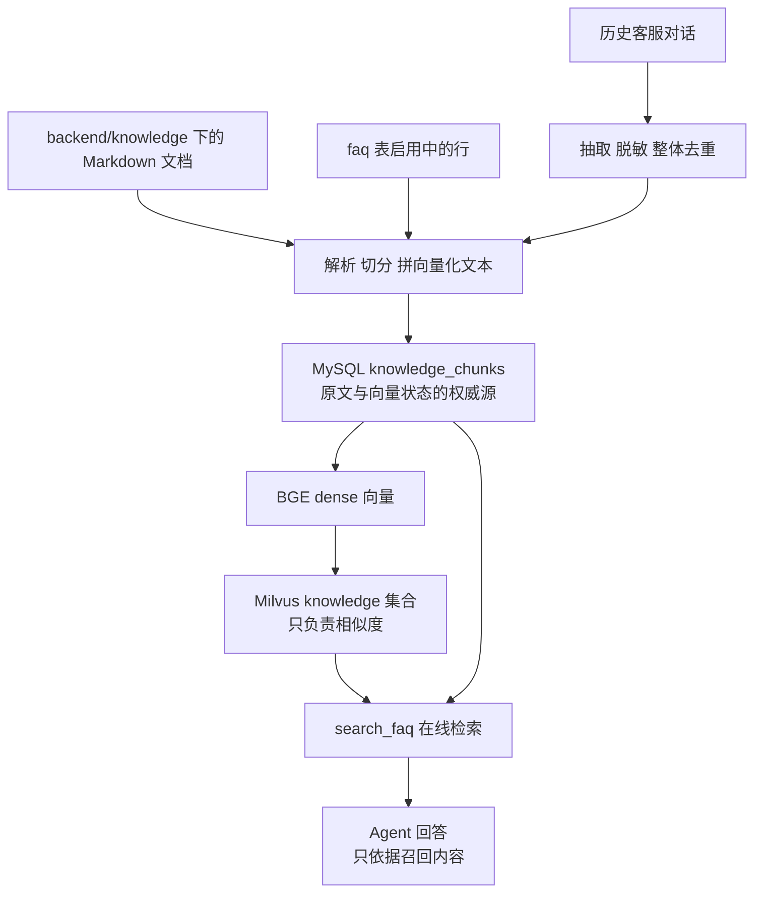
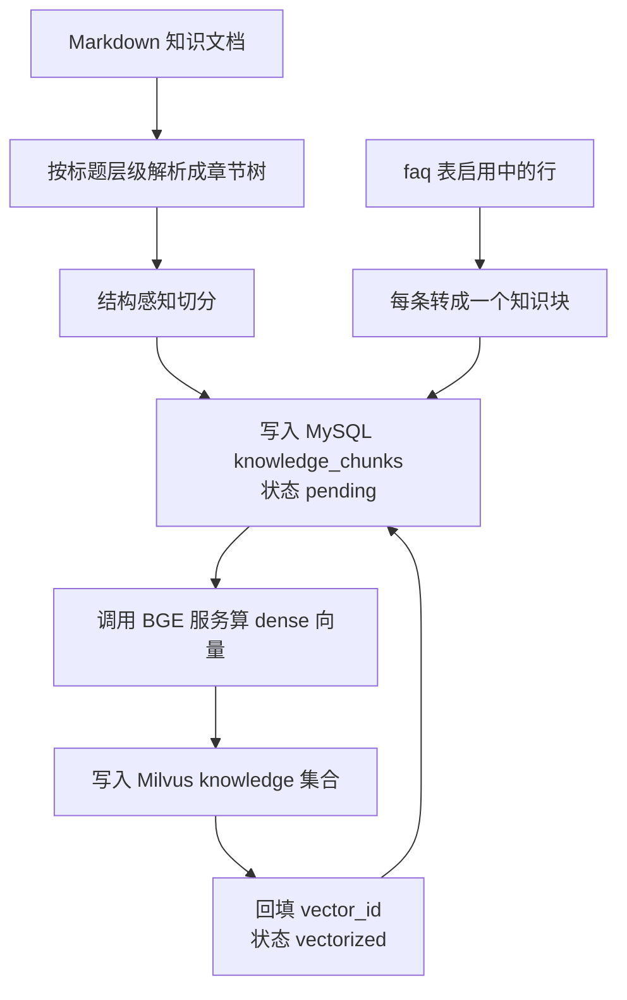
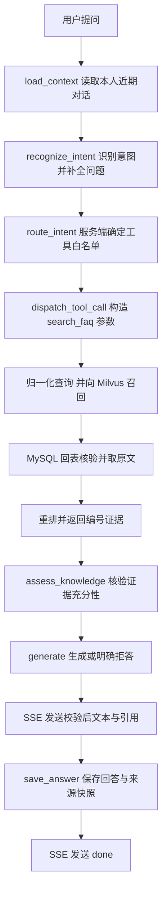
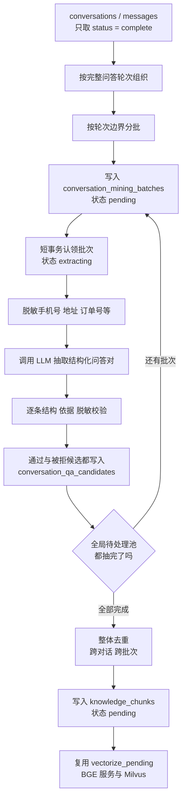

# Aiden RAG

本文说明 Aiden 当前 RAG 实现：文档与 FAQ 建库、历史客服对话挖掘、低置信度问题人工审核补库、`search_faq` 在线混合检索、四策略评估，以及员工建库控制台。

## 全景

三段能力的分工与衔接关系是理解本文其余部分的前提：



要点：

- **两条离线路径、一张表**。Markdown/FAQ 导入与历史对话挖掘的输入不同，但最后都落到 `knowledge_chunks`、共用一套向量化流程，因此可以一同被在线检索到。
- **MySQL 是权威源，Milvus 只是索引**。原文、问法、分类、章节路径与向量状态都在 MySQL；Milvus 只回答"哪条向量最像"。任何在线结果都要回 MySQL 取原文并校验状态。
- **离线和在线必须同源**。两端共用 `build_embedding_text` 的模板与同一个 `EmbeddingClient`（同一模型、同一 L2 归一化），否则相似度不可比。
- **知识只经工具结果进入模型**。`search_faq` 的返回值作为一轮工具结果交给模型，不拼进系统提示词；提示词只约束"只能依据召回内容作答"。

详细说明见「离线建库」「在线混合检索与生成质量控制」「评估体系」「历史对话挖掘」「员工建库控制台」「低置信度问题审核与补库」；在线一节包含一次提问从入口到 SSE 的调用链。

`docs/Aiden.md` 的 RAG 章记录目标设计与选型过程，其中包含尚未实现的规划内容；已实现的行为以本文为准。

## 离线建库

把知识变成可检索的向量。

两条离线路径共用同一套知识块表与同一套向量化流程：

| 路径 | 输入 | 入口 |
| --- | --- | --- |
| 离线建库 | Markdown 知识文档、`faq` 表启用中的行 | `backend/scripts/build_knowledge_base.py` |
| 历史对话挖掘 | `conversations`、`messages` 里的历史客服对话 | `backend/scripts/mine_conversation_knowledge.py` |

后者见本文的「历史对话挖掘」一节。

### 整体流程

离线建库把「解析、切分、向量化」拆成两条独立路径，中间用 MySQL 表衔接。



两条路径分开的理由是它们对文本的处理方式不同。Markdown 需要按标题层级还原结构再切分；FAQ 本身就是一问一答，不该再切。但两条路径最后汇合到同一张表、同一套向量化流程，因此只需要一个补齐命令。

代码按职责分三层：

| 层 | 位置 | 职责 |
| --- | --- | --- |
| 切分与知识构建 | `backend/app/services/rag/` | 解析、切分、拼接向量化文本，不接触数据库 |
| MySQL 持久化 | `backend/app/persistence/mysql/knowledge.py` | 知识块读写与向量状态流转 |
| Milvus 集合 | `backend/app/persistence/milvus/knowledge_store.py` | 集合建表、写入、删除 |
| 编排与命令 | `backend/app/services/rag/indexing.py`、`backend/scripts/build_knowledge_base.py` | 按顺序串起上面三层 |

### 知识块

#### 字段与来源

一个知识块不是一段裸正文，而是结构化记录。原文的权威来源是 MySQL，Milvus 只承担相似度检索。这样切分策略调整、换 embedding 模型、换向量维度时都能回到原文重算，不必担心信息在向量化过程中丢失。

| 字段 | 含义 |
| --- | --- |
| chunk_key | 幂等键，由来源、块序号与内容哈希决定 |
| source_type / source_id | 来源类型与稳定标识 |
| source_path / source_title | 文档相对路径与标题 |
| chunk_index | 块在来源内的顺序 |
| category | 分类 |
| questions | 问法列表 |
| answer | 知识正文 |
| embedding_text | 当时实际送去向量化的文本 |
| embedding_fingerprint | 拼接模板版本 |
| section_path | 章节路径 |
| content_type | text、table、code、mixed，或对话挖掘的「对话挖掘问答」 |
| is_key_clause | 是否关键条款 |
| prev_chunk_id / next_chunk_id | 同一来源内相邻块 |
| vector_status / vector_id | 向量同步状态与回填的向量主键 |
| content_hash | 正文哈希，用于识别内容变更 |

来源有三类。Markdown 文档以相对路径标识为 `markdown:<相对路径>`，现有 FAQ 行标识为 `faq:<行 id>`。FAQ 逐条独立成来源，因此改一条 FAQ 只影响它自己那块，不会牵动其他 FAQ 的向量。第三类是历史对话挖掘出的问答，`source_type` 为 `conversation`、`source_id` 形如 `conversation-qa:<问法集合哈希>`，标识方式与理由见「历史对话挖掘」一节。

#### 哪些字段进入向量化

只有 category、questions、answer 三项会拼成向量化文本。章节路径、内容类型、关键条款标记和前后块指针只作为元数据保存，不参与 embedding。元数据掺进向量化文本会稀释语义，让相似度偏向结构而不是内容。

拼接格式由 `app.services.rag.embedding_text` 中的 `build_embedding_text` 单点定义，离线建库与在线检索两端都必须走它，避免不同路径拼出不一致的文本：

```python
def build_embedding_text(category, questions, answer):
    """按唯一格式拼接向量化文本。"""
    clean_questions = [q.strip() for q in questions if q and q.strip()]
    lines = [f"分类：{category.strip()}"]
    if clean_questions:
        lines.append(f"问题：{'｜'.join(clean_questions)}")
    lines.append(f"答案：{answer.strip()}")
    return "\n".join(lines)
```

实际产出形如：

```
分类：退货政策
问题：七天无理由退货｜不适用情形
答案：以下商品不适用七天无理由退货：

- 消费者定作的商品。
- 鲜活易腐商品。
```

格式里带固定字段标签，是为了让向量化文本可读、便于人工核对，同时让不同字段的语义在向量空间里保持稳定位置。同一块有多个真实问法时用全角竖线分隔，避免与中文问句里的标点冲突。

#### 问法从哪来

FAQ 块天然带真实问题，直接用它作为 questions，用自己的分类作为 category。

政策或手册块没有天然问法，`questions` 只填所属章节标题；`category` 填完整上级标题路径。例如 `退货政策 > 七天无理由退货 > 不适用情形`，对应 `questions=["不适用情形"]`、`category="退货政策 > 七天无理由退货"`。根章节没有上级标题时，分类退回文档标题。完整章节路径另存为元数据。

章节标题作为当前块的问法、上级路径作为分类，能让同一文档的不同章节在向量化文本中保持区别；若所有块只写同一个文档标题，问法无法帮助区分章节。当前检索质量按「评估体系」中的四策略报告核对。

#### 关键条款

`is_key_clause` 标记退货、退款、换货、售后这类条款，判定方式是看章节路径里是否出现退货、退款、换货、售后、保修、质保、赔付、运费险、发票、退换这些关键词。当前可将它作为 Milvus 检索前的精确过滤条件；默认排序不按此字段额外加权。

### 切分

`app.services.rag.chunking` 中的 `chunk_section` 负责切分。它有三条硬约束。

#### 不切半截句子

正文需要拆块时，以完整句子为打包单位。句子边界由 `app.services.rag.length` 中的 `split_sentences` 识别：先按硬换行分段，再按中文句末标点切开，最后处理西文句点。西文句点只在小写或数字之后、且后面跟着空白与大写时才当句末，避免切开 `3.14`、`No. 1` 这类写法。未超预算且没有特殊块或超长句的章节直属正文可整体保留。

相邻正文块尽量保留重叠：只从上一块**新增内容的尾部完整句子**回退，同时检查 `RAG_OVERLAP_TOKENS` 和“重叠 + 下一句”的单块预算。尾句放不下时省略重叠，不复制半句；表格和待人工审核块不参与正文重叠。

#### 超长章节递归下钻

子标题是天然的语义边界。`chunk_section` 先处理章节直属内容，再递归处理每个子章节；即使达到 `RAG_MAX_HEADING_DEPTH`，子章节也不会被丢弃。需要拆分的正文按完整句子装箱。每次尝试加入句子时都计量**实际拼接后的文本**，精确分词模式直接用 tokenizer 编码该文本，不能用字符长度推算。只有重叠、没有新句子的块不会输出。解析器也保留同名标题为独立章节，并将 Markdown 代码围栏识别为代码块。

#### 异常长句显式标记

单句自身超过生效单句上限时，整句原样保留并标记 `need_manual_review`，写 MySQL 但不进 Milvus，等人工拆分。这样处理的理由是：截断会静默丢内容，而静默丢内容在客服场景里比检索不到更危险。

超过单句上限的句子会独立成块，所以单句上限必须小于单块预算，否则独立成块反而造出超大块。这个不变式由 `app.config.rag` 的 `RagSettings` 保证。

#### 表格按行分块

Markdown 表格单独处理。表头是表格语义的一部分，因此大表格按数据行分块时，每块都会复制表头两行，让单块脱离上下文也能独立理解。

每个表格块独立输出，不与正文或其它表格块合并，也不参与重叠。行数限制和整块 token 预算同时生效。

单行加表头就超过预算时，整行独立成块并标记 `need_manual_review`；表头本身超预算、代码块超预算时也标记待审核，不做静默截断。

### 长度计量

长度一律以模型的 token 为准，由 `app.services.rag.length` 中的 `get_length_meter` 提供，有两种模式。

配置 `EMBEDDING_TOKENIZER_PATH` 指向本地 `tokenizer.json` 且安装 `tokenizers` 时按实际文本的子词数精确计量。这是推荐用法；设置 `RAG_REQUIRE_EXACT_TOKENIZER=true` 时，精确计量不可用会直接报错。

没有配置时退回按字符估算。中文一个汉字常常对应多个子词，估算会偏乐观，因此配置里预留了 `RAG_MEASUREMENT_UNCERTAINTY_TOKENS` 和 `RAG_SAFETY_MARGIN_TOKENS`，从预算里扣掉，避免真实 token 数越过模型上限。

#### 预算的推导

单块预算不直接等于配置值，而是由三层约束推出，全部在 `app.config.rag` 的 `RagSettings` 里：

```
生效单块上限   = min(RAG_MAX_CHUNK_TOKENS, EMBEDDING_MAX_SEQ_TOKENS)
生效单句上限   = min(RAG_MAX_SENTENCE_TOKENS, 生效单块上限 / 2)
正文预算       = min(生效单块上限 - 计量不确定度 - 安全余量,
                    生效单块上限 - 生效单句上限)
不变式：正文预算 + 生效单句上限 <= 生效单块上限
```

第一层用模型能力作硬上限，是因为切分预算如果按 `RAG_MAX_CHUNK_TOKENS` 单独决定，换用上下文较短的模型后块会超过可编码长度，推理服务只能自行截断，等于静默丢内容。这个 bug 只在换模型时暴露：BGE-M3 支持 8192，而 bge-small-zh-v1.5 只有 512。

以两套配置为例：

| | bge-small-zh-v1.5 | BGE-M3 |
| --- | --- | --- |
| EMBEDDING_MAX_SEQ_TOKENS | 512 | 8192 |
| 生效单块上限 | 512 | 8192 |
| 生效单句上限 | 256 | 2048 |
| 正文预算 | 192 | 6144 |

换成上下文较短的模型时必须同步调小 `EMBEDDING_MAX_SEQ_TOKENS`，否则预算会算错。

### 向量状态与幂等

#### 状态机

`vector_status` 有四个取值：

| 状态 | 含义 | 是否进 Milvus |
| --- | --- | --- |
| pending | 原文已入库，尚未向量化 | 会 |
| vectorized | 向量已写入并回填 vector_id | 已进 |
| need_manual_review | 块或单句超过模型可编码长度 | 不进，等人工拆分 |
| superseded | 该块已失效 | 不进，且旧向量待删 |

#### 建库顺序

顺序是固定的：先把块写入 MySQL 并标为 pending，再写 Milvus，成功后才回填状态。原文是权威源，即使后面全失败，知识也不会丢，重跑可以从这一步之后继续。

`app.services.rag.indexing` 中的 `vectorize_pending` 负责补齐待向量化的块：

```python
pending = knowledge_repo.list_pending_chunks(limit)
...
for start in range(0, len(pending), rag_settings.embedding_batch_size):
    batch = pending[start : start + rag_settings.embedding_batch_size]
    vectors = active_client.embed_documents([item.embedding_text for item in batch])
    written = active_store.upsert(rows)
    # 只有 Milvus 确认写成功后才回填状态
    vectorized += knowledge_repo.mark_chunks_vectorized(written)
```

数据库会话在这个流程里是短生命周期的。读取待处理块、写向量、回填状态各自开一个事务，算向量的过程不持有任何数据库连接。

#### 中断窗口

要重点处理「Milvus 已写成功、MySQL 状态尚未回填」时进程中断的情况，重跑不得产生重复向量。

处理办法是让 MySQL 主键同时充当 Milvus 主键，写入使用 upsert 而不是 insert：

```python
schema.add_field(CHUNK_ID_FIELD, DataType.VARCHAR, is_primary=True, max_length=64)
...
self._client.upsert(collection_name=self._collection, data=batch)
```

这样重跑时读到仍是 pending 的块，重新算向量再写一遍，因为主键相同只覆盖同一条记录，不会新增。这个窗口因此从根上消失，不需要额外的去重逻辑。

早期方案曾设想由 Milvus 分配 ID、再由应用回填；当前 `docs/Aiden.md` 已同步为实际实现。使用 MySQL 主键作为 Milvus 主键的理由是：若 `vector_id` 由 Milvus 生成，中断时应用不知道上次写入的向量 ID，重跑可能重复插入。

#### 幂等键

`app.services.rag.indexing` 中的 `_chunk_key` 生成幂等键：

```python
def _chunk_key(source_id, chunk_index, content_digest):
    """生成块的稳定幂等键。

    键包含内容哈希：内容变化会产生新键，旧键在导入时被置为 superseded。
    """
    return sha256(f"{source_id}\n{chunk_index}\n{content_digest}".encode("utf-8")).hexdigest()
```

键包含内容哈希而不是只用来源加序号，是为了避免「旧行的 embedding_text 与新内容不一致」这种静默错误。同一序号的内容变化会产生新键，旧行被作废，不会出现原地错配。

`upsert_source_chunks` 以这个键做幂等 upsert。内容哈希与模板指纹都没变的块保持原状态，不会被重新向量化；变化过的块重置为 pending 并清空 vector_id。

#### 判定作废

内容更新或块数量减少时，本次没生成的旧块要作废，并从 Milvus 删除对应向量。判定方式是主键差集，在写入结束后对比本次生成的 chunk_key 集合：

```python
current_keys = set(deduped)
stale_ids = [c.id for key, c in existing.items() if key not in current_keys]
if stale_ids:
    session.execute(
        update(KnowledgeChunk)
        .where(KnowledgeChunk.id.in_(stale_ids))
        .values(vector_status=VECTOR_STATUS_SUPERSEDED, vector_id=None)
    )
```

这里不能用 `created_at` 与本次运行时间比较。`created_at` 只在首次插入时写入，不随更新刷新，拿它比较会把所有早于本次运行的行都误判为旧块，导致已向量化的块每次重导入都被打回待向量化，反复重新算向量。这个缺陷在开发中被实测抓到并修正，判定改成与时间无关的主键差集后，重跑结果稳定。

#### 一个运维注意点

`cleanup_superseded_vectors` 是从 MySQL 的 superseded 记录推导待删 id 的。如果整库被重建或整表被清空，这些记录不再存在，Milvus 里的旧向量就成了孤儿，清理函数看不到它们。此时只能换 `MILVUS_KNOWLEDGE_COLLECTION` 集合名，或手动删除该集合重建。这是「MySQL 是权威源」的代价。

### 向量服务

#### 为什么需要它

BGE-M3 本身只是模型权重，不会响应 HTTP 请求。应用侧按 OpenAI 兼容协议访问 `{EMBEDDING_BASE_URL}/embeddings`，因此需要把权重包成一个小服务，让私有化部署也能用同一套客户端代码。

#### 准备与启动

本项目按 CPU 推理部署，不需要显卡，也不需要安装 CUDA。环境准备由 `backend/scripts/setup_embedding_server.ps1` 完成，它建一个独立虚拟环境，把 torch 与推理依赖装在里面，与后端 `requirements.txt` 隔离。脚本默认装 CPU 版 torch，约 0.3 GB；默认使用 HuggingFace 镜像下载权重。整个准备过程只需执行一次。

    # 准备环境（CPU 版，约 0.3 GB）
    .\backend\scripts\setup_embedding_server.ps1

服务由 `backend/scripts/embedding_server.py` 提供，只监听 127.0.0.1：

    cd backend
    # 小模型，用于链路验证
    D:\bge-m3-env\Scripts\python.exe scripts\embedding_server.py --model BAAI/bge-small-zh-v1.5
    # 真实 BGE-M3
    D:\bge-m3-env\Scripts\python.exe scripts\embedding_server.py --model BAAI/bge-m3

三点使用注意。

手动运行脚本时，服务是前台进程，需保持终端开启；员工控制台也可在满足本地地址与解释器配置时启动后台子进程。它没有装成 Windows 服务，重启后需要重新启动。首次启动若本地没有模型权重，可能需要下载，之后从本地缓存读取。

不要传 `--fp16`。该参数只在 GPU 上有效，CPU 推理时 FlagEmbedding 会强制使用 float32，传了也不会生效。

`--device` 默认是自动选择，本机没有可用的 CUDA 时会落到 CPU，无需显式指定。

BGE-M3 的 CPU 加载、整库向量化和在线编码耗时取决于目标机器与知识规模，需在部署环境实测。若需要 GPU，可执行 `setup_embedding_server.ps1 -Gpu` 安装 CUDA 版 torch，并给服务加 `--fp16`。

启动成功的标志是在终端看到服务开始监听，可用 `/health` 确认：

    Invoke-RestMethod http://127.0.0.1:8001/health

返回的 `dimension` 在第一次编码之后才会有值，刚启动时为 null。员工控制台会将模型名已匹配、维度尚为 null 的服务显示为“维度待验证”，不会误报配置不一致；首次编码后才比较实际维度，若与后端配置不同则明确报错。实际向量化调用也会校验维度。

`backend/scripts/verify_embedding_service.ps1` 做一键探测，并把实际返回的向量维度回写到 `backend/.env`。

#### 接口

服务暴露 OpenAI 兼容的三个端点：

    GET  /health          返回服务状态、模型名与已探测到的维度
    GET  /v1/models       返回模型列表
    POST /v1/embeddings   返回 dense 向量

请求与响应形如：

```json
// 请求
{"model": "BAAI/bge-m3", "input": ["文本一", "文本二"]}

// 响应
{"object": "list", "data": [{"object": "embedding", "index": 0, "embedding": [0.013, -0.021]}]}
```

`data[].index` 与请求顺序对应，应用侧依赖该字段排序。

#### 维度校验

应用侧由 `app.services.rag.embedding` 中的 `EmbeddingClient` 调用。它以配置中的 `EMBEDDING_DIMENSION` 为准，与实际返回值比对，不一致直接报错：

```python
if len(vector) != self._expected_dimension:
    raise DimensionMismatchError(
        f"向量维度与配置不一致：期望 {self._expected_dimension}，实际 {len(vector)}。"
        "请先确认 EMBEDDING_MODEL 与 EMBEDDING_DIMENSION，再重建 Milvus 集合。"
    )
```

早失败比晚失败便宜得多：Milvus 集合一旦按错误维度建好，后续写入会持续失败，而且难以定位。集合创建时也会校验维度，与已存在集合不一致时直接报错。

服务侧对向量统一做 L2 归一化，配合 Milvus 的 COSINE 距离使用。归一化后余弦相似度等价于内积，不同模型的向量尺度差异也不会影响检索排序。

#### 换模型要动哪几个值

CPU 推理下换模型只改配置，服务启动命令不需要额外参数：

    EMBEDDING_MODEL=BAAI/bge-m3
    EMBEDDING_DIMENSION=1024
    EMBEDDING_MAX_SEQ_TOKENS=8192
    EMBEDDING_TOKENIZER_PATH=<bge-m3 的 tokenizer.json>

改完重新执行导入与向量化即可。因为幂等键与向量主键都不变，换模型不会产生重复向量，旧向量会被覆盖。

注意 Milvus 集合的维度在创建时固定，沿用旧集合会直接报错。想并存两个模型对比，用不同的集合名区分，例如 `MILVUS_KNOWLEDGE_COLLECTION=knowledge_bge_m3`。

从 0.2 GB 的 bge-small-zh-v1.5 换到 2.3 GB 的 BGE-M3 时，CPU 推理的内存占用和单条耗时都会明显上升，首次整库向量化的时间也会变长，但几十到几百块知识库仍在可接受范围内。

### Milvus 集合

集合名由 `MILVUS_KNOWLEDGE_COLLECTION` 指定，当前默认 `knowledge_bm25`。本地 Milvus 2.5+ 服务使用 `http://127.0.0.1:19531`；结构由 `app.persistence.milvus.knowledge_store` 中的 `KnowledgeVectorStore.ensure_collection` 创建：

| 字段 | 类型 | 说明 |
| --- | --- | --- |
| chunk_id | VARCHAR(64) | 主键，等于 MySQL 块主键 |
| embedding | FLOAT_VECTOR | 维度由实际模型输出决定 |
| source_type | VARCHAR(32) | 来源类型 |
| source_id | VARCHAR(256) | 来源标识 |
| source_path | VARCHAR(1024) | 文档相对路径 |
| category | VARCHAR(512) | 分类 |
| section_path | VARCHAR(1024) | 章节路径 |
| content_type | VARCHAR(32) | 内容类型 |
| is_key_clause | BOOL | 关键条款标记 |
| chunk_index | INT32 | 块序号 |
| content | VARCHAR(65535) | 正文，便于检索直接取回候选 |
| metadata | JSON | 问法列表、前后块 id、模板指纹 |

索引使用 HNSW，度量用 COSINE。规模不大时 HNSW 的查询延迟比 IVF 更低，这与 `docs/Aiden.md` 的选型一致。

标量字段（source_type、source_id、category、section_path、content_type、is_key_clause、chunk_index）随向量保存。其中 category、source_type、source_id、content_type、is_key_clause 可在 Milvus 召回前作为精确过滤条件；结果的有效性仍由 MySQL 回表校验。`text` 字段使用内置 chinese analyzer，BM25 函数从它自动生成稀疏向量。

`content` 字段是写入时留下的正文副本，同样**没有参与在线检索**：命中后按主键回 MySQL 取 `category/questions/answer`，不使用这个副本，避免它落后于 MySQL 时把过期正文交给模型。它保留的目的只是让集合自身可读、便于人工排查。

`KnowledgeVectorStore.search`、`search_bm25` 和 `hybrid_search` 分别提供 dense、BM25 与 Milvus RRF 融合召回，返回 `chunk_id`、策略原始分数与顺序。默认在线路径在融合后用 bge-reranker-v2-m3 精排；MySQL 再校验知识是否有效。集合不存在或连接失败时会抛错，不把服务故障伪装成空结果。

`get_collection_stats` 返回的 `row_count` 统计的是物理存储版本数，upsert 覆盖后旧版本仍在，直到后台压缩完成才收敛。判断集合里有没有重复向量必须按主键去重计数，不能用这个值。

### 命令

命令都在 `backend` 目录下执行，连接与凭据来自 `backend/.env`。

    # 导入 Markdown 目录，缺省用 RAG_KNOWLEDGE_DIR（即 backend/knowledge）
    .\.venv\Scripts\python.exe -m scripts.build_knowledge_base import-markdown
    # 导入启用中的 faq 行
    .\.venv\Scripts\python.exe -m scripts.build_knowledge_base import-faq
    # 扫描待向量化块并补齐；退出码 1 表示仍有遗留
    .\.venv\Scripts\python.exe -m scripts.build_knowledge_base vectorize
    # 只看还有多少待处理，不写数据
    .\.venv\Scripts\python.exe -m scripts.build_knowledge_base scan-pending
    # 删除已作废块的旧向量
    .\.venv\Scripts\python.exe -m scripts.build_knowledge_base cleanup-vectors
    # 各状态的块数与当前配置
    .\.venv\Scripts\python.exe -m scripts.build_knowledge_base stats
    # 分页查看已入库知识块，用于人工核对切分结果
    .\.venv\Scripts\python.exe -m scripts.build_knowledge_base chunks --limit 5

退出码约定：0 成功，1 还有遗留待向量化块，2 出错。所有命令都可以重复执行。

### 配置

全部从进程环境读取，示例见 `backend/.env.example`，真实凭据不要提交。

#### 向量服务配置

| 变量 | 说明 |
| --- | --- |
| EMBEDDING_BASE_URL | 服务地址，末尾带 /v1 |
| EMBEDDING_API_KEY | 服务未开鉴权时留空 |
| EMBEDDING_MODEL | 模型名 |
| EMBEDDING_DIMENSION | 期望维度，与返回值校验 |
| EMBEDDING_MAX_SEQ_TOKENS | 模型可编码长度，决定切分预算上限 |
| EMBEDDING_TOKENIZER_PATH | 本地 tokenizer.json，用于精确计量 |
| EMBEDDING_BATCH_SIZE | 单次请求条数，只影响吞吐 |
| HF_HOME / HF_ENDPOINT | 由 huggingface_hub 读取，模型缓存位置与下载源 |

#### Milvus 配置

| 变量 | 说明 |
| --- | --- |
| MILVUS_URI | 服务地址 |
| MILVUS_TOKEN | 未开鉴权时留空 |
| MILVUS_KNOWLEDGE_COLLECTION | 集合名 |
| MILVUS_INSERT_BATCH_SIZE | 单次写入条数 |

#### 切分配置

| 变量 | 默认值 | 说明 |
| --- | --- | --- |
| RAG_KNOWLEDGE_DIR | knowledge | 默认知识目录，相对 backend 解析 |
| RAG_MAX_CHUNK_TOKENS | 8192 | 单块上限，与模型长度取较小值 |
| RAG_MAX_SENTENCE_TOKENS | 2048 | 单句上限，不超过单块上限的一半 |
| RAG_OVERLAP_TOKENS | 80 | 相邻块重叠 |
| RAG_MEASUREMENT_UNCERTAINTY_TOKENS | 256 | 长度计量的不确定度 |
| RAG_SAFETY_MARGIN_TOKENS | 64 | 安全余量 |
| RAG_MAX_HEADING_DEPTH | 6 | 标题递归下钻最大层数 |
| RAG_TABLE_ROWS_PER_CHUNK | 20 | 表格每块数据行数 |
| RAG_ESTIMATOR_CHARS_PER_TOKEN | 1.1 | 字符估算比例 |
| RAG_REQUIRE_EXACT_TOKENIZER | false | 为真时缺少精确分词器直接报错 |

### 知识文档怎么写

切分依赖 Markdown 结构，因此知识文档的组织方式直接决定检索质量。

用规范的 `#`、`##`、`###` 标题组织章节。章节标题会作为该块没有天然问题时的问法，上级标题会成为分类，因此标题要写得像用户会问的说法，而不是内部编号。

一个章节讲一件事。过长的直属正文按完整句子装箱，子章节按标题层级单独处理；若长段落没有句号等可识别边界，整句会被保留并标记待人工审核。

表格用标准 Markdown 表格语法，包含表头和分隔行，这样才被识别为表格并按行分块。表格前加一句说明它的用途，有助于这块被正确检索到。

不要把关键信息只放在图片里。当前只处理文本、表格和代码块，图片内容不进知识库。

### 当前实现与核对点

建库时可按源码与控制台核对以下不变量；实际完成数量以当前 MySQL 和 Milvus 集合为准，不沿用旧批次统计。

- Markdown 按章节和完整句子切分，表格按行分块并保留表头；过长且无法安全拆分的内容会标记 `need_manual_review`，不进入向量化。
- Markdown、FAQ 和历史对话知识先写入 `knowledge_chunks`，可向量化块处于 `pending`；只有实际 embedding 维度与集合配置相符，才写入 Milvus，再回填 `vector_id` 和 `vectorized` 状态。
- Milvus 使用 MySQL 块 ID 作为 `chunk_id` 主键并执行 upsert；回填前中断时可重跑同一 pending 块。内容更新产生的 `superseded` 向量另由清理步骤删除。
- `knowledge_chunks` 的权威正文与向量状态可在员工建库控制台查看；在线召回会再回表过滤无效块。当前四策略的召回与生成评估见「评估体系」，其中报告的 dense 模型和具体运行环境须与当前部署配置区分。

## 在线混合检索与生成质量控制

### 从提问到最终回答

知识类提问沿着以下路径处理；`app/agent/graph.py` 编排 Agent，`app/services/tools/customer.py` 提供 `search_faq`，`app/services/rag/retrieval.py` 编排召回，Milvus 只返回候选 ID 和分数，MySQL `knowledge_chunks` 决定当前有效性和权威正文。



`recognize_intent` 只接收分类提示词和对话上下文，不接收知识正文或工具定义；`route_intent` 决定是否允许 `search_faq`，`dispatch_tool_call` 把补全后的当前问题放入 `question`，由服务端合成工具调用。召回知识作为本轮 `ToolMessage` 进入 `generate`，没有拼进 System Prompt。历史消息只保存最终回答及来源快照，不保存本轮 ToolMessage；追问会重新检索。`app/api/routes/conversations.py` 在 `generate` 节点完成后发送已通过引用校验的最终文本（单次 `delta`）及可用的 `citations`，随后图内 `save_answer` 落库；图正常结束后才发送 `done`，不会先推送未经校验的模型草稿。

### 查询准备、召回与过滤

`normalize_query` 合并多余空白并去掉限定的口语前缀、句尾语气词，保留实体、否定词和业务条件。`expand_retrieval_query` 只在 BM25 查询文本后附加少量业务同义词，例如“邮费”补“运费”；dense 始终编码归一化问题。两者只处理本次查询，不改写或复制知识库原文。

dense 查询由 `build_query_embedding_text` 复用入库的 `build_embedding_text` 模板，实际文本为 `分类：用户提问\n问题：<归一化问题>\n答案：`。固定分类只用于模板对齐，不推断业务类别；query 与入库块须用同一 embedding 模型、维度及 L2 归一化方式。BM25 侧由 Milvus 2.5+ 集合的 `text` 字段、内置 `chinese` analyzer 和 BM25 function 生成稀疏向量。非纯 dense 策略要求集合具备 `text` / `sparse_embedding` schema；旧集合缺字段时会明确要求迁移，不会自动改表。

默认 `hybrid_rerank` 让 dense 与 BM25 各取最多 Top-50，再由 Milvus `RRFRanker(60)` 融合，融合候选也最多 50 条。`dense`、`bm25`、`hybrid` 是其余三个可选策略：分别使用单路向量、单路关键词、双路 RRF 而不精排。`semantic_search` 的 `category`、`source_type`、`source_id`、`content_type`、`is_key_clause` 在 Milvus 各路召回前做精确过滤；线上工具仅暴露可选 `category`，不指定时检索全库。表达式只使用固定字段名，值用 JSON 编码。

Milvus 命中后按 `chunk_id` 去重，再调用 `get_vectorized_chunks_by_ids` 回 MySQL；仅保留仍存在且 `vector_status = 'vectorized'` 的块，`pending`、`superseded`、`need_manual_review` 和孤儿向量都不能进入回答。多取候选是为了过滤无效命中后尽量补足最终条数。`hybrid_rerank` 用本地 `bge-reranker-v2-m3` 对归一化问题和 MySQL 权威正文（分类、问法、答案）打分，logit 经 sigmoid 映射到 0～1，再按分数排序；最终条数受 `RAG_ONLINE_RESULT_LIMIT` 和 `RAG_RERANK_LIMIT` 共同限制，默认 Top-10。其余策略保留 Milvus 顺序，原始 COSINE、BM25、RRF 分数不能跨策略比较。

`search_faq` 的成功响应包含 `status`、`results`、`message`；每条结果有 `[1]` 等引用编号、chunk ID、章节、来源路径、原文、展示问法和可用的原文链接。展示问法优先把非空 `questions` 用全角竖线连接，缺失时用 `section_path`。检索服务报错时返回 `status=error`，不会静默转到 MySQL `LIKE` 或另一套检索方式，以免把服务故障误判为知识缺失。

### 证据核验、拒答与来源展示

工具返回后，`assess_knowledge` 先处理空召回；仅当结果带重排分数时，才比较最高分与 `RAG_MIN_RERANK_SCORE`（默认 0.35），这个阈值不用于纯 dense、BM25 或未重排的 RRF 原始分数。随后模型只依据给定证据判断问题能否直接回答，型号、时间、金额、条件不一致须判不足。空召回、低重排分或证据不足时给出明确拒答；检索服务故障则提示稍后重试，不当成空知识。

System Prompt 要求知识事实只依据本轮 `search_faq` 结果，并逐项用 `[n]` 引用；不得从 `policies` 表、模型记忆或其他用户历史回答补造政策，也不得保证具体到账、送达或赔付结果。`generate` 把最相关证据放在上下文开头、次相关放在结尾，减少长上下文中段的信息损失。生成后检查引用编号：没有引用、引用了不存在的编号，均改为拒答；引用失败以独立技术兜底入口 `generation_missing_citation` 入池，不混同模型自评不足。

每个失败诉求分别记录原问法、入口及原因：空召回和最高可比较重排分低于阈值使用 `retrieval_low_confidence`（原因分别说明空召回或低分），自评判不足或结果无法解析使用 `generation_insufficient_knowledge`。工具服务故障只返回错误文案，不作为知识不足入池。`finish_assistant_message` 在保存最终助手消息及引用快照的同一 MySQL 事务中批量写入 `low_confidence_questions`，重复收尾或 SSE 重放不重复写入。

用户点击已完成助手回答的满意度按钮时，带鉴权的 `POST /api/conversations/{conversation_id}/messages/{message_id}/feedback` 仅接收 `{"rating":"satisfied"}` 或 `{"rating":"unsatisfied"}`；服务端核验会话归属和目标消息，并在“不满意”时关联真实用户问题，以 `user_feedback_unresolved` 入同一问题池。满意反馈只保存到 `messages.feedback`，不入池；已记录的反馈重复提交返回原结果，不允许改选。历史消息回传 `feedback` 供刷新后回显；失败时页面提示错误，可重试。消息表的 `citations` JSON 保存生成时的来源快照；历史消息和 SSE 的 `citations` 事件使用同一结构，前端点击 `[n]` 可查看原 chunk 正文与章节。Markdown 来源还可经已认证的 `GET /api/knowledge/source/{chunk_id}` 打开原始文档。问题入池不等于人工审核或自动补库，后两项尚未实现。

### 运行配置与验证范围

| 配置 | 默认值 | 作用 |
| --- | --- | --- |
| `RAG_ONLINE_STRATEGY` | `hybrid_rerank` | 在线策略；另可选 `dense`、`bm25`、`hybrid` |
| `RAG_ONLINE_CANDIDATE_LIMIT` | `50` | 每路候选池下限；混合检索仍由 Milvus 封顶 50 |
| `RAG_ONLINE_RESULT_LIMIT` / `RAG_RERANK_LIMIT` | `10` / `10` | 最终返回上限及重排保留上限 |
| `RAG_RERANKER_MODEL` / `RAG_MIN_RERANK_SCORE` | `BAAI/bge-reranker-v2-m3` / `0.35` | 重排模型或本地目录、生成前的重排分数阈值；本机 `.env` 指向 `D:\hf-cache\bge-reranker-v2-m3` |
| `EMBEDDING_*` / `MILVUS_*` | 见「离线建库」配置 | 线上查询沿用入库模型、维度、向量服务和集合；`MILVUS_KNOWLEDGE_COLLECTION` 选集合 |
| `OPENAI_THINKING_MODE` | 空（不传参数） | 在线模型思考模式；使用 DeepSeek 思考模型时应设 `disabled` |

DeepSeek 携带 `tools` 的思考模式请求要求回传既有 `reasoning_content`；本项目的 `dispatch_tool_call` 是服务端合成 `AIMessage(tool_calls=...)`，没有该字段，因此这类模型需设 `OPENAI_THINKING_MODE=disabled`，否则工具结果后的生成可能收到 400。开关只作用于在线 Agent 的 `ChatOpenAI`；历史对话挖掘使用单独的 `MINING_LLM_*` 客户端。

此前在 Milvus 2.5 `knowledge_bm25`、本地 `bge-reranker-v2-m3` 的进程环境中实测：询问库外型号 MH-LP999 的猫砂容量时，SSE 返回明确拒答、没有 `error` 事件，`low_confidence_questions` 新增一条原话一致的记录；当时的入口值为 `generation_self_check`（现已改为 `generation_insufficient_knowledge`）。这是修改前该次问法与配置下的验证，不代表新入口已在同环境重新实测，也不代表所有库外问题都会落在同一拒答入口。四策略离线评估的范围和局限见下一节。

另用 MH-LP50 具体型号问题走真实在线链路，SSE 依次包含 `start`、`delta`、`citations`、`done`，返回 3 个引用；MySQL 助手消息也保存了相同的 3 个引用及对应 chunk ID，来源章节路径存在，已认证的来源原文接口返回 HTTP 200。这验证了该次问法的回答、引用持久化和原文回链；不代表所有题目都有相同的引用数。

本地 `backend/.env`、示例配置和代码默认值均指向 Milvus 2.5 的 `knowledge_bm25`。该集合已由旧数据迁移并核对为 84 条记录；新部署仍须按自己的 Milvus 地址和 embedding 维度配置环境变量。运行后端的虚拟环境需安装 `backend/requirements-rag.txt` 中的 `FlagEmbedding` 和 `torch`，否则精排模型无法加载。

## 评估体系

### 数据集、策略与指标口径

`backend/evals/customer_rag_v1.jsonl` 有 15 道人工标注题：12 道有答案、3 道库外题。每行记录问题 ID、原句、`type`、`difficulty`、目标来源文件和章节（`ground_truth`）以及人工核对用的 `answer_facts`。问题类型覆盖具体型号、口语问法、政策边界、多证据和库外拒答；难度为 easy、medium、hard。多证据题可有两个目标章节，库外题没有目标章节。

`backend/evals/run_customer_rag.py` 对每道题依次运行 `dense`、`bm25`、`hybrid`、`hybrid_rerank`，每种策略最多保留 10 条有效召回，组成 60 条逐题结果。前两种分别测单路 dense 和 BM25，`hybrid` 测 RRF 融合，`hybrid_rerank` 在融合后加本地 BGE 精排。检索都经同一 `semantic_search` 的 MySQL 回表过滤；这组结果用于比较召回与生成表现，不能把不同策略的原始分数直接比较。

| 指标 | 计算范围与含义 |
| --- | --- |
| Recall@1 / @5 / @10 | 只统计可回答题。目标章节在前 K 条中出现的比例；多证据题按每个目标章节分别计数，再对题目取平均。命中要求召回 `source_path` 的最后文件名与标注文件名相同，且标注章节包含在 `section_path` 中。 |
| MRR | 只统计可回答题。取最先命中的目标章节名次的倒数，完全未命中为 0；多证据题也只看最先命中的那一条。 |
| Faithfulness | 统计有生成答案及模型评审结果的题。模型逐条判断答案里的可验证事实是否由本次召回证据直接支持；纯拒答且未增加事实可以得 1。它不测答案完整性、业务事实真伪或跨来源冲突。 |
| 库外拒答率 | 只统计 `ground_truth` 为空的题。脚本检查生成答案是否包含“无法核实”“无法确认”“证据不足”“不能保证”等词，再对 0/1 取平均；这是词面规则，不等于人工判断的拒答质量。 |

报告的 `strategies.*.overall`、`by_type`、`by_difficulty` 用同一口径汇总，并保留每桶的题数、可回答题数。`cases` 对每道题和每种策略保存召回排名、答案、Recall、MRR、Faithfulness、评审理由及拒答标记。Faithfulness 来自当前配置的对话模型，是模型评审结果；结合 `answer_facts` 和原始证据人工复核，尤其注意来源冲突与具体时效承诺。初始基线数字与解读见 [`backend/evals/reports/customer_rag_v1.md`](../backend/evals/reports/customer_rag_v1.md)；页面读取的同目录 JSON 可由手动评估更新，二者之后可能不同。初始快照使用 Milvus 2.5 `knowledge_bm25` 和 512 维 `bge-small-zh-v1.5` dense 模型，没有测试 1024 维 BGE-M3 dense 模型，样本量也不足以外推线上胜率。

### 运行、重算与页面核对

在 `backend` 目录配置可访问的 MySQL、embedding 服务、Milvus 2.5+ 集合、重排模型及生成模型后运行完整评估；`--collection` 可把评估指向独立集合，不修改在线默认集合。

```powershell
# 在 backend 目录，临时指向独立的 Milvus 2.5+ 评估实例
$env:MILVUS_URI = 'http://127.0.0.1:19531'
.\.venv\Scripts\python.exe -m evals.run_customer_rag --collection knowledge_bm25 --report evals/reports/customer_rag_v1.json
```

只需检索指标时加 `--retrieval-only`：报告中 `answer`、`faithfulness`、`judge_reason`、`faithfulness_judge` 为 `null`，库外题的 `refused` 也为 `null`；页面应显示未生成、未评审，而非零分。若只修正标注、问题正文和召回列表未变，可用 `--recompute-from evals/reports/customer_rag_v1.json` 从保存的召回重算检索指标；该模式保留旧答案及评审，不会再次请求生成模型。

员工以 remote 模式登录后，从 `/staff/rag` 进入 `/staff/evals`。点击“运行四策略评估”会通过员工鉴权的 `POST /api/rag/jobs/evaluate` 启动后台任务；服务器使用当前配置的知识库、固定的 `customer_rag_v1.jsonl` 题集，依次运行四种策略的检索、生成与模型评审。任务复用建库控制台的跨进程锁，同一时间只接受一项控制台任务；前端每 2 秒读取 `GET /api/rag/jobs` 显示已完成题数和失败状态。运行较久时页面仍显示上一份报告，失败时也保留旧报告。任务完成后先写同目录临时文件，再原子替换 `backend/evals/reports/customer_rag_v1.json`；页面自动重新请求员工鉴权的 `GET /api/rag/evals/customer-rag-v1`，无需重启服务。“刷新报告”只重新读取文件，不启动评估；命令行输出到其他路径的报告不会显示在该页面。

页面展示四策略总体指标和 `by_type` 分桶对比；按题型、难度筛选 15 道题后，可逐题核对 ground truth、答案要点、四策略召回排名、生成答案、拒答和 Faithfulness 理由。目标章节按上述文件名与章节路径规则标亮。新报告记录 `generated_at`；旧版报告缺少该字段时页面显示“历史报告未记录”。任务进度只保存在当前 API 进程内，服务重启后进度会消失，但已经完成写入的报告仍保留。手动评估不会自动新增或修改测试题，也不会通过线上聊天编排链路验证低置信度入池。

## 历史对话挖掘

从历史客服对话里挖出可复用的商品或服务知识。与人工编写的 Markdown 或 FAQ 不同，这些知识要从对话里抽取，因此多了三道必须处理的关卡：只从可信对话里抽、抽取前后都要去掉个人信息、以及候选必须整体去重之后才能入库。

范围限定在挖掘这一段。挖掘出的知识进入同一张 `knowledge_chunks` 表、走同一套向量化流程，因此可以像文档或 FAQ 一样被 `search_faq` 检索到；本节只说明抽取与入库，检索路径见「在线混合检索与生成质量控制」。

### 整体流程



流程切成「抽取」与「去重入库」两段。闸门检查**所有轮次**的 `pending`、`extracting`、`failed` 批次；只要还有未完成批次，整体去重就推迟。`extracted` 与 `ready` 批次中仍为 `staged` 的候选会跨 `run_id` 汇集去重。`run_id` 仅追溯认领和抽取发生在哪一轮，不限定去重范围。

代码分层：

| 层 | 位置 | 职责 |
| --- | --- | --- |
| 脱敏与校验 | `backend/app/services/rag/sanitization.py`、`extraction.py` | 擦除个人与交易标识、调模型、按结构逐条校验 |
| 编排 | `backend/app/services/rag/conversation_mining.py` | 分批、抽取、整体去重、入库 |
| MySQL 持久化 | `backend/app/persistence/mysql/conversation_mining.py` | 消息读取、批次进度、候选暂存 |
| 运行控制 | `backend/app/services/rag/runtime_control.py` | 实例锁与停止信号 |
| 定时入口 | `backend/scripts/mine_conversation_knowledge.py` | 手动跑一次、按周期常驻、查看进度 |

### 消息读取与分批

#### 什么算可信问答

只读 `messages.status = 'complete'` 的消息。`streaming` 还在生成、`error` 与 `stopped` 都不是可信答案，把它们当依据会把半截回答变成「知识」。`system` 消息也不参与。

轮次的构成规则是：一条用户消息（或**连续**多条用户消息合并成一个提问）加上紧邻其后的一条可信答案消息（`assistant` 或 `staff`）算一轮。合并连续用户消息是必要的，否则「我要退货」和「尺码不对」会被当成两个独立问题，而答案只有一个。末尾没等到答案的用户消息被丢弃，等下一轮运行有新答案时再处理。

#### 分批不切开一轮问答

两个上限同时生效：单批最多 `MINING_MAX_TURNS_PER_BATCH` 轮、送进模型的对话文本最多 `MINING_MAX_BATCH_CHARS` 字符。装箱只发生在轮次边界上，因此一轮问答不会跨批，否则答案与问题分离，抽出来的知识必然残缺。

单轮自身就超过字符上限时，它独占一个批次，抽取阶段把它标记为 `skipped` 并记录原因。既不与别的轮次合并（合并会让整批超限），也不切分它（切分违反上一条约束）。

#### 增量读取靠续跑锚点

每个会话从「已处置批次的最后消息时间」之后继续读，已处理过的消息不会再次读取。这里的「已处置」只包括 `promoted` 与 `skipped`：

- 不包括 `superseded`：它表示窗口被显式作废，若拿它推进锚点，那段消息就再也读不到；
- 不包括 `failed`：那是「下次要重试」。

一次任务的读取量由上界控制（会话数、批次数），达到上限就停下，剩余消息留给下一次运行。

### 脱敏

个人与交易标识在**调用模型之前**就擦除，不依赖模型自觉。理由是这些信息一旦进入模型输出、暂存表或正式知识，就等于把用户隐私写进了可被检索的知识库，事后清理的代价远高于提前擦除。

处理方式是纯文本的确定性替换，用固定占位符而不是随机串：

| 类别 | 占位符 | 识别要点 |
| --- | --- | --- |
| 证件号 | `[证件号]` | 18 位与 15 位两代身份证格式 |
| 邮箱 | `[邮箱]` | 常规邮箱形态 |
| 订单号 | `[订单号]` | 需带「订单号」「订单编号」等上下文标签，编号本体至少 6 位 |
| 运单号 | `[运单号]` | 需带「运单号」「快递单号」等上下文标签 |
| 手机号 | `[手机号]` | 允许 `+86`、空格与连字符分隔；前后不允许紧邻字母数字，避免误吃长数字串 |
| 地址 | `[地址]` | 需命中行政区划或门牌号，单独一个市名不算 |

替换用固定占位符是为了让同一段对话每次都得到同一份文本，批次签名与候选指纹才稳定，重复运行不会因为脱敏结果抖动而产生新知识。

裸编号不匹配：纯数字形态无法与商品编号、金额、时间戳区分，误伤面太大。代价是「订单 202405160001」这种没有标签的写法不会被擦除，而真实对话里订单号几乎总带着标签或 `#`。

### 抽取与校验

#### 抽取的目标不是摘要

提示词里明确禁止把某个用户的订单状态、物流轨迹、个人承诺或含糊的助手回答提炼成通用政策。这类内容一旦入库，会在别的用户提问时被当成公司政策检索出来，比缺失更有害。

模型按固定结构输出，每条包含 question、answer、category、evidence、confidence。调用走 OpenAI 兼容的 `/v1/chat/completions`，凭据默认复用在线 Agent 的 `OPENAI_*`，也可用 `MINING_LLM_*` 单独指定，让离线批量抽取与在线客服回答使用不同的模型或网关。

#### 逐条校验与拒绝原因

模型输出必须通过结构校验，任何一条不满足的候选都会带上拒绝原因写入暂存表，而不是静默丢弃。

| 拒绝原因 | 触发条件 |
| --- | --- |
| 缺少必填字段 | question、answer 或 evidence 为空 |
| 问题或答案超出长度上限 | 超过 `MINING_MAX_QUESTION_CHARS` 或 `MINING_MAX_ANSWER_CHARS` |
| 答案过短，不构成可复用知识 | 答案短于 8 个字符 |
| 答案本身仍是提问 | 答案以问号结尾 |
| 模型给出的置信度过低 | confidence 低于 0.5 |
| 问法/答案依赖个人或交易标识 | 脱敏后仍带占位符 |
| 答案含糊，未给出确定结论 | 命中「不确定」「视情况而定」等表述 |
| 答案自相矛盾 | 同时给出互斥结论 |
| 答案在对话中没有明确依据 | evidence 与原文的字符 n-gram 覆盖率低于 0.6 |
| 缺少可用的分类 | category 为空 |
| 同一问法存在相互冲突的答案 | 见下一节 |
| 与已入库知识重复，未重复生成 | 见下一节 |

含占位符就等于「这段话只在某个用户的具体情境下成立」。「您的包裹已到 [地址]」这类候选描述的是订单播报，把占位符当通用政策写进知识库，检索会返回残缺内容。

依据校验用字符 n-gram 覆盖率而不是严格子串匹配：模型常会轻微改写或补全标点，严格匹配会误杀真实依据；而覆盖率过低基本可以确认是凭常识补出来的内容。短依据（不超过 12 字）用子串匹配，避免 n-gram 样本不足导致比例失真。

结构校验失败不重试。重试同一个提示词通常得到同样的越界输出，重试只对网络与响应解析错误有意义，这类错误会把批次标为 `failed` 并保留原因，下次运行重新认领继续。

### 整体去重

去重跑在**全局待处理候选池**上（跨运行、跨对话、跨批次），同时读入已有 `knowledge_chunks`。判定顺序是：

1. 同一问法在待处理池中出现多个**不互为同义**的答案 → 冲突，全部留待人工确认，不入库；
2. 该问法与已有正式知识相同或同义：候选答案与已有答案等价 → 判为已入库，不重复生成正式知识与向量；不等价 → 冲突，留待人工确认，不自动改写已有知识；
3. 其余候选先按「问法 + 答案」分组，再把**语义等价的问法**合并成一条知识，questions 保留全部真实问法。

#### 同义问法与同义答案

只用文本比较无法合并「保修期是多久」与「质保多长时间」这类同义问法，同一条知识会被拆成多个块。因此归一化后仍不同的问法再用向量余弦相似度判定，复用第一阶段同一个 `EmbeddingClient`（BGE-M3），不新建向量客户端。

| 阈值 | 默认值 | 说明 |
| --- | --- | --- |
| `MINING_QUESTION_SIMILARITY` | 0.88 | 同义改写通常在 0.90 以上，话题相近但问题不同多在 0.75 到 0.88，取 0.88 以免把不同问题并成一条 |
| `MINING_ANSWER_SIMILARITY` | 0.95 | 比问法阈值更严：答案差一点就是不同结论，不能并成一条 |

换用其它向量模型时必须重新标定这两个值。向量服务不可用时默认不中止（`MINING_REQUIRE_EMBEDDING_FOR_DEDUPE=false`），退化为「只有归一化问法完全相同才合并」并在运行结果里记录降级原因；置为 `true` 则直接报错，避免在依赖不可用时产生一批没有合并过的知识。

合并问法时**答案也必须语义等价**。两条知识的问法同义但答案不同（例如「退款多久到账」分别答 15 个工作日和 7 个工作日）描述的是不同结论，合并会丢掉其中一个结论，还会给同一条知识挂上互相矛盾的两个问法。这种情况保持两条独立知识。

合并按顺序进行且不设传递闭包：相似度是近似的，传递合并可能把「A 像 B、B 像 C、但 A 不像 C」的问法串成一条，导致检索语义漂移。

#### 入库如何保持幂等

来源标识按**规范化问法集合**生成（`conversation-qa:<问法集合哈希>`），不是按会话或批次。理由是 `upsert_source_chunks` 的作废判定是「同一来源内本次未生成的块」：来源随问法集合走，同一组真实问法在每次运行中都映射到同一个来源，重复运行才不会把已经向量化的块置为 superseded。

`chunk_index` 恒为 0，每个来源就是一条问答知识。chunk_key 复用第一阶段的规则（来源 + 序号 + 内容哈希），只是内容哈希覆盖答案与全部问法——问法集合变了就应该是一条新知识，而不是静默沿用旧的 embedding_text。

因此重复运行只会更新同一行：已抽取的窗口不会再次调模型，已入库的知识不会产生新块，Milvus 侧是 upsert 覆盖同一条向量。

### 状态与续跑

#### 批次状态

| 状态 | 含义 | 是否推进续跑锚点 |
| --- | --- | --- |
| pending | 窗口已确定，尚未调用模型 | 否 |
| extracting | 已被某次运行认领，正在调模型 | 否 |
| extracted | 抽取完成、候选已写入暂存表 | 否 |
| ready | 抽取已完成，等待全局候选池整体去重 | 否 |
| promoted | 本批次参与的去重与入库已完成 | 是 |
| skipped | 已处置但没产生知识（候选全是重复或冲突、单轮超长、窗口内无完整轮次） | 是 |
| failed | 调用模型或校验失败，保留错误信息，可重跑 | 否 |
| superseded | 预留状态，当前没有代码路径产生 | 否 |

`skipped` 与 `failed` 的区别是语义：`failed` 表示这次没成功、下次要重试；`skipped` 表示重复执行也不会有不同结果，因此计入已处理窗口并让锚点前进，避免每次运行都重复抽取同一段历史。

候选状态有三值：`staged` 抽取后待去重处理，`promoted` 已作为正式知识写入 knowledge_chunks（并回填 `promoted_chunk_id`，可从知识反查来源），`rejected` 不入库、`rejection_reason` 说明原因。被拒候选择保留在暂存表而不是删除，便于后续人工复核与调整提示词。

#### 续跑

不带参数重跑同一命令即可。入口启动时默认先把上次被强杀留下的 `extracting` 批次放回 `pending`，再用批次签名与候选键跳过已完成的工作，因此不会重复抽取、不会重复生成知识或向量。`--no-reset-stale` 可关闭这一行为。

#### 并发安全

两道机制配合：

```python
select(ConversationMiningBatch)
    .where(ConversationMiningBatch.status.in_((PENDING, FAILED)))
    .order_by(ConversationMiningBatch.first_message_at.asc())
    .limit(limit)
    .with_for_update(skip_locked=True)      # 行锁 + 跳过被锁行
# 同一事务内立即置为 extracting 并写入 claimed_by
```

`FOR UPDATE` 保证同一批次只会被一个运行拿到，`SKIP LOCKED` 让其他运行直接跳过被锁行而不是排队等待。批次签名与候选键的唯一约束在数据库层兜底：并发运行可能同时算出同一个窗口，先提交者胜出，后者跳过。

进程级还有一把非阻塞文件锁，把同时启动的第二个任务实例直接挡在门外。锁绑定在打开的文件句柄上，进程无论正常退出还是被强杀，操作系统都会释放句柄，不需要人工清理锁文件。

数据库会话不跨模型调用持有：读消息、写候选、写状态各自是短事务，调模型期间没有任何打开的连接。

### 命令

都在 `backend` 目录下执行，连接与凭据来自 `backend/.env`。

    # 手动运行一次：抽取 -> 暂存 -> 整体去重 -> 入库 -> 补向量
    .\.venv\Scripts\python.exe -m scripts.mine_conversation_knowledge
    # 只抽取并写入暂存表，不做整体去重与入库
    .\.venv\Scripts\python.exe -m scripts.mine_conversation_knowledge --staging-only
    # 按周期常驻运行；周期也可用 MINING_INTERVAL_SECONDS 配置
    .\.venv\Scripts\python.exe -m scripts.mine_conversation_knowledge --interval 3600
    # 查看批次与候选状态统计，不写数据
    .\.venv\Scripts\python.exe -m scripts.mine_conversation_knowledge stats
    # 列出留待处理或已拒绝的候选及原因
    .\.venv\Scripts\python.exe -m scripts.mine_conversation_knowledge list-candidates --status rejected

退出码约定：0 本轮工作完整结束，1 还有遗留（批次上限、抽取失败或存在待处理候选），2 配置或外部服务出错，3 已有实例在运行，130 收到中断。

定时循环由独立 CLI 进程执行，不在 FastAPI 导入阶段启动。仓库根目录的 `start.ps1` 默认不启动挖掘；仅显式运行 `.\start.ps1 -EnableConversationMining` 才启动该定时进程。员工建库控制台也可经鉴权的 HTTP 请求启动**一轮**挖掘，它与 CLI 共用实例锁；控制台这一轮只写暂存候选和正式知识，向量补齐另由 `vectorize` 任务触发。CLI 周期运行与 API 生命周期独立，按 `Ctrl+C` 时当前批次会跑完并写回状态。

### 配置

| 变量 | 默认值 | 说明 |
| --- | --- | --- |
| MINING_LLM_API_KEY / BASE_URL / MODEL | 回落到 OPENAI_* | 抽取模型，可让离线抽取与在线回答用不同模型 |
| MINING_LLM_TIMEOUT | 180 | 单次请求超时（秒） |
| MINING_LLM_TEMPERATURE | 0.0 | 抽取是照抄已有依据，不需要发散 |
| MINING_LLM_MAX_TOKENS | 2048 | 输出上限 |
| MINING_LLM_USE_JSON_MODE | true | 服务不支持 response_format=json_object 时置 false |
| MINING_MAX_TURNS_PER_BATCH | 8 | 单批最多完整问答轮次 |
| MINING_MAX_BATCH_CHARS | 6000 | 单批对话文本字符上限 |
| MINING_MAX_CONVERSATIONS_PER_RUN | 20 | 单次运行最多检查多少会话 |
| MINING_MAX_BATCHES_PER_RUN | 40 | 单次运行最多抽取多少批次 |
| MINING_MAX_QUESTION_CHARS | 200 | 单条候选问法长度上限 |
| MINING_MAX_ANSWER_CHARS | 800 | 单条候选答案长度上限 |
| MINING_INTERVAL_SECONDS | 21600 | 定时周期（秒） |
| MINING_VECTORIZE_AFTER_PROMOTE | true | 入库后是否顺势补齐向量 |
| MINING_QUESTION_SIMILARITY | 0.88 | 问法同义判定阈值 |
| MINING_ANSWER_SIMILARITY | 0.95 | 答案同义判定阈值 |
| MINING_MAX_SEMANTIC_QUESTIONS | 500 | 一次去重最多为多少条问法算向量 |
| MINING_REQUIRE_EMBEDDING_FOR_DEDUPE | false | 向量服务不可用时是否中止入库 |

### 数据库表

新增两张表，由迁移 `0005_conversation_mining` 创建；该迁移同时把 `knowledge_chunks.content_type` 由 VARCHAR(16) 加宽到 VARCHAR(64)，因为内容类型标为可读的「对话挖掘问答」（24 字节装不下）。字段与索引的完整说明见 [`数据层.md`](数据层.md)。

| 表 | 用途 |
| --- | --- |
| conversation_mining_batches | 抽取窗口与进度：批次签名、窗口消息、轮次数、状态、错误信息 |
| conversation_qa_candidates | 问答候选暂存：真实问法、答案、分类、来源消息标识、依据、置信度、状态与拒绝原因 |

`batch_signature` 对「会话 id + 窗口内消息 id 与发送角色序列」取哈希，因此窗口的内容与边界完全决定签名：重跑同一窗口命中唯一键而跳过，边界变化则天然生成新批次，不需要额外的「改过没有」标记。

### 运行边界

挖掘任务通过批次状态和实例锁避免同一窗口重复抽取；候选要经过脱敏、依据校验与全局去重，冲突候选保留拒绝原因，不直接进入正式知识。正式知识先入 MySQL，是否随后补向量由 `MINING_VECTORIZE_AFTER_PROMOTE` 控制。运行结果可在员工建库控制台查看批次、候选和知识块状态；真实模型下的去重阈值仍需结合业务问法标定，不能用静态规则替代人工复核。

## 员工建库控制台

remote 模式下用员工账号登录后进入 `/staff/rag`。该页面调用员工 Cookie 鉴权的 `/api/rag`；mock 模式只展示不可建库提示，不生成模拟写入结果。员工账号需在完成 Alembic 迁移后，从 `backend` 目录人工执行 `python -m scripts.init_staff_user` 创建；脚本从运行环境读取 `AIDEN_STAFF_EMAIL`、`AIDEN_STAFF_NAME`、`AIDEN_STAFF_PASSWORD`（密码至少 12 字符），只新增账号，不覆盖已有邮箱或密码。启动 API 不会自动创建员工账号。

```
     cd D:\myproject\Aiden\backend
     $env:AIDEN_STAFF_EMAIL = '你的邮箱@example.com'
     $env:AIDEN_STAFF_NAME = '你的姓名'
     $secret = Read-Host '输入员工密码（至少 12 位）' -AsSecureString
     $env:AIDEN_STAFF_PASSWORD = [System.Net.NetworkCredential]::new('', $secret).Password
     .\.venv\Scripts\python.exe -m scripts.init_staff_user
     Remove-Item Env:AIDEN_STAFF_PASSWORD
```


| API | 行为 |
| --- | --- |
| `GET /api/rag/overview` | 查看向量服务健康状态、知识块/批次/候选状态统计、知识目录文件列表与 Milvus 集合配置 |
| `GET /api/rag/milvus?limit=20&offset=0` | 只读查看 Milvus 集合是否存在、实际维度、记录统计数及分页标量字段；按主键回 MySQL 标出当前状态 |
| `GET /api/rag/preview?file=...` | 用正式解析与切分函数预览知识目录内的 Markdown；只读，不访问 MySQL 或 Milvus |
| `GET /api/rag/chunks`、`GET /api/rag/mining` | 分页查看入库块及批次、候选摘要；不返回原始对话或模型凭据 |
| `GET /api/rag/jobs` | 查看当前 API 进程内的最近任务和结果 |
| `POST /api/rag/jobs/{kind}` | 排队执行 `import-markdown`、`import-markdown-all`、`import-faq`、`mine`、`vectorize` 或 `cleanup` |
| `POST /api/rag/embedding/start`、`POST /api/rag/embedding/stop` | 启动或关闭本 API 进程拥有的本地向量服务子进程 |

写任务返回 HTTP 202，表示已经排队，实际状态需查询 `/jobs`；不支持的参数返回 400，同时运行另一项建库任务返回 409。`mine` 只运行一轮并关闭自动向量化，之后需单独执行 `vectorize`；`cleanup` 删除已作废块对应的 Milvus 向量。导入 Markdown 只接受配置知识目录内已有的 `.md` 相对路径，预览不会导入或写库。`import-faq` 读取现有启用中的 FAQ 行。

页面的“Milvus 集合配置”显示的是后端预期值，“Milvus 实际数据”才读取真实集合。后者只展示少量主键和标量字段，不返回高维向量或正文；集合记录统计数可能短暂滞后于写入。MySQL 中 `vector_status` 为 `vectorized` 的数量和 Milvus 统计数可以互相核对，但两者短暂不同并不直接证明数据损坏；分页记录的 MySQL 状态可帮助定位待回填、已作废或孤儿向量。

向量服务启动只支持后端配置的本机 `http://127.0.0.1:<端口>/v1` 地址。解释器从服务器环境变量 `AIDEN_EMBEDDING_PYTHON` 读取；Windows 默认路径为 `D:\bge-m3-env\Scripts\python.exe`。健康检查会校验模型名和维度；外部已经运行的服务可查看状态，但控制台不会接管或关闭它。关闭操作只终止当前 API 进程亲自启动的子进程。BGE 权重、Python 环境、MySQL、Milvus 与抽取 LLM 都须按部署配置准备，控制台不会自动安装它们。

任务列表和 BGE 进程句柄只保存在当前 API 进程内：重启后任务历史消失，多 worker 之间也不共享列表或句柄。写任务用本机文件锁防止多个 API 进程同时执行；挖掘任务还与 CLI 共用挖掘实例锁。遇到中断，应以 MySQL `vector_status`、批次及候选状态判断续跑，再重新触发对应任务。控制台前后端做过静态检查，真实服务启停及完整建库链路尚未验收。

## 低置信度问题审核与补库

这条人工审核路径以 `low_confidence_questions` 为输入，不等同于上文的历史对话挖掘：模型只提出标准化问题及**未核实的示例答案**，正式 FAQ 必须由员工提交人工核准答案。`0010_review_queue` 增加 `review_queue`、原始问题的归并 ID 和召回证据字段，以及 `messages.retrieval_snapshots`；当前迁移 head `0011_remove_unanswered_questions` 移除了停用表，使用新增队列接口前须将实际 MySQL 升级到 head。

### 当次检索证据

`graph.py` 对每个诉求冻结其原话、检索问题及当次 `search_faq` 工具返回的有序片段（`rank`、`chunk_id`、正文、来源、章节、可比较分数）；没有执行检索标为 `not_searched`，执行成功即使零结果也标为 `searched`，工具故障标为 `error`。自动入池时，`finish_assistant_message()` 在回答完成的事务内将相应诉求证据写入 `low_confidence_questions`，不以最终 `citations` 冒充全部召回。负反馈发生得更晚：回答完成时先把逐诉求快照存于员工专用的 `messages.retrieval_snapshots`，`submit_message_feedback()` 再复制到每一条负反馈原话，绝不审核时重查；普通用户消息 API 不返回该字段。旧记录没有证据时 `retrieval_snapshot = null`，已执行检索但无片段为 `[]` + `searched`，未执行检索为 `[]` + `not_searched`，失败为 `[]` + `error`。详情页逐条显示这些区别；多诉求只展示各自当次检索结果。

### 整理任务与审核

员工从 `/staff/reviews` 点击“整理低置信度问题”会向 `POST /api/rag/jobs/low-confidence-review` 提交任务，`GET /api/rag/jobs` 给出当前 API 进程内的进度、结果或错误。任务按 `(created_at, id)` 游标分批读取 `matched_review_id IS NULL` 的原话；先按现有脱敏规则处理个人与订单标识，再让模型返回固定 JSON 的单句标准化问题和备查示例答案。无意义、不可可靠标准化或模型错误只在原始行记 `processing_error`，保留未归并以便下一轮重试。待审候选集超过窗口时用现有 embedding 检索有限候选，模型只可返回给定候选 ID 或 `null`；实体、否定、条件、时效不一致时不得合并。模型调用不持有数据库事务；写入时用 MySQL 命名锁和原始行锁重新核对待审候选，变化则重新判断。同一原话首次关联才增加 `occurrence_count`，已通过或驳回的队列行不再参与新的归并。任务列表是进程内状态，服务重启后任务进度不保留；未归并数据仍在 MySQL，可再次启动整理。

员工专用的 `GET /api/rag/review-queue?status=pending|approved|rejected&limit=20&offset=0` 返回分页列表和 `total`；`GET /api/rag/review-queue/{id}` 返回原始问题逐条详情及历史证据。两者与全部写接口均走 `current_staff`。页面默认待审，可切换状态、翻页、刷新；remote 请求失败提示重试，mock 模式不会伪造归并或审核。`POST /api/rag/review-queue/{id}/approve` 接收员工核准的 `approved_answer`、可选 `category` 和 `review_note`；`POST /api/rag/review-queue/{id}/reject` 接收 `rejection_reason`（`existing_knowledge_not_retrieved`、`not_reusable`、`outdated`、`other`）及备注。审核状态为 `pending`、`approved`、`rejected`；已驳回不会补库，已审核记录不能改为另一决定。审核人及时间由服务端记录，重复同内容请求与并发请求不会重复插入 FAQ。

### FAQ 同步状态与续跑

通过时在同一短事务写 `review_queue.approved_answer`、审核信息及一条启用的正式 `faq`，用唯一 `faq_id` 关联；后续同步只复用该 FAQ，不采用模型的 `example_answer`。事务之外调用 `index_faq_rows([faq])` 产生 `source_id = faq:<id>` 的 `knowledge_chunks`，再调用 `vectorize_pending()` 写入 Milvus，最后检查这条 FAQ 的有效块状态。`ingestion_status` 取值：`not_started`（未开始）、`pending`（未全部向量化）、`ready`（有效块全部 `vectorized`）、`manual_review`（存在过长块 `need_manual_review`）、`failed`（导入或同步异常，错误分类保存在 `ingestion_error`）。**只有 `ready` 才表示可检索**；审核通过本身不等于知识上线。`POST /api/rag/review-queue/{id}/retry-ingestion` 对已通过记录复用原 FAQ 继续同步；同步用短租约避免并发执行，进程中断后租约过期可重试。`manual_review` 须先人工修正超长知识内容，不能靠反复点击解决；同步失败或 pending 可重试，但仍以实际知识块状态判断结果。检索继续经过原有 Milvus 候选与 MySQL `knowledge_chunks` 状态校验，不另建索引或绕过长度约束。
