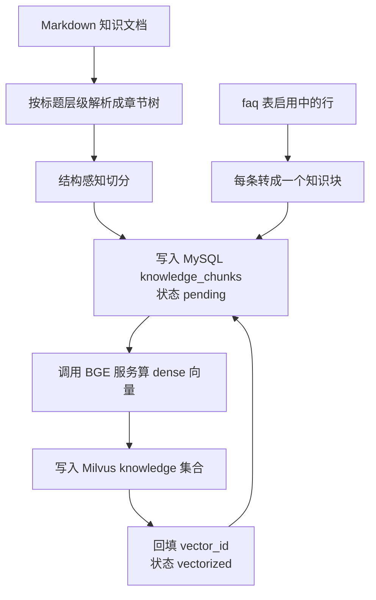

# Aiden RAG

本文说明 Aiden 的 RAG 设计。当前实现了两段离线能力：把既有文档与 FAQ 建成知识库，以及从历史客服对话里挖出问答知识。在线语义检索待补。

## 离线建库

把知识变成可检索的向量。

范围限定在离线这一段。在线语义检索还没有实现，`search_faq` 也没有接入向量召回，仍是关键词匹配。`docs/Aiden.md` 的 RAG 章记录目标设计与选型过程，其中包含尚未实现的规划内容；已实现的离线建库行为以本文为准。

两条离线路径共用同一套知识块表与同一套向量化流程：

| 路径 | 输入 | 入口 |
| --- | --- | --- |
| 离线建库 | Markdown 知识文档、`faq` 表启用中的行 | `backend/scripts/build_knowledge_base.py` |
| 历史对话挖掘 | `conversations`、`messages` 里的历史客服对话 | `backend/scripts/mine_conversation_knowledge.py` |

后者见本文的「历史对话挖掘」一节。

### 整体流程

离线建库把「解析、切分、向量化」拆成两条独立路径，中间用 MySQL 表衔接。



两条路径分开的理由是它们对文本的处理方式不同。Markdown 需要按标题层级还原结构再切分；FAQ 本身就是一问一答，不该再切。但两条路径最后汇合到同一张表、同一套向量化流程，因此只需要一个补齐命令。

代码按职责分三层：

| 层 | 位置 | 职责 |
| --- | --- | --- |
| 切分与知识构建 | `backend/app/services/rag/` | 解析、切分、拼接向量化文本，不接触数据库 |
| MySQL 持久化 | `backend/app/persistence/mysql/knowledge.py` | 知识块读写与向量状态流转 |
| Milvus 集合 | `backend/app/persistence/milvus/knowledge_store.py` | 集合建表、写入、删除 |
| 编排与命令 | `backend/app/services/rag/indexing.py`、`backend/scripts/build_knowledge_base.py` | 按顺序串起上面三层 |

### 知识块

#### 字段与来源

一个知识块不是一段裸正文，而是结构化记录。原文的权威来源是 MySQL，Milvus 只承担相似度检索。这样切分策略调整、换 embedding 模型、换向量维度时都能回到原文重算，不必担心信息在向量化过程中丢失。

| 字段 | 含义 |
| --- | --- |
| chunk_key | 幂等键，由来源、块序号与内容哈希决定 |
| source_type / source_id | 来源类型与稳定标识 |
| source_path / source_title | 文档相对路径与标题 |
| chunk_index | 块在来源内的顺序 |
| category | 分类 |
| questions | 问法列表 |
| answer | 知识正文 |
| embedding_text | 当时实际送去向量化的文本 |
| embedding_fingerprint | 拼接模板版本 |
| section_path | 章节路径 |
| content_type | text、table、code、mixed，或对话挖掘的「对话挖掘问答」 |
| is_key_clause | 是否关键条款 |
| prev_chunk_id / next_chunk_id | 同一来源内相邻块 |
| vector_status / vector_id | 向量同步状态与回填的向量主键 |
| content_hash | 正文哈希，用于识别内容变更 |

来源有三类。Markdown 文档以相对路径标识为 `markdown:<相对路径>`，现有 FAQ 行标识为 `faq:<行 id>`。FAQ 逐条独立成来源，因此改一条 FAQ 只影响它自己那块，不会牵动其他 FAQ 的向量。第三类是历史对话挖掘出的问答，`source_type` 为 `conversation`、`source_id` 形如 `conversation-qa:<问法集合哈希>`，标识方式与理由见「历史对话挖掘」一节。

#### 哪些字段进入向量化

只有 category、questions、answer 三项会拼成向量化文本。章节路径、内容类型、关键条款标记和前后块指针只作为元数据保存，不参与 embedding。元数据掺进向量化文本会稀释语义，让相似度偏向结构而不是内容。

拼接格式由 `app.services.rag.embedding_text` 中的 `build_embedding_text` 单点定义，所有入口都必须走它，避免不同路径拼出不一致的文本：

```python
def build_embedding_text(category, questions, answer):
    """按唯一格式拼接向量化文本。"""
    clean_questions = [q.strip() for q in questions if q and q.strip()]
    lines = [f"分类：{category.strip()}"]
    if clean_questions:
        lines.append(f"问题：{'｜'.join(clean_questions)}")
    lines.append(f"答案：{answer.strip()}")
    return "\n".join(lines)
```

实际产出形如：

```
分类：退货政策
问题：七天无理由退货｜不适用情形
答案：以下商品不适用七天无理由退货：

- 消费者定作的商品。
- 鲜活易腐商品。
```

格式里带固定字段标签，是为了让向量化文本可读、便于人工核对，同时让不同字段的语义在向量空间里保持稳定位置。同一块有多个真实问法时用全角竖线分隔，避免与中文问句里的标点冲突。

#### 问法从哪来

FAQ 块天然带真实问题，直接用它作为 questions，用自己的分类作为 category。

政策或手册块没有天然问法，因此用章节标题充当。这里取的是直接上级标题与本节标题两项，例如「七天无理由退货」加「不适用情形」。这个选择有实测依据：如果只取本节标题，会丢掉「这是哪份政策的哪一条」的限定；如果取完整路径，又和 category 重复。

只取文档标题是错的，这一点在开发中被实测抓到。最初实现让同一份文档里所有块的 questions 完全相同，向量化文本只剩「答案」部分有区别，检索直接退化：

| 指标 | questions 退化时 | 修正后 |
| --- | --- | --- |
| top-1 命中 | 9/14 = 64% | 12/14 = 86% |
| top-3 命中 | 13/14 = 93% | 14/14 = 100% |
| 「七天无理由退货要满足什么条件」 | 第 9 名 | 第 1 名，相似度 0.82 |

这组数据来自 14 条真实问法对 36 个知识块的检索评测。它支持了 `docs/Aiden.md` 里的一段判断：检索质量的瓶颈很少卡在 embedding 参数规模上，更多卡在切分做得好不好。

#### 关键条款

`is_key_clause` 标记退货、退款、换货、售后这类条款，留作后续检索排序的加权信号，当前只做标记、不参与排序。判定方式是看章节路径里是否出现退货、退款、换货、售后、保修、质保、赔付、运费险、发票、退换这些关键词。

### 切分

`app.services.rag.chunking` 中的 `chunk_section` 负责切分。它有三条硬约束。

#### 不切半截句子

所有文本切分都发生在完整句子边界上。句子边界由 `app.services.rag.length` 中的 `split_sentences` 识别：先按硬换行分段，再按中文句末标点切开，最后处理西文句点。西文句点只在小写或数字之后、且后面跟着空白与大写时才当句末，避免切开 `3.14`、`No. 1` 这类写法。

相邻块之间保留重叠，让跨块语义不在句子中间断开。重叠同样只从上一块尾部按完整句子回退取得，总量受 `RAG_OVERLAP_TOKENS` 限制。

#### 超长章节递归下钻

子标题是天然的语义边界。章节超过单块预算时，先递归切子章节；没有更深标题可下钻，或到达 `RAG_MAX_HEADING_DEPTH` 上限，才按段落打包。这样切出来的块天然落在文档已有的结构上，而不是按字数硬切。递归一定会收敛，因为每下钻一层标题深度就加一。

打包时有一个容易忽略的细节：unit 之间最终会用换行拼成一块，而长度计量的结果依赖整段文本，子词边界会随拼接变化。因此累计器不累加各单位自己的 token 数，而是记录拼接后的长度，再统一换算 token，预算判断针对的才是最终要送去向量化的那段文本。

```python
@dataclass
class _ChunkAccumulator:
    """打包过程中的可变状态。"""

    units: list[_SentenceUnit] = field(default_factory=list)
    assembled_length: int = 0
    new_units: int = 0

    def project_length(self, unit):
        """把某个单位并入本块后，拼接文本会变成多长。"""
        if not self.units:
            return len(unit.text)
        return self.assembled_length + 1 + len(unit.text)
```

`new_units` 记录本块新增的单位数，不含从上一块搬来的重叠前缀。只有重叠、没有新增内容的块不输出，否则会在内容本身重复时产出完全一样的块。

#### 异常长句显式标记

单句自身超过生效单句上限时，整句原样保留并标记 `need_manual_review`，写 MySQL 但不进 Milvus，等人工拆分。这样处理的理由是：截断会静默丢内容，而静默丢内容在客服场景里比检索不到更危险。

超过单句上限的句子会独立成块，所以单句上限必须小于单块预算，否则独立成块反而造出超大块。这个不变式由 `app.config.rag` 的 `RagSettings` 保证。

#### 表格按行分块

Markdown 表格单独处理。表头是表格语义的一部分，因此大表格按数据行分块时，每块都会复制表头两行，让单块脱离上下文也能独立理解。

```python
def flush():
    """把当前累计的数据行连同表头输出为一块。"""
    units.append(_SentenceUnit(
        text="\n".join([*header_rows, *current_rows]),
        content_type="table",
        line_count=len(current_rows),
        break_after=True,          # 表格块之间必须硬断开
    ))
```

`break_after` 要求表格块与下一块硬断开，且不保留跨块重叠。否则打包时会把这些各带表头的表格块又合并回去，或让下一块把上一块的表体再抄一遍，造成数据行重复。

单行加表头就超过预算时，整行独立成块并标记 `need_manual_review`，不做静默截断。

### 长度计量

长度一律以模型的 token 为准，由 `app.services.rag.length` 中的 `get_length_meter` 提供，有两种模式。

配置 `EMBEDDING_TOKENIZER_PATH` 指向本地 `tokenizer.json` 时按子词精确计数，长度判断与模型侧一致。这是推荐用法，模型权重下载后 `tokenizer.json` 就在 HuggingFace 缓存目录里。

没有配置时退回按字符估算。中文一个汉字常常对应多个子词，估算会偏乐观，因此配置里预留了 `RAG_MEASUREMENT_UNCERTAINTY_TOKENS` 和 `RAG_SAFETY_MARGIN_TOKENS`，从预算里扣掉，避免真实 token 数越过模型上限。

#### 预算的推导

单块预算不直接等于配置值，而是由三层约束推出，全部在 `app.config.rag` 的 `RagSettings` 里：

```
生效单块上限   = min(RAG_MAX_CHUNK_TOKENS, EMBEDDING_MAX_SEQ_TOKENS)
生效单句上限   = min(RAG_MAX_SENTENCE_TOKENS, 生效单块上限 / 2)
正文预算       = min(生效单块上限 - 计量不确定度 - 安全余量,
                    生效单块上限 - 生效单句上限)
不变式：正文预算 + 生效单句上限 <= 生效单块上限
```

第一层用模型能力作硬上限，是因为切分预算如果按 `RAG_MAX_CHUNK_TOKENS` 单独决定，换用上下文较短的模型后块会超过可编码长度，推理服务只能自行截断，等于静默丢内容。这个 bug 只在换模型时暴露：BGE-M3 支持 8192，而 bge-small-zh-v1.5 只有 512。

以两套配置为例：

| | bge-small-zh-v1.5 | BGE-M3 |
| --- | --- | --- |
| EMBEDDING_MAX_SEQ_TOKENS | 512 | 8192 |
| 生效单块上限 | 512 | 8192 |
| 生效单句上限 | 256 | 2048 |
| 正文预算 | 192 | 6144 |

换成上下文较短的模型时必须同步调小 `EMBEDDING_MAX_SEQ_TOKENS`，否则预算会算错。

### 向量状态与幂等

#### 状态机

`vector_status` 有四个取值：

| 状态 | 含义 | 是否进 Milvus |
| --- | --- | --- |
| pending | 原文已入库，尚未向量化 | 会 |
| vectorized | 向量已写入并回填 vector_id | 已进 |
| need_manual_review | 块或单句超过模型可编码长度 | 不进，等人工拆分 |
| superseded | 该块已失效 | 不进，且旧向量待删 |

#### 建库顺序

顺序是固定的：先把块写入 MySQL 并标为 pending，再写 Milvus，成功后才回填状态。原文是权威源，即使后面全失败，知识也不会丢，重跑可以从这一步之后继续。

`app.services.rag.indexing` 中的 `vectorize_pending` 负责补齐待向量化的块：

```python
pending = knowledge_repo.list_pending_chunks(limit)
...
for start in range(0, len(pending), rag_settings.embedding_batch_size):
    batch = pending[start : start + rag_settings.embedding_batch_size]
    vectors = active_client.embed_documents([item.embedding_text for item in batch])
    written = active_store.upsert(rows)
    # 只有 Milvus 确认写成功后才回填状态
    vectorized += knowledge_repo.mark_chunks_vectorized(written)
```

数据库会话在这个流程里是短生命周期的。读取待处理块、写向量、回填状态各自开一个事务，算向量的过程不持有任何数据库连接。

#### 中断窗口

要重点处理「Milvus 已写成功、MySQL 状态尚未回填」时进程中断的情况，重跑不得产生重复向量。

处理办法是让 MySQL 主键同时充当 Milvus 主键，写入使用 upsert 而不是 insert：

```python
schema.add_field(CHUNK_ID_FIELD, DataType.VARCHAR, is_primary=True, max_length=64)
...
self._client.upsert(collection_name=self._collection, data=batch)
```

这样重跑时读到仍是 pending 的块，重新算向量再写一遍，因为主键相同只覆盖同一条记录，不会新增。这个窗口因此从根上消失，不需要额外的去重逻辑。

需要说明这里与 `docs/Aiden.md` RAG 章的差异。该章写 Milvus 会为记录分配 ID、再由应用回填，实际实现是反过来。理由是：若 vector_id 由 Milvus 生成，中断时应用既不知道上次写入的向量 ID，也无法删除它，重跑只能重复插入。

#### 幂等键

`app.services.rag.indexing` 中的 `_chunk_key` 生成幂等键：

```python
def _chunk_key(source_id, chunk_index, content_digest):
    """生成块的稳定幂等键。

    键包含内容哈希：内容变化会产生新键，旧键在导入时被置为 superseded。
    """
    return sha256(f"{source_id}\n{chunk_index}\n{content_digest}".encode("utf-8")).hexdigest()
```

键包含内容哈希而不是只用来源加序号，是为了避免「旧行的 embedding_text 与新内容不一致」这种静默错误。同一序号的内容变化会产生新键，旧行被作废，不会出现原地错配。

`upsert_source_chunks` 以这个键做幂等 upsert。内容哈希与模板指纹都没变的块保持原状态，不会被重新向量化；变化过的块重置为 pending 并清空 vector_id。

#### 判定作废

内容更新或块数量减少时，本次没生成的旧块要作废，并从 Milvus 删除对应向量。判定方式是主键差集，在写入结束后对比本次生成的 chunk_key 集合：

```python
current_keys = set(deduped)
stale_ids = [c.id for key, c in existing.items() if key not in current_keys]
if stale_ids:
    session.execute(
        update(KnowledgeChunk)
        .where(KnowledgeChunk.id.in_(stale_ids))
        .values(vector_status=VECTOR_STATUS_SUPERSEDED, vector_id=None)
    )
```

这里不能用 `created_at` 与本次运行时间比较。`created_at` 只在首次插入时写入，不随更新刷新，拿它比较会把所有早于本次运行的行都误判为旧块，导致已向量化的块每次重导入都被打回待向量化，反复重新算向量。这个缺陷在开发中被实测抓到并修正，判定改成与时间无关的主键差集后，重跑结果稳定。

#### 一个运维注意点

`cleanup_superseded_vectors` 是从 MySQL 的 superseded 记录推导待删 id 的。如果整库被重建或整表被清空，这些记录不再存在，Milvus 里的旧向量就成了孤儿，清理函数看不到它们。此时只能换 `MILVUS_KNOWLEDGE_COLLECTION` 集合名，或手动删除该集合重建。这是「MySQL 是权威源」的代价。

### 向量服务

#### 为什么需要它

BGE-M3 本身只是模型权重，不会响应 HTTP 请求。应用侧按 OpenAI 兼容协议访问 `{EMBEDDING_BASE_URL}/embeddings`，因此需要把权重包成一个小服务，让私有化部署也能用同一套客户端代码。

#### 准备与启动

本项目按 CPU 推理部署，不需要显卡，也不需要安装 CUDA。环境准备由 `backend/scripts/setup_embedding_server.ps1` 完成，它建一个独立虚拟环境，把 torch 与推理依赖装在里面，与后端 `requirements.txt` 隔离。脚本默认装 CPU 版 torch，约 0.3 GB；默认使用 HuggingFace 镜像下载权重。整个准备过程只需执行一次。

    # 准备环境（CPU 版，约 0.3 GB）
    .\backend\scripts\setup_embedding_server.ps1

服务由 `backend/scripts/embedding_server.py` 提供，只监听 127.0.0.1：

    cd backend
    # 小模型，用于链路验证
    D:\bge-m3-env\Scripts\python.exe scripts\embedding_server.py --model BAAI/bge-small-zh-v1.5
    # 真实 BGE-M3
    D:\bge-m3-env\Scripts\python.exe scripts\embedding_server.py --model BAAI/bge-m3

三点使用注意。

服务是前台进程，需要单独开一个终端并保持开启；重启电脑后要重新启动，它没有装成 Windows 服务。首次启动会自动下载模型权重，bge-small-zh-v1.5 约 0.2 GB，bge-m3 约 2.3 GB，之后从本地缓存读取。

不要传 `--fp16`。该参数只在 GPU 上有效，CPU 推理时 FlagEmbedding 会强制使用 float32，传了也不会生效。

`--device` 默认是自动选择，本机没有可用的 CUDA 时会落到 CPU，无需显式指定。

CPU 推理速度完全够用。模型加载约 5 秒，单条文本编码在几十毫秒量级；知识库只有几十到几百块时，整库向量化几秒内完成，单次查询的编码开销相对模型调用可以忽略。若日后知识库规模大幅增长或需要频繁重建，再考虑换 GPU，届时执行 `setup_embedding_server.ps1 -Gpu` 装 CUDA 版 torch 并给服务加 `--fp16` 即可。

启动成功的标志是在终端看到服务开始监听，可用 `/health` 确认：

    Invoke-RestMethod http://127.0.0.1:8001/health

返回的 `dimension` 在第一次编码之后才会有值，刚启动时为 null，这是正常的。

`backend/scripts/verify_embedding_service.ps1` 做一键探测，并把实际返回的向量维度回写到 `backend/.env`。

#### 接口

服务暴露 OpenAI 兼容的三个端点：

    GET  /health          返回服务状态、模型名与已探测到的维度
    GET  /v1/models       返回模型列表
    POST /v1/embeddings   返回 dense 向量

请求与响应形如：

```json
// 请求
{"model": "BAAI/bge-m3", "input": ["文本一", "文本二"]}

// 响应
{"object": "list", "data": [{"object": "embedding", "index": 0, "embedding": [0.013, -0.021]}]}
```

`data[].index` 与请求顺序对应，应用侧依赖该字段排序。

#### 维度校验

应用侧由 `app.services.rag.embedding` 中的 `EmbeddingClient` 调用。它以配置中的 `EMBEDDING_DIMENSION` 为准，与实际返回值比对，不一致直接报错：

```python
if len(vector) != self._expected_dimension:
    raise DimensionMismatchError(
        f"向量维度与配置不一致：期望 {self._expected_dimension}，实际 {len(vector)}。"
        "请先确认 EMBEDDING_MODEL 与 EMBEDDING_DIMENSION，再重建 Milvus 集合。"
    )
```

早失败比晚失败便宜得多：Milvus 集合一旦按错误维度建好，后续写入会持续失败，而且难以定位。集合创建时也会校验维度，与已存在集合不一致时直接报错。

服务侧对向量统一做 L2 归一化，配合 Milvus 的 COSINE 距离使用。归一化后余弦相似度等价于内积，不同模型的向量尺度差异也不会影响检索排序。

#### 换模型要动哪几个值

CPU 推理下换模型只改配置，服务启动命令不需要额外参数：

    EMBEDDING_MODEL=BAAI/bge-m3
    EMBEDDING_DIMENSION=1024
    EMBEDDING_MAX_SEQ_TOKENS=8192
    EMBEDDING_TOKENIZER_PATH=<bge-m3 的 tokenizer.json>

改完重新执行导入与向量化即可。因为幂等键与向量主键都不变，换模型不会产生重复向量，旧向量会被覆盖。

注意 Milvus 集合的维度在创建时固定，沿用旧集合会直接报错。想并存两个模型对比，用不同的集合名区分，例如 `MILVUS_KNOWLEDGE_COLLECTION=knowledge_bge_m3`。

从 0.2 GB 的 bge-small-zh-v1.5 换到 2.3 GB 的 BGE-M3 时，CPU 推理的内存占用和单条耗时都会明显上升，首次整库向量化的时间也会变长，但几十到几百块知识库仍在可接受范围内。

### Milvus 集合

集合名由 `MILVUS_KNOWLEDGE_COLLECTION` 指定，默认 `knowledge`。结构由 `app.persistence.milvus.knowledge_store` 中的 `KnowledgeVectorStore.ensure_collection` 创建：

| 字段 | 类型 | 说明 |
| --- | --- | --- |
| chunk_id | VARCHAR(64) | 主键，等于 MySQL 块主键 |
| embedding | FLOAT_VECTOR | 维度由实际模型输出决定 |
| source_type | VARCHAR(32) | 来源类型 |
| source_id | VARCHAR(256) | 来源标识 |
| source_path | VARCHAR(1024) | 文档相对路径 |
| category | VARCHAR(512) | 分类 |
| section_path | VARCHAR(1024) | 章节路径 |
| content_type | VARCHAR(32) | 内容类型 |
| is_key_clause | BOOL | 关键条款标记 |
| chunk_index | INT32 | 块序号 |
| content | VARCHAR(65535) | 正文，便于检索直接取回候选 |
| metadata | JSON | 问法列表、前后块 id、模板指纹 |

索引使用 HNSW，度量用 COSINE。规模不大时 HNSW 的查询延迟比 IVF 更低，这与 `docs/Aiden.md` 的选型一致。

标量字段的作用是后续在线检索时做过滤与加权，例如按分类或来源过滤、给关键条款加权。正文随向量一起存放，检索命中后可以直接取回，MySQL 仍是权威原文。

`get_collection_stats` 返回的 `row_count` 统计的是物理存储版本数，upsert 覆盖后旧版本仍在，直到后台压缩完成才收敛。判断集合里有没有重复向量必须按主键去重计数，不能用这个值。

### 命令

命令都在 `backend` 目录下执行，连接与凭据来自 `backend/.env`。

    # 导入 Markdown 目录，缺省用 RAG_KNOWLEDGE_DIR（即 backend/knowledge）
    .\.venv\Scripts\python.exe -m scripts.build_knowledge_base import-markdown
    # 导入启用中的 faq 行
    .\.venv\Scripts\python.exe -m scripts.build_knowledge_base import-faq
    # 扫描待向量化块并补齐；退出码 1 表示仍有遗留
    .\.venv\Scripts\python.exe -m scripts.build_knowledge_base vectorize
    # 只看还有多少待处理，不写数据
    .\.venv\Scripts\python.exe -m scripts.build_knowledge_base scan-pending
    # 删除已作废块的旧向量
    .\.venv\Scripts\python.exe -m scripts.build_knowledge_base cleanup-vectors
    # 各状态的块数与当前配置
    .\.venv\Scripts\python.exe -m scripts.build_knowledge_base stats
    # 分页查看已入库知识块，用于人工核对切分结果
    .\.venv\Scripts\python.exe -m scripts.build_knowledge_base chunks --limit 5

退出码约定：0 成功，1 还有遗留待向量化块，2 出错。所有命令都可以重复执行。

### 配置

全部从进程环境读取，示例见 `backend/.env.example`，真实凭据不要提交。

#### 向量服务配置

| 变量 | 说明 |
| --- | --- |
| EMBEDDING_BASE_URL | 服务地址，末尾带 /v1 |
| EMBEDDING_API_KEY | 服务未开鉴权时留空 |
| EMBEDDING_MODEL | 模型名 |
| EMBEDDING_DIMENSION | 期望维度，与返回值校验 |
| EMBEDDING_MAX_SEQ_TOKENS | 模型可编码长度，决定切分预算上限 |
| EMBEDDING_TOKENIZER_PATH | 本地 tokenizer.json，用于精确计量 |
| EMBEDDING_BATCH_SIZE | 单次请求条数，只影响吞吐 |
| HF_HOME / HF_ENDPOINT | 由 huggingface_hub 读取，模型缓存位置与下载源 |

#### Milvus 配置

| 变量 | 说明 |
| --- | --- |
| MILVUS_URI | 服务地址 |
| MILVUS_TOKEN | 未开鉴权时留空 |
| MILVUS_KNOWLEDGE_COLLECTION | 集合名 |
| MILVUS_INSERT_BATCH_SIZE | 单次写入条数 |

#### 切分配置

| 变量 | 默认值 | 说明 |
| --- | --- | --- |
| RAG_KNOWLEDGE_DIR | knowledge | 默认知识目录，相对 backend 解析 |
| RAG_MAX_CHUNK_TOKENS | 8192 | 单块上限，与模型长度取较小值 |
| RAG_MAX_SENTENCE_TOKENS | 2048 | 单句上限，不超过单块上限的一半 |
| RAG_OVERLAP_TOKENS | 80 | 相邻块重叠 |
| RAG_MEASUREMENT_UNCERTAINTY_TOKENS | 256 | 长度计量的不确定度 |
| RAG_SAFETY_MARGIN_TOKENS | 64 | 安全余量 |
| RAG_MAX_HEADING_DEPTH | 6 | 标题递归下钻最大层数 |
| RAG_TABLE_ROWS_PER_CHUNK | 20 | 表格每块数据行数 |
| RAG_ESTIMATOR_CHARS_PER_TOKEN | 1.1 | 字符估算比例 |
| RAG_REQUIRE_EXACT_TOKENIZER | false | 为真时缺少精确分词器直接报错 |

### 知识文档怎么写

切分依赖 Markdown 结构，因此知识文档的组织方式直接决定检索质量。

用规范的 `#`、`##`、`###` 标题组织章节。章节标题会作为该块没有天然问题时的问法，上级标题会成为分类，因此标题要写得像用户会问的说法，而不是内部编号。

一个章节讲一件事。章节过长会触发递归下钻；如果连子标题都没有，就只能按段落硬切，切出来的块语义完整性会变差。

表格用标准 Markdown 表格语法，包含表头和分隔行，这样才被识别为表格并按行分块。表格前加一句说明它的用途，有助于这块被正确检索到。

不要把关键信息只放在图片里。当前只处理文本、表格和代码块，图片内容不进知识库。

### 已验证的范围

用 `bge-small-zh-v1.5`（512 维）与真实 Milvus 验证过的内容：

- 切分：36 个知识块的每块不超预算、每行都来自原文、表格分块复制表头且数据行不丢失不重复、异常长句整句保留并标记待人工处理
- 长度计量：精确分词模式下在 512 与 8192 两套配置下均通过
- 迁移：`alembic upgrade head` 建出 knowledge_chunks 表，字段与唯一索引齐全
- 幂等：内容未变时重导入零新增、零作废、不重置状态，重跑向量化是空操作
- 中断补齐：模拟回填前中断后重跑，Milvus 唯一主键数等于块总数，无重复向量
- 一致性：MySQL 已回填的 vector_id 与 Milvus 主键集合完全相同，无孤儿向量
- Milvus：集合按 HNSW 与 COSINE 建索引，同名主键连续 upsert 两次后记录数仍为 1
- 检索：14 条真实问法的离线评测，top-1 命中 86%，top-3 命中 100%

尚未验证的部分：真实 BGE-M3（1024 维）尚未跑过，当前使用的是 bge-small-zh-v1.5。离线建库也尚未接入任何 Agent 工具，`search_faq` 仍走关键词匹配。

## 历史对话挖掘

从历史客服对话里挖出可复用的商品或服务知识。与上一节的差别在于知识不是人写好的，而是从对话里抽出来的，因此多了三道必须处理的关卡：只从可信对话里抽、抽取前后都要去掉个人信息、以及候选必须整体去重之后才能入库。

范围同样限定在离线。挖掘出的知识进入同一张 `knowledge_chunks` 表、走同一套向量化流程，`search_faq` 与在线检索不受影响。

### 整体流程


流程被刻意切成「抽取」与「去重入库」两段，中间以「本轮所有批次是否都抽完」为闸门。只要还有批次没抽完（达到批次上限或抽取失败），去重就整体推迟到下一次运行。理由是重复问法会跨批次出现，只在单个模型批次内部去重必然漏掉。

代码分层：

| 层 | 位置 | 职责 |
| --- | --- | --- |
| 脱敏与校验 | `backend/app/services/rag/sanitization.py`、`extraction.py` | 擦除个人与交易标识、调模型、按结构逐条校验 |
| 编排 | `backend/app/services/rag/conversation_mining.py` | 分批、抽取、整体去重、入库 |
| MySQL 持久化 | `backend/app/persistence/mysql/conversation_mining.py` | 消息读取、批次进度、候选暂存 |
| 运行控制 | `backend/app/services/rag/runtime_control.py` | 实例锁与停止信号 |
| 定时入口 | `backend/scripts/mine_conversation_knowledge.py` | 手动跑一次、按周期常驻、查看进度 |

### 消息读取与分批

#### 什么算可信问答

只读 `messages.status = 'complete'` 的消息。`streaming` 还在生成、`error` 与 `stopped` 都不是可信答案，把它们当依据会把半截回答变成「知识」。`system` 消息也不参与。

轮次的构成规则是：一条用户消息（或**连续**多条用户消息合并成一个提问）加上紧邻其后的一条可信答案消息（`assistant` 或 `staff`）算一轮。合并连续用户消息是必要的，否则「我要退货」和「尺码不对」会被当成两个独立问题，而答案只有一个。末尾没等到答案的用户消息被丢弃，等下一轮运行有新答案时再处理。

#### 分批不切开一轮问答

两个上限同时生效：单批最多 `MINING_MAX_TURNS_PER_BATCH` 轮、送进模型的对话文本最多 `MINING_MAX_BATCH_CHARS` 字符。装箱只发生在轮次边界上，因此一轮问答不会跨批，否则答案与问题分离，抽出来的知识必然残缺。

单轮自身就超过字符上限时，它独占一个批次，抽取阶段把它标记为 `skipped` 并记录原因。既不与别的轮次合并（合并会让整批超限），也不切分它（切分违反上一条约束）。

#### 增量读取靠续跑锚点

每个会话从「已处置批次的最后消息时间」之后继续读，已处理过的消息不会再次读取。这里的「已处置」只包括 `promoted` 与 `skipped`：

- 不包括 `superseded`：它表示窗口被显式作废，若拿它推进锚点，那段消息就再也读不到；
- 不包括 `failed`：那是「下次要重试」。

一次任务的读取量由上界控制（会话数、批次数），达到上限就停下，剩余消息留给下一次运行。

### 脱敏

个人与交易标识在**调用模型之前**就擦除，不依赖模型自觉。理由是这些信息一旦进入模型输出、暂存表或正式知识，就等于把用户隐私写进了可被检索的知识库，事后清理的代价远高于提前擦除。

处理方式是纯文本的确定性替换，用固定占位符而不是随机串：

| 类别 | 占位符 | 识别要点 |
| --- | --- | --- |
| 证件号 | `[证件号]` | 18 位与 15 位两代身份证格式 |
| 邮箱 | `[邮箱]` | 常规邮箱形态 |
| 订单号 | `[订单号]` | 需带「订单号」「订单编号」等上下文标签，编号本体至少 6 位 |
| 运单号 | `[运单号]` | 需带「运单号」「快递单号」等上下文标签 |
| 手机号 | `[手机号]` | 允许 `+86`、空格与连字符分隔；前后不允许紧邻字母数字，避免误吃长数字串 |
| 地址 | `[地址]` | 需命中行政区划或门牌号，单独一个市名不算 |

替换用固定占位符是为了让同一段对话每次都得到同一份文本，批次签名与候选指纹才稳定，重复运行不会因为脱敏结果抖动而产生新知识。

裸编号不匹配：纯数字形态无法与商品编号、金额、时间戳区分，误伤面太大。代价是「订单 202405160001」这种没有标签的写法不会被擦除，而真实对话里订单号几乎总带着标签或 `#`。

### 抽取与校验

#### 抽取的目标不是摘要

提示词里明确禁止把某个用户的订单状态、物流轨迹、个人承诺或含糊的助手回答提炼成通用政策。这类内容一旦入库，会在别的用户提问时被当成公司政策检索出来，比缺失更有害。

模型按固定结构输出，每条包含 question、answer、category、evidence、confidence。调用走 OpenAI 兼容的 `/v1/chat/completions`，凭据默认复用在线 Agent 的 `OPENAI_*`，也可用 `MINING_LLM_*` 单独指定，让离线批量抽取与在线客服回答使用不同的模型或网关。

#### 逐条校验与拒绝原因

模型输出必须通过结构校验，任何一条不满足的候选都会带上拒绝原因写入暂存表，而不是静默丢弃。

| 拒绝原因 | 触发条件 |
| --- | --- |
| 缺少必填字段 | question、answer 或 evidence 为空 |
| 问题或答案超出长度上限 | 超过 `MINING_MAX_QUESTION_CHARS` 或 `MINING_MAX_ANSWER_CHARS` |
| 答案过短，不构成可复用知识 | 答案短于 8 个字符 |
| 答案本身仍是提问 | 答案以问号结尾 |
| 模型给出的置信度过低 | confidence 低于 0.5 |
| 问法/答案依赖个人或交易标识 | 脱敏后仍带占位符 |
| 答案含糊，未给出确定结论 | 命中「不确定」「视情况而定」等表述 |
| 答案自相矛盾 | 同时给出互斥结论 |
| 答案在对话中没有明确依据 | evidence 与原文的字符 n-gram 覆盖率低于 0.6 |
| 缺少可用的分类 | category 为空 |
| 同一问法存在相互冲突的答案 | 见下一节 |
| 与已入库知识重复，未重复生成 | 见下一节 |

含占位符就等于「这段话只在某个用户的具体情境下成立」。「您的包裹已到 [地址]」这类候选描述的是订单播报，把占位符当通用政策写进知识库，检索会返回残缺内容。

依据校验用字符 n-gram 覆盖率而不是严格子串匹配：模型常会轻微改写或补全标点，严格匹配会误杀真实依据；而覆盖率过低基本可以确认是凭常识补出来的内容。短依据（不超过 12 字）用子串匹配，避免 n-gram 样本不足导致比例失真。

结构校验失败不重试。重试同一个提示词通常得到同样的越界输出，重试只对网络与响应解析错误有意义，这类错误会把批次标为 `failed` 并保留原因，下次运行重新认领继续。

### 整体去重

去重跑在**本轮全部候选**上（跨对话、跨批次），同时读入已有 `knowledge_chunks`。判定顺序是：

1. 同一问法在本轮出现多个**不互为同义**的答案 → 冲突，全部留待人工确认，不入库；
2. 该问法与已有正式知识相同或同义：候选答案与已有答案等价 → 判为已入库，不重复生成正式知识与向量；不等价 → 冲突，留待人工确认，不自动改写已有知识；
3. 其余候选先按「问法 + 答案」分组，再把**语义等价的问法**合并成一条知识，questions 保留全部真实问法。

#### 同义问法与同义答案

只用文本比较无法合并「保修期是多久」与「质保多长时间」这类同义问法，同一条知识会被拆成多个块。因此归一化后仍不同的问法再用向量余弦相似度判定，复用第一阶段同一个 `EmbeddingClient`（BGE-M3），不新建向量客户端。

| 阈值 | 默认值 | 说明 |
| --- | --- | --- |
| `MINING_QUESTION_SIMILARITY` | 0.88 | 同义改写通常在 0.90 以上，话题相近但问题不同多在 0.75 到 0.88，取 0.88 以免把不同问题并成一条 |
| `MINING_ANSWER_SIMILARITY` | 0.95 | 比问法阈值更严：答案差一点就是不同结论，不能并成一条 |

换用其它向量模型时必须重新标定这两个值。向量服务不可用时默认不中止（`MINING_REQUIRE_EMBEDDING_FOR_DEDUPE=false`），退化为「只有归一化问法完全相同才合并」并在运行结果里记录降级原因；置为 `true` 则直接报错，避免在依赖不可用时产生一批没有合并过的知识。

合并问法时**答案也必须语义等价**。两条知识的问法同义但答案不同（例如「退款多久到账」分别答 15 个工作日和 7 个工作日）描述的是不同结论，合并会丢掉其中一个结论，还会给同一条知识挂上互相矛盾的两个问法。这种情况保持两条独立知识。

合并按顺序进行且不设传递闭包：相似度是近似的，传递合并可能把「A 像 B、B 像 C、但 A 不像 C」的问法串成一条，导致检索语义漂移。

#### 入库如何保持幂等

来源标识按**规范化问法集合**生成（`conversation-qa:<问法集合哈希>`），不是按会话或批次。理由是 `upsert_source_chunks` 的作废判定是「同一来源内本次未生成的块」：来源随问法集合走，同一组真实问法在每次运行中都映射到同一个来源，重复运行才不会把已经向量化的块置为 superseded。

`chunk_index` 恒为 0，每个来源就是一条问答知识。chunk_key 复用第一阶段的规则（来源 + 序号 + 内容哈希），只是内容哈希覆盖答案与全部问法——问法集合变了就应该是一条新知识，而不是静默沿用旧的 embedding_text。

因此重复运行只会更新同一行：已抽取的窗口不会再次调模型，已入库的知识不会产生新块，Milvus 侧是 upsert 覆盖同一条向量。

### 状态与续跑

#### 批次状态

| 状态 | 含义 | 是否推进续跑锚点 |
| --- | --- | --- |
| pending | 窗口已确定，尚未调用模型 | 否 |
| extracting | 已被某次运行认领，正在调模型 | 否 |
| extracted | 抽取完成、候选已写入暂存表 | 否 |
| ready | 本运行全部批次已抽取完成，可以整体去重 | 否 |
| promoted | 本批次参与的去重与入库已完成 | 是 |
| skipped | 已处置但没产生知识（候选全是重复或冲突、单轮超长、窗口内无完整轮次） | 是 |
| failed | 调用模型或校验失败，保留错误信息，可重跑 | 否 |
| superseded | 预留状态，当前没有代码路径产生 | 否 |

`skipped` 与 `failed` 的区别是语义：`failed` 表示这次没成功、下次要重试；`skipped` 表示重复执行也不会有不同结果，因此计入已处理窗口并让锚点前进，避免每次运行都重复抽取同一段历史。

候选状态有三值：`staged` 抽取后待去重处理，`promoted` 已作为正式知识写入 knowledge_chunks（并回填 `promoted_chunk_id`，可从知识反查来源），`rejected` 不入库、`rejection_reason` 说明原因。被拒候选择保留在暂存表而不是删除，便于后续人工复核与调整提示词。

#### 续跑

不带参数重跑同一命令即可。入口启动时默认先把上次被强杀留下的 `extracting` 批次放回 `pending`，再用批次签名与候选键跳过已完成的工作，因此不会重复抽取、不会重复生成知识或向量。`--no-reset-stale` 可关闭这一行为。

#### 并发安全

两道机制配合：

```python
select(ConversationMiningBatch)
    .where(ConversationMiningBatch.status.in_((PENDING, FAILED)))
    .order_by(ConversationMiningBatch.first_message_at.asc())
    .limit(limit)
    .with_for_update(skip_locked=True)      # 行锁 + 跳过被锁行
# 同一事务内立即置为 extracting 并写入 claimed_by
```

`FOR UPDATE` 保证同一批次只会被一个运行拿到，`SKIP LOCKED` 让其他运行直接跳过被锁行而不是排队等待。批次签名与候选键的唯一约束在数据库层兜底：并发运行可能同时算出同一个窗口，先提交者胜出，后者跳过。

进程级还有一把非阻塞文件锁，把同时启动的第二个任务实例直接挡在门外。锁绑定在打开的文件句柄上，进程无论正常退出还是被强杀，操作系统都会释放句柄，不需要人工清理锁文件。

数据库会话不跨模型调用持有：读消息、写候选、写状态各自是短事务，调模型期间没有任何打开的连接。

### 命令

都在 `backend` 目录下执行，连接与凭据来自 `backend/.env`。

    # 手动运行一次：抽取 -> 暂存 -> 整体去重 -> 入库 -> 补向量
    .\.venv\Scripts\python.exe -m scripts.mine_conversation_knowledge
    # 只抽取并写入暂存表，不做整体去重与入库
    .\.venv\Scripts\python.exe -m scripts.mine_conversation_knowledge --staging-only
    # 按周期常驻运行；周期也可用 MINING_INTERVAL_SECONDS 配置
    .\.venv\Scripts\python.exe -m scripts.mine_conversation_knowledge --interval 3600
    # 查看批次与候选状态统计，不写数据
    .\.venv\Scripts\python.exe -m scripts.mine_conversation_knowledge stats
    # 列出留待处理或已拒绝的候选及原因
    .\.venv\Scripts\python.exe -m scripts.mine_conversation_knowledge list-candidates --status rejected

退出码约定：0 本轮工作完整结束，1 还有遗留（批次上限、抽取失败或存在待处理候选），2 配置或外部服务出错，3 已有实例在运行，130 收到中断。

这是独立的离线任务，**不绑定 FastAPI**：不在应用导入阶段启动任何线程或循环，也不由 HTTP 请求触发。定时执行由入口自己的「跑一轮、按周期等待、再跑一轮」循环完成，因此 API 进程重启与在线流量都不影响抽取节奏。按 `Ctrl+C` 时当前批次会跑完并把状态写回数据库。

### 配置

| 变量 | 默认值 | 说明 |
| --- | --- | --- |
| MINING_LLM_API_KEY / BASE_URL / MODEL | 回落到 OPENAI_* | 抽取模型，可让离线抽取与在线回答用不同模型 |
| MINING_LLM_TIMEOUT | 180 | 单次请求超时（秒） |
| MINING_LLM_TEMPERATURE | 0.0 | 抽取是照抄已有依据，不需要发散 |
| MINING_LLM_MAX_TOKENS | 2048 | 输出上限 |
| MINING_LLM_USE_JSON_MODE | true | 服务不支持 response_format=json_object 时置 false |
| MINING_MAX_TURNS_PER_BATCH | 8 | 单批最多完整问答轮次 |
| MINING_MAX_BATCH_CHARS | 6000 | 单批对话文本字符上限 |
| MINING_MAX_CONVERSATIONS_PER_RUN | 20 | 单次运行最多检查多少会话 |
| MINING_MAX_BATCHES_PER_RUN | 40 | 单次运行最多抽取多少批次 |
| MINING_MAX_QUESTION_CHARS | 200 | 单条候选问法长度上限 |
| MINING_MAX_ANSWER_CHARS | 800 | 单条候选答案长度上限 |
| MINING_INTERVAL_SECONDS | 21600 | 定时周期（秒） |
| MINING_VECTORIZE_AFTER_PROMOTE | true | 入库后是否顺势补齐向量 |
| MINING_QUESTION_SIMILARITY | 0.88 | 问法同义判定阈值 |
| MINING_ANSWER_SIMILARITY | 0.95 | 答案同义判定阈值 |
| MINING_MAX_SEMANTIC_QUESTIONS | 500 | 一次去重最多为多少条问法算向量 |
| MINING_REQUIRE_EMBEDDING_FOR_DEDUPE | false | 向量服务不可用时是否中止入库 |

### 数据库表

新增两张表，由迁移 `0005_conversation_mining` 创建；该迁移同时把 `knowledge_chunks.content_type` 由 VARCHAR(16) 加宽到 VARCHAR(64)，因为内容类型标为可读的「对话挖掘问答」（24 字节装不下）。字段与索引的完整说明见 [`数据层.md`](数据层.md)。

| 表 | 用途 |
| --- | --- |
| conversation_mining_batches | 抽取窗口与进度：批次签名、窗口消息、轮次数、状态、错误信息 |
| conversation_qa_candidates | 问答候选暂存：真实问法、答案、分类、来源消息标识、依据、置信度、状态与拒绝原因 |

`batch_signature` 对「会话 id + 窗口内消息 id 与发送角色序列」取哈希，因此窗口的内容与边界完全决定签名：重跑同一窗口命中唯一键而跳过，边界变化则天然生成新批次，不需要额外的「改过没有」标记。

### 已验证的范围

用 stub 的 OpenAI 兼容对话与向量端点（真实 LLM 密钥与 BGE-M3 服务在本机未配置）验证：

- 去重规则：13 项判定全部通过，覆盖同问法同答案合并、同问法不同答案冲突不入库、语义等价答案合并、已有知识同答案判重复、同义问法 + 同答案判重复、同义问法 + 不同答案冲突、同义问法合并且保留两种问法、同义问法但答案不同不合并、向量不可用时降级并给出提示
- 端到端：10 个批次抽取 → 5 条候选经整体去重合并成 3 条知识（questions 分别保留 2、1、2 个真实问法），4 条候选按 4 种原因留待处理
- 幂等：第二次运行新建批次 0、抽取 0、入库 0，LLM 调用次数不增加
- 续跑：把已入库批次改回 `pending` 后重跑，判为重复，不产生新知识与新向量
- 并发：持锁时启动第二个实例被拒绝（退出码 3）
- 迁移：`alembic upgrade head` 建出两张表，`content_type` 为 varchar(64)，检查约束与索引齐全

尚未验证：真实 LLM 的抽取质量与真实 BGE-M3 的语义阈值标定（`MINING_QUESTION_SIMILARITY` 与 `MINING_ANSWER_SIMILARITY` 需要接入真实模型后重新标定），以及真实 Milvus 写入。
