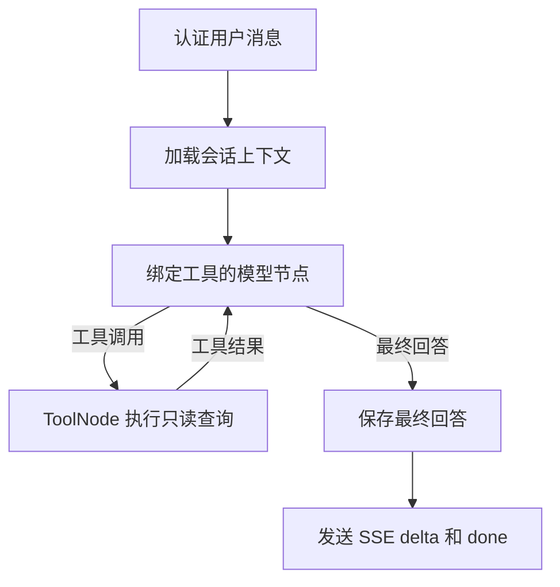

# 客服 Agent 只读工具

本文说明第一版接入的订单、物流和 FAQ 查询工具。工具实现位于 [`backend/app/services/tools/customer.py`](../backend/app/services/tools/customer.py)，ORM 查询位于 [`backend/app/persistence/mysql/queries.py`](../backend/app/persistence/mysql/queries.py)。数据库表结构和本地准备方法见 [`database-schema.md`](database-schema.md)，演示数据问题见 [`测试回答.md`](测试回答.md)。

## 工具一览

| 工具 | 模型可传参数 | 查询范围 | 空结果 |
| --- | --- | --- | --- |
| `query_order` | `order_no` 可选 | 当前登录用户的订单及商品快照；省略订单号时按下单时间倒序最多返回 5 笔 | 返回 `found: false`、空 `orders` 列表及说明 |
| `query_logistics` | `order_no` 必填 | 当前登录用户指定订单的包裹、承运信息和物流节点 | 不存在或不属于当前用户的订单返回 `found: false`；有订单但无包裹时返回 `found: true` 和空 `shipments` 列表 |
| `search_faq` | `question` 必填 | 启用中的 FAQ，最多返回 5 条匹配的问题、答案和分类 | 返回空 `results` 列表及说明 |

订单结果只含订单号、状态、总金额、币种、下单时间和商品名称、规格名称、数量、成交价。物流结果只含包裹号、承运商、运单号、状态、发货/签收时间和节点状态、说明、地点、发生时间。工具不返回地址、手机号或数据库主键。

MySQL `DATETIME` 按 UTC 约定写入；工具把返回时间标为 ISO 8601 UTC（末尾 `Z`）。金额以十进制字符串返回，避免 JSON 浮点数改变金额精度。

## LangGraph 调用流程

`ChatOpenAI.bind_tools` 将工具定义提供给模型；`ToolNode` 执行模型提出的调用，并把 `ToolMessage` 交回模型，直到模型生成不再包含工具调用的回答。工具调用轮不保存为助手回答，只有最终回答会写入原有助手消息记录。

## 身份、查询和错误约束

- HTTP 路由通过 `current_actor` 验证登录 Cookie，再把服务端得到的 `actor.id` 写入 LangGraph 状态。订单与物流工具使用 `InjectedState("user_id")` 读取该值；OpenAI 工具参数 Schema 不包含 `user_id`，模型不能指定查询身份。
- `query_order` 的 SQL 同时匹配 `Order.user_id` 和可选的精确订单号。最近订单查询也必须有 `user_id` 条件。
- `query_logistics` 先以 `user_id` 和订单号找到用户拥有的订单，再通过订单关系加载包裹与轨迹。不同用户的订单号与不存在的订单号得到相同的空结果。
- FAQ 是商城公共内容，不按用户隔离；查询只包含 `FAQ.is_active = true` 的记录。
- 所有查询使用 SQLAlchemy 表达式和绑定参数。FAQ 使用有界的中英文关键词及带自动转义的 `LIKE` 匹配；当前表没有全文索引，因此这不是语义检索。
- 每个工具在短时间内创建并关闭自己的 SQLAlchemy Session。模型调用期间不持有同步数据库连接。
- 数据库查询异常由工具转成通用错误结果；未预期的工具节点异常由 SSE 路由转换为通用错误事件。错误响应不包含堆栈、SQL、连接信息或数据库异常内容。

## 回答边界与 SSE

系统提示要求订单、物流和 FAQ 答案必须依据工具结果。工具返回空列表时，模型应说明没有匹配记录；查询报错时应说明暂时无法查询。退款/售后申请、政策表和工单目前没有单独查询工具；只有 FAQ 返回的内容可以作为常见问题依据，不能从未查询的数据表或模型记忆补出具体状态或政策。

消息流仍使用原有 `start`、`delta`、`done`、`error` 事件及其 JSON 字段。路由只收集 `langgraph_node == "generate"` 的模型片段，并暂存到该节点结束；确认该轮没有工具调用后才发送 `delta`。因此工具调用计划不会显示给用户；最终模型轮的片段会在该轮生成完成后发送，客户端仍按原方式拼接文本。
