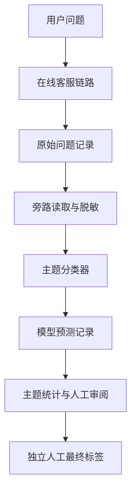

# 旁路主题分类器：从原理到实现

这份文档面向准备实现文本分类器的开发者。以 Aiden 的电商客服问题为例，解释如何定义标签、整理数据、训练多标签模型、评估效果，并把分类结果安全地保存到业务系统。

**学习目标：给定一句用户问题，输出主题标签、各主题分数和分类状态，而不是生成客服答案。** 先跑通规则分类，再根据数据和效果决定是否训练编码器；没有人工测试集时，不把演示结果当成业务质量证明。

本文区分两种内容：

- **通用方法**：换成其他领域也能复用的分类器设计思路。
- **Aiden 实现**：仓库已有的接口、字段和命令。命令在 `backend/` 目录执行，使用 PowerShell；路径和示例标识须按实际环境替换。

## 阅读路线

1. [理解任务与旁路架构](#1-先确定分类器要解决什么问题)。
2. [设计标签和边界](#2-先设计标签体系再选模型)。
3. [运行第一个分类器](#3-先跑一个不需要模型的分类器)。
4. [制作数据并防止泄漏](#4-制作可训练的数据)、[冻结切分](#5-先按组切分再做数据增强)。
5. [理解多标签训练](#6-本地编码器为什么能做多标签分类)、[执行训练与预测](#7-用-aiden-cli-完成训练与预测)。
6. [判断效果](#8-怎样判断分类器是否真的可用)，然后[部署旁路批处理](#10-把分类器接入旁路批处理)。

如果只想理解实现，读第 1～6 节和第 12 节；如果要动手训练，按第 4、5、7、8 节顺序操作。缺少人工数据时，可用第 9 节的独立合成实验路线学习训练流程，但不能据此宣称业务验收通过。

## 1. 先确定分类器要解决什么问题

### 1.1 输入、输出和非目标

一个分类器首先是一个清楚的契约：

| 项目 | 本例约定 |
| --- | --- |
| 输入 | 用户原始问法，经脱敏后的一段文本 |
| 标签 | 固定英文 ID，可同时输出多个 |
| 分数 | 每个标签一个分数；编码器使用 sigmoid 分数，规则使用关键词命中指示值 |
| 状态 | 模型能给出标签时为 `predicted`，不能确定时为 `uncertain` |
| 附加身份 | 输入 hash、taxonomy version、model version，用于追溯 |
| 非目标 | 生成答案、决定退款、调用订单工具、自动修改知识目录 |

例如，下面是**教学标注示例，不是实测模型输出**：

| 输入 | 期望主题 | 理由 |
| --- | --- | --- |
| `快递什么时候到？` | `logistics` | 询问到货进度 |
| `鞋子开胶了，我想退货，运费谁承担？` | `quality`、`returns_exchange`、`shipping_fee` | 同时表达三个主题 |
| `鞋子开胶了` | `quality` | 不能替用户补出退货或维修诉求 |
| `这个呢？` | 无标签，人工可标 `insufficient_context` | 只看当前输入无法知道所指 |
| `你们几点营业？` | `other` | 问题明确，但不属于具体主题 |

**多标签分类不等于多分类。** 多分类通常在多个互斥类别中选一个；多标签允许一句话属于多个主题。客服问题常包含多个诉求，强制只选一个会丢失信息。

### 1.2 为什么采用旁路

旁路分类器读取业务留下的问题，独立处理，不改变在线客服回答链路。



这种设计适合先分析问题分布、建立标注数据集、观察模型错误。分类失败不会改变在线答案，模型预测也不会自动变成人工真值。

Aiden 的来源是 `low_confidence_questions.original_question`，不是审核队列中的 `normalized_question`。标准化问题可能合并或改写用户诉求，不能替代分类输入。主题标签也不是 `review_queue.issue_types`，不直接改写 `FAQ.category` 或 `knowledge_chunks.category`。

**迁移到其他项目时：** 先确定“分类单位”是单条消息、整段会话还是一张工单，再决定是否需要上下文。本例分类单位是原始问题，不能宣称模型理解了它没有读取的历史会话。

## 2. 先设计标签体系，再选模型

### 2.1 什么是 taxonomy

Taxonomy 是标签体系：稳定 ID、显示名称、纳入条件、排除条件和版本。它同时约束标注人员、训练编码、模型输出和统计口径。

Aiden 的定义位于 [`taxonomy.json`](../backend/app/services/topic_classification/taxonomy.json)，当前版本为 `aiden-topic-v1`，共 17 个标签：

| Label ID | 名称 | 主要边界 |
| --- | --- | --- |
| `returns_exchange` | 退换货 | 明确退货、退款、换货；仅说商品坏了不自动添加 |
| `logistics` | 物流 | 发货、运输、派送、到货进度；不含运费金额 |
| `size` | 尺码 | 码数、合身、偏码；仅断码归库存 |
| `invoice` | 发票 | 开票、抬头、税票、报销凭证 |
| `quality` | 质量问题 | 破损、故障、瑕疵；不自动添加退换或维修 |
| `shipping_fee` | 运费 | 包邮、运费承担、运费险；不含运输进度 |
| `promotion` | 优惠活动 | 优惠券、满减、活动、叠加规则 |
| `price_protection` | 价保 | 买后降价、价保期限、补差价 |
| `payment` | 支付 | 付款失败、方式、分期、重复扣款；明确退款诉求归退换货 |
| `order_change` | 订单修改 | 下单后改地址/电话、取消订单；换绑电话归账号 |
| `stock` | 库存补货 | 有货、断码、补货；不含尺码合身 |
| `product_info` | 商品信息 | 材质、功能、清洗、使用方式；具体故障归质量 |
| `warranty` | 保修维修 | 保修、维修、保修换新；普通换货归退换货 |
| `account` | 账号 | 登录、密码、绑定、安全 |
| `membership` | 会员积分 | 会员权益、等级、积分使用 |
| `review` | 评价 | 评价修改、追评、晒单；投诉客服不因负面语气归评价 |
| `other` | 其他 | 明确可理解但不属于具体主题；与具体标签互斥 |

知识目录只能提供预标提示。例如，`物流` 目录可以提示 `logistics`，但泛化的 `售后` 目录不能判断用户是在问退货、质量还是维修。目录映射不是问题标签真值。

### 2.2 区分标签、判断状态和审核状态

这三个维度不能混用：

| 维度 | Aiden 字段/取值 | 含义 |
| --- | --- | --- |
| 主题 | `labels` / `predicted_labels` | 用户说了什么；`other` 也是一个主题 |
| 数据集判断状态 | `classification_status`：`predicted`、`uncertain`、`insufficient_context` | 是否能给出主题，或为何暂时不能给出 |
| 模型判断状态 | `status`：`predicted`、`uncertain` | 模型不声称自己能够区分所有不确定原因 |
| 标注来源状态 | `annotation_status`：`human_confirmed`、`prelabel` | 标签是否经人工确认；不是分类主题 |
| 数据库人工最终状态 | `confirmed`、`uncertain`、`insufficient_context` | 员工独立审阅结论 |
| 结果页状态 | `unclassified` | 没有符合当前输入和 taxonomy 的该模型预测；不等于 `other` |

核心约束：

- `predicted` 或人工 `confirmed` 必须有标签。
- `uncertain`、`insufficient_context` 必须为空标签。
- `other` 不能与任一具体标签同时出现。
- 未分类不计入 `other`，也不计作“模型已经拒判”。

### 2.3 标签设计的实践顺序

1. 收集真实问法，按业务语义列出候选主题。
2. 给每个主题写正例、反例和相邻类别边界。
3. 让不同标注人员独立标一批相同问题，集中处理分歧。
4. 修正定义后，再扩大标注范围和训练。
5. 固定英文 ID 与顺序，保存 taxonomy version。新增主题或改变边界时，重新检查数据、模型和消费者契约。

不要用“每类随便写几个关键词”代替标签规范。模型无法修复标签定义本身的矛盾。

## 3. 先跑一个不需要模型的分类器

规则分类器适合验证输入输出契约、熟悉多标签结果，也可作为训练模型的比较基线。它不需要下载权重或连接 MySQL。

在已有 backend 环境中执行：

```powershell
# Windows PowerShell 管道可能损坏中文输入，显式使用 UTF-8。
$OutputEncoding = [System.Text.UTF8Encoding]::new($false)
@'
import json
from app.services.topic_classification.baselines import RulePredictor

texts = ["快递什么时候到？", "鞋子开胶了，我想退货", "这个呢？"]
model = RulePredictor()
for text, result in zip(texts, model.predict_batch(texts)):
    print(json.dumps({"text": text, **result}, ensure_ascii=False))
'@ | .\.venv\Scripts\python.exe -X utf8 -
```

代码使用自行编写的教学文本，可以打印；真实用户原话和脱敏导出文本仍应限制访问，不复制到日志或公开文档。

该实现按关键词命中输出：

- 第一条：`logistics`，状态 `predicted`。
- 第二条：`returns_exchange`、`quality`，状态 `predicted`。
- 第三条：空标签，状态 `uncertain`。

规则的 `scores` 是 0/1 命中指示值，**不是概率**。例如 `我不是要退货，我只问材质` 可能仍命中退货，因为关键词规则不理解否定。它只能用作低保真基线，不是可靠的语义分类器。

迁移到自己的项目时，先实现同样的 `predict_batch(texts)` 接口，并统一返回 `scores`、`predicted_labels`、`status`。后续替换模型时，批处理和评估代码不必重新定义输出格式。

## 4. 制作可训练的数据

### 4.1 数据质量比选择模型更早

每条样本至少要回答：文本从哪里来、是否脱敏、标签是谁确认的、属于哪个语义组、按哪个版本标注。

建议收集以下类型，而不是只收集句式整齐的单主题问题：

- 各主题的自然问法、错别字、口语、简称。
- 多诉求问题，例如质量 + 退货 + 运费。
- 相邻类别的边界，例如库存与尺码、优惠与价保、支付与退款。
- 否定、引用、条件句，例如“不是要退款，只想问发票”。
- 明确域外问题、上下文不足问题和无法判断的问题。

没有通用的“多少条就够了”。应按每类独立语义组数量、测试 support 和错误类型判断缺口；批量改写同一句话不能提供同样数量的独立证据。

### 4.2 先脱敏，再人工核验

Aiden 使用 `data.prepare_input(text)` 做主题专用脱敏，尽量保留“改地址”“收件人”等诉求词。但规则可能漏掉没有显式前缀的姓名或地址，因此自动脱敏不等于隐私审核完成。

输入身份定义为：

```text
input_hash = SHA256(INPUT_VERSION + "\n" + prepare_input(raw_question))
INPUT_VERSION = "topic-raw-redacted-v1"
```

不要对数据库原话、审核标准化问题或 tokenizer 输出分别计算不同的 hash。导出、训练和批次写入必须使用同一输入语义。

### 4.3 从业务来源导出待标注记录

以下命令只读取 MySQL 来源，写一个**新的本地 JSONL 文件**，不写主题预测或人工表。需已有本地数据库配置和权限；输出父目录应先由操作者准备，文件不能已存在。

```powershell
.\.venv\Scripts\python.exe -m scripts.topic_classifier export --limit 20 --output .tmp/topic-export.jsonl
```

CLI 的 `export --limit` 范围为 1～100。导出默认 `privacy_confirmed=false`、`annotation_status=prelabel`，不等于已确认的训练数据。分页可用 `--after "带时区ISO8601时间,来源UUID"`；按时间和来源 ID 续读，不使用容易漂移的 offset。

保留导出原件，在独立的 `topic-annotated.jsonl` 中逐条审阅。JSONL 每行是一个 JSON 对象，不是整个 JSON 数组。

### 4.4 人工标注记录长什么样

以下是**字段示意**，不是已审核数据，也不能直接提交训练。尖括号字段必须由真实审核或程序计算填入；只有完成审核后才能把确认状态设置为真。

```json
{
  "id": "<保留导出样本ID>",
  "original_question": "鞋子开胶了，我想退货",
  "input_hash": "<由input_hash函数计算>",
  "taxonomy_version": "aiden-topic-v1",
  "input_version": "topic-raw-redacted-v1",
  "data_version": "<保留来源数据版本>",
  "source_refs": [
    {
      "source": "low_confidence_questions",
      "source_id": "<真实来源UUID>",
      "conversation_id": "<真实会话UUID>"
    }
  ],
  "labels": ["quality", "returns_exchange"],
  "classification_status": "predicted",
  "annotation_status": "human_confirmed",
  "annotation_method": "manual",
  "annotation_revision": "annotation-v1",
  "annotator": "<真实标注人员标识>",
  "annotation_audit": [
    {"reviewer": "<真实标注人员标识>", "action": "<实际审阅过程>"}
  ],
  "privacy_confirmed": true,
  "privacy_reviewer": "<真实隐私审核人员标识>",
  "semantic_cluster": "<人工确定的语义簇ID>"
}
```

在实际导出记录上审阅时，保留原 `source_refs` 中的消息、归并 review 和时间信息，不按示意重新造来源。`annotation_audit`、`prelabel_history` 应保留预标和修改过程；程序接受某个字段不代表已经完成事实上的审核。

特别注意：数据集的 `classification_status=predicted` 只是表示有确定标签，**不是说这条标签由模型生成**；标签来源由 `annotation_status`、`annotation_method` 和审计信息说明。

标注时先读 taxonomy，逐个判断文本明确表达的主题；不能根据客服答案、后续处理结果或知识目录推断用户没有说出的诉求。规则/LLM 建议只是 `prelabel`，人工复核后才可以标为 `human_confirmed`。

## 5. 先按组切分，再做数据增强

### 5.1 为什么不能随便随机分行

假设训练集有“什么时候发货”，测试集有“什么时候能发货呀”，测试成绩可能只是记住了同一句话。来自同一会话、同一语义簇和模板改写的样本跨 split，会让独立评估失真。

Aiden 的 `prepare_dataset`：

1. 根据脱敏输入 hash 合并精确重复，保留来源和标注审计；标签冲突需人工解决。
2. 将同会话、同人工语义簇、精确重复及近重复连成同组。
3. 近重复使用 `SequenceMatcher.ratio() >= 0.9`；字符相似度不是语义理解，仍需人工语义复核。
4. 按组分为 `train`、`validation`、`test`，固定 seed 并兼顾稀有标签覆盖。
5. 验证/测试只接受人工确认标签；所有人工模式输入都要求隐私确认。

至少需要三个独立组，这只是结构下限，不是充分训练数据。验证/测试各分配 `max(1, 组数 // 10)` 个组，剩余进入训练；**这不是严格按样本数 80/10/10**，大组会改变样本比例，也不保证每个类别都有测试支持。

### 5.2 冻结数据的操作步骤

先完成逐条隐私和标注审核，再完成整份数据的语义分组审核。CLI 需要一个绑定精确数据 hash 的审核文件。

1. 创建 `semantic-review.json`，初始内容为 `{}`，表示尚未签署。
2. 执行下面的 `prepare`。逐条审核字段合格后，命令会以 `human semantic review required for dataset_hash=...` 返回待签署的数据 hash；此次不会写成功数据集。
3. 审阅这份精确版本中的重复、相邻语义、会话和分组；有修改则重新运行获得新 hash。
4. 审核完成后填写下方签署内容，再运行同一命令。

```powershell
.\.venv\Scripts\python.exe -m scripts.topic_classifier prepare --input .tmp/topic-annotated.jsonl --semantic-review .tmp/semantic-review.json --output .tmp/topic-dataset.json --seed 42
```

审核文件格式：

```json
{
  "dataset_hash": "<命令计算出的精确hash>",
  "confirmed": true,
  "reviewer": "<真实语义审核人员标识>",
  "revision": "semantic-review-v1"
}
```

这里的确认是人工审阅结论，不是让程序通过的开关。只替换 hash 并填 `true` 不能构成审核。

成功后检查 `coverage`、`dedup`、各 split 的标签支持和独立组数量。`dataset_hash` 标识准备时的去重样本内容，`split_hashes` 分别标识冻结切分；二者不是文件本身的 SHA-256。训练和评估消费者还会重新验证数据，不能靠手工改 hash 绕过隔离检查。

### 5.3 增强只能扩展训练集

先切分，再从训练样本生成改写，人工确认语义和标签没有变。增强记录必须绑定训练样本，不能从验证/测试样本生成，也不能与 held-out 内容重合。

Aiden 有 `augment` 命令和 `attach_augmentations` 实现，但增强不是起步所必需。首次训练先使用原始冻结数据；数据不足时优先补充真实独立问法，而不是用改写数量装饰覆盖率。

## 6. 本地编码器为什么能做多标签分类

### 6.1 从文本到 17 个分数

Aiden 使用本地中文编码器和分类头，执行**全参数微调**，不是只训练随机分类头，也不是向量检索。

```text
文本列表
  → tokenizer（padding、截断、attention_mask）
  → 中文预训练编码器 + 分类头
  → logits，形状 [batch_size, 17]
  → sigmoid，每个主题独立得到 [0, 1] 分数
  → 阈值选择 + other 互斥约束
  → 标签列表和状态
```

Tokenizer 必须与本地基座匹配。`max_length` 限制的是 token 长度，不是汉字数量；截断可能丢掉长文本末尾的第二个诉求。

多标签使用 **multi-hot** 编码：按固定 `LABEL_IDS` 顺序，有某标签记 1，否则记 0。一条样本可以有多个 1。不能使用只允许一个 1 的 one-hot，也不应使用把所有类别归一化为总和 1 的 softmax。

### 6.2 训练的核心计算

下面摘出训练原理，完整加载、数据验证、checkpoint 和保存逻辑见 [`training.py`](../backend/app/services/topic_classification/training.py)。变量 `rows`、`LABEL_IDS`、`tokenizer`、`model`、`optimizer`、`device` 和 `pos_weight` 由完整训练函数准备；不是独立训练脚本。

```python
inputs = tokenizer(
    [r['original_question'] for r in rows],
    padding=True, truncation=True, max_length=max_length,
    return_tensors='pt',
).to(device)
# multi-hot 的列顺序必须与模型分类头完全一致。
targets = torch.tensor(
    [[float(label in r['labels']) for label in LABEL_IDS] for r in rows],
    device=device,
)
optimizer.zero_grad()
logits = model(**inputs).logits
loss = torch.nn.BCEWithLogitsLoss(pos_weight=pos_weight)(logits, targets)
loss.backward()
optimizer.step()
```

`BCEWithLogitsLoss` 对每个标签计算二元损失，内部处理 sigmoid；训练时不要先 sigmoid 再传给这个损失函数。Aiden 根据训练集正负例数计算 `pos_weight`，并限制在 1～20，缓解稀有标签的正例不足；权重不能用测试集统计。

训练只消费有确定标签的训练记录。`uncertain`、`insufficient_context` 不作为全零训练目标参与本实现的监督训练，以免把“无法判断”误当成“明确没有任何主题”；它们仍可参与验证阈值和测试状态分析。

### 6.3 验证集负责两件不同的事

- **选 checkpoint**：每轮计算确定标签验证样本的 BCE loss，保存最低 loss 的权重。
- **选阈值**：用选中的权重对验证集推理，在 `0.1～0.9`、步长 `0.1` 的候选中比较 micro F1；同分时比较状态准确率，再偏好接近 `0.5` 的阈值。

当前实现是**所有标签共用一个验证选择的阈值**，metadata 虽保存逐标签字典，也不表示分别调过阈值。测试集不参与 checkpoint 或阈值选择。

选择规则位于 `model.select_labels`：

- 取 `score >= threshold` 的标签。
- 没有标签过线：空标签 + `uncertain`。
- `other` 与具体标签同时过线：空标签 + `uncertain`，交给人工处理，不静默删除冲突。

Sigmoid 输出是模型分数，未经额外校准不能直接解释成“业务正确率”。提高阈值通常减少标签输出，但精度和召回的实际变化必须用数据衡量。

## 7. 用 Aiden CLI 完成训练与预测

### 7.1 准备环境与本地基座

在项目既有 backend 环境中，额外训练依赖由 [`requirements-topic-classifier.txt`](../backend/requirements-topic-classifier.txt) 管理：PyTorch、Transformers、safetensors，以及可选 LLM 基线使用的 OpenAI SDK。若环境尚未具备依赖，先按项目后端安装流程准备，再安装该清单；安装依赖不等于下载模型。

```powershell
.\.venv\Scripts\python.exe -m pip install -r requirements-topic-classifier.txt
.\.venv\Scripts\python.exe -m scripts.topic_classifier --help
.\.venv\Scripts\python.exe -m scripts.topic_classifier train --help
```

训练还需要：

1. 经核验的本地中文编码器目录，包含权重、配置和 tokenizer。
2. 基座来源证明 `provenance.json`。
3. 第 5 节准备完成的冻结数据集。
4. 尚不存在的产物输出目录。

`provenance.json` 包含 `model_id`、`revision`、`license`、`source`、`reviewer`、`license_verified`、`chinese_encoder_verified`、`files`。其中 `files` 是基座目录**全部文件**的相对路径到 SHA-256 的映射，必须与实际目录完全一致。来源、版本和许可证经真实核验后才能填写确认字段，不能自动设为真。

可研究的候选是 [hfl/chinese-roberta-wwm-ext 模型卡](https://huggingface.co/hfl/chinese-roberta-wwm-ext)。名称含 RoBERTa 不表示必须硬编码 `RobertaTokenizer`；Aiden 使用 `AutoTokenizer`、`AutoModelForSequenceClassification` 读取基座配置。公开模型卡不能替代本地文件校验或数据使用许可核验。

本实现使用 `local_files_only=True`，缺少基座不会自动下载，也不会用 embedding/reranker 权重替代。设备默认 `cpu`；只有 PyTorch 与硬件确实支持时才选择 `cuda`。

### 7.2 训练

以下路径是示例，需替换为已有本地目录和真实 provenance；输出目录不能覆盖已有产物。

```powershell
.\.venv\Scripts\python.exe -m scripts.topic_classifier train --dataset .tmp/topic-dataset.json --base-dir D:/local/hfl-chinese-roberta-wwm-ext --provenance .tmp/provenance.json --artifact-dir .tmp/topic-model --epochs 3 --batch-size 16 --learning-rate 2e-5 --max-length 256 --seed 42 --device cpu
```

| 参数 | 作用 | 首次运行的注意点 |
| --- | --- | --- |
| `epochs` | 训练轮数，默认 3 | 看验证 loss，不是越多越好 |
| `batch-size` | 每批样本数，默认 16 | 内存/显存不足可减小 |
| `learning-rate` | AdamW 学习率，默认 `2e-5` | 这是现有默认，不是所有数据最优值 |
| `max-length` | tokenizer 截断长度，默认 256 | 检查是否截断长文本诉求 |
| `seed` | 随机种子，默认 42 | 保存运行参数，不把跨设备结果承诺为逐位一致 |
| `device` | 运算设备，默认 `cpu` | 不自动选择或下载设备依赖 |

成功产物包含模型权重、配置、tokenizer 和 `metadata.json`。Metadata 保存标签顺序、输入/taxonomy 版本、冻结数据 hashes、训练参数、基座 provenance、验证阈值、checkpoint 信息和文件校验值；`model_version` 由 metadata 内容指纹生成。

**只存在权重文件或随机初始化的分类头不构成可交付分类器。** `EncoderPredictor` 还会检查训练标记、文件完整性、分类头和版本；失败直接报错，不回退规则或 LLM。

### 7.3 对新文本预测

预测输入只需 JSONL 的 `id` 和 `original_question`，不像训练输入必须带完整审核字段。下面是可以自行创建的教学输入 `topic-new.jsonl`：

```jsonl
{"id":"demo-1","original_question":"快递什么时候到？"}
{"id":"demo-2","original_question":"鞋子开胶了，我想退货"}
```

```powershell
.\.venv\Scripts\python.exe -m scripts.topic_classifier predict --artifact-dir .tmp/topic-model --input .tmp/topic-new.jsonl --output .tmp/topic-predictions.json --device cpu
```

结果文件包含 `model_version`、`taxonomy_version`、数据模式、标签来源及逐条 `scores / predicted_labels / status`。这是新文本推理，不是质量评估；没有参考标签就不能计算准确率或 F1。输出文件仍须独占新建。

### 7.4 对冻结测试集评估

```powershell
.\.venv\Scripts\python.exe -m scripts.topic_classifier evaluate --dataset .tmp/topic-dataset.json --artifact-dir .tmp/topic-model --output .tmp/topic-eval.json --device cpu
```

CLI 默认同时评估规则；提供 artifact 时加入编码器。没有显式配置并授权 LLM 时不会调用 LLM，因此 `comparison_complete=false` 不代表已有方案运行失败，而是三方案比较不完整。

编码器评估必须匹配训练产物绑定的 `dataset_hash` 和 **train/validation/test 全部 `split_hashes`**。重新切分、换 seed 或修改样本后，不能冒充该产物的原冻结测试；应建立新的实验版本和相应评估证据。

## 8. 怎样判断分类器是否真的可用

### 8.1 看逐类指标，不只看一个总分

对每个标签，将“是否包含这个标签”看成二元判断：

```text
TP：该标签应有，模型也有
FP：该标签不应有，模型却有
FN：该标签应有，模型漏掉

precision = TP / (TP + FP)
recall    = TP / (TP + FN)
F1        = 2TP / (2TP + FP + FN)
support   = TP + FN
```

- **Micro F1**：先汇总所有标签的 TP/FP/FN，再算 F1；常见标签影响更大。
- **Supported-class macro F1**：对测试集中有真实支持的类别取 F1 均值；Aiden 不把没有测试正例的类别假装成已评估。
- **Support**：测试正例数量。某类零 support，即使没有错例也不足以证明它可用。
- **状态与错误分析**：模型是否过度拒判、漏掉第二个主题、把 `other` 与不确定混淆。

Aiden 的分母不存在或类别无法评估时会返回 `null`，不是把缺数据报成 0 分。也不能只报 macro F1 而省略 `supported_class_count` 和 `unevaluable_classes`。

### 8.2 用错误样例决定下一步

评估报告的 `errors[]` 保存经过隐私检查的文本、参考标签、原始预测、缺失标签和多加标签；人审模式用 `human_truth_labels`，合成模式用 `synthetic_prelabel_labels`。

| 错误类型 | 优先检查 |
| --- | --- |
| 相邻类别反复混淆 | taxonomy 边界和标注一致性 |
| 常漏第二个主题 | 多标签训练样本、阈值、截断长度 |
| 稀有类别召回低 | 独立训练来源组与测试支持是否足够 |
| 否定句误报 | 自然否定/引用样本是否覆盖；规则基线是否仅命中词 |
| 大量 `uncertain` | 输入信息不足、领域偏移或验证阈值选择 |
| 合成成绩很好，真实问题很差 | 合成句式偏差、真实数据覆盖、跨 split 泄漏 |

不要先用测试集挑阈值再报同一测试集的成绩。若反复阅读测试错例并据此修改模型，这份测试集已经参与开发，应补充新的独立测试证据。

### 8.3 性能和上线条件也要独立定义

报告的 `elapsed_seconds`、`samples_per_second` 反映本次推理评分范围，不包括模型加载、数据库写入、全部数据审核或页面读取。需要业务吞吐时，应单独测完整链路，不能把推理速度冒充批处理速度。

上线前由业务定义各类可接受的漏判/误判、拒判处理方式、输入隐私和运行资源要求。本文没有通用验收阈值；合成高分、测试通过或控制台能打开，都不能代替真实业务验收。

## 9. 数据不足时：独立合成实验路线

合成数据可以用来练习准备、训练和评估，但模型可能只学到生成器的句式和标注偏好。**对合成预标签的高 F1 不等于对真实用户问题的准确率。**

Aiden 提供独立模式 `synthetic_experiment`，来源标记为 `synthetic_model_prelabels`。合成记录保留 `annotation_status=prelabel`、`human_reviewed=false`、`privacy_confirmed=false`，不能批量改成人工确认；歧义挑战题独立保存，不混入监督切分。

从已有合成监督文件重建数据的示例：输出目录须尚不存在。

```powershell
.\.venv\Scripts\python.exe -m scripts.topic_classifier prepare-synthetic --input datasets/topic_synthetic_v2_vibe_20261007/train.jsonl datasets/topic_synthetic_v2_vibe_20261007/validation.jsonl datasets/topic_synthetic_v2_vibe_20261007/test.jsonl --output-dir .tmp/topic-synthetic-learning --seed 42
```

重建会重新归组和切分，不直接继承输入文件名中的 train/validation/test 身份。训练、预测、评估都要显式匹配实验模式：

```powershell
.\.venv\Scripts\python.exe -m scripts.topic_classifier train --dataset .tmp/topic-synthetic-learning/dataset.json --base-dir D:/local/hfl-chinese-roberta-wwm-ext --provenance .tmp/provenance.json --artifact-dir .tmp/topic-synthetic-model --synthetic-experiment --device cpu
.\.venv\Scripts\python.exe -m scripts.topic_classifier predict --artifact-dir .tmp/topic-synthetic-model --input .tmp/topic-new.jsonl --output .tmp/topic-synthetic-predictions.json --synthetic-experiment --device cpu
.\.venv\Scripts\python.exe -m scripts.topic_classifier evaluate --dataset .tmp/topic-synthetic-learning/dataset.json --artifact-dir .tmp/topic-synthetic-model --output .tmp/topic-synthetic-eval.json --synthetic-experiment --device cpu
```

该模式不豁免基座 provenance、文件校验和冻结数据校验，也不自动下载模型。CLI `batch` 始终只接受人工审核模式，**没有 `--synthetic-experiment` 开关**；显式实验批次需使用管理员登记的控制台入口，仍不能把结果包装为人工标签。

已有实验的来源、文件和限制见[实验数据集说明](../backend/datasets/topic_synthetic_v2_experiment_20261009/README.md)。

## 10. 把分类器接入旁路批处理

### 10.1 从读取到写入的调用链

```text
CLI batch / 员工 API
  → batch.run_batch
  → repo.list_source_batch：短 Session 读取原始来源，关闭 Session
  → EncoderPredictor.predict_batch：在数据库 Session 外推理
  → repo.persist_prediction：短事务重查当前输入 hash，再写模型预测
  → statistics / results：按明确模型版本读取当前结果
```

模型调用较慢，不要跨推理持有数据库 Session。读取后原始问题可能变化，因此写入时重新检查当前 hash；不匹配返回 `stale_source`，不写陈旧预测。分页使用 `(created_at, source_id)` 游标。

### 10.2 分开保存模型、人工最终结论和审计

| 表 | 用途 | 身份/约束 |
| --- | --- | --- |
| `topic_classification_predictions` | 模型分数、标签、状态、版本 | 按 `(source_id, input_hash, model_version)` 幂等保存 |
| `topic_classification_human_reviews` | 员工最终标签与状态 | 按 `(source_id, input_hash)` 保存，跨模型版本复用 |
| `topic_classification_human_audits` | 每次人工修改的旧值/新值、员工和时间 | 保留审计，不由模型批次替代 |

结构由 [`0012_topic_classification.py`](../backend/alembic/versions/0012_topic_classification.py) 引入。部署者应检查目标库和当前迁移版本，按授权的迁移流程准备，不因阅读教程直接执行 `upgrade head` 或重新建表；API 不会自动迁移。

当原始输入发生变化，旧预测和旧人工标签都不再是当前结果。当前预测还必须匹配当前 taxonomy。保留历史用于追溯，但不能把旧结果放进当前主题分布。

### 10.3 有限批次和人工最终审阅

以下 `batch` 会读取已有业务来源并写**预测表**；`stats` 只读；`review` 会写**人工最终表和人工审计表**。运行前应具备相应授权和真实身份，不能用虚构 staff ID 自动确认。

```powershell
.\.venv\Scripts\python.exe -m scripts.topic_classifier batch --artifact-dir .tmp/topic-model --device cpu --limit 100 --batch-size 16
.\.venv\Scripts\python.exe -m scripts.topic_classifier stats --model-version <实际metadata中的model_version>
.\.venv\Scripts\python.exe -m scripts.topic_classifier review --source-id <来源UUID> --input-hash <当前来源hash> --staff-id <真实员工UUID> --labels logistics order_change --status confirmed --note 已核验
```

最后两条是参数模板，尖括号不是可直接粘贴的 PowerShell 参数。人工 `uncertain` 或 `insufficient_context` 时不传标签；事务内检查员工角色和当前来源 hash。批次不覆盖人工最终标签。

### 10.4 统计口径必须说清楚

- 原始来源数：有多少条源问题。
- 模型标签数：有多少来源预测含这个标签；多标签计数总和可以大于来源数。
- 人工标签数：独立人工最终结果，不能由模型结果补齐。
- `merged_review_label_counts`：同一归并 review 的同一标签只算一次。
- `linked_reviews_lifetime_occurrence_count`：所链接 review 的全生命周期 occurrence 之和，不是查询时间范围内的原始问题数。

不同模型版本的分布分别统计；没有当前预测的来源计为未分类，不塞入 `other`。结果页筛选与统计 scope 也不能默认认为一致。

## 11. 员工控制台如何使用已有模型

### 11.1 注册的是完整产物，不是在线训练入口

管理员在 `TOPIC_CLASSIFIER_REGISTRY` 指定的 JSON 注册表登记候选，默认文件为 `app/config/topic_models.json`。路径相对 `backend/`，以下为人工数据模式配置示例：

```json
[
  {
    "model_key": "topic-human-run001",
    "display_name": "人工数据实验 run001",
    "artifact_dir": ".tmp/topic-model",
    "dataset": ".tmp/topic-dataset.json",
    "data_mode": "human_reviewed"
  }
]
```

- `model_key`：部署者指定的候选标识，用于选择执行模型。
- `model_version`：产物 metadata 的真实内容版本，用于结果、统计和历史报告。
- `model_id`：基座来源名称，不是以上两个字段。

登记不等于 ready。员工必须主动选择 `model_key`，服务端才实际加载并核验权重、版本和原冻结数据；未选择时只列候选。实验产物必须登记为 `synthetic_experiment`，不能改称人审模式。

服务端另有 `TOPIC_CLASSIFIER_DEVICE`（默认 `cpu`）、`TOPIC_CLASSIFIER_RUNTIME_DIR`（默认 `.tmp/topic-console`）、`TOPIC_CLASSIFIER_REPORT_DIR`（默认 `.tmp/topic-console/reports`）。旧 `TOPIC_CLASSIFIER_ARTIFACT_DIR / TOPIC_CLASSIFIER_DATASET` 不再是现行入口。

运行/报告文件可能包含受控数据，应放在 ignored 目录或仓库外并限制访问。任务绑定接受时的模型版本、数据模式和内容身份；任务期间 artifact、dataset 必须保持不可变。

### 11.2 HTTP 入口与安全边界

所有路由在 `/api/topics` 下，使用真实 Cookie 的员工鉴权。页面不提供模型下载、训练、任意命令、本地路径或设备选择，也不会自动切换在线意图路由。

| 路由 | 用途与关键参数 |
| --- | --- |
| `GET /availability?model_key=X` | 候选、阻塞原因、当前选择的真实可执行性；无 key 不自动选择 |
| `POST /jobs/batch` | 有限分类任务；必填 `model_key`，可指定时间、游标、limit、batch_size |
| `POST /jobs/evaluation` | 对原冻结 test 评估；必填 `model_key` |
| `GET /jobs`、`GET /jobs/{UUID}` | 任务列表/详情，可刷新状态和实际进度 |
| `GET /results`、`GET /results/{source UUID}` | 当前/历史模型预测与人工标签 |
| `GET /stats?model_version=X` | 明确版本的统计；不自动应用结果页的 topic/status 等筛选 |
| `GET /reports`、`GET /reports/{UUID}` | 历史评估报告及证据核验结果 |

调用链为 `app/main.py → api/routes/topics.py → console.py → batch/evaluation → model/repo`，员工页面入口为 `/staff/topics`。

任务状态为 `queued / running / succeeded / failed / interrupted`，由稳定文件锁限制受控目录内的跨进程并发；这是有限后台任务，不是持续分类 daemon。失败保留已完成进度，不能伪造成功或全零进度。

未登录返回 401，普通用户返回 403；并发冲突 409，实际前置条件缺失 503，非法请求字段 422。`availability` 可列出阻塞原因，但不能因为 taxonomy ready 就宣称模型可运行。结果的“执行模型”与“历史版本”分别控制新任务和旧结果查询。

历史报告保存冻结数据和原始预测证据，读取时重建指标；不能用当前另一份数据或模型来补造旧报告。合成参考标签与人工真值始终分开展示，未实测成本和不可评指标保持 `null`。

## 12. 实现模块与复用顺序

| 功能点 | 文件 | 类/函数或入口 |
| --- | --- | --- |
| 标签定义与校验 | `backend/app/services/topic_classification/taxonomy.json`、`taxonomy.py` | `LABEL_IDS`、`TAXONOMY_VERSION`、`validate_labels` |
| 脱敏、hash、数据准备 | `backend/app/services/topic_classification/data.py` | `prepare_input`、`input_hash`、`prepare_dataset`、`validate_dataset` |
| 合成实验准备 | 同上 | `prepare_synthetic_dataset`、`validate_synthetic_row` |
| 规则/LLM 比较基线 | `backend/app/services/topic_classification/baselines.py` | `RulePredictor`、`LLMPredictor` |
| 全参数训练 | `backend/app/services/topic_classification/training.py` | `train` |
| 产物加载和多标签选择 | `backend/app/services/topic_classification/model.py` | `EncoderPredictor`、`select_labels` |
| 独立测试与指标 | `backend/app/services/topic_classification/evaluation.py` | `validate_frozen_evaluation`、`evaluate`、`metrics` |
| 旁路批次编排 | `backend/app/services/topic_classification/batch.py` | `export_source_batch`、`run_batch`、`statistics`、`record_human_review` |
| MySQL 读写与统计 | `backend/app/persistence/mysql/topic_classification.py` | `list_source_batch`、`persist_prediction`、`readiness`、`result_rows` |
| ORM 与迁移 | `backend/app/persistence/mysql/models.py`、`backend/alembic/versions/0012_topic_classification.py` | 三张主题表的结构、约束和关联 |
| CLI | `backend/scripts/topic_classifier.py` | `main`：export/prepare/prepare-synthetic/augment/train/predict/evaluate/batch/stats/review |
| 员工任务控制 | `backend/app/services/topic_classification/console.py`、`backend/app/api/routes/topics.py` | `availability`、`start`、任务/报告与 `/api/topics` 路由 |
| 员工页面 | `frontend/src/pages/TopicConsole.tsx` | `/staff/topics` 页面 |

自己实现一个类似系统时，按下面的依赖顺序推进，不必先做页面：

```text
输入与标签契约
  → 脱敏和标注格式
  → 规则基线
  → 分组切分和冻结数据
  → 编码器训练与产物保存
  → 统一预测接口与独立评估
  → 批处理持久化和人工审阅
  → 控制台
```

第一阶段要得到可以重复运行的分类结果；第二阶段要有可信的质量证据；最后才把结果写入业务系统。改变领域时可沿用流程，但应重新设计 taxonomy、真实标注和业务验收标准，而不是只替换显示名称。

## 13. 常见问题与排查

| 现象 | 含义与处理 |
| --- | --- |
| `human privacy confirmation required` | 输入未完成逐条隐私审核；先审阅，不批量填真 |
| `human semantic review required for dataset_hash=...` | 缺少绑定当前版本的人工语义审核；按第 5 节完成 |
| 少于三个独立组 | 无法形成有效结构切分；补独立来源，不复制同义句凑数 |
| 精确重复标注冲突 | 同一输入标签/状态/分组不一致；由人工解决后重做数据准备 |
| `local pretrained model directory unavailable` | 本地基座未就绪或路径错误；不自动下载替代模型 |
| `base provenance content checksum mismatch` | 本地目录与已核验来源记录不一致；重新核实，不能仅改 hash 放行 |
| 输出文件或目录已存在 | CLI 拒绝覆盖；使用新的运行目录，不删除或覆盖已有人工数据 |
| 默认模式拒绝合成数据/模型 | 数据来源模式不匹配；显式实验授权，不能篡改人审状态 |
| artifact checksum / head / version 错误 | 产物不完整、不兼容或被改动；检查原产物，不回退规则掩盖问题 |
| 冻结 hashes 不匹配 | 不是该模型绑定的原数据；恢复原版本或建立新实验 |
| `schema_missing` / `database_unavailable` | 实际表/列或连接前置条件缺失；检查目标库、配置和迁移状态 |
| 批次 `stale_source` | 读取后输入发生变化，陈旧预测被拒绝；针对当前来源重新处理 |
| 某类指标 `null` | 缺少可评支持或分母；补数据，不当成 0 分或满分 |
| 有预测但统计像“没分类” | 核对模型版本、当前输入 hash、taxonomy 和时间 scope |

## 14. 实验记录的正确读法

以下仅为原文保留的 **2026-10-09 历史实验记录摘要**，不是本教程改写时新执行的验收，也不表示当前环境仍有同样状态：

- 两个显式登记的合成模型曾完成服务层有限批次和同一来源的版本化持久化；再次执行后预测行数未增加。
- 冻结评估使用 511 条合成预标签测试样本。run002 历史记录的 micro F1 为 `0.9670920080591001`，有支持类别 macro F1 为 `0.965842305102954`，错误样例 41 条。
- 历史推理评分耗时为 `3.1106631999991805` 秒，不含加载、数据库写入或报告读取。这些成绩只衡量与合成预标签的一致程度。
- 真实员工成功页面交互尚缺合法凭据验收；人工表为空的历史批次也不能证明非空人工记录上的实库保护已验收。人工冻结测试集业务质量未由上述实验证明。

教程不保留多轮连接诊断、临时文件 hash 和任务 UUID 的长篇流水账。实际部署以当前代码、注册产物、目标数据库和本次运行输出为准；没有实际运行证据的项目应标为未验证，不能沿用历史“通过”。

## 15. 动手完成清单

- [ ] 明确分类单位、输入范围、多标签需求和非目标。
- [ ] 定义稳定标签 ID、正反例、互斥规则和不确定状态。
- [ ] 跑通规则基线，知道它不能处理哪些语义。
- [ ] 完成真实来源脱敏、人工标注与语义分组审核。
- [ ] 按组冻结 train/validation/test，检查逐类支持和泄漏。
- [ ] 准备许可与文件已核验的本地基座；记录训练参数。
- [ ] 训练后只用验证集选 checkpoint 和阈值，保存完整产物。
- [ ] 用原冻结测试集报告逐类指标、状态、错误和性能范围。
- [ ] 接入有限旁路批次，验证当前 hash、幂等和模型/人工隔离。
- [ ] 由业务定义验收标准，再决定是否扩大使用范围。

相关知识：[模型微调](模型微调.md)、[评估说明](评估说明.md)、[数据飞轮](数据飞轮.md)。
