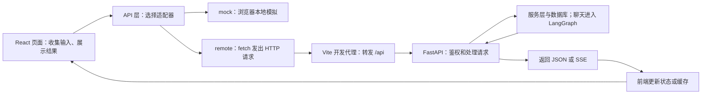

# Aiden 前端

本项目的前端学习路线与所有技术专题索引见[技术学习路线](技术学习路线.md)。本文侧重 React/TypeScript 与前端源码；§7 的 SSE 表描述 remote 当前协议，不应直接套用 mock。

**先记住一句话：HTML 定义结构，CSS 定义样式，JavaScript 处理交互；本项目用 React 组织界面，用 TypeScript 编写交互代码，用 HTTP API 与 Python 后端通信。**

示例分为“源码摘录”和“教学示例”：前者来自本项目；后者只用于解释概念，不是项目新增功能，也不需要覆盖现有文件。

## 1. 本项目用了什么框架

### 1.1 技术栈及各自职责

版本范围来自 [`frontend/package.json`](../frontend/package.json)，实际安装版本由 `package-lock.json` 锁定。

| 技术 | 本项目声明的版本范围 | 是什么 | 在项目中的作用 |
| --- | --- | --- | --- |
| React | `^18.3.1` | UI 库，常被称作前端框架 | 把页面拆成组件，数据变化时更新界面 |
| React DOM | `^18.3.1` | React 的浏览器渲染工具 | 将 React 组件渲染到网页的 DOM 中 |
| TypeScript | `~5.7.2` | 带类型检查的 JavaScript | 提前发现参数、字段和类型用错等问题 |
| Vite | `^6.1.0` | 开发服务器和构建工具 | 本地启动、修改后更新页面、生成部署文件、开发期 API 代理 |
| Ant Design（`antd`） | `^5.24.3` | React UI 组件库 | 提供按钮、表单、输入框、弹窗、提示等组件 |
| React Router（`react-router-dom`） | `^6.30.0` | 前端路由库 | 根据网址显示登录页、用户工作台、客服工作台等 |
| TanStack Query（`@tanstack/react-query`） | `^5.66.0` | 异步数据查询与缓存库 | 管理会话、消息、当前身份的读取、缓存和刷新 |
| Day.js | `^1.11.13` | 日期工具库 | 格式化消息时间等 |
| `@ant-design/icons` | `^6.0.0` | 图标组件库 | 提供发送、客服、退出等图标 |

不是 Vue，不是把所有内容写进一个 HTML 文件，也不是由 FastAPI 直接生成每个页面。当前没有额外引入 Redux、Zustand 等全局状态库。

这里的“前后端分离”指职责与代码分开：

- **前端**：浏览器里的页面、输入框、按钮、加载状态、数据展示。
- **后端**：FastAPI 接收请求，处理鉴权、订单/售后业务、数据库访问，以及 LangGraph 对话编排。
- **通信**：普通接口返回 JSON；智能客服回复使用 SSE 事件流。

前端不直接连接 MySQL、Milvus，也不直接拿模型 API Key 调用模型。数据库连接和模型密钥应留在后端。

### 1.2 从 HTML/CSS 的视角理解它们

以前你可能写：

```html
<div class="chat-card">
  <h2>订单咨询</h2>
  <button>发送</button>
</div>
```

在 React 中，类似结构放进一个返回 JSX 的函数：

```tsx
// 教学示例：展示组件的基本形状，不是项目现有组件。
export function ChatCard() {
  return (
    <div className="chat-card">
      <h2>订单咨询</h2>
      <button>发送</button>
    </div>
  );
}
```

这个函数叫**组件**。在另一个组件中写 `<ChatCard />`，就能使用它。

CSS 仍按你熟悉的方式写：

```css
/* 教学示例：对应上面的 className。 */
.chat-card {
  padding: 16px;
  border: 1px solid #ddd;
  border-radius: 10px;
}
```

所以 HTML/CSS 基础没有作废。新增的是：用 JavaScript/TypeScript 把结构、数据和交互连接起来。

## 2. 先认识目录和页面入口

### 2.1 文件地图

下面省略不影响入门的文件：

```text
frontend/
├─ index.html                 # 浏览器最先加载的 HTML 外壳
├─ package.json               # 依赖和 npm 命令
├─ vite.config.ts             # Vite 配置，含开发期 /api 代理
├─ .env.example               # 前端环境变量示例
└─ src/
   ├─ main.tsx                # 挂载 React，设置 Ant Design 主题，导入 CSS
   ├─ App.tsx                 # 路由、身份门禁、QueryClient
   ├─ styles.css              # 页面样式
   ├─ types.ts                # 身份、会话、消息等数据类型
   ├─ components/Common.tsx   # 共用品牌、状态标签、页面头部
   ├─ pages/
   │  ├─ LoginPage.tsx        # 登录
   │  ├─ UserWorkspace.tsx    # 用户聊天
   │  ├─ StaffWorkspace.tsx   # 人工客服工作台
   │  ├─ ServicePages.tsx     # 用户和员工的售后/工单页
   │  ├─ RagConsole.tsx       # 员工知识建库控制台
   │  ├─ RagEvals.tsx         # 员工 RAG 评估页
   │  └─ ReviewQueue.tsx      # 员工问题审核页
   ├─ api/
   │  ├─ index.ts            # 选择 mock 或 remote
   │  ├─ contracts.ts        # 两种适配器共同遵守的接口
   │  ├─ mock.ts             # 浏览器本地模拟业务
   │  ├─ remote.ts           # 普通业务 HTTP 请求和 SSE 解析
   │  └─ rag.ts              # 员工知识管理/审核/评估的 API 请求
   └─ data/demoData.ts        # mock 演示数据
```

文件扩展名：

- `.ts`：TypeScript，通常是类型定义、请求逻辑或工具代码。
- `.tsx`：可以写 JSX 的 TypeScript，本项目页面和组件使用它。
- `.css`：样式；`.html`：HTML 外壳。

### 2.2 页面从哪里出来

[`frontend/index.html`](../frontend/index.html) 的关键源码：

```html
<div id="root"></div>
<script type="module" src="/src/main.tsx"></script>
```

`root` 是 React 放入页面内容的位置。`script` 引入入口代码，由 Vite 处理 TypeScript、JSX 和模块导入；浏览器不是原生直接执行 `.tsx`。

[`frontend/src/main.tsx`](../frontend/src/main.tsx) 调用 `ReactDOM.createRoot(...).render(...)`，在 `React.StrictMode` 和 Ant Design 的 `ConfigProvider` 中渲染 `<App />`，同时导入 `styles.css`。`ConfigProvider` 提供中文配置、主题颜色和组件样式。

可以按下面的顺序理解：

```text
index.html 的 #root
  → main.tsx 挂载 React
  → App.tsx 设置路由和数据缓存环境
  → 根据 URL 选择 pages/ 中的页面组件
  → 页面组合 components/ 中的共用组件
  → 数据和样式共同决定最终界面
```

这是单页应用（SPA）：通常由 React Router 在浏览器内切换组件，而不是每次跳转都下载一份新的 HTML 页面。

### 2.3 页面 URL 与 API URL 是两回事

路由定义在 [`frontend/src/App.tsx`](../frontend/src/App.tsx)：

| 浏览器页面地址 | 页面组件 | 用途 |
| --- | --- | --- |
| `/login` | `LoginPage` | 登录 |
| `/app`、`/app/:conversationId` | `UserWorkspace` | 用户聊天与指定会话 |
| `/app/service` | `UserServicePage` | 用户售后与工单 |
| `/staff`、`/staff/:conversationId` | `StaffWorkspace` | 客服接管与回复 |
| `/staff/service` | `StaffServicePage` | 员工售后与工单处理 |
| `/staff/rag` | `RagConsole` | 知识建库 |
| `/staff/reviews` | `ReviewQueue` | 问题审核 |
| `/staff/evals` | `RagEvals` | RAG 评估 |

`:conversationId` 表示会话 ID，例如 `/app/某个会话ID`；源码用 `useParams()` 读取它。

**`/app/...` 是给人看的页面，`/api/...` 是给代码调用的数据接口。** `RoleGate` 控制前端展示和跳转，但不能替代后端权限检查；修改网址不能合法获得别人的会话。

## 3. 看懂 React 代码前，补齐几个概念

### 3.1 JavaScript/TypeScript 常用语法

先认识这些，不必立刻掌握全部语言：

| 写法 | 含义 | 在项目里怎么用 |
| --- | --- | --- |
| `const text = '你好'` | 定义变量，不重新赋值 | 保存输入、路径、配置 |
| `let assistantId = ...` | 定义可以重新赋值的变量 | 流开始后更新助手消息 ID |
| `import { api } from '../api'` | 从另一个模块导入内容 | 页面复用 API 层 |
| `export function LoginPage()` | 导出函数供其他文件使用 | `App.tsx` 导入页面组件 |
| `(input) => api.login(input)` | 箭头函数 | 事件处理和请求回调 |
| `{ account, password }` | JavaScript 对象 | 表示登录数据 |
| `items.map(...)` | 将数组逐项转换为新数组 | 把消息数据转换为界面或更新后的数据 |
| `...item` | 展开对象的已有字段 | 保留消息其他字段，再修改正文 |
| `condition ? a : b` | 条件成立用 `a`，否则用 `b` | 不同身份进入不同页面 |
| `value ?? ''` | 仅当值是 `null` 或 `undefined` 时用空字符串 | 处理可能缺失的正文 |
| `async` / `await` | 表达异步操作，等待结果 | 等待网络请求，不阻塞整个浏览器 |

JSON 是传输数据的文本格式，不是 HTML。JavaScript 对象用 `JSON.stringify(...)` 转成 JSON 请求体，响应 JSON 用 `response.json()` 解析回对象。

### 3.2 JSX：像 HTML，但可以嵌入数据

JSX 是 JavaScript/TypeScript 中描述 UI 的语法。主要差异：

- HTML 的 `class` 在 JSX 中写成 `className`。
- `{表达式}` 用于嵌入变量、条件和函数。
- 事件写成 `onClick={处理函数}`，不是在 HTML 字符串里写 `onclick="..."`。
- 自定义组件首字母大写，例如 `<PageHeader />`、`<Button />`。
- `<Button />` 来自 Ant Design；`<button />` 是原生 HTML 元素。

源码摘录，来自 [`frontend/src/components/Common.tsx`](../frontend/src/components/Common.tsx)：

```tsx
export function ModePill() {
  return apiMode === 'mock'
    ? <Tag className="mode-tag mode-mock"><span className="mode-dot" />演示模式 · 模拟流式输出</Tag>
    : <Tag className="mode-tag mode-remote"><span className="mode-dot" />真实 API · SSE 流式连接</Tag>;
}
```

读法：根据 `apiMode` 返回不同的标签。`Tag` 是导入的 Ant Design 组件，`span` 是原生 HTML，样式来自 `styles.css`。

### 3.3 props：父组件传入的数据

props 可以理解为组件的参数。例如源码中的：

```tsx
<PageHeader actor={actor} />
```

父页面把当前身份 `actor` 传给 `PageHeader`。共用头部据此显示姓名和用户/员工入口。组件不是只能显示固定文字，而是可以根据参数显示不同内容。

### 3.4 state：会变化且影响界面的数据

`useState` 是 React 的 Hook。Hook 是组件里使用 React 状态、生命周期等能力的函数，按规则放在组件顶层调用。

下面是基于 `UserWorkspace.tsx` 输入框写法的**教学示例**，只演示输入状态，不发送请求：

```tsx
import { useState } from 'react';
import { Input } from 'antd';

export function DraftExample() {
  const [draft, setDraft] = useState('');

  return (
    <Input.TextArea
      value={draft}
      onChange={(event) => setDraft(event.target.value)}
      placeholder="输入消息开始对话…"
    />
  );
}
```

- `draft` 是当前输入内容，初始为空字符串。
- `setDraft(...)` 更新状态，React 随后重新渲染相关界面。
- `value={draft}` 让输入框显示状态里的值。
- `onChange` 在用户输入时把新的内容写回状态。

这叫**受控输入框**：输入内容由 React 状态管理。不要直接写 `draft = '新的内容'`，也不要靠手动修改 DOM 来绕过 React 更新界面。

项目还使用 `useEffect` 处理订阅、切换会话时的清理等副作用，使用 `useRef` 保存请求控制器等不需要直接触发渲染的对象。入门时先掌握 `useState`，再读这些。

### 3.5 TypeScript：给数据约定形状

源码摘录，来自 [`frontend/src/types.ts`](../frontend/src/types.ts)：

```ts
export interface LoginInput {
  account: string;
  password: string;
  role?: Role;
}
```

`interface` 描述对象需要什么字段；`string` 是字符串；`?` 表示字段可省略。这里的 `Role` 在同一文件中定义为 `'user' | 'staff'`，只能取这两个字符串之一。

源码中的 API 契约是：

```ts
login(input: LoginInput): Promise<Actor>;
```

含义：传入符合 `LoginInput` 的对象，异步获得 `Actor`（身份资料）。`Promise` 表示结果稍后才会到；`await api.login(input)` 才能拿到最终对象。

**TypeScript 检查的是开发期代码，不会自动验证网络返回数据，也不是权限防线。** 后端仍须校验请求字段和当前登录身份。

## 4. 页面如何管理数据：本地状态与请求缓存

本项目主要分两类数据：

| 数据类别 | 例子 | 管理方式 |
| --- | --- | --- |
| 当前页面交互状态 | 输入草稿、侧栏是否展开、是否正在生成 | React `useState` 等 |
| API 返回的业务数据 | 当前身份、会话列表、历史消息 | TanStack Query 的查询缓存 |

源码摘录，来自 `UserWorkspace.tsx`：

```tsx
const conversationQuery = useQuery({
  queryKey: ['conversations'], queryFn: api.listConversations,
  refetchInterval: apiMode === 'remote' ? 5_000 : false,
});
const conversations = conversationQuery.data ?? [];
```

逐项理解：

1. `queryKey` 是缓存的标识，不是网络地址。
2. `queryFn` 是取得数据的函数；这里会调用 `api.listConversations`。
3. `data` 保存成功结果；请求未完成时可能没有结果，所以 `?? []` 先给一个空数组。
4. `isLoading`、`isError` 等字段可用于显示加载状态和错误，而不是把失败伪装为空列表。
5. remote 模式每 5 秒刷新会话列表；消息查询另有 3 秒轮询，用来同步历史与人工回复。

`useMutation` 用于登录、新建会话、转人工等写入或操作请求：

- `mutate(...)` 触发操作。
- `onSuccess` 处理成功结果。
- `onError` 展示失败原因。
- `isPending` 控制按钮的加载状态。

`queryClient.setQueryData(...)` 直接更新缓存；`invalidateQueries(...)` 将匹配的缓存标记为需要刷新，通常会触发活跃查询重新读取。**把缓存更新后，使用这些数据的组件也会更新界面。**

当前 `App.tsx` 的默认查询配置是 `staleTime: 2_000`、`retry: 1`、窗口重新聚焦时刷新；mutation 默认不自动重试。具体查询可以覆盖这些设置，例如身份检查不自动重试。无需另写一套全局变量保存所有业务数据。

## 5. 前后端究竟怎么联系起来

### 5.1 完整链路



图中的 Vite 代理只描述**本地开发路径**。生产环境部署构建产物后，不能指望 `vite.config.ts` 自动充当生产网关；需要部署环境另外配置 `/api` 转发，或明确配置后端地址及相应跨域策略。

### 5.2 为什么页面调用 api，而不是到处写 fetch

本项目让普通业务页面依赖统一的 `AidenApi`，具体实现放在适配器里。源码摘录，来自 [`frontend/src/api/index.ts`](../frontend/src/api/index.ts)：

```ts
import type { AidenApi } from './contracts';
import { mockApi } from './mock';
import { remoteApi } from './remote';

export const apiMode = import.meta.env.VITE_API_MODE === 'remote' ? 'remote' : 'mock';
export const api: AidenApi = apiMode === 'remote' ? remoteApi : mockApi;
```

页面写 `api.login(...)`，不必在每个按钮里判断模式。`contracts.ts` 约定方法名和参数，`mock.ts` 与 `remote.ts` 各自实现这些方法。

| 对比项 | mock | remote |
| --- | --- | --- |
| 是否请求 FastAPI 业务接口 | 本地适配器不请求 | 请求真实后端 |
| 业务数据位置 | 浏览器 `localStorage` | 服务端 MySQL 等依赖 |
| 登录状态 | 当前标签页的 `sessionStorage` | 服务端签发的 HttpOnly Cookie |
| 回复方式 | 浏览器模拟分段输出 | HTTP SSE 流式响应 |
| 跨标签同步 | `storage` 事件、`BroadcastChannel` | 页面查询和轮询服务端状态 |
| 请求失败 | 反映模拟逻辑的错误 | 展示实际请求/服务错误，不静默回退 mock |

**注意边界：这里的模式切换是 `AidenApi` 这一层的机制。员工知识管理等页面另用 `api/rag.ts`，仅允许 remote 真实请求，mock 下会禁用或提示切换模式，不生成模拟入库结果。**

mock 里的订单和账号不等于 remote 数据库里的订单和账号；看到打字效果也不等于已连接大模型。

### 5.3 普通请求：HTTP + JSON

[`frontend/src/api/remote.ts`](../frontend/src/api/remote.ts) 用下面的配置确定前缀：

```ts
const baseUrl = (import.meta.env.VITE_API_BASE_URL || '/api').replace(/\/$/, '');
```

普通请求由 `request<T>()` 统一处理。下面是其中发请求的源码摘录：

```ts
const response = await fetch(`${baseUrl}${path}`, {
  ...init,
  credentials: 'include',
  headers: { ...(init.body ? { 'Content-Type': 'application/json' } : {}), ...init.headers },
});
```

- `fetch` 是浏览器发 HTTP 请求的 API。
- `` `${baseUrl}${path}` `` 是模板字符串，将前缀和路径拼成地址。
- `init` 包含请求方法、正文等选项；`...init` 把它们展开进配置。
- 有请求体时声明 `Content-Type: application/json`。
- `credentials: 'include'` 让浏览器按 Cookie 规则携带登录凭证，并处理响应 Cookie；并不绕过跨域或 SameSite 限制。

`request<T>()` 后续检查 `response.ok`：失败时读取错误正文并抛出 `ApiError`；成功时通常用 `response.json()` 解析，`204` 则没有正文。泛型 `T` 表达预期的响应类型，例如 `Actor`。

### 5.4 `/api` 怎么到达 Python 后端

开发时默认前端地址为 `http://localhost:5173`，后端代理目标默认是 `http://127.0.0.1:8000`。

源码摘录，来自 [`frontend/vite.config.ts`](../frontend/vite.config.ts)：

```ts
export default defineConfig({
  plugins: [react()],
  server: {
    proxy: {
      '/api': {
        target: process.env.VITE_API_PROXY_TARGET || 'http://127.0.0.1:8000',
        changeOrigin: true,
      },
    },
  },
});
```

例如前端请求 `/api/auth/login`：

```text
浏览器 → http://localhost:5173/api/auth/login
Vite   → http://127.0.0.1:8000/api/auth/login
FastAPI → 匹配登录路由并执行 Python 函数
```

没有配置路径重写，**`/api` 前缀会保留**。前端使用 `baseUrl='/api'` 加上 `path='/auth/login'`，后端路由同样是 `/api/auth/login`，两边才能对上。

同源是指协议、主机、端口都相同。开发代理让浏览器向前端自己的来源发请求，由 Vite 转发。如果改成浏览器直连不同来源的后端，需要配置允许的前端来源、凭证 CORS 和合适的 Cookie 属性；当前 `backend/app/main.py` 没有配置 CORS 中间件，不能只改地址就认为已经可用。

## 6. 实例一：点击登录，直到进入工作台

### 6.1 前端收集表单并调用 API

`LoginPage.tsx` 中，remote 表单的 `onFinish={remoteLogin}` 在校验通过后提交字段，`remoteLogin` 加上所选角色，再调用 `login.mutate(...)`。

源码摘录：

```tsx
const login = useMutation({
  mutationFn: (input: LoginInput) => api.login(input),
  onSuccess: (actor) => {
    queryClient.setQueryData(['me'], actor);
    navigate(actor.role === 'staff' ? '/staff' : '/app', { replace: true });
  },
  onError: (error) => message.error(error instanceof Error ? error.message : '登录失败'),
});
```

登录成功后，将身份资料写入 `['me']` 缓存，并跳转到用户或员工工作台。**跳转角色取后端返回的 `actor.role`，不是仅相信界面所选角色。**

remote 适配器中对应的源码：

```ts
async login(input) {
  return request<Actor>('/auth/login', { method: 'POST', body: JSON.stringify(input) });
},
```

这会发送 `POST /api/auth/login`。请求体形状如下，内容是占位示例，不是可用账号：

```json
{
  "account": "你的账号",
  "password": "你的密码",
  "role": "user"
}
```

### 6.2 后端接收并设置 Cookie

[`backend/app/api/routes/auth.py`](../backend/app/api/routes/auth.py) 用 `APIRouter(prefix="/api/auth")` 注册路由。登录函数开头的源码：

```python
@router.post("/login")
def login(body: LoginRequest, response: Response) -> dict:
    """验证用户或员工并签发 HttpOnly Cookie；Cookie 明文不会写入 MySQL。"""
    actor = verify_user(body.account, body.password, body.role)
    if not actor:
        raise HTTPException(status_code=status.HTTP_401_UNAUTHORIZED, detail="账号或密码错误")
    token, _ = create_session(actor["id"])
```

后续通过 `response.set_cookie(...)` 设置登录 Cookie，使用 `httponly=True`、`samesite="lax"` 和 `path="/"`；是否要求 HTTPS 由 `session_cookie_secure` 配置决定。响应正文返回公开身份资料 `actor`。

你可以把 Cookie 理解成浏览器保存的一张“登录凭证”：

1. 登录响应带 `Set-Cookie`，浏览器保存凭证。
2. 后续请求自动携带适用的 Cookie。
3. 后端校验会话，再判断用户是谁、能访问什么。
4. 页面刷新后调用 `GET /api/auth/me` 恢复公开身份资料。

HttpOnly 表示页面 JavaScript 不能直接读取这张 Cookie；它不是放在 `localStorage` 里的 token。前端缓存 `actor` 是为了显示界面，不是后端信任的登录凭证。

remote 的 `me()` 仅把 `401` 解释为未登录并返回 `null`；连接失败等其他错误仍向上抛出，页面显示连接错误，避免误当作退出登录。

### 6.3 整条调用链

```text
LoginPage 的表单 onFinish
  → remoteLogin → login.mutate
  → api.login → remoteApi.login → request<Actor>
  → POST /api/auth/login → Vite 代理
  → auth.py 的 login → verify_user / create_session
  → Set-Cookie + 身份 JSON
  → onSuccess 更新 ['me'] 缓存
  → navigate('/app' 或 '/staff')
```

登录请求的后端字段定义在 [`backend/app/api/schemas.py`](../backend/app/api/schemas.py) 的 `LoginRequest`，前端定义在 `types.ts` 的 `LoginInput`。新增或修改字段时，需要同时检查这两边，不能只改表单。

## 7. 实例二：发一条消息，为什么回答会逐步出现

### 7.1 智能客服使用 SSE，不是 WebSocket

普通 JSON 请求通常等待一次完整结果。SSE（Server-Sent Events）则允许后端在同一个 HTTP 响应中持续发送事件，前端收到一段就处理一段。

本项目是**通过 `fetch` 发 POST 请求并读取响应流**，不是使用只能直接发 GET 的原生 `EventSource`，也不是 WebSocket。后端返回的内容类型是 `text/event-stream`。

发送按钮触发 `UserWorkspace.tsx` 中的 `send(draft)`：

1. 去掉首尾空白，检查是否有可发送的会话和正文。
2. 在缓存中先显示用户消息和空的助手占位消息，减少等待感；此时并不表示后端已保存成功。
3. 创建 `clientMessageId` 和 `AbortController`，再调用 `api.sendMessageStream(...)`。
4. 收到事件后更新助手消息缓存，React 随之更新气泡。

`clientMessageId` 用来标识同一轮请求并支持幂等重试，不等于数据库里的助手消息主键。

### 7.2 remote 适配器发出的请求

源码摘录，来自 `remote.ts` 的 `sendMessageStream`：

```ts
const response = await fetch(`${baseUrl}/conversations/${encodeURIComponent(conversationId)}/messages/stream`, {
  method: 'POST',
  credentials: 'include',
  headers: { 'Content-Type': 'application/json', Accept: 'text/event-stream' },
  body: JSON.stringify({ text, clientMessageId }),
  signal,
});
```

- `conversationId` 决定是哪一段会话，`encodeURIComponent` 对路径中的 ID 编码。
- `text` 是用户输入；`clientMessageId` 是本轮请求标识。
- `Accept` 表示前端希望接收 SSE。
- `signal` 用于停止/取消当前读取；页面的“停止生成”会调用控制器的 `abort()`。

流式接口不能用一次 `response.json()` 处理整个响应。适配器用 `readSseStream(response.body, ...)` 增量解码事件，再由 `normalizedEvent(...)` 转成前端统一的 `StreamEvent`。

### 7.3 后端流式接口

[`backend/app/api/routes/conversations.py`](../backend/app/api/routes/conversations.py) 的路由前缀是 `/api/conversations`。对应入口源码：

```python
@router.post("/{conversation_id}/messages/stream")
async def stream_message(
    conversation_id: str,
    body: StreamMessageRequest,
    actor: dict = Depends(current_actor),
) -> StreamingResponse:
```

它会验证当前用户是否拥有会话，创建用户消息和助手占位记录，然后进入 LangGraph 对话流程；同一轮已完成请求的重试可以直接重放保存结果。这里不是前端直接调用 Python 函数，而是 HTTP 请求被 FastAPI 路由分派到函数。

响应返回部分的源码：

```python
return StreamingResponse(
    event_stream(),
    media_type="text/event-stream",
    headers={"Cache-Control": "no-cache, no-transform", "X-Accel-Buffering": "no", "Connection": "keep-alive"},
)
```

`event_stream()` 是逐步产生事件的异步生成器。事件编码由 [`backend/app/api/sse.py`](../backend/app/api/sse.py) 的 `sse_event(...)` 处理。

### 7.4 事件长什么样，前端怎么处理

下面是**格式教学示例**，不是本次运行抓包；事件之间实际用空行分隔：

```text
event: start
data: {"messageId":"assistant-example"}

event: progress
data: {"stage":"query","message":"正在查询本人订单"}

event: delta
data: {"text":"你的订单"}

event: final
data: {"text":"这里是核验并保存后的完整回答。","citations":[]}

event: done
data: {}

```

`event` 是事件名，`data` 是 JSON 数据，空行标志一条事件结束。网络分片不一定等于事件边界，不能简单认为每次读取就是一个完整 JSON；项目解析器会保留未读完的行并继续拼接。

remote 主要事件与页面行为：

| 事件 | 含义 | 前端动作 |
| --- | --- | --- |
| `start` | 后端确认助手记录 ID | 把临时助手 ID 换成真实 ID |
| `progress` | 意图识别、查询、检索、核验等进度 | 更新“正在查询……”等提示 |
| `delta` | 未核验的增量回答草稿 | 追加到当前正文 |
| `final` | 核验且保存后的权威正文和完整引用 | **替换**草稿正文及引用，而非追加 |
| `handoff` | 后端已提交转人工状态 | 刷新会话状态 |
| `done` | 本轮正常结束 | 标记完成，结束加载状态 |
| `error` | 本轮失败 | 显示错误，保留相应失败状态 |

remote 正常调用先发 `start`，其后在最终保存前可穿插零个或多个 `progress` 与 `delta`，接着是 `final`，可选 `handoff`，然后 `done`；`progress` 与 `delta` 不应被假定总按固定先后排列。已完成请求的幂等重放是 `start → final → done`（不重放旧的草稿 delta）。`final` 的 `data` 同时包含完整 `text` 和 `citations`，后端不会再单独发送 `citations` 事件。错误则以 `error` 结束，不保证随后有 `done`。可以在 [`conversations.py`](../backend/app/api/routes/conversations.py) 的 `stream_message()` 与 [`remote.ts`](../frontend/src/api/remote.ts) 的 `sendMessageStream()`、`normalizedEvent()` 对照实际入口。

“停止生成”由前端 `AbortController` 中止读取。remote 下服务端若尚未保存最终回答，会把助手行收尾为 `stopped`（此时草稿只在客户端，不是已保存答案）；若最终答案已提交，仓储终态保护会阻止迟到的取消把 `complete` 改成 `stopped`。取消不是一个专用 SSE 事件，客户端不应等待 `cancelled` 事件。

**mock 不模拟这套权威保存链路：** [`mock.ts`](../frontend/src/api/mock.ts) 在浏览器本地写演示数据，流式模拟通常是 `start → tool_status/order_card（视场景）→ delta* → [handoff] → done`，没有 remote 的 `progress` / `final`；取消时本地设置 `stopped`，但通过 `done` 结束。它只演示 UI 交互，不验证模型核验、服务端持久化或 SSE 协议一致性。

源码摘录，来自 `UserWorkspace.tsx` 的事件回调：

```tsx
} else if (event.type === 'delta') {
  setStreamingText('Aiden 正在回复…');
  updateAssistant(assistantId, (item) => ({ ...item, content: item.content + (event.text ?? '') }));
} else if (event.type === 'final' && apiMode === 'remote') {
  if (streamStateRef.current) streamStateRef.current.authoritative = true;
  updateAssistant(assistantId, (item) => ({ ...item, verified: true, content: event.text ?? '', citations: event.citations ?? [] }), true);
  setRetryTurn(null);
  setStreamingText('回答已核验并保存，正在同步会话…');
```

这是分支摘录，不是可以单独运行的完整函数。`updateAssistant` 更新消息缓存，`MessageTimeline`、`MessageBubble` 等组件再渲染它。

**关键区别：`delta` 是草稿，`final` 才是核验并落库后的正文；收到 `final` 不等于已经收到 `done`。** 引用数组也由 `final` 完整替换，即使它是空数组，不能保留上一份草稿引用。

### 7.5 人工聊天走另一条路径

当会话状态是 `waiting`（等待接入）或 `staff`（员工接入），同一个 `send()` 会改用 `api.sendHumanMessage(...)`，调用 `POST /api/conversations/{id}/messages` 保存用户留言，不触发智能客服 SSE。

员工的回复走员工 API，用户页通过历史消息轮询同步。不能把“聊天页面”里的所有消息都理解成模型在实时生成。

## 8. 常用接口与源码对照

下面是入门最常碰到的接口，不是全部 API 清单。`{id}` 表示实际会话 ID，`{message_id}` 表示实际消息 ID。

| 操作 | remote 适配器方法 | HTTP 接口 | 后端处理入口 |
| --- | --- | --- | --- |
| 登录 | `login` | `POST /api/auth/login` | `auth.py → login` |
| 恢复身份 | `me` | `GET /api/auth/me` | `auth.py → me` |
| 退出 | `logout` | `POST /api/auth/logout` | `auth.py → logout` |
| 会话列表 | `listConversations` | `GET /api/conversations` | `conversations.py → conversations` |
| 新建会话 | `createConversation` | `POST /api/conversations` | `conversations.py → create_conversation` |
| 历史消息 | `listMessages` | `GET /api/conversations/{id}/messages` | `conversations.py → messages` |
| 智能客服回复 | `sendMessageStream` | `POST /api/conversations/{id}/messages/stream` | `conversations.py → stream_message` |
| 转人工 | `requestHandoff` | `POST /api/conversations/{id}/handoff` | `conversations.py → handoff` |
| 人工阶段用户留言 | `sendHumanMessage` | `POST /api/conversations/{id}/messages` | `conversations.py → send_user_human_message` |
| 满意/不满意反馈 | `submitFeedback` | `POST /api/conversations/{id}/messages/{message_id}/feedback` | `conversations.py → message_feedback` |

前后端“约定一致”至少包括：方法、路径、请求字段、响应字段、身份规则，以及 SSE 事件语义。

例如前端 `LoginInput` 的 `account` 不能擅自改成 `username`，因为后端 `LoginRequest` 读取的是 `account`。同样，`final` 不能仅发一个新增片段，因为前端会把它当作完整正文替换。

## 9. 怎么运行和观察，不必先搭完整后端

### 9.1 先用 mock 熟悉界面

从仓库根目录打开 PowerShell：

```powershell
cd frontend
npm install
npm run dev
```

打开终端打印的 URL，默认是 `http://localhost:5173`；若端口被占用，以实际打印地址为准。

未设置 `VITE_API_MODE` 时，普通业务适配器默认为 mock。如果已有本地配置把它设成 remote，先检查配置；需要练习 mock 时，将本地 `frontend/.env.local` 的模式设为：

```dotenv
VITE_API_MODE=mock
```

修改配置后重启 Vite。使用登录页的 mock 演示账号，只输入演示内容，不输入真实个人信息。建议先观察：登录、选择会话、输入消息、转人工，以及另一个标签页的客服接管。

### 9.2 再切到 remote

在本地 `frontend/.env.local` 中配置：

```dotenv
VITE_API_MODE=remote
VITE_API_BASE_URL=/api
```

后端需要先按 [`frontend/README.md`](../frontend/README.md) 的准备说明配置数据库、迁移、账号，以及相关模型/检索依赖。仅改这两行不会自动创建数据库或启动 FastAPI。

默认开发代理指向 `8000`。如果后端实际运行在其他端口，前端启动环境中的 `VITE_API_PROXY_TARGET` 也必须匹配，例如：

```powershell
# 在 frontend 目录运行；后端须已单独启动在此地址。
$env:VITE_API_PROXY_TARGET = 'http://127.0.0.1:8100'
npm run dev
```

`8100` 只是示例，不保证本机空闲。仓库根目录 `start.ps1` 会强制使用 remote 并协调代理目标，且会启动 MySQL、执行迁移和初始化演示用户；它不是只读的前端启动脚本，使用前先阅读 README 的写入边界。

`VITE_` 前缀的客户端变量会暴露给浏览器代码，不应放数据库密码、模型 API Key 等秘密。环境变量不是保密手段。

生产构建使用 `npm run build`，执行 TypeScript 构建检查后由 Vite 生成默认的 `frontend/dist/`；`npm run preview` 仅用于本地预览，不替代生产部署。

### 9.3 用浏览器开发者工具验证自己的理解

按 `F12` 打开开发者工具：

1. **Elements（元素）**：看 React 最终生成的 HTML，检查 class 和 CSS；浏览器里临时改样式通常不写回源码。
2. **Console（控制台）**：看 JavaScript 错误。
3. **Network（网络）**：remote 模式登录时找 `/api/auth/login`，查看方法、状态码、请求 JSON 和响应身份资料。
4. **Application（应用）**：remote 看 Cookie，mock 看 Local Storage/Session Storage；不要复制、公开登录凭证。
5. remote 发送消息时找 `/messages/stream`，查看 `text/event-stream` 响应；请求在生成期间保持打开是正常现象。

对照一个具体操作：**页面事件 → API 方法 → 网络路径 → 后端路由 → 响应数据 → 状态/缓存 → 界面**。这比一开始把整份聊天代码逐行背下来更有用。

### 9.4 常见问题，先按层定位

| 现象 | 优先检查 |
| --- | --- |
| 页面标记“演示模式”，没有真实 API 请求 | `apiMode` 和本地环境配置；mock 本来就不访问普通业务后端 |
| remote 请求连接失败或出现代理错误 | FastAPI 是否启动、代理目标和后端端口是否一致 |
| 登录 `401` | 真实账号、密码、角色；mock 员工账号不自动等于 remote 员工账号 |
| 已登录但其他接口仍 `401` | Cookie 是否保存/携带、会话是否过期，直连时的跨域和 Cookie 配置 |
| 请求 `422` | 请求 JSON 字段和后端 schema 的类型、长度等约束 |
| 登录成功但没有订单 | remote 数据库是否给当前用户准备了订单，不能套用 mock 数据 |
| 聊天有草稿后报错 | 查看 SSE 的 `error` 和后端日志；草稿不代表最终回答已完成 |

`GET /api/health` 返回正常只证明 API 进程存活，不证明数据库、检索服务和模型都可用。

## 10. 只有 HTML/CSS 基础，建议按什么顺序读

1. **补 JavaScript 基础**：变量、函数、对象、数组、`map`、模块导入导出、事件、Promise、`async/await`、JSON 和 `fetch`。
2. **认识 JSX 和组件**：先看 `Common.tsx` 的 `ModePill`、`StatusPill`，理解原生标签和 Ant Design 组件如何混用。
3. **练习状态和事件**：看 `UserWorkspace.tsx` 的 `draft`、`setDraft`、输入框、发送按钮；先理解数据变化如何驱动 UI。
4. **看懂 TypeScript 数据结构**：从 `types.ts` 的 `Actor`、`LoginInput`、`Conversation`、`Message` 开始。
5. **追登录全链路**：`LoginPage.tsx → api/index.ts → remote.ts → auth.py`，结合 Network 面板核对。
6. **再学数据缓存和路由**：`App.tsx` 的 `BrowserRouter`、`RoleGate`、`QueryClientProvider`，页面中的 `useQuery` / `useMutation`。
7. **最后读复杂聊天**：`UserWorkspace.tsx → sendMessageStream → readSseStream → conversations.py`，先关注 `delta/final/done`，再研究取消、重试和历史消息合并。

目前要改什么，可以先定位这里：

| 想改的内容 | 首先查看 |
| --- | --- |
| 颜色、间距、布局 | `frontend/src/styles.css`，Ant Design 全局主题另看 `main.tsx` |
| 登录文案、表单和提交行为 | `frontend/src/pages/LoginPage.tsx` |
| 聊天输入区、消息气泡、生成状态 | `frontend/src/pages/UserWorkspace.tsx` |
| 顶部入口和公共状态标签 | `frontend/src/components/Common.tsx` |
| 页面地址和身份跳转 | `frontend/src/App.tsx` |
| HTTP 路径和请求体 | `frontend/src/api/remote.ts`；员工知识管理另看 `rag.ts` |
| 请求/响应字段 | 前端 `types.ts`、`contracts.ts` 与对应后端 schema/路由一起检查 |
| mock 演示数据和模拟行为 | `frontend/src/data/demoData.ts`、`frontend/src/api/mock.ts` |

学习时先修改简单文案或样式并观察页面；涉及 API 时先核对两端契约。不要为了让界面“看起来正常”，把 remote 错误改成假数据成功。

进一步阅读：

- [前端 README：启动、账号、依赖准备与 SSE 契约](../frontend/README.md)
- [FastAPI 入门与项目用法](FastAPI.md)
- [Aiden 项目整体架构](Aiden.md)

- [统一技术学习路线与源码导航](技术学习路线.md)：按基础、项目调用链、进阶专题组织。
