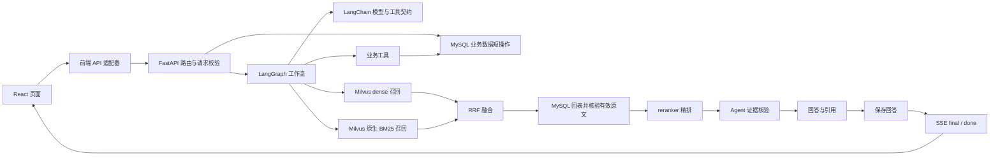

# 技术学习路线与源码导航

本文是目录，不替代各技术专题。按“基础概念 → 本项目调用链 → 进阶能力”阅读；看到教学示例时，先确认它是否标为独立示例，勿将示例代码当成仓库实现。项目行为和版本范围以链接所指源码与依赖清单为准；“已实现”表示仓库有代码，不代表对应外部服务已部署或完整验收。

## 一、基础层：认识应用、接口与数据

适合先建立 Web 应用和持久化的基本概念，不要求先运行全套服务。

| 主题 | 从哪里开始 | 项目入口 | 阅读目标与边界 |
| --- | --- | --- | --- |
| 项目地图与边界 | [根 README](../README.md) | [API 装配](../backend/app/main.py)、[启动脚本](../start.ps1) | 分清浏览器 mock 与 remote、API 存活与业务可用、服务代码与外部依赖。启动脚本会迁移数据库并初始化演示用户；先读副作用再决定是否运行。 |
| React、TypeScript、Vite、Router、TanStack Query、Ant Design | [前端入门及源码链路](前端.md) | [React 挂载](../frontend/src/main.tsx)、[路由与 QueryClient](../frontend/src/App.tsx)、[类型](../frontend/src/types.ts)、[API adapter 选择](../frontend/src/api/index.ts) | 从组件、props/state、路由和缓存开始；版本范围见 [`frontend/package.json`](../frontend/package.json)，实际解析安装版本以 lockfile 为准。mock 使用浏览器本地演示数据，不等于真实 API、模型或数据库。 |
| HTTP、FastAPI、Pydantic、Uvicorn | [FastAPI 教程与项目用法](FastAPI.md) | [应用装配](../backend/app/main.py)、[会话路由](../backend/app/api/routes/conversations.py)、[Pydantic schemas](../backend/app/api/schemas.py) | 看请求如何进入路由、由 schema 校验，再由依赖提供身份/数据库资源；Uvicorn 是 ASGI 服务器。仓库 API 已实现，但仅 `/api/health` 成功不能证明模型或检索可用。 |
| MySQL、SQLAlchemy、Session、事务、Alembic | [数据层基础与迁移](数据层.md)、[数据库实现摘要](数据库.md) | [ORM models](../backend/app/persistence/mysql/models.py)、[Engine/Session](../backend/app/persistence/mysql/database.py)、[Alembic env](../backend/alembic/env.py)、[0012 migration](../backend/alembic/versions/0012_topic_classification.py) | 先分清 ORM 模型、实际数据库 schema、短操作 Session 与迁移版本；仓库迁移 head 为 `0012_topic_classification`，实际数据库状态须单独核对。不要为学习而直接运行写入性迁移。 |

## 二、项目层：沿一次真实请求走过系统

建议以“一条用户消息”作为主线，顺着浏览器、HTTP、Agent、工具、数据库和响应逐层定位。

| 主题 | 建议阅读 | 可追踪的主链 | 当前边界 |
| --- | --- | --- | --- |
| 用户消息与 SSE | [前端 SSE 实现](前端.md#7-实例二发一条消息为什么回答会逐步出现) | `UserWorkspace.send()` → `remoteApi.sendMessageStream()` → `conversations.stream_message()` → `build_support_graph()` → `save_answer` → `final` / `done` | `delta` 是未核验草稿，`final` 才是保存的权威正文与引用；mock 不运行真实 LangGraph，事件与持久化行为不可当作 remote 服务承诺。 |
| LangChain / LangGraph | [LangChain 专篇](LangChain.md)、[LangGraph 专篇](LangGraph.md)、[Agent 当前实现](Agent实现详解.md) | `backend/app/agent/graph.py:build_support_graph()` 装配图；`backend/app/agent/nodes/` 实现节点；服务端意图路由决定可执行工具 | 代码中存在调用不代表模型能自由决定权限；目标设计/历史笔记要与当前节点代码区分。实际版本范围见 `backend/requirements.txt`，而非本路线推测。 |
| 检索、知识库与向量存储 | [RAG](RAG.md)、[Milvus](Milvus.md)、[数据层知识数据流](数据层.md#离线建库rag) | `scripts.build_knowledge_base` 导入/向量化 → MySQL `knowledge_chunks` → `KnowledgeVectorStore` → Milvus dense/BM25 召回 → RRF 融合 → MySQL 按 ID 回表并核验有效原文 → reranker 精排 → Agent 证据核验与回答 | Milvus 2.5+ 服务、embedding 服务及 reranker 权重需单独准备；Compose / `start.ps1` 不负责部署 Milvus、embedding 或模型。向量配置与集合 schema 必须匹配。 |
| 会话持久化与业务工具 | [工具契约](tools.md)、[售后与工单](售后与工单.md)、[数据层](数据层.md) | 路由/服务 → `persistence/mysql/` 短事务 → MySQL；Agent 工具只能使用服务端允许的业务参数和当前身份 | 工单、售后申请、排队转人工为不同流程；业务写入及政策资格取决于本人数据和服务端核验。 |

## 三、进阶层：评估、观测与旁路能力

这些专题建立在基础调用链之上。它们有已实现入口，但各自的数据、模型或验收条件不可互换。

| 主题 | 专题入口 | 实际入口 / 状态边界 |
| --- | --- | --- |
| 离线 RAG 与在线工作流评估 | [评估说明](评估说明.md)、[RAG 评估](RAG.md#评估体系) | 后端有离线评估与工作流评估入口和报告；报告文件/页面可读不等于当前模型、题集、数据集或生产质量已验收。以专题记载的具体范围为准。 |
| Langfuse 可观测性 | [可观测性](可观测性.md) | Langfuse callback 和员工只读观测 API 已实现；配置缺失时在线上报关闭。并非通用生产监控平台，未独立追踪的内部阶段不能由页面补造。 |
| 低置信度问题与知识飞轮 | [数据飞轮](数据飞轮.md)、[RAG 审核与补库](RAG.md#低置信度问题审核与补库) | 问题反馈、员工审核、FAQ/知识块同步有对应闭环；入库/向量化是写操作，仍须审阅目标库与明确知识来源。 |
| 旁路主题分类 | [主题分类器](主题分类器.md)、[0012 schema](../backend/alembic/versions/0012_topic_classification.py) | 迁移、ORM、API/控制台和 CLI 能力存在；不接在线意图路由。真实训练、模型可用性、批量预测/评测须按文档列出的数据与权重前提判断，不能由表已迁移推断能力已验收。 |
| 运维与本机演示 | [根 README](../README.md)、[前端运行说明](../frontend/README.md) | `deploy/compose.mysql.yml` 仅部署 MySQL；`start.ps1` 会执行 `alembic upgrade head` 和演示用户初始化。生产部署网关、密钥管理、数据库备份与外部 Milvus/模型部署不由本地启动脚本提供。 |

## 版本与示例辨析

- 前端声明版本范围见 [`frontend/package.json`](../frontend/package.json)：React 18、TypeScript 5.7、Vite 6、React Router 6、TanStack Query 5、Ant Design 5；依赖范围不等于机器当前解析安装版本。
- 后端声明约束见 [`backend/requirements.txt`](../backend/requirements.txt)、[`requirements-db.txt`](../backend/requirements-db.txt)、[`requirements-rag.txt`](../backend/requirements-rag.txt)：FastAPI、LangChain/LangGraph、SQLAlchemy、Alembic、PyMySQL、pymilvus 和 FlagEmbedding 均有约束范围。Pydantic 由 FastAPI 请求/响应 schema 使用，顶层 requirements 未单独声明 Pydantic 版本；以解析后的环境依赖为准。
- 文档中的教学片段若未明确指向仓库真实文件/符号，应视作概念示例；真实实现以本路线中的链接源码为准。代码存在、依赖已安装、外部服务启动、代表场景验收是不同状态，不要合并成“已上线”或“生产可用”。
