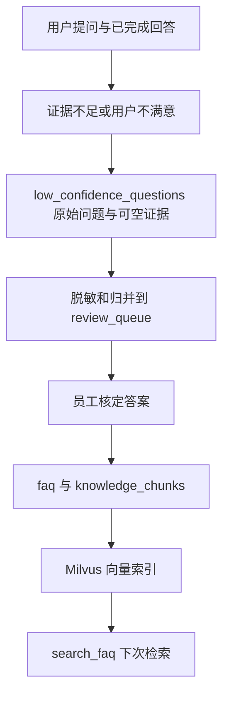

# 数据飞轮

本文只描述仓库里已经接通的「回答 → 发现知识缺口 → 人工审核 → 补库 → 再检索」链路。MySQL 表结构与迁移见 [数据层.md](数据层.md)，检索、对话挖掘和评估细节见 [RAG.md](RAG.md)。[Aiden.md](Aiden.md#数据飞轮) 包含主题分类器、微调等设想，不能当作已上线能力。

## 入口：只保存实际问题，不把缺证据编造成答案

- 在线知识请求先经 `search_faq` 检索。无有效结果、重排分数低于阈值、生成阶段判断证据不足，或生成答案缺引用时，Agent 拒答并附上本条知识缺口。`app.persistence.mysql.chat.finish_assistant_message` 在完成助手消息的同一事务把原问法、入口和原因写入 `low_confidence_questions`。检索错误不等同于知识缺失，不应把所有失败都写成待补 FAQ。入口判断见 [`nodes/knowledge.py`](../backend/app/agent/nodes/knowledge.py)（无有效结果、重排分低、自评判不足）和 [`nodes/answer.py`](../backend/app/agent/nodes/answer.py)（生成答案缺引用），写入见 [`chat.py`](../backend/app/persistence/mysql/chat.py)。
- 退款办理还有一条非检索来源的入口：本人订单没有正文覆盖用户陈述原因的现行商家政策时，`refund.py` 以 `refund_policy_unavailable` 记入同一张表。它要补的是商家政策（`policies`）而不是知识库条目，知识库检索结果也不能作为退款提交依据。
- 已完成的助手回答可由用户选择“满意 / 不满意”。[`submit_message_feedback`](../backend/app/persistence/mysql/chat.py) 校验会话所有者和对应回答，首次反馈写入 `messages.feedback`，不允许改选；“满意”不入问题池，“不满意”按原诉求复制真实用户问题。回答完成时保存于 `messages.retrieval_snapshots` 的当次检索证据同时复制到原始问题行；新回答中没有检索的诉求标记为未检索，缺少历史快照的旧回答则保留空值，不在事后重跑检索伪造当时的依据。来源消息外键允许为空，以容纳迁移前的历史问题。
- 当前在线缺口和负反馈写入 `low_confidence_questions`，人工审核使用 `review_queue`；用户数据和原始问法不直接作为通用 FAQ 发布。

## 整理与审核：由员工决定是否成为知识

员工在 `/staff/reviews` 使用鉴权的 `POST /api/rag/jobs/low-confidence-review` 启动整理，并通过 `/api/rag/review-queue` 查询和审核。整理任务在 [`services/rag/review_queue.py`](../backend/app/services/rag/review_queue.py) 中游标读取尚未绑定的原话，先脱敏，再用模型标准化问法和示例答案，匹配现有待审项；候选过多时用现有向量服务筛选候选，再由模型核对。归并写入由 [`persistence/mysql/review_queue.py`](../backend/app/persistence/mysql/review_queue.py) 保护：原始问题只绑定一次 `matched_review_id`，匹配成功时待审项 `occurrence_count` 加一，否则新增待审项；失败留下 `processing_error`，原始行可重试。运营视图提供按全生命周期出现次数排序，统计及卡片另列筛选范围内数量；不自动决定补库。

审核员查看归并问题和每条原话的当次检索快照后，可批准或驳回。批准时 `review_queue` 与一条启用的 `faq` 在同一 MySQL 事务里关联，答案由员工核准，`ingestion_status` 先为 `pending`；驳回只记录原因，不生成 FAQ。批准接口随后调用现有 FAQ 导入与向量补齐：`faq` → `knowledge_chunks` → Milvus，按该 FAQ 的有效块状态回填 `ready`、`pending`、`manual_review` 或 `failed`。失败可从员工接口重试；**批准不等于向量已就绪**，只有回表确认 `vector_status = 'vectorized'` 的块才能被在线检索。审核和同步入口见 [`rag_admin.py`](../backend/app/api/routes/rag_admin.py)、[`review_queue.py`](../backend/app/services/rag/review_queue.py)。

## 运营视图：按范围寻找问题并识别修复对象

员工可在 `/staff/reviews` 使用审核状态（含全部）、最近创建或全生命周期热度、现有 FAQ 类目、问题类型及原始问题日期范围筛选。日期控件按浏览器本地日期选择，起始日含当日零时、结束日包含整日；前端发送 UTC `[start_at, end_at)`，筛选原始问题 `created_at` 而不是归并时间。后端保存的无时区 ISO 时间按 UTC 解释并以 UTC 显示，避免员工把本地时区偏移误读为原始时间。

热度排序按全生命周期 `occurrence_count`，不随日期范围改变；列表同时显示范围内原始问题和负反馈次数。详情展示该归并项全部关联原话、各原话当时保存的检索状态、检索问题与召回快照；详情统计和问题类型也覆盖全部关联记录。日期/类目/类型/状态/排序筛选变化会关闭详情并回到第一页。

问题类型按范围内原始证据判定，可多标签：`knowledge_gap` 是已检索且非故障的疑似知识缺口，仍待员工核实；`retrieval_miss` 仅在员工以“已有知识但当次未召回”驳回后确认；`policy_gap` 对应 `refund_policy_unavailable`，修复对象是商家政策而非 FAQ；`service_failure` 对应检索错误，不能据此认定缺少知识；其余为 `unclassified`。统计同时展示全部匹配归并项的原始问题数、归并问题数、审核状态、入库状态及类型分布，不受分页影响。原始问题数只计当前匹配归并项关联的原话，不包括尚未归并的 `low_confidence_questions`；反馈次数只计 `user_feedback_unresolved` 不满意事件，按 `source_assistant_message_id` 跨归并项去重，旧记录没有消息 ID 时按记录计。详情或列表每行的反馈计数相加可能高于全局去重总数；多标签类型计数合计也可能高于归并问题数。

FAQ 的 `ready` 仅表示关联 FAQ 已同步并可检索，不证明原话复问已经命中。通过项保留 FAQ ID、同步失败/待人工复核等真实状态和原始检索证据，并提示员工用原话重新提问、核对实际引用内容；视图没有复问持久记录，也不会展示伪造的修复成功。政策缺口、检索漏召回、服务故障条目明确提示应核对相应修复对象，不能以补入 FAQ 代替政策或服务修复。

调用链：`ReviewQueue` → `ragApi.reviewQueue()` / `ragApi.reviewDetail()` → `rag_admin.list_review_queue()` / `rag_admin.review_detail()` → `mysql/review_queue.list_reviews()` / `mysql/review_queue.review_detail()`。后端路由见 [`rag_admin.py`](../backend/app/api/routes/rag_admin.py)，查询与详情持久化见 [`mysql/review_queue.py`](../backend/app/persistence/mysql/review_queue.py)；前端类型与响应位于 [`types.ts`](../frontend/src/types.ts)，筛选控件、统计卡片、证据详情与复问核对说明位于 [`ReviewQueue.tsx`](../frontend/src/pages/ReviewQueue.tsx)，查询参数序列化位于 [`rag.ts`](../frontend/src/api/rag.ts)。此视图不新增模拟审核数据或可选的复问记录 API。

**验证边界（2026-10-03；后端只读场景于 2026-10-02/03 执行）**：后端通过 11 个 FastAPI TestClient 场景，使用连接内只读 MySQL CTE fixture 执行实际权限、查询、过滤、统计及序列化路径；未写业务表、执行 migration 或改配置。远端前端页面通过 OS 临时副本、HTTP fixture、Vite 与 Chromium 实际操作审核状态、热度、类目、日期、分页、详情证据、队列 503 原因与重试；fixture 不连接真实业务库。ReviewQueue 定向 TypeScript 检查通过；整项目 `tsc -b` 被并发 `UserWorkspace.tsx` 两处 `RetryTurn` 缺少 `conversationId` 类型错误阻断，未改该并发文件。未以 fixture 结果宣称真实用户库 UI 全链路验收。

## 再检索与质量核对

MySQL 的 `knowledge_chunks` 保存正文、来源、状态与块 ID；Milvus 只保存检索索引并用相同块 ID 回表。`search_faq` 对召回块重新检查 MySQL 中的向量状态，失效块及未完成向量化的块不会进入回答；这使补库后的有效知识参与后续请求，但不保证同一问法必然命中或被回答。Markdown/既有 FAQ 的导入、历史客服对话挖掘也是知识来源：后者从完成的历史对话抽取、脱敏、暂存、整体去重，再走相同的 `knowledge_chunks` / 向量化链路；它与低置信度问题人工审核是两条不同的数据路径。

当前另有 [四策略 RAG 评估](RAG.md#评估体系)：使用固定题集与报告核对召回、答案和拒答等指标，可从员工建库控制台手动运行。评估报告并不会自动调整检索参数、生成政策、审核结论或更新知识库；员工需要依据报告与原始证据人工决定下一步。[Aiden.md](Aiden.md#数据飞轮) 提到的海量问题主题分类器、微调及按类目自动排优先级尚无对应实现，不能视为这条闭环的一环。
