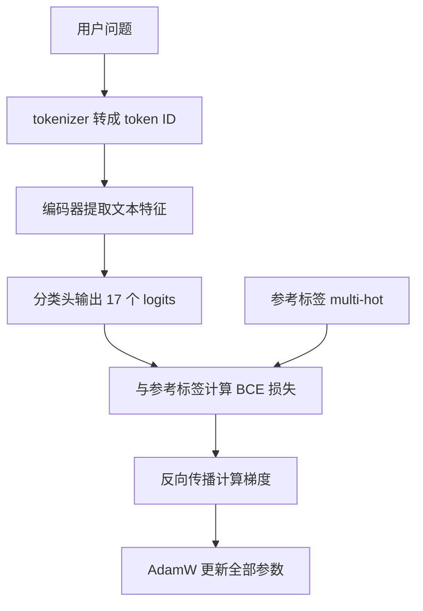

# 模型微调

模型微调，是在一个已经预训练过的模型上，用特定任务的数据继续训练，让它适应新的输入和输出要求。本文以 Aiden 的客服主题分类器为例，说明模型如何学习、需要哪些依赖、如何准备数据与启动训练，以及如何判断训练效果。

一条客服问题可能同时包含多个主题。例如“鞋子买小了，想换大一码”可以同时属于“尺码”和“退换货”。分类器要输出这些主题，而不是生成客服回答。

## 1. 先认识模型、微调和预测

### 1.1 基座模型是什么

基座模型是微调的起点。它通过预训练从大量文本中学习语言特征，但不一定具备项目需要的分类能力。

本文使用 `hfl/chinese-roberta-wwm-ext` 作为候选基座。虽然名称包含 RoBERTa，它在 Transformers 中按 BERT 类型加载；不能仅根据模型名称决定使用哪种架构。

分类模型可以分成两部分：

| 部分 | 作用 | 微调前的来源 |
| --- | --- | --- |
| 编码器 encoder | 将文本转换成包含上下文特征的数值表示 | 复用基座的预训练权重 |
| 分类头 classifier | 将编码器的表示转换成各主题的分数 | 为 17 类主题任务新建并初始化 |

因此，下载基座不等于得到了可用的主题分类器。分类头还需要通过带标签的数据学习“哪些文本对应哪些主题”。

### 1.2 参数、超参数和指标不是同一件事

| 名称 | 是什么 | 例子 | 由谁决定 |
| --- | --- | --- | --- |
| 模型参数 parameter | 模型内部参与计算的数值，也称权重 | 编码器矩阵、分类头权重 | 训练算法根据数据更新 |
| 超参数 hyperparameter | 控制训练方法的设置 | 学习率、batch size、epoch | 训练者预先设置，在验证集上选择 |
| 评估指标 metric | 衡量模型结果的数值 | Precision、Recall、F1 | 对预测与参考标签进行统计 |

`--learning-rate 2e-5` 是训练设置；`micro_f1=0.95` 是评估结果。

### 1.3 全参数微调、只训练分类头与 LoRA

| 方式 | 更新哪些参数 | 主要特点 |
| --- | --- | --- |
| 全参数微调 | 编码器和分类头的全部参数 | 可调整整个模型，通常需要更多训练内存 |
| 只训练分类头 | 冻结编码器，只更新分类头 | 资源需求较小，但编码器不会适应新任务 |
| LoRA 等参数高效微调 | 主要更新额外引入的一小部分参数 | 通常降低训练资源需求，需要相应实现 |

Aiden 的主题训练入口使用**全参数微调**。降低 batch size 或输入长度不会把它变成 LoRA。该入口没有 LoRA、混合精度、梯度累积、自动提前停止或断点续训参数。

### 1.4 训练与预测的区别

- **训练**：输入文本和参考标签，计算误差，更新模型参数。
- **验证**：用不参与参数更新的数据检查模型，选择 checkpoint 和阈值。
- **测试评估**：用事先保留的测试集衡量最终模型，不据此反复调参。
- **预测 inference**：输入新文本，用保存的模型输出主题，不更新参数。

分类器识别的是主题，不负责证明退款政策正确、订单状态真实或客服答案可靠。

## 2. 训练依赖：每个组件做什么

“依赖”是训练程序需要调用的软件组件。Python 包、显卡驱动、模型文件和数据集属于不同层次，不能互相替代。

### 2.1 Python 软件依赖

| 组件 | 作用 | 在这个流程中的用途 |
| --- | --- | --- |
| Python | 执行训练脚本的语言运行环境 | 运行 CLI、读取文件、调用训练库 |
| 虚拟环境 `.venv` | 为一个项目隔离 Python 解释器和第三方包 | 避免其他项目的依赖版本互相影响 |
| uv 或 pip | 下载和安装 Python 包的工具 | 安装依赖，不参与模型学习本身 |
| **PyTorch，包名 `torch`** | 张量运算、自动求导、优化器和 GPU 运算 | 前向计算、反向传播、AdamW 更新、BCE 损失 |
| **Transformers，包名 `transformers`** | 提供预训练模型结构、加载和保存接口 | 加载 tokenizer、BERT 编码器和分类头 |
| `huggingface_hub` | 从 Hugging Face 下载固定版本文件 | 下载基座；训练本身只读取本地文件 |
| `tokenizers` | 高效的文本分词实现 | 将文本转为模型输入的 token ID，通常由 Transformers 间接安装 |
| `safetensors` | 保存和加载一种张量权重格式 | 支持模型权重读写；它不是训练算法 |
| `python-dotenv` | 读取 `.env` 配置文件 | 项目 CLI 导入配置模块时需要，即使不启动网站也会读取配置 |
| `openai` | 调用 OpenAI 兼容的远程模型接口 | 仅用于显式启用的 LLM 评估基线；本地编码器训练不使用它 |

`huggingface_hub` 和 `tokenizers` 通常随 Transformers 一起安装。“间接依赖”表示另一个库需要它，包管理器会一起安装，不表示它不重要。

本地编码器训练不需要 OpenAI API Key。默认规则与编码器比较也不调用付费 LLM；LLM 基线必须单独提供模型、端点、密钥和付费授权。

### 2.2 项目的依赖声明

[主题分类器依赖文件](../backend/requirements-topic-classifier.txt)声明：

```text
torch>=2.2,<3
transformers>=4.40,<5
safetensors>=0.4,<1
openai>=1.30,<3
```

例如 `transformers>=4.40,<5` 表示版本至少为 4.40，但不能达到 5。它是允许的版本范围，不是某个环境实际安装版本的记录；也不表示所有范围内版本与所有 Python、操作系统、模型格式都同样兼容。

`python-dotenv>=1.0,<2.0` 在[后端基础依赖文件](../backend/requirements.txt)中声明。新建仅用于主题训练的环境时，也要安装它，否则 CLI 可能在进入训练逻辑前就报 `No module named 'dotenv'`。

依赖范围用于限定候选版本；可复现实验还需要记录实际解析后的版本。`uv pip check` 检查已安装包之间的依赖关系，**不等于**已经验证模型加载、GPU 运算或训练效果，也不能替代与项目依赖声明的比对。

### 2.3 NVIDIA 驱动、CUDA Toolkit、cuDNN 与 CUDA 版 PyTorch

**CPU** 是承担通用计算的处理器；**GPU** 是擅长大量并行数值运算的处理器。训练可以在 CPU 上执行，但适合的 GPU 通常能加速神经网络运算。CUDA 是 NVIDIA GPU 使用的计算平台，不是所有品牌 GPU 都能使用的通用驱动。

| 组件 | 作用 | 是否必须单独安装 |
| --- | --- | --- |
| NVIDIA 驱动 | 让操作系统和程序使用 NVIDIA GPU | 使用 NVIDIA GPU 训练时需要兼容驱动 |
| CUDA 运行库 | 让程序执行 GPU 运算 | 通常随预编译 CUDA 版 PyTorch 提供，具体取决于分发方式 |
| CUDA Toolkit | 提供 `nvcc` 等开发工具，用于编译 CUDA 程序或扩展 | 不编译自定义 CUDA 扩展时，通常不需要另外安装完整 Toolkit |
| cuDNN | 为神经网络提供优化的 GPU 运算 | 预编译 PyTorch 通常提供所需组件，不必另装一套 |
| CUDA 版 PyTorch | 将 Python 张量运算交给 GPU 执行 | NVIDIA GPU 训练需要选择适用的构建版本 |

CPU 版 PyTorch 不会因为安装了 CUDA Toolkit 就自动获得 CUDA 支持。PyTorch 使用的 CUDA 运行库版本也不必与系统 Toolkit 完全相同，但驱动必须兼容。

版本后缀如 `+cu128` 表示这个 PyTorch 构建面向 CUDA 12.8。它不是“显卡型号”，也不是“必须安装 Toolkit 12.8”的命令。

三个常见检查结果需要分开看：

| 检查 | 告诉你什么 | 不告诉你什么 |
| --- | --- | --- |
| `nvidia-smi` | 驱动、GPU、显存使用等信息；其中 CUDA Version 是驱动报告的支持能力 | 不证明 Python 中装了 CUDA 版 PyTorch |
| `nvcc --version` | 系统 CUDA Toolkit 的编译工具版本 | 不证明训练脚本正在使用 GPU |
| `torch.version.cuda`、`torch.cuda.is_available()` | PyTorch 的 CUDA 构建版本及当前进程是否能使用 CUDA | 不证明模型分类效果达标 |

### 2.4 哪些东西不是离线训练的必要服务

使用本地 JSON 数据和本地基座进行 `train / evaluate / predict` 时，不需要启动 React、Vite、FastAPI、MySQL 或 Milvus。

这些组件服务于网站、数据库业务或知识检索。来源导出、生产批处理与员工控制台属于其他入口，不能把那些入口的服务依赖等同于离线训练依赖。

### 2.5 内存、显存与磁盘空间

| 资源 | 存放什么 | 不足时的典型现象 |
| --- | --- | --- |
| 系统内存 RAM | Python 进程、数据、CPU 上的模型与加载临时对象 | 程序变慢、换页、进程失败 |
| 显存 VRAM | GPU 上的参数、梯度、优化器状态和中间计算结果 | `CUDA out of memory` |
| 磁盘 | 基座文件、包缓存、模型产物与报告 | 下载、保存或安装失败 |

训练显存不能只按模型下载体积估算。FP32 表示每个普通浮点数约占 4 字节；全参数 AdamW 训练通常还要保存梯度和两份优化器状态。仅这些主要数组就可能约为每个参数 16 字节，还没算中间激活、临时对象和重载模型的额外占用。

实际需求受参数量、batch size、输入长度、数值精度和实现影响。先用较小批次验证完整流程，再根据观测调整；不要从“一次前向能运行”推断“整个训练一定够显存”。

## 3. 数据决定模型学什么

### 3.1 一个训练样本包含什么

最直观的样本是“问题 + 标签”：

```json
{
  "id": "example-001",
  "original_question": "鞋子买小了，想换大一码",
  "labels": ["returns_exchange", "size"]
}
```

这只是概念示例，不是可直接传给训练 CLI 的完整数据集。项目还需要来源、脱敏输入 hash、审核状态、分组、版本和冻结切分等信息。

- **样本 sample**：一条训练或评估记录。
- **标签 label**：该问题所属的主题。
- **taxonomy**：完整标签集合、固定顺序以及每类的包含和排除规则。
- **标注 annotation**：为文本确定参考标签的过程。
- **脱敏 redaction**：移除或替换不应进入训练的个人信息。

模型会学习参考标签中的规律，也会学习其中的错误。因此，结构合法的数据不一定是高质量数据。

### 3.2 为什么这里是多标签分类

| 任务 | 一条输入可选多少类 | 常见输出方式 |
| --- | --- | --- |
| 单标签分类 | 一个类别 | softmax 后选一个类别 |
| 多标签分类 | 多个类别，必要时拒判为空 | 每类独立 sigmoid，再应用阈值 |

Aiden 固定 17 类：

| 标签 ID | 中文主题 | 标签 ID | 中文主题 |
| --- | --- | --- | --- |
| `returns_exchange` | 退换货 | `logistics` | 物流 |
| `size` | 尺码 | `invoice` | 发票 |
| `quality` | 质量问题 | `shipping_fee` | 运费 |
| `promotion` | 优惠活动 | `price_protection` | 价保 |
| `payment` | 支付 | `order_change` | 订单修改 |
| `stock` | 库存补货 | `product_info` | 商品信息 |
| `warranty` | 保修维修 | `account` | 账号 |
| `membership` | 会员积分 | `review` | 评价 |
| `other` | 其他 | — | — |

完整边界以 [taxonomy.json](../backend/app/services/topic_classification/taxonomy.json) 为准。例如“商品坏了”只表达质量问题，不能自动推断用户还要退款或维修。

标签会转换为 **multi-hot** 向量：有该标签记为 1，没有记为 0。按项目固定顺序，“退换货 + 尺码”对应：

```text
[1, 0, 1, 0, 0, 0, 0, 0, 0, 0, 0, 0, 0, 0, 0, 0, 0]
```

one-hot 通常只有一个位置为 1；这里允许多个位置为 1，所以不能混用名称，也不能改变标签顺序。

### 3.3 训练集、验证集和测试集

| 数据集 | 用途 | 是否更新参数 | 是否用于选配置 |
| --- | --- | --- | --- |
| train 训练集 | 让模型学习文本与标签的关系 | 是 | 用于观察训练过程 |
| validation 验证集 | 选择 checkpoint、阈值、训练超参数 | 否 | 是 |
| test 测试集 | 评估已选定的最终模型 | 否 | 否 |

“冻结”表示在模型选择前固定样本、分组和切分。模型训练后不能重新挑一组更容易的问题作为原测试集。

**数据泄漏**是评估信息提前进入训练或选模过程。例如同一会话的相似问题分散到 train 和 test，会让测试结果偏乐观。

项目通过精确去重、会话关系、语义簇和近重复分组，先建立分组，再切分；同组不得跨 split。自动近重复判断仍是启发式处理，不能代替人工确认语义独立性。

数据切分 seed 与训练 seed 不同：前者决定样本如何分配，后者影响训练打乱和初始化。更改训练 seed 不应该重切测试集。

### 3.4 人工标签与合成预标签

| 模式 | 参考标签来源 | 可得出的结论 |
| --- | --- | --- |
| `human_reviewed` | 满足项目审核契约的人工确认数据 | 在该人审测试集和覆盖场景上的表现 |
| `synthetic_experiment` | 合成文本与模型预标签 | 对这些合成参考标签的拟合和泛化表现 |

合成实验可用于验证训练流程、研究标签边界和做初步比较，但它不证明真实客服效果。人审数据也必须有足够覆盖，不能仅因为叫“人审”就当作通用生产保证。

实验模式的 `train / evaluate / predict` 必须显式传入 `--synthetic-experiment`。默认人审入口会拒绝不匹配的数据或模型；不能把预标签的审核标志改成 true 来绕过。

### 3.5 不确定不等于“其他”

`other` 表示内容明确、可理解，但不属于其他具体主题，例如明确询问营业时间。

“那个怎么办”“还是不行”或缺少上下文的问题，并不自动属于 `other`。歧义、缺上下文、乱码等应作为独立挑战题检查，不能因为空标签就混入普通监督训练。

如果测试集中只有可明确分类的样本，即使状态结果很好，也没有测到拒判能力。分类评估和歧义挑战检查应分别说明范围。

## 4. 模型如何完成一次训练更新



### 4.1 Token、分词、补齐和截断

**Token** 是 tokenizer 处理文本后得到的基本单位，可能是字、词片段或特殊符号，不等于中文字符数。

模型处理的是**张量 tensor**，即数值组成的多维数组。一句话可以对应一组 token ID；4 条问题组成一个 batch 时，分类输出可表示为 4 行、17 列的数组，每行对应一个问题，每列对应一个标签。

- **Token ID**：词表中 token 对应的整数编号。
- **Padding 补齐**：把同一批次不同长度的输入补齐到可组成张量的长度，并用 mask 区分补齐部分。
- **Truncation 截断**：输入超过 `max_length` 时截去超出的部分。
- **动态 padding**：按当前批次的最长输入补齐，而不是每条都补到固定上限。

缩短 `max_length` 可以减少运算和显存，但可能截掉句子后半段的诉求。应根据输入 token 长度和截断情况选择，不只看是否运行得更快。

### 4.2 Logits、sigmoid、分数和阈值

分类头直接输出的数值称为 **logits**，它们可以大于 1 或小于 0。sigmoid 将其映射到 0 到 1：

$$
\operatorname{sigmoid}(z)=\frac{1}{1+e^{-z}}
$$

每个标签独立计算分数，所有标签分数不需要相加等于 1。例如“退换货”0.90、“尺码”0.80 可以同时很高。

阈值是将分数变成标签的门槛。假设阈值为 0.5，两类都超过阈值，就可以同时输出。分数是模型信号，不保证“0.9 就有 90% 的实际正确率”。

一般来说，降低阈值容易增加检出的标签，也容易增加误标；提高阈值可能减少误标，却增加漏标。项目还有 `other` 互斥和拒判规则，因此最终指标不保证随阈值单调变化。

### 4.3 Loss：模型用来学习的误差

**Loss，损失**衡量当前输出与参考标签的差异。训练通过降低损失来调整模型，但 loss 不是准确率或 F1。

项目使用 `BCEWithLogitsLoss`，即对每个标签分别计算二元交叉熵。它直接接受 logits，内部处理 sigmoid，避免重复转换带来的问题。

**正例**指某个标签应该出现的样本；同一条样本对其他标签可能是负例。多标签任务中的“正负”必须按标签理解，不是把整句话统一划为好坏。

### 4.4 pos_weight：处理不同类别正例数量的差异

如果某类正例很少，普通损失可能让模型更容易忽略它。`pos_weight` 放大该类正例的损失贡献。

项目只用训练集计算：

```text
pos_weight = (训练样本数 - 该类正例数) / max(该类正例数, 1)
再将结果限制在 1 到 20
```

例如 100 个训练样本中某类有 10 个正例，初始权重为 90/10=9。它不表示真实类别发生概率，不是复制 9 份样本，也不是预测阈值。

`pos_weight` 越大不一定越好。它改变损失中的关注程度，不能修复错误标签。该入口自动计算此值，没有 `--pos-weight` CLI 参数。

### 4.5 梯度、反向传播和 AdamW

- **梯度 gradient**：描述损失对各参数变化的敏感程度。
- **反向传播 backward**：计算这些梯度的过程。
- **优化器 optimizer**：依据梯度更新参数的算法。
- **AdamW**：项目使用的优化器；学习率控制更新尺度，它还使用历史梯度统计和权重衰减。
- **权重衰减 weight decay**：限制参数过度增大的优化机制，可能帮助减少过拟合，但不能代替验证集检查。该 CLI 没有单独设置它的参数。

项目每个 batch 完成一次“前向 → loss → backward → optimizer.step”。它没有把多个 batch 的梯度累积后再更新。

## 5. 训练参数应该如何理解

### 5.1 控制学习过程的参数

| CLI 参数 | 默认值 | 含义 | 改动时关注什么 |
| --- | --- | --- | --- |
| `--epochs` | 3 | 完整遍历训练集的轮数 | 更多轮可能学得更充分，也可能过拟合 |
| `--batch-size` | 16 | 一次更新使用的样本数 | 显存、更新次数与训练行为，不是越大越好 |
| `--learning-rate` | 2e-5 | 优化器更新参数的尺度 | 过大可能不稳定，过小可能学习缓慢 |
| `--max-length` | 256 | 模型输入 token 数的最大长度 | 截断比例、显存、运行时间 |
| `--seed` | 42 | 训练随机种子 | 控制打乱和初始化中的随机性，不是效果旋钮 |
| `--device` | cpu | 运算设备，示例可选 cuda | 是否能使用 GPU，资源和运行速度 |

`2e-5` 是科学计数法，等于 `0.00002`。学习率不是“每步固定修改 0.00002”，实际更新还取决于梯度和优化器状态。

**Batch 与 epoch 示例：**假设有 4,000 条有效训练样本，batch size 为 4，则每轮有 1,000 次更新，训练 3 轮共 3,000 次更新。若样本数不能整除 batch size，最后一个较小批次仍参与更新。

降低 batch size 通常节省显存，但同样 epoch 下会增加更新次数，因此不是只改变速度、不改变训练行为。

**过拟合**是模型越来越适应训练数据，却不能同样改善未见数据。训练 loss 下降、验证 loss 持续上升是需要关注的信号；不能只因为训练 loss 更低就选择更多 epoch。

固定 seed 有助于复现，但跨设备、依赖版本和算法实现不保证逐字节相同。

### 5.2 文件、模式与输出参数

| 参数 | 指向什么 | 为什么需要 |
| --- | --- | --- |
| `--dataset` | 已准备并冻结的 `dataset.json` | 提供 train/validation/test、标签和来源契约 |
| `--base-dir` | 基座模型的本地目录 | 加载预训练权重与 tokenizer，训练不会自动下载 |
| `--provenance` | 基座来源核验 JSON | 校验来源、许可、版本和文件内容 |
| `--artifact-dir` | 训练模型的输出目录；评估/预测时为输入目录 | 保存或读取训练产物 |
| `--synthetic-experiment` | 显式合成实验授权 | 区分合成预标签与默认人审契约 |
| `--input` | 预测输入 JSONL | 每行包含问题 ID 与原始问法 |
| `--output` | 评估或预测输出 JSON | 保存结果，不覆盖已有文件 |

训练 artifact 目录必须尚不存在，不要提前创建它。输入文件和输出产物不能混成同一个目录。

### 5.3 阈值是怎样选择的

阈值不是上述训练 CLI 的手动参数。训练结束后，程序在**验证集**上比较 0.1、0.2……0.9：

1. 优先选择验证 micro F1 较高的阈值。
2. 平局时比较验证状态准确率。
3. 仍平局时优先更接近 0.5 的阈值。

项目选择一个**全局阈值**，写入所有 17 类的 `thresholds`，并记录 `threshold_mode=global`、`threshold_source=validation`。不是每类分别调参，也不从测试集选择阈值。

### 5.4 Checkpoint、best_epoch 与训练 loss

**Checkpoint** 是某个训练阶段保存的模型权重。项目每轮计算验证 loss，只有验证 loss 更低时才保存到同一 artifact 目录；最终重载最佳 checkpoint，而不是无条件使用最后一轮。

| metadata 字段 | 含义 |
| --- | --- |
| `history[].epoch` | 第几轮训练，从 1 开始 |
| `history[].train_loss` | 该轮训练批次的加权 BCE loss 均值 |
| `history[].validation_loss` | 验证集未加权、按样本和标签元素平均的 BCE loss |
| `best_epoch` | 被选中 checkpoint 所属的轮次 |
| `checkpoint_selection.best_loss` | 最佳验证 BCE loss |
| `train_args` | 实际训练超参数，包括全参数标记和正例权重 |
| `calibration` | 验证集上各候选阈值的比较结果 |

训练 loss 与验证 loss 的加权、聚合方式不同，不能直接把两者大小差当作过拟合程度。应分别观察其趋势，并结合验证分类指标。

训练 1 个完整 epoch 仍是真正的训练。它可以用来验证整条流程，但不等同于“只检查一次前向反向”的单步冒烟检查。

## 6. 训练效果：评估报告各字段的含义

### 6.1 TP、FP、FN 与 support

对每个标签分别统计：

| 字段 | 名称 | 含义 | 以“支付”为例 |
| --- | --- | --- | --- |
| `tp` | True Positive，正确检出 | 参考标签有，预测也有 | 支付问题被标为支付 |
| `fp` | False Positive，误标 | 参考标签没有，预测却有 | 非支付问题被加了支付标签 |
| `fn` | False Negative，漏标 | 参考标签有，预测没有 | 支付问题没标出支付 |
| `support` | 支持样本数 | 参考标签包含该类的样本数，等于 TP+FN | 测试集中有多少条支付问题 |
| `evaluable` | 是否有支持样本 | 此类 support 是否大于 0 | 没有支付参考样本时不能宣称测到了支付召回能力 |

参考标签是比较基准，不必然是真实答案。合成实验报告中的参考标签来自模型预标，人工仍需检查其正确性。

### 6.2 Precision：标出来的有多少符合参考标签

$$
\mathrm{Precision}=\frac{TP}{TP+FP}
$$

Precision 关注**误标**。例如把很多无关问题都标为支付，即使找回了支付问题，Precision 也可能很低。

### 6.3 Recall：应该标出来的找回了多少

$$
\mathrm{Recall}=\frac{TP}{TP+FN}
$$

Recall 关注**漏标**。例如只对最明显的支付问句给标签，可能 Precision 很高，却漏掉其他表达方式，Recall 较低。

### 6.4 F1：兼顾误标与漏标

$$
\mathrm{F1}=\frac{2TP}{2TP+FP+FN}
$$

F1 是 Precision 与 Recall 的调和平均，二者任意一个很低都会拖低 F1。它不是简单的“答对句子比例”。

**计算示例，非实验记录：**某类 TP=18、FP=2、FN=6：

- support=24；
- Precision=18/20=90%；
- Recall=18/24=75%；
- F1=36/44≈81.82%。

漏标和误标的业务代价可能不同。F1 不会替你决定哪个更严重，也没有通用于所有业务的上线分数线。

### 6.5 Micro F1 与 Macro F1

| 字段 | 计算方法 | 主要关注点 |
| --- | --- | --- |
| `micro_f1` | 先汇总所有类的 TP、FP、FN，再计算 F1 | 整体标签级表现，样本较多的类影响更大 |
| `macro_f1_supported_classes` | 对有支持样本的各类 F1 取算术平均 | 每个可评估类权重相同，更能暴露小类问题 |
| `supported_class_count` | 有支持样本的类别数 | 本次到底覆盖了几类 |
| `unevaluable_classes` | 没有参考正例的类别列表 | 哪些类缺乏召回与 F1 的评估依据 |

例如两类 F1 分别为 95% 和 50%，Macro F1 为 72.5%。Micro F1 则必须用原始 TP/FP/FN 汇总计算，不能直接平均这两个 F1。

Micro F1 高、Macro F1 较低时，应查看少数类是否表现较差；但二者接近也不证明类别覆盖、参考标签或真实业务分布没有问题。

项目对无支持类的 Recall/F1 返回 `null`，没有预测正例时 Precision 也可能为 `null`。`null` 表示缺乏相应计算依据，不是 0，也不是 100%。

### 6.6 标签级指标不等于整句完全正确

参考标签为 `[returns_exchange, size]`，预测为 `[returns_exchange]`：

- 一个标签正确：退换货计 TP；
- 一个标签漏掉：尺码计 FN；
- 这句话的完整标签集合仍不一致。

一条样本可能同时误标和漏标。因此，标签级错误总数可能大于错误样本数。报告中的 Micro F1 不能直接转换成“有多少句话完全正确”。

`revision_needed_count` 按样本计数：标签集合有差异，或者可比较的状态有差异，就加入错误记录。其补集表示在该报告的标签与状态比较规则下没有差异，不是一个另行测量的真实业务正确率。

### 6.7 状态指标与拒判

编码器输出两种状态：

| 状态 | 含义 | 不代表什么 |
| --- | --- | --- |
| `predicted` | 至少一个标签通过阈值且符合互斥规则 | 不代表所有标签正确 |
| `uncertain` | 无标签通过阈值，或触发 `other` 与具体主题冲突 | 不代表已确定缺上下文的具体原因 |

`other` 与具体主题同时过线时，编码器输出空标签和 `uncertain`，不会静默删除冲突标签后假装成功。

| `status_metrics` 字段 | 含义 |
| --- | --- |
| `confusion` | 参考状态到预测状态的样本计数，例如 `predicted->uncertain` |
| `label_confusion_pairs` | 同一错误样本中“漏掉某标签、误加另一标签”的组合次数 |
| `revision_needed_count` | 需要复核的样本数，包含标签或状态差异 |
| `revision_needed_rate` | 需要复核的样本数 / 总样本数 |
| `completed_human_revisions` | 此评估报告中的已完成人工修正记录数；评估程序不会自动做人工审核 |
| `insufficient_context_is_uncertain_for_comparison` | 比较时将参考的缺上下文状态对应到编码器能输出的 uncertain |

一个样本有多个漏标和误标时，会形成多个组合，所以 `label_confusion_pairs` 不是互斥的单标签混淆矩阵。

“参考 predicted，预测也 predicted”只说明状态一致。即使所有样本都有输出标签，标签仍可能错。没有真实不确定样本的测试集，也无法说明模型拒判能力好。

PowerShell 将箭头显示成 `\u003e` 时，这是 JSON 对 `>` 的转义，不是模型报错。

### 6.8 错误详情、资源与报告元信息

| 字段 | 用途 |
| --- | --- |
| `errors[].missing` / `extra` | 查看漏掉和额外预测的标签 |
| `errors[].raw_prediction` | 保留模型原始标签、分数和状态，不用人工修正替换它 |
| `synthetic_prelabel_labels` / `human_truth_labels` | 明确区分合成参考标签与人审参考标签 |
| `elapsed_seconds` | 该基线测试推理批次的总耗时，不包括整套网站运行时间 |
| `samples_per_second` | 测试样本数除以推理耗时；不是单条请求延迟 |
| `resource_usage` | 运行设备及可用的 GPU 峰值统计；峰值是进程中的 PyTorch 张量分配统计，不是系统总 GPU 占用 |
| `data_mode` / `evaluation_source` | 说明评估基于哪种数据和标签来源 |
| `dataset_hash` / `test_split_hash` | 绑定冻结数据内容，不是分类质量分数 |
| `comparison_complete` / `missing_baselines` | 是否包含 rules、encoder、llm 三种基线及缺少哪些 |

规则基线是关键词分类，帮助判断模型是否比简单方法更有价值。默认只比较 rules 和 encoder 时，缺少 LLM、`comparison_complete=false` 是比较范围说明，不是训练失败。

## 7. 实操：准备依赖、数据和基座

以下示例使用 Windows PowerShell，工作目录为仓库 `backend/`。路径是示例配置，应换成实际位置；它们不是安装状态记录。

PowerShell 中，行尾反引号用于续行，后面不要加空格。`& $Python` 表示执行变量指向的解释器，不需要激活虚拟环境。

### 7.1 定义路径

```powershell
Set-Location "D:\projects\Aiden\backend"

$Python = ".\.venv\Scripts\python.exe"
$BaseDir = "D:\models\chinese-roberta-wwm-ext"
$Provenance = ".tmp/topic-base-provenance.json"
$Dataset = "datasets/topic_synthetic_v2_experiment_20261009/dataset.json"
```

后面的代码块在同一个 PowerShell 会话中使用这些变量。`$Dataset` 示例引用仓库的合成实验数据；替换人审数据时还需遵守对应审核契约，而不是只去掉模式参数。

### 7.2 创建环境与安装依赖

需要先能调用 Python 和 uv。下面是**新环境**的创建、安装示例：虚拟环境目录必须未被其他任务使用；已有兼容环境可以直接配置 `$Python` 并跳过创建，不要覆盖已有环境或在共享环境盲目重装。

```powershell
uv venv --python 3.13 .venv

uv pip install --python $Python `
  "torch==2.11.0+cu128" `
  --index-url https://download.pytorch.org/whl/cu128

uv pip install --python $Python `
  -r requirements-topic-classifier.txt `
  "python-dotenv>=1.0,<2.0"

uv pip check --python $Python
```

这里先选择 CUDA 版 torch，再安装项目其他依赖。该 torch 版本满足依赖文件的 torch 范围；示例不使用 `--upgrade`。安装后仍要核对实际版本与 CUDA 可用性，不能把整个版本范围视作任何环境都适用的承诺。

使用不同操作系统、Python 或 GPU 时，应通过 [PyTorch 官方安装说明](https://pytorch.org/get-started/locally/)选择匹配构建；不要照搬 CUDA 索引就认为硬件兼容。只使用 CPU 时选择 CPU 构建，并在训练和推理中显式使用 `--device cpu`。

检查版本和 GPU：

```powershell
& $Python -c "import torch, transformers; print('torch:', torch.__version__); print('transformers:', transformers.__version__); print('CUDA build:', torch.version.cuda); print('CUDA available:', torch.cuda.is_available())"
nvidia-smi
```

`CUDA available: True` 表示该 Python 进程能使用 CUDA，不表示已经完成模型训练。

### 7.3 准备冻结数据

训练读取的是准备好的 `dataset.json`，不是把任意“问题 + 标签”列表直接传入 CLI。数据准备负责检查来源、标签、脱敏、去重、分组、覆盖和 split hashes。

如需从仓库合成素材重建一个独立版本，选择新的输出目录：

```powershell
$DataRun = Get-Date -Format "yyyyMMdd-HHmmss"
$PreparedDir = "datasets/topic-synthetic-prepared-$DataRun"

& $Python -m scripts.topic_classifier prepare-synthetic `
  --input datasets/topic_synthetic_v2_vibe_20261007/train.jsonl datasets/topic_synthetic_v2_vibe_20261007/validation.jsonl datasets/topic_synthetic_v2_vibe_20261007/test.jsonl `
  --output-dir $PreparedDir `
  --seed 42

$Dataset = "$PreparedDir/dataset.json"
```

该命令生成 `dataset.json`、三个监督 JSONL、`group_manifest.json`、`statistics.json` 和 `manifest.json`；它不自动复制独立挑战题或生成额外的人工审查报告。每次重建都按新版本管理，训练、评估使用同一个冻结文件。

默认人审数据的来源导出、标注与语义核验流程见[主题分类器说明](主题分类器.md)。合成准备命令不能授予人审或生产准入。

### 7.4 下载固定版本的基座

```powershell
@'
import sys
from huggingface_hub import hf_hub_download

files = [
    "pytorch_model.bin", "config.json", "tokenizer.json",
    "tokenizer_config.json", "special_tokens_map.json",
    "added_tokens.json", "vocab.txt", "README.md",
]
for name in files:
    hf_hub_download(
        repo_id="hfl/chinese-roberta-wwm-ext",
        revision="5c58d0b8ec1d9014354d691c538661bf00bfdb44",
        filename=name,
        local_dir=sys.argv[1],
        endpoint="https://huggingface.co",
        token=False,
    )
'@ | & $Python - $BaseDir
```

固定 `revision` 能避免来源仓库更新后，名称相同却下载到不同权重。网络失败应检查代理、连接与授权来源，不关闭 TLS 校验。使用明确授权的镜像时，记录实际端点，并核对官方发布内容。

| 文件 | 作用 |
| --- | --- |
| `pytorch_model.bin` 或 `model.safetensors` | 模型权重；示例固定版本使用前者 |
| `config.json` | 模型结构与配置，不是训练样本 |
| `tokenizer.json`、`vocab.txt` 等 | 分词规则和词表；必须与模型配套 |
| `README.md` | 模型介绍、用途、来源和许可声明 |

只下载权重而没有配套配置和 tokenizer，可能无法正确加载；换 tokenizer 也可能改变输入含义。

### 7.5 Provenance：记录来源、许可与文件内容

**Provenance** 是基座来源核验记录。它回答“使用哪个模型、哪个版本、来自哪里、许可是什么、由谁核验、文件有没有变化”，不负责调整训练超参数。

| 字段 | 含义 |
| --- | --- |
| `model_id` | 来源模型名称 |
| `revision` | 对应下载文件的固定版本 |
| `license` | 核验的许可证名称 |
| `source` | 原始模型来源 |
| `download_endpoint` | 实际下载通道，镜像与原始来源应区分 |
| `reviewer` | 实际核验者的标识 |
| `license_verified` | 是否完成许可核验 |
| `chinese_encoder_verified` | 是否确认所需的中文编码器类型与用途 |
| `files` | 相对文件路径到 SHA-256 的映射 |

**SHA-256** 是根据文件内容计算的指纹。内容变化通常会得到不同指纹。自行生成的清单只能证明后续文件与记录一致，不能单独证明下载来源可信或许可证已人工审查。

生成未签署草稿，文件不存在时才执行：

```powershell
@'
import hashlib
import json
import sys
from pathlib import Path

base = Path(sys.argv[1])
output = Path(sys.argv[2])
if not base.is_dir():
    raise ValueError("请先下载基座并检查路径")

def sha256(path):
    with path.open("rb") as stream:
        return hashlib.file_digest(stream, "sha256").hexdigest()

record = {
    "model_id": "hfl/chinese-roberta-wwm-ext",
    "revision": "5c58d0b8ec1d9014354d691c538661bf00bfdb44",
    "license": "apache-2.0",
    "source": "https://huggingface.co/hfl/chinese-roberta-wwm-ext",
    "download_endpoint": "https://huggingface.co",
    "reviewer": "",
    "license_verified": False,
    "chinese_encoder_verified": False,
    "files": {
        p.relative_to(base).as_posix(): sha256(p)
        for p in sorted(base.rglob("*")) if p.is_file()
    },
}
output.parent.mkdir(parents=True, exist_ok=True)
with output.open("x", encoding="utf-8") as stream:
    json.dump(record, stream, ensure_ascii=False, indent=2)
    stream.write("\n")
'@ | & $Python - $BaseDir $Provenance
```

此模板使用 Python 3.11 及以上的 `hashlib.file_digest`。它流式读取文件，不一次把整个权重装进内存。下载模型、版本、端点改变时，必须同步使用真实信息，不照抄来源字段。

阅读模型说明、许可和来源内容，并确认用于本任务的中文编码器后，由实际核验者填写 `reviewer`，将完成核验的标志设为 `true`。不能为绕过训练入口而伪造身份或确认。

项目核对**基座目录内的全部文件**，包括下载工具产生的 `.cache/huggingface/` 元数据。provenance 应放在基座目录外；重新下载、增加或删除文件后，需要重新核验，而不是随意改 hash 掩盖变化。

## 8. 实操：训练、评估与预测

### 8.1 训练 1 个完整 epoch

在定义路径的同一 PowerShell 会话中：

```powershell
$RunId = Get-Date -Format "yyyyMMdd-HHmmss"
$ArtifactDir = ".tmp/topic-model-$RunId"

& $Python -m scripts.topic_classifier train `
  --dataset $Dataset `
  --base-dir $BaseDir `
  --provenance $Provenance `
  --artifact-dir $ArtifactDir `
  --synthetic-experiment `
  --device cuda `
  --epochs 1 `
  --batch-size 4 `
  --max-length 128 `
  --learning-rate 2e-5 `
  --seed 42
```

这是较保守的起步配置，不是对所有机器的内存保证。正式比较可以在验证集上选择轮数、批次大小和长度；每次使用新 artifact 目录并记录配置。

如选定 3 个 epoch，在新的输出目录运行 `--epochs 3`。重新从原基座训练 3 轮不是在上一轮模型上追加 3 轮；入口不恢复上次优化器状态。

### 8.2 训练日志和成功产物

| 日志或文件 | 应如何理解 |
| --- | --- |
| `classifier.weight / bias MISSING` | 基座没有新任务的分类头，初始化后参与训练；仅基座转任务时可预期 |
| `cls.predictions.* / cls.seq_relationship.* UNEXPECTED` | 基座的旧预训练任务头不用于主题分类 |
| `Writing model shards` | 正在保存 checkpoint；多次保存不等于每轮都留下独立模型 |
| 重新 `Loading weights` | 训练结束后重载最佳 checkpoint，用于阈值校准 |
| 最终 `model_version / artifact_dir / data_mode` | 训练流程返回成功与产物标识，不是效果分数 |

编码器权重缺失、维度不匹配不能忽略。加载训练完成的 artifact 时也不能套用“分类头缺失正常”：最终分类头必须完整存在。

训练先校验数据和来源文件，再进入模型计算；该 CLI 没有逐 batch/epoch 进度条，暂时无新输出不必然表示卡死。

完整产物包括权重、配置、tokenizer 和 `metadata.json`。metadata 保存标签版本、来源、训练参数、最佳 checkpoint、阈值、数据 hash 和模型文件 hash。

- `trained=true`：完成训练流程，不表示质量合格。
- `model_version`：产物内容与元信息的版本标识，不是分数。
- `software_versions`：记录实际 torch、Transformers 版本，供复现审阅。
- 只有权重而没有完整 metadata：可能是中途失败留下的目录，不能当作完成产物。

加载器核对 artifact 中除 metadata 外的全部文件。报告、输入、笔记和日志放在目录外；不要手改 metadata 绕过完整性校验。

### 8.3 在测试集上评估选定模型

完成验证集选模后再执行最终测试：

```powershell
$ReportPath = ".tmp/topic-eval-$RunId.json"

& $Python -m scripts.topic_classifier evaluate `
  --dataset $Dataset `
  --artifact-dir $ArtifactDir `
  --synthetic-experiment `
  --device cuda `
  --output $ReportPath

$Report = Get-Content $ReportPath -Raw -Encoding UTF8 | ConvertFrom-Json
$Report.reports.encoder.metrics | ConvertTo-Json -Depth 6
$Report.reports.encoder.status_metrics | ConvertTo-Json -Depth 6
$Report.reports.rules.metrics | ConvertTo-Json -Depth 6
```

评估会检查模型绑定的原 `dataset_hash` 和全部 split hashes；不能用重新切分的数据替代原冻结测试集。命令默认比较规则与编码器，不启动付费 LLM。

评估 CLI 没有 `--batch-size` 参数，内部推理 batch 默认为 32。训练 batch 较小不表示评估也使用同样大小。如果 GPU 评估 OOM，可明确改用 `--device cpu`，并记录设备差异；使用新的报告文件名保留失败或已有记录。

### 8.4 查看错误，而不是只看平均分

```powershell
$Report.reports.encoder.errors |
  Select-Object id, redacted_text, synthetic_prelabel_labels,
    @{Name="predicted_labels"; Expression={$_.raw_prediction.predicted_labels}},
    missing, extra |
  ConvertTo-Json -Depth 6
```

合成实验中应区分模型错误、预标签错误和类目边界问题。人审模式的参考标签字段为 `human_truth_labels`。

测试错误用于审计和记录，不用于反复选择阈值或训练配置。需要改进模型时，回到训练/验证数据；若已经按测试结果反复调整，不能继续把同一 test 当作未使用过的独立最终评估。

### 8.5 对新问题做预测

生成独立的 UTF-8 JSONL 演示输入，每行一条 JSON：

```powershell
$InputPath = ".tmp/topic-input-$RunId.jsonl"
$PredictionPath = ".tmp/topic-predictions-$RunId.json"

@'
import json
import sys
from pathlib import Path

rows = [
    {"id": "demo-001", "original_question": "鞋子买小了，想换大一码"},
    {"id": "demo-002", "original_question": "能帮我查一下快递到哪里了吗？"},
]
with Path(sys.argv[1]).open("x", encoding="utf-8") as stream:
    for row in rows:
        stream.write(json.dumps(row, ensure_ascii=False) + "\n")
'@ | & $Python - $InputPath

& $Python -m scripts.topic_classifier predict `
  --artifact-dir $ArtifactDir `
  --input $InputPath `
  --output $PredictionPath `
  --synthetic-experiment `
  --device cuda
```

输出包含各类 `scores`、`predicted_labels` 和 `status`。实际标签由模型与保存的阈值决定，示例问句不是质量证明。处理真实来源时遵守权限和脱敏约束，不把敏感原话随意打印到日志或提交仓库。

## 9. 如何判断模型值得使用

一次可信的评估需要同时回答：

1. **测的是什么数据？** 合成、人工确认、真实业务来源是否清楚，训练和测试是否独立。
2. **覆盖了什么？** 每类 support、常见表达、少数类、多诉求、否定、不确定和缺上下文场景。
3. **相比什么更好？** 与规则等基线在同一冻结样本上比较，而不是只看模型单独分数。
4. **错在哪里？** 漏标、误标、拒判、错误参考标签和边界争议分别分析。
5. **业务代价是什么？** 漏掉关键诉求和误加无关主题的风险是否可接受。
6. **资源是否合适？** 在明确设备和输入长度条件下测耗时、吞吐和内存，不把离线批量吞吐当成网站延迟。
7. **能否追溯？** 保留数据版本、基座 provenance、实际依赖版本、超参数、完整 artifact 和原始评估报告。

训练 loss 下降只说明优化器在训练目标上有所推进；高 F1 只说明在指定参考标签和测试覆盖上的表现。二者都不能单独证明上线安全。

Aiden 的合成 artifact 不会因训练完成或放入本地目录就自动启用。管理员可明确授权注册合成实验，员工再主动选择执行；这仍是实验接入，不代表生产验收，也不修改在线 Agent 意图路由、FAQ 类目、知识索引或人工 final/audit。真实业务质量验收仍需合适的人审数据、场景覆盖与独立证据；不能删除模式字段或伪造人审标志绕过边界。

### 9.1 注册候选与显式选择

员工控制台只通过 `TOPIC_CLASSIFIER_REGISTRY` 读取模型注册表，默认 `app/config/topic_models.json`，相对路径按 `backend/` 解析。旧 `TOPIC_CLASSIFIER_ARTIFACT_DIR / TOPIC_CLASSIFIER_DATASET` 不再消费，也没有兼容回退。管理员新增产物只修改注册表，不自动扫描缓存或实验目录。示例：

```json
[
  {
    "model_key": "topic-synthetic-run001",
    "display_name": "合成实验 run001",
    "artifact_dir": ".tmp/topic-synthetic-model-run001",
    "dataset": "datasets/topic_synthetic_v2_experiment_20261009/dataset.json",
    "data_mode": "synthetic_experiment"
  },
  {
    "model_key": "topic-synthetic-run002",
    "display_name": "合成实验 run002",
    "artifact_dir": ".tmp/topic-synthetic-model-run002",
    "dataset": "datasets/topic_synthetic_v2_experiment_20261009/dataset.json",
    "data_mode": "synthetic_experiment"
  }
]
```

注册记录是管理员对模式与数据来源的显式授权，不是验证通过的声明。员工必须主动选择 `model_key`：无 key 的 availability 仅列候选；带 key 才加载并执行真实权重、完整性、模式和原冻结数据校验。候选训练参数或 `validated` 不等于当前模型 ready。模型采用单一缓存，不把注册表中全部权重预加载到 GPU。`TOPIC_CLASSIFIER_DEVICE / TOPIC_CLASSIFIER_RUNTIME_DIR / TOPIC_CLASSIFIER_REPORT_DIR` 仍只由服务端配置，浏览器不能指定设备、路径或命令。

### 9.2 三种模型标识与任务冻结

| 标识 | 用途 | 不能混同的对象 |
| --- | --- | --- |
| 基座 `model_id` | provenance 中的预训练来源，如 `hfl/chinese-roberta-wwm-ext` | 不是训练产物版本或执行选择 |
| 注册 `model_key` | 员工明确选择要加载/执行的候选 | 不等于质量分数或真实产物版本 |
| 真实 `model_version` | 产物内容与元信息版本；查询历史预测、统计和报告 | 不应被当前页面选择或别名替换 |

任务接受时记录 `model_key / model_version / data_mode / evaluation_source`、`artifact_identity / dataset_identity` 内容身份安全 hash、`dataset_hash` 和所有 `split_hashes`。身份不含本地路径；旧历史无法确定的新字段允许为空，不能用现行配置补造。锁内执行固定已校验模型，浏览切换或配置变化不能把已接受任务改成另一个模型；产物和原冻结数据在运行期间应保持不可变，内容变化需阻塞而非悄悄替换。

加载、批次、评估和历史报告都必须核验原模式及参考标签来源。模型预测、合成预标签与人工 final/audit 是三套独立事实；实验报告不能把合成参考标签改名为人审真值。历史报告以原 dataset、模式、来源、hash 及原始评分预测重建证据，不要求当前执行选择与旧报告一致，也不从当前选择推断旧结果的模式。

### 9.3 页面执行与历史查询

`GET /api/topics/availability?model_key=X` 在原可用性字段之外返回候选 `models`、`selected_model_key`、`data_mode / evaluation_source`；候选含名称、真实版本（可为空）、模式/来源、训练摘要、阻塞原因和 `validated`。`POST /api/topics/jobs/batch` 与 `/jobs/evaluation` 必须在参数同级提供 `model_key`，未知 key 返回404。

页面执行模型选择只决定 availability 加载和新的批次/评估。结果与统计仍按真实 `model_version` 查询，报告列表支持 `GET /api/topics/reports?model_version=X`；历史版本过滤与执行选择分开，即使旧产物不再注册，也不能改写其历史身份。预测/统计中的 `data_mode / evaluation_source` 无法确认时为 null；报告详情和摘要携带原模式、来源及 `model_key|null`。完整 HTTP/JSON 字段与安全错误见[主题分类器说明](主题分类器.md#httpjson-契约)。

## 10. 常见问题与排查顺序

| 问题 | 常见原因与处理 |
| --- | --- |
| `No module named ...` | 用错解释器或缺少依赖；先确认 `$Python`，再按依赖契约安装 |
| CUDA 不可用 | CPU 版 torch、驱动或设备问题；分别检查 Python 包版本与 `nvidia-smi` |
| CUDA OOM | 显存被占用、batch 或长度过大；先观察占用，再降低训练 batch/长度并记录配置 |
| RAM 不足或保存失败 | 系统内存或磁盘不足，不是显存问题；检查相应资源 |
| 数据模式授权错误 | 实验数据/模型缺少 `--synthetic-experiment`，或模式与来源不一致 |
| provenance/license required | 来源记录缺失、核验者为空或确认未完成；真实核验后再填写 |
| provenance checksum mismatch | 基座文件或下载元数据变化；核查来源和版本，不伪造 hash |
| output already exists | 输出目录或文件已存在；选择新名称，不自动删除旧产物 |
| 原冻结数据不匹配 | 使用了不同数据、版本或 split；找回训练时绑定的数据 |
| loss 降低但验证效果恶化 | 可能过拟合、标签问题或配置不合适；用验证数据分析，不用 test 调参 |
| F1 很高但真实问句不好用 | 测试分布、标签质量、覆盖或输入长度不同；需要独立真实数据和错误分析 |
| predicted 很多 | 只表示模型常给标签；还要看标签是否正确与拒判场景是否被测到 |

## 11. 项目实现对应关系与参考

主调用链：

```text
scripts.topic_classifier train
  → 数据模式、标签、分组与冻结 hash 校验
  → 本地基座 provenance 和文件校验
  → Transformers 加载 tokenizer 与分类模型
  → PyTorch BCE、反向传播与 AdamW
  → 验证集选择 checkpoint 与阈值
  → 保存完整 artifact
  → evaluate 冻结测试评估 / predict 新问题预测
```

| 知识点 | 项目文件 | 函数或入口 |
| --- | --- | --- |
| 标签与主题边界 | `backend/app/services/topic_classification/taxonomy.py`、`taxonomy.json` | `LABEL_IDS`、`validate_labels` |
| 数据准备与模式隔离 | `backend/app/services/topic_classification/data.py` | `prepare_synthetic_dataset`、`prepare_dataset`、`validate_dataset`、`require_data_mode` |
| 训练、来源核验与校准 | `backend/app/services/topic_classification/training.py` | `train` |
| 权重加载与主题决策 | `backend/app/services/topic_classification/model.py` | `EncoderPredictor`、`select_labels` |
| 指标与冻结评估 | `backend/app/services/topic_classification/evaluation.py` | `metrics`、`evaluate`、`validate_frozen_evaluation` |
| 命令行契约 | `backend/scripts/topic_classifier.py` | `main` |

延伸阅读：

- [主题分类器：数据契约、默认人审流程与业务边界](主题分类器.md)。
- [PyTorch 官方安装说明](https://pytorch.org/get-started/locally/)。
- [PyTorch BCEWithLogitsLoss](https://docs.pytorch.org/docs/stable/generated/torch.nn.BCEWithLogitsLoss.html)。
- [PyTorch AdamW](https://docs.pytorch.org/docs/stable/generated/torch.optim.AdamW.html)。
- [Transformers 文档](https://huggingface.co/docs/transformers/index)。
- [Hugging Face 文件下载接口](https://huggingface.co/docs/huggingface_hub/en/guides/download)。
- [候选模型说明与来源](https://huggingface.co/hfl/chinese-roberta-wwm-ext)。
