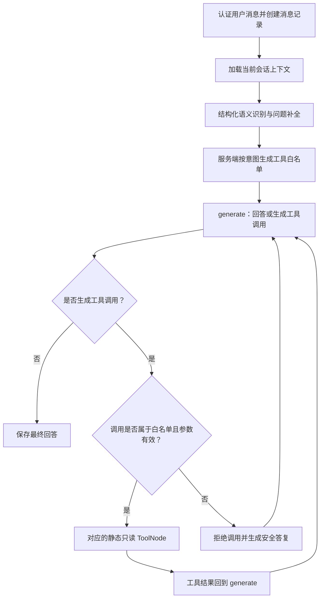

# 语义识别与意图路由前置层

本文记录客服 Agent 在现有只读工具循环前新增的语义识别与服务端路由行为。实现位于 `backend/app/agent/intent.py`、`backend/app/agent/graph.py` 和 `backend/app/agent/state.py`。

这一层只是负责意图识别和问题补全，订单号什么的由正则表达式提取

## 消息处理流程

`recognize_intent` 使用结构化输出理解当前问题和加载的会话历史，可将“这个订单”“它到哪了”等表达补全成独立问题。补全文本只用于本轮模型上下文；数据库仍保存用户原始消息。识别器没有绑定订单、物流或 FAQ 业务工具，也不输出或保存隐藏推理过程。

## 好处

- **更好理解上下文指代。** 结合当前会话历史补全“这个订单”“它到哪了”等表达，让后续模型和工具得到更完整的问题；数据库仍保存用户原始消息。
- **让工具调用更可控。** 服务端按有限意图选择白名单，并在执行前再次检查工具名和参数，减少误选工具、无关查询和模型拼造订单号的机会。
- **避免对歧义订单擅自作答。** 订单目标不明确时先澄清；需要查本人订单来定位物流时，只有目标可确定后才继续查物流。
- **降低超出当前能力的误答。** 售后、工单等未接入能力会进入诚实兜底；政策问题只有 FAQ 工具实际返回内容时才能回答。
- **便于审查与调整路由。** 识别结果是固定结构，权限和工具选择留在服务端代码中，可单独修改和检查路由规则，而不让模型自行决定可访问数据范围。
- **保持现有对话体验。** 识别结果不会展示给用户；澄清、兜底和工具回答沿用 `generate`、现有 SSE 事件及最终回答持久化流程。

## 识别结果

结构化结果定义在 `IntentRecognition`：

| 字段 | 内容 |
| --- | --- |
| `intent` | 固定值：`order_query`、`logistics_query`、`faq`、`smalltalk`、`unsupported`、`unclear` |
| `completed_question` | 结合当前问题与会话历史补全的独立问题 |
| `entities.order_no` | 当前问题或会话历史中明确出现的订单号；没有时为 `null` |
| `entities.order_reference` | `explicit`、`latest`、`account_lookup`、`ambiguous`、`none`，表示订单指代类型 |
| `needs_clarification` | 是否仍缺少必要信息或存在歧义 |
| `clarification_question` | 可选的简短追问；用户可见内容会经过受控处理 |
| `confidence` | 0 到 1 的分类置信度，仅用于澄清或兜底决策 |

`unsupported` 用于当前没有对应工具的请求，例如售后进度、工单状态或人工转接。政策类问题可归为 FAQ 并尝试检索，但只有 FAQ 工具实际返回的内容能作为依据；`policies` 表没有因此成为已接入工具。

`smalltalk` 只用于问候、感谢、自我介绍和询问客服能力范围。服务端不给它分配业务工具，由主回答模型按 System Prompt 简短作答；介绍能力时只能说明当前已接入的订单、物流和 FAQ 能力。由于这类回答不访问业务数据，不受 0.55 的意图置信度门槛限制。

## 意图与工具路由

工具白名单由 `graph.py` 中的服务端路由按固定意图选择。模型生成的工具名不能扩展白名单。

| 意图/条件 | 白名单与处理 |
| --- | --- |
| 订单查询，订单号明确 | 只允许 `query_order`，订单号必须与识别结果一致 |
| 订单查询，明确要求最近订单或列出本人订单 | 只允许 `query_order`；查询范围仍是当前登录用户自己的最近订单 |
| 物流查询，订单号明确或从上下文唯一补全 | 只允许 `query_logistics`，订单号必须与识别结果一致 |
| 物流查询，明确指定最近一笔订单 | 第一阶段只允许 `query_order`；确认查询成功后，服务端从按下单时间倒序的本人订单结果中选最新一笔，再只允许对该订单调用 `query_logistics` |
| 物流查询，要求先从本人订单中确定目标 | 第一阶段只允许 `query_order`；结果唯一时继续物流查询，多笔时列出订单并追问，不任意选择 |
| FAQ 咨询 | 只允许 `search_faq`，查询参数必须是补全后的当前问题 |
| 问候、自我介绍或能力范围咨询 | 不允许业务工具；由 `generate` 根据客服身份和当前能力范围直接回答 |
| 需要澄清、`unsupported`、`unclear` 或置信度低于 0.55（`smalltalk` 除外） | 不允许业务工具；由 `generate` 发送追问或能力兜底 |

若订单目标存在歧义，系统先澄清。用户明确说“最近一笔”时，才会基于本人订单结果选择最新记录。置信度不会用于验证身份或放宽数据访问权限。

## 工具调用校验和数据边界

主回答模型只绑定当前白名单中的工具。图为三个只读工具分别建立静态 `ToolNode`；在进入 `ToolNode` 之前，服务端还会检查：

- 本次只能有一个工具调用，且工具名必须同时属于本轮白名单和服务端静态工具映射；
- 参数只能包含该工具允许的字段，模型不能提交 `user_id`；
- 订单号必须匹配语义识别的订单号，或服务端刚从本人订单查询结果中确认的订单号；
- FAQ 查询必须使用本轮补全后的问题。

任一检查失败都不会执行工具；图会清空工具权限，并让 `generate` 输出安全答复。用户身份仍由会话 API 的认证结果写入 LangGraph 状态。订单和物流工具继续通过 `InjectedState("user_id")` 注入身份，SQL 查询继续按用户归属过滤；语义识别不能选择用户或扩大访问范围。

FAQ 答案只能依据 `search_faq` 实际返回的问题、答案和分类。售后申请、退货政策记录、工单和人工客服没有对应业务工具，不会伪装成已查询或已转接。

## 回答、持久化与 SSE

澄清、能力兜底、工具循环后的回答和被拒绝调用的安全答复都经过名为 `generate` 的节点。语义结果只存在于图状态中，不发送给客户端，也不写入消息记录。工具调用轮的 `answer` 为空，不会作为助手回答保存。

现有 SSE 路由仍只收集 `langgraph_node == "generate"` 的最终回答片段，并在该节点结束后发送。结构化识别节点和工具计划不会作为回答发给用户。最终回答仍由原保存节点更新现有助手消息记录；登录、消息和 SSE 事件契约没有改变。

## 当前范围

此层只路由到现有三个只读工具：`query_order`、`query_logistics`、`search_faq`。没有新增 SQL、数据库结构或前端能力。架构文档中未定义的其他意图类别、售后流程、政策查询、工单和人工接管仍属于未实现能力。

