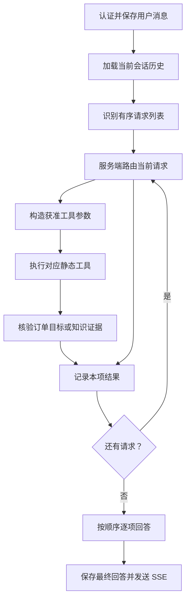

# 语义识别与意图路由前置层

本文记录当前客服 Agent 的请求拆分与服务端路由。完整工具契约见 [tools.md](tools.md)。实现位于 `backend/app/agent/intent.py`、`backend/app/agent/graph.py` 和 `backend/app/agent/state.py`。

## 流程

`recognize_intent()` 用 JSON 模式请求 `SupportRequests`，再用 Pydantic 校验。列表最多四项，每项包含固定九类意图、固定处理目标、置信度、独立补全问题、订单引用、申请号、工单号和澄清状态。超出上限时要求用户分批发送；解析失败时关闭工具并给出兜底答复。补全结果只在本轮图状态中使用，数据库中的用户原文不改写。

## 权限与订单来源

`route_intent()` 对当前项调用 `_route_request()`，按意图和目标的固定允许组合计算唯一工具白名单。`dispatch_tool_call()` 由服务端构造参数，模型不能提交工具名或用户 ID。订单号须来自用户原文，或从最近一条规范订单列表的唯一选择中取得；列表选择还须由当前用户近期订单结果复核。物流目标也必须经过这些校验。订单、售后申请和工单工具继续在 SQL 中按当前登录用户过滤。

查询政策、已提交售后申请和已有工单，与登记新的处理请求是不同目标。`create_ticket` 只有用户原文明确要求投诉处理、人工协助或办理售后时才开放；一轮最多尝试登记一项。登记工单不创建退款退货申请，也不表示真人已实时接入。

某项缺订单目标时可列出本人近期订单供选择；某项需要澄清、查无结果、工具失败或低置信度时会保留该项的答复，其他项继续处理。相同工具与参数的查询复用本轮结果。商品知识先检查召回证据是否充分，生成的引用编号必须对应实际结果；无法核实时单项拒答。最终 `generate()` 按原顺序组织回复，`save_answer()` 保存同一条助手消息。SSE 事件契约保持不变。
