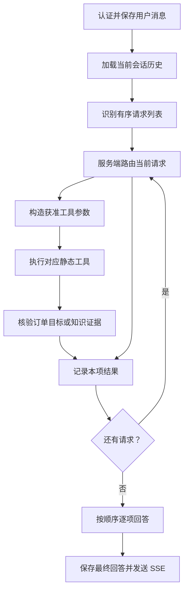

# 语义识别与意图路由前置层

本文记录当前客服 Agent 的请求拆分与服务端路由。完整工具契约见 [tools.md](tools.md)。实现位于 `backend/app/agent/`：字段与模型在 `intent.py`，识别与逐项授权在 `nodes/intent.py`，语义订单权限在 `order_routing.py`，图装配在 `graph.py`，共享状态在 `state.py`。

## 流程

`recognize_intent()` 先只用本轮用户原话进行非流式 JSON 识别，再用 Pydantic 校验；只有识别为其他意图或仍需澄清时，才带入近期历史补全指代。列表最多四项，每项包含固定九类意图、固定处理目标、置信度、独立补全问题、订单引用、申请号、工单号和澄清状态。超出上限时要求用户分批发送；模型返回空白或非法 JSON 时重试一次，仍失败则关闭工具并明确提示处理失败，不把格式错误说成用户需求不明确。补全结果只在本轮图状态中使用，数据库中的用户原文不改写。

## 九类意图的当前去向

九类意图不是“一类对应一个工具”。模型只识别 `intent` 与处理目标 `goal`，服务端再校验允许组合并计算工具白名单；模型不直接选择工具。以下是当前实现，不代表所有意图都会检索知识库或自动转人工。

| 意图 | 允许的处理目标 `goal` | 当前去向 |
| --- | --- | --- |
| `logistics`：物流 | `logistics` | 目标订单明确时调用 `query_logistics`；查询最近一单时先用 `query_order` 确定本人订单，再查物流；订单不明确时先列出本人近期订单供选择。历史列表选择须先复核归属，本轮已核验的订单列表可用于后续物流查询。 |
| `order`：订单 | `order` | 调用 `query_order`，查询指定订单、最近一单，或列出本人近期订单供选择。 |
| `product`：商品咨询 | `product` | 调用 `search_faq`，走混合检索、精排与证据充分性检查；需要澄清时先询问。当前没有独立的实时价格或库存查询工具。 |
| `refund_return`：退款退货 | `policy`、`after_sale_status`、`ticket_status`、`create_ticket` | 规则咨询调用 `search_faq`；申请进度调用 `query_after_sale`；工单进度调用 `query_ticket`；办理新申请进入下文的退款、退货或换货专用流程，不直接调用 `create_ticket` 工具。 |
| `after_sales`：售后 | `policy`、`after_sale_status`、`ticket_status`、`create_ticket` | 规则咨询调用 `search_faq`；申请进度调用 `query_after_sale`；工单进度调用 `query_ticket`；明确要求登记售后处理时调用 `create_ticket`。 |
| `complaint`：投诉 | `ticket_status`、`create_ticket` | 已有工单进度调用 `query_ticket`；明确要求投诉处理时调用 `create_ticket`；缺少明确办理原话时，先询问是否需要登记。 |
| `smalltalk`：闲聊 | `smalltalk` | 不开放业务工具，由主模型结合近期上下文回答当前这项闲聊。 |
| `human`：人工客服 | `ticket_status`、`other` | 查询已有工单进度时调用 `query_ticket`；明确要求转人工时设置 `handoff_requested=True`，在保存答复时进入站内人工队列。缺少明确转接原话时先询问，不表示真人已经接入。 |
| `other`：其他或无法判断 | `other` | 不开放工具，返回引导澄清，要求说明要查询或办理什么；不会默认检索知识库或自动转人工。 |

### 退款退货的特殊流程

`refund_return + create_ticket` 中的 `create_ticket` 是处理目标枚举，不表示执行同名工单工具。`_route_request()` 会将这一组合转入 `_route_refund_request()`：

- **单商品订单退款：** `query_order` 核验本人订单，补齐用户原文中的退款原因，再用 `query_refund_policy` 查询该订单当前可用的有效商家政策。只有政策正文明确覆盖原因，才进入确认阶段；用户确认且服务端核验上一轮订单、原因和政策上下文后，才开放 `submit_after_sale`。办理依据来自业务政策，不以知识库 FAQ 替代提交条件。
- **退货、换货或多商品订单：** 核验本人订单后，引导到 `/app/service` 售后页面选择具体商品、填写或核对原因、核对当前政策并确认提交，不在对话里直接提交。
- **无法核验适用政策：** 不开放提交工具，说明已核实事实与缺少的依据，并提供人工核对路径；不会自动登记工单或进入人工队列。

登记工单、提交售后申请和进入人工队列是三种不同操作。提交退款申请仅创建待审核申请，不代表退款审核通过，也不代表资金到账。

### 统一路由约束与代码位置

- **允许组合与置信度：** `goal` 必须属于该 `intent` 的固定允许集合；非闲聊意图的 `cofidence` 低于 `0.55` 时关闭工具，返回澄清引导。`cofidence` 是当前 schema 的实际字段名。
- **逐项执行：** 一轮最多拆分四项请求，按顺序处理并汇总；每次工具派发只允许一个确定的工具，必要时由服务端状态转换继续下一步，不是模型自主循环调用。
- **写入与人工接管：** 登记工单或转人工需要核对本轮用户动作原话；退款提交另受核单、原因、政策和确认上下文约束。一轮最多尝试登记一项工单。

| 功能点 | 实现位置 |
| --- | --- |
| 九类意图、目标枚举与请求字段 | `backend/app/agent/intent.py`：`SupportRequest` |
| 意图与目标允许组合、目标到工具映射 | `backend/app/agent/nodes/intent.py`：`_REQUEST_GOALS`、`_SERVICE_TOOL_BY_GOAL` |
| 置信度校验、转人工与逐项授权 | `backend/app/agent/nodes/intent.py`：`route_intent()`、`_route_request()` |
| 订单、物流、商品与闲聊的语义路由 | `backend/app/agent/order_routing.py`：`_semantic_route()` |
| 退款办理与订单、政策结果转换 | `backend/app/agent/refund.py`：`_route_refund_request()`、`_refund_order_result()`、`_refund_policy_result()` |
| 服务端工具参数构造与派发 | `backend/app/agent/nodes/tools.py`：`make_dispatch_tool_call()` |
| 工具执行、证据检查、逐项收尾与最终答复 | `backend/app/agent/graph.py`：图节点与条件边 |

## 权限与订单来源

`route_intent()` 对当前项调用 `_route_request()`，按意图和目标的固定允许组合计算唯一工具白名单。`dispatch_tool_call()` 由服务端构造参数，模型不能提交工具名或用户 ID。订单号须来自用户原文，或从最近一条规范订单列表的唯一选择中取得；列表选择还须由当前用户近期订单结果复核。物流目标也必须经过这些校验。订单、售后申请和工单工具继续在 SQL 中按当前登录用户过滤。

查询政策、已提交售后申请和已有工单，与登记新的处理请求是不同目标。实际 `create_ticket` 工具只在用户原文明确要求登记处理时开放，一轮最多尝试登记一项。`refund_return + create_ticket` 走专用申请流程，`human + other` 走人工队列；两者均不等同于调用工单工具。登记工单不创建退款退货申请，也不表示真人已实时接入。

某项缺订单目标时可列出本人近期订单供选择；某项需要澄清、查无结果、工具失败或低置信度时会保留该项的答复，其他项继续处理。相同工具与参数的查询复用本轮结果。商品知识先检查召回证据是否充分，生成的引用编号必须对应实际结果；无法核实时单项拒答。最终 `generate()` 按原顺序组织回复，`save_answer()` 保存同一条助手消息。SSE 事件契约保持不变。
